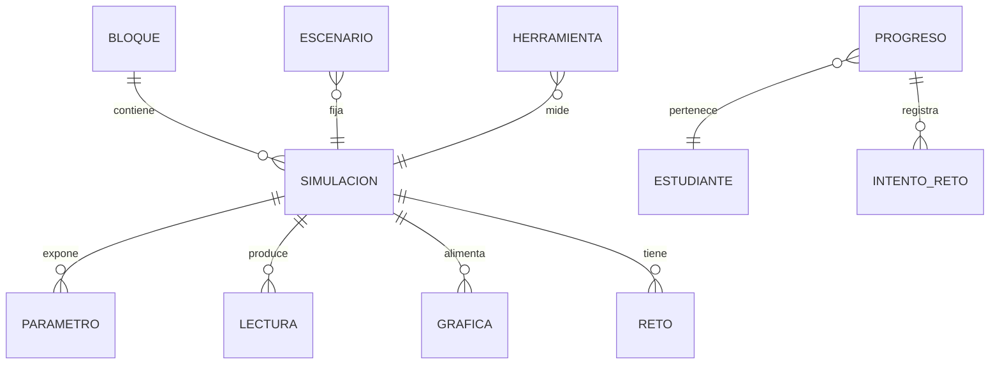

# Simulador de Física Interactivo — fisicahn (v3 optimizado)

Simulador web **100% offline** para colegios técnicos en Honduras. HTML5 + CSS3 + JavaScript vanilla. Cero dependencias externas. Sin build step. Compatible con `file://` (doble clic desde USB).

---

## Stack: ¿React + Million.js?

### Qué es Million.js

[Million.js](https://github.com/aidenybai/million) es un **compilador optimizador para React**: reduce el costo de reconciliación del Virtual DOM (diffing) reescribiendo componentes para actualizaciones más directas al DOM. No es un motor de física ni un renderer de Canvas.

### Dónde está el cuello de botella en fisicahn

| Capa | Trabajo pesado | ¿React/Million ayuda? |
|------|----------------|------------------------|
| **Canvas 2D** (60 FPS, partículas, vectores, trayectorias) | Sí — casi todo el FPS | **No.** Canvas se dibuja fuera del VDOM |
| **Gráficas SVG** (pocos paths por frame) | Medio | Poco; SVG inline o Canvas bastan |
| **Sliders / paneles / catálogo** | Bajo (eventos ocasionales) | Sí, pero el coste actual ya es trivial |
| **Solvers** (Kirchhoff, integraciones) | Puntual | No — es CPU de números, no DOM |

Conclusión de rendimiento: **Million acelera re-renders de React**. En un lab con canvas, el 90% del frame es `clearRect` + draw, no reconciliación de botones. React + Million **no haría el simulador más fluido** de forma medible respecto a vanilla + rAF.

### Estética

React no mejora la estética por sí solo. La UI se define con CSS/tokens (lab oscuro, tipografía sistema). Million no aporta estilos. Un diseño “más bonito” se resuelve con tokens y layout (ya en §4), no con el framework.

### Costes de adoptar React + Million

| Coste | Impacto en fisicahn |
|-------|---------------------|
| **Build step** (Vite/webpack + compilador Million) | Rompe “doble clic USB / cero tooling” |
| **Dependencias npm** | Bundle mayor; mantenimiento y versiones |
| **ES modules + bundler** | Complica o impide `file://` sin servidor |
| **Hardware modesto en aula** | Cargar React (~40–100 KB+ gzip) sin beneficio en canvas |
| **Docentes locales** | Más difícil editar/enseñar el código |
| **Estado del proyecto Million** | Último release mayor ~2024; riesgo de stack “congelado” |

### Decisión

| Opción | Veredicto |
|--------|-----------|
| **Vanilla + Canvas + CSS** (actual) | **Elegida.** Mejor FPS real, offline, sin build, estética controlada por design system |
| React solo | Solo si en el futuro hay UI muy compleja (auth, dashboards online) **y** se acepta servidor local |
| React + Million | **No recomendado** para este producto: optimiza el problema equivocado |

**Si algún día** se migra a React (p. ej. versión online con cuenta docente): Canvas sigue en un componente imperativo (`useRef` + rAF), **no** dentro del VDOM; Million sería opcional solo para listas de retos/paneles densos.

---

## Decisiones de diseño (skills aplicadas)

Este plan se reescribió aplicando:

| Skill | Rol en el plan |
|-------|----------------|
| **layers-skills** | Modelo conceptual, job stories, breadboard de flujo, superficie alineada al modelo |
| **ponytail** | YAGNI: recortar lo especulativo, pocas abstracciones, código mínimo que funciona |
| **taste-skill** | Dials bajos (herramienta educativa, no landing); anti-slop; no estética “juguete” |
| **ui-ux-pro-max** | Accesibilidad crítica, contraste, touch targets, charts legibles, checklist pre-entrega |

### Defaults cerrados (ponytail: no dejar preguntas abiertas que bloqueen)

| Pregunta | Default | Añadir solo si…
|----------|---------|-----------------|
| IE11 | **No soportado** | Alguien lo exige por escrito |
| Tablets | **Sí** (breakpoints + 44px); móvil usable pero no prioritario | Hay auditoría de celulares como primario |
| Panel docente centralizado / red local | **No** (export JSON + panel local) | Hay red de aula confiable |
| Módulos Fluidos / Termodinámica / Ondas | **Fase 3**, fuera del MVP | Se confirma en CNB y hay tiempo |
| Idioma | **Solo español en UI**; strings en código o un único `es.js` simple | Se pide otra lengua concreta |
| ES modules | **No** (scripts clásicos + `window.FisicaHN`) | Se abandona `file://` y se usa servidor local |

---

## 0. Orientación layers (`/layers-orient`)

### Auditoría de capas

| Capa | Estado | Notas |
|------|--------|-------|
| Observed behaviour | Assumed | Sin investigación formal; hipótesis de aula HN (labs con PC modestos, USB, proyector) |
| Domain | Strong | Física de bachillerato técnico; dominio bien definido en skills `01–04` |
| User needs | Partial → se fija abajo | Estudiantes + docentes; jobs definidos en §1 |
| Product strategy | Strong | Offline, curricular, exploración + retos; sin monetización |
| Conceptual model | Partial → se fija en §2 | Antes era una lista de widgets UI, no objetos de producto |
| Interaction structure | Partial → se fija en §3 | Flujo principal + edges |
| Surface | Partial → se fija en §4 | Lab oscuro minimal; no claymorphism / no fonts CDN |

**Cuello de botella resuelto en este documento:** conceptual model + interacción + superficie. El dominio de física ya está en `skills/0X-*.md`.

---

## 1. Necesidades de usuario (job stories)

**Usuarios:** (A) estudiante de física en colegio técnico, (B) docente de aula.

| Prioridad | Job story | Confianza |
|-----------|-----------|-----------|
| P0 | Cuando estoy en el lab sin internet, quiero abrir el simulador desde USB y ver un experimento en segundos, para no depender de red ni instalación. | observed (contexto HN) |
| P0 | Cuando no entiendo una fórmula, quiero **cambiar un parámetro y ver** posición/fuerza/corriente y la gráfica al mismo tiempo, para conectar símbolo ↔ fenómeno. | inferred |
| P0 | Cuando el profesor pone un reto, quiero **probar en la simulación y responder**, con feedback inmediato, para saber si entendí. | inferred |
| P1 | Cuando preparo la clase, quiero **cargar un escenario listo** (JSON) y que todos partan del mismo estado. | inferred |
| P1 | Cuando termino la sesión, quiero **exportar mi progreso** para que el docente lo recoja por USB. | assumed |
| P2 | Cuando comparo “qué pasa si…”, quiero ver dos configuraciones a la vez. | assumed — **diferido (Fase 2+)** |

**No son objetos de producto** (ponytail): “modo aula en red”, “insignias por tiempo de uso”, “i18n multi-idioma”, “sonidos de laboratorio”.

---

## 2. Modelo conceptual

Objetos reales (instanciables, con atributos, útiles al usuario). No widgets de UI.



| Objeto | Qué es | Estados relevantes | Acciones |
|--------|--------|--------------------|----------|
| **Bloque** | Tema curricular (Cinemática, Dinámica, …) | — | Abrir lista de simulaciones |
| **Simulación** | Un experimento (MRU, Ohm, …) | `idle` / `corriendo` / `pausada` / `terminada` | play, pause, reset, cambiar parámetros |
| **Parámetro** | Entrada numérica o preset (v₀, θ, R, …) | valor válido / fuera de rango (clamp) | ajustar |
| **Lectura** | Salida en vivo (x(t), I, …) | actualizándose | (solo lectura) |
| **Gráfica** | Serie x–t, v–t, barras de energía, … | vacía / con datos | limpiar al reset |
| **Reto** | Pregunta ligada a la simulación | pendiente / acertado / fallido | responder, pedir pista |
| **Escenario** | Snapshot de simulación + pasos docentes | cargado / editado localmente | importar, exportar, cargar |
| **Progreso** | Registro del alumno en este navegador | — | exportar JSON |
| **Herramienta** | Cronómetro / regla / multímetro (según módulo) | visible u oculta | usar sobre la escena |

### Vocabulario ubicuo (un nombre = un concepto)

| Usar en UI | No usar |
|------------|---------|
| Simulación | “Experimento”, “Lab”, “Demo” mezclados |
| Parámetro | “Slider”, “Control”, “Variable de entrada” en labels |
| Lectura | “Output”, “Display” |
| Reto | “Quiz”, “Challenge”, “Pregunta” mezclados |
| Escenario | “Preset”, “Template” |
| Reiniciar | “Reset” (salvo en código) |

### Eliminado del modelo (antes se colaba como “feature”)

| Concepto anterior | Decisión |
|-------------------|----------|
| Insignias / rachas / gamificación completa | **Fuera del MVP.** Progreso por bloque (N/M retos) basta. Insignias = Fase 2 si se piden. |
| Modo comparación split-view | **Fase 2+.** Un canvas + reset + memoria del alumno cubre “qué pasa si” en MVP. |
| Web Worker genérico | **No en MVP.** Kirchhoff 2 mallas y matrices pequeñas en main thread (&lt;5 ms). Worker solo si un profiler lo exige. |
| i18n multi-archivo | **No.** Español hardcodeado o un mapa `t()` mínimo. |
| perf-tier.js + particle pool + dirty renderer | **No como módulos.** 2–3 flags inline si hace falta FPS. |
| Sonidos de UI | **No.** |

---

## 3. Flujo de interacción (breadboard)

### Job P0 — Explorar una simulación y ver efecto de un parámetro

```
Inicio (index.html)
- ver bloques → Lugar: Lista de bloques
[ sidebar: bloques con progreso simple N/M ]

Lista de bloques
- elegir bloque → Lista de simulaciones
- (docente) importar escenario → Simulación cargada

Lista de simulaciones
- elegir simulación → Espacio de simulación
[ nombre, descripción corta, objetivos 1–2 líneas ]

Espacio de simulación
- play / pause / reiniciar → mismo lugar (cambia estado)
- ajustar parámetro → Lecturas + Gráfica se actualizan
- abrir retos → Panel de retos
- exportar progreso → descarga JSON (sin cambiar de lugar)
[ canvas | parámetros | lecturas | gráficas ]

Panel de retos
- responder → feedback (acierto / error + pista opcional)
- siguiente reto → Panel de retos
- cerrar → Espacio de simulación
[ enunciado, input, feedback ]

Panel docente (?modo=docente)  — solo docente
- importar varios JSON de progreso → Resumen de clase
[ dropzone, tabla por bloque, lista de retos difíciles ]
```

### Edges obligatorios (no afterthought)

| Situación | Comportamiento |
|-----------|----------------|
| JSON de escenario inválido | Mensaje: causa + “elige otro archivo”; no crashea |
| localStorage lleno | Mensaje al guardar; ofrecer exportar y borrar local |
| División por cero / R=0 / ω=0 | Estado explícito en lecturas + texto, no NaN en UI |
| Sin retos cargados | Empty state: “No hay retos para esta simulación” |
| Reduced motion | Física en canvas sigue (es el contenido); solo se cortan transiciones de paneles/toasts |
| Teclado | Todo el flujo P0 operable sin mouse |

### Places máximos por job: 4 (cumple disciplina layers: no más de 5–6)

---

## 4. Superficie y sistema de diseño

### Design read (taste-skill)

> **Reading this as:** herramienta de laboratorio educativo (product UI denso, no landing) para estudiantes de colegio técnico y docentes, con lenguaje **trust-first / lab oscuro minimal**, lean hacia **flat + semantic tokens + system fonts**, sin claymorphism ni motion decorativo.

| Dial | Valor | Por qué |
|------|-------|---------|
| DESIGN_VARIANCE | **2/10** | Misma UI en todos los bloques; solo cambia el canvas |
| MOTION_INTENSITY | **2/10** | Solo feedback de control (150–200 ms). La animación física **no** cuenta como “motion de UI” |
| VISUAL_DENSITY | **5/10** | Controles + lecturas + gráfica visibles; sin chrome decorativo |

**Fuera de alcance de taste-skill (landing):** no hero, no bento marketing, no marquee, no glassmorphism, no em-dash copy, no “AI purple gradient”.

### Override de ui-ux-pro-max

La búsqueda `--design-system` sugirió *Claymorphism + indigo/naranja + Google Fonts (Exo)*. **Se rechaza** para este producto:

| Sugerencia generada | Problema | Decisión fisicahn |
|---------------------|----------|-------------------|
| Claymorphism | Pesado, “infantil”, mal en dark lab, sombras caras en PC viejos | **Flat / soft-flat**, radios 6–8px, sin double-shadow |
| Google Fonts (Exo, etc.) | **Rompe offline** y añade dependencia de red | **`system-ui` + mono del sistema** |
| “Avoid dark modes” (anti-pattern del generator) | Contradice proyector/aula y fatiga visual en labs | **Dark por defecto** + tema alto contraste + tema claro opcional |
| Indigo #4F46E5 + naranja CTA | Cerca del default “AI purple”; naranja+cyan mal para daltonismo si es el único código | **Cian datos + ámbar énfasis + neutros**; semántica con icono/texto, no solo color |

### Tokens CSS (única fuente de verdad visual)

```css
:root {
  /* Superficies — off-black, no #000 puro */
  --bg-0: #0c0f14;
  --bg-1: #141a22;
  --bg-2: #1c2430;
  --border: rgba(255, 255, 255, 0.08);

  /* Texto */
  --text-0: #e8eef6;   /* ≥ 4.5:1 sobre --bg-0 */
  --text-1: #9aa8b8;
  --text-2: #6b7a8c;

  /* Semántica (color + siempre texto/icono) */
  --accent: #3ecfbf;       /* datos, foco, primario */
  --accent-2: #e8a838;     /* énfasis / advertencia suave */
  --ok: #3ecf7a;
  --err: #f07178;
  --vector-vx: #5b9fd4;
  --vector-vy: #e07a5f;

  --font-ui: system-ui, "Segoe UI", Roboto, "Helvetica Neue", Arial, sans-serif;
  --font-num: ui-monospace, "Cascadia Code", "Consolas", "Courier New", monospace;

  --space-1: 4px; --space-2: 8px; --space-3: 12px; --space-4: 16px; --space-5: 24px;
  --radius: 8px;
  --focus: 0 0 0 3px color-mix(in srgb, var(--accent) 55%, transparent);
  --touch-min: 44px;
  --dur: 180ms;
  --ease: ease-out;
}

[data-theme="alto-contraste"] {
  --bg-0: #000; --bg-1: #000; --bg-2: #111;
  --text-0: #fff; --text-1: #eee; --border: #fff;
  --accent: #6ff; --ok: #0f0; --err: #f66;
}

[data-theme="claro"] {
  --bg-0: #f4f6f8; --bg-1: #fff; --bg-2: #e8eef4;
  --text-0: #121820; --text-1: #3a4654; --border: rgba(0,0,0,.12);
  --accent: #0d7a70;
}
```

### Layout (surface = places del breadboard)

```
┌──────────────────────────────────────────────────────────┐
│ Header: título simulación | play pause reset | tema | ℹ   │
├────────────┬─────────────────────────────┬───────────────┤
│ Sidebar    │ Canvas (rol principal)      │ Lecturas      │
│ bloques +  │                             │ + gráficas    │
│ sims       │                             │ SVG           │
│            ├─────────────────────────────┤               │
│            │ Parámetros (sliders+número) │ Retos (panel) │
└────────────┴─────────────────────────────┴───────────────┘
```

- **≥1024px:** tres columnas.
- **600–1023px:** sidebar off-canvas; gráficas debajo del canvas; touch ≥44px; gap ≥8px entre targets.
- **&lt;600px:** usable; banner no bloqueante “mejor en tablet/PC”.

### Reglas UI innegociables (ui-ux-pro-max, P1–P3)

1. Contraste texto normal ≥ 4.5:1; lecturas de instrumento objetivo ≥ 7:1.
2. Foco visible siempre (`:focus-visible` + `--focus`); nunca `outline: none` sin reemplazo.
3. Color no es el único portador de significado (real/virtual, flota/se hunde, ok/error).
4. Cada simulación expone **tabla de lecturas** con `aria-live="polite"` (alternativa al canvas).
5. Labels visibles en parámetros (nunca placeholder-as-label).
6. `prefers-reduced-motion: reduce` → sin bounce de paneles; canvas de física opcionalmente sin trails.
7. Skip link “Ir a la simulación”.
8. Iconos: SVG inline monoline (un solo estilo); **no emoji** como icono de UI.
9. Gráficas: líneas/barras con leyenda + valores en texto; paleta daltónica-safe; no pie charts.
10. Un CTA primario por vista (Play es primario en el espacio de simulación).

### Anti-reglas eliminadas del plan v2

| Regla v2 | Por qué se elimina |
|----------|-------------------|
| Spring `cubic-bezier(0.34, 1.56, 0.64, 1)` en paneles | Contradice MOTION 2 y distrae en aula |
| Glow cian/verde en tokens | Decoración; reduce legibilidad en monitores mal calibrados |
| Claymorphism / pasteles educativos genéricos | No es lab técnico de bachillerato |
| Fuentes web / Exo / Atkinson vía CDN | Offline-first |
| Slider custom class completo si `<input type="range">` basta | Ponytail: nativo primero; potenciar con teclado + `aria-*` |

---

## 5. Catálogo curricular y fases

### 5.1 Navegación: pestaña de módulos

Vista inicial (`#catalogView`): **3 pestañas de nivel** + **botones/cards** para entrar a cada módulo.

| Pestaña | Nivel | Módulos |
|---------|-------|---------|
| Secundaria | Middle School | Campos magnéticos · Fuerzas y movimiento · Circuitos · Energía potencial y cinética · Ondas y transferencia de energía · Conservación de la energía |
| Bachillerato | High School | Luz · Movimiento unidimensional · Momentum · Sonido · Electrodinámica · Gravedad universal |
| Avanzado | Advanced | Movimiento bidimensional · Movimiento oscilatorio · Física atómica · Física de partículas · Óptica ondulatoria · Movimiento rotacional |

Fuente de datos: `fisicahn/js/catalog.js`. UI: `css/catalog.css`. Desde el lab: **Todos los módulos** / `Esc`.

Cada entrada tiene `status: ready | soon` y opcionalmente `engineKey` hacia un motor ya implementado (`kinematics`, `dynamics`, `electricity`, `optics`) o placeholder.

### 5.2 Mapa catálogo → motor (estado actual)

| Catálogo | Nivel | Motor actual | Estado |
|----------|-------|--------------|--------|
| Fuerzas y movimiento | MS | dynamics | ready |
| Circuitos | MS | electricity | ready |
| Energía potencial y cinética | MS | dynamics | ready (misma entrada de energía) |
| Conservación de la energía | MS | dynamics | ready |
| Luz | HS | optics | ready |
| Movimiento unidimensional | HS | kinematics | ready |
| Electrodinámica | HS | electricity | ready (base) |
| Movimiento bidimensional | Adv | kinematics | ready (proyéctil) |
| Óptica ondulatoria | Adv | optics | ready (base geométrica; onda dedicada = soon) |
| Campos magnéticos | MS | — | soon |
| Ondas y transferencia de energía | MS | — | soon |
| Momentum | HS | — | soon |
| Sonido | HS | — | soon |
| Gravedad universal | HS | — | soon |
| Movimiento oscilatorio | Adv | — | soon |
| Física atómica | Adv | — | soon |
| Física de partículas | Adv | — | soon |
| Movimiento rotacional | Adv | — | soon |

### 5.3 Fases de implementación de motores

### Fase 1 — MVP (hecho / en curso)

- Catálogo con 18 entradas y 3 pestañas
- Motores: cinemática (1D + 2D proyectil), dinámica (fuerzas/energía), electricidad (circuitos), óptica geométrica
- Layout lab + a11y básica

### Fase 2

Motores dedicados: Momentum, Gravedad universal, Movimiento rotacional (MCU), Movimiento oscilatorio, Sonido, Campos magnéticos (intro).

### Fase 3

Ondas y transferencia de energía, Óptica ondulatoria real, Física atómica, Física de partículas (intros conceptuales, no simuladores de investigación).

**Fórmulas detalladas:** `skills/01–07`. El plan no duplica el código de física.


---

## 6. Arquitectura técnica (mínima)

### 6.1 Restricción `file://` (crítica)

Chrome bloquea `type="module"` en `file://`. Distribución = USB + doble clic → **scripts clásicos** + namespace global:

```javascript
window.FisicaHN = window.FisicaHN || {};
// cada archivo registra funciones; app.js al final
```

Orden de carga explícito en `index.html`. Lanzadores `.bat`/`.sh` opcionales (solo comodidad).

### 6.2 Stack

| Capa | Elección | No usar |
|------|----------|---------|
| HTML/CSS/JS | Vanilla | React, Vue, bundlers, Tailwind CDN |
| Canvas | 2D API | WebGL en MVP |
| Gráficas | SVG generado en JS | Chart.js, D3 |
| Storage | localStorage + download Blob | Backend, IndexedDB (salvo que localStorage no baste) |
| Cómputo | Main thread | Worker hasta que FPS lo exija |

### 6.3 Estructura de archivos (MVP)

```
fisicahn/
├── index.html
├── abrir-simulador.bat
├── abrir-simulador.sh
├── css/
│   └── main.css                 # tokens + layout + a11y + breakpoints (un solo archivo)
├── js/
│   ├── app.js
│   ├── physics-engine.js        # rAF + fixed timestep
│   ├── renderer.js              # helpers canvas (grid, flecha, texto)
│   ├── ui-controls.js           # play/pause + rango nativo + teclado
│   ├── charts.js
│   ├── tools.js                 # cronómetro, regla; multímetro con electricidad
│   ├── challenges.js
│   ├── scenarios.js
│   ├── progress.js              # localStorage + export/import JSON
│   ├── analytics-panel.js       # solo ?modo=docente
│   ├── modules/
│   │   ├── kinematics/{mru,mruv,free-fall,projectile}.js
│   │   └── electricity/{ohm-law,kirchhoff,circuit-builder}.js
│   └── utils/{math-helpers,vector2d,unit-converter}.js
├── data/
│   ├── scenarios/               # 2–4 escenarios seed
│   └── challenges/              # cinematica-retos.json, electricidad-retos.json
├── assets/icons/                # SVG monoline
└── README.md
```

**vs v2 eliminados del árbol MVP:** `accessibility.css`, `responsive.css`, `badges.js`, `compare-mode.js`, `perf-tier.js`, `worker/`, `i18n/`, módulos fluids/thermo/waves, `assets/sounds`, `assets/badges`.

### 6.4 Motor (contrato simple)

```javascript
// Cada simulación exporta el mismo shape (namespace)
// FisicaHN.modules['kinematics/mru'] = {
//   id, title, block,
//   params: [{ key, label, unit, min, max, step, value }],
//   init(state), update(dt, t, state), render(ctx, state, alpha),
//   readings(state), chartSeries(state)  // opcional
// }
```

Game loop: fixed `dt = 1/60`, cap de frame 100 ms, `requestAnimationFrame`. Un canvas en MVP (no dual engine).

### 6.5 Controles: nativo primero (ponytail)

```html
<label>
  Velocidad inicial (m/s)
  <input type="range" min="0" max="50" step="0.1" value="10"
         aria-valuemin="0" aria-valuemax="50" aria-valuenow="10">
  <output>10</output>
</label>
```

JS solo sincroniza `output` + `aria-valuenow` y aplica Shift+flechas para paso grueso si el navegador no lo da. **No** reimplementar slider custom a menos que el nativo falle en un navegador objetivo.

### 6.6 Rendimiento (reglas cortas, no framework)

- Partículas / trails: tope fijo (ej. 40 puntos de estela); no object pool hasta medir.
- Redibujar fondo estático solo al resize o cambio de escala.
- Kirchhoff N≤3 en main thread; si N crece y cae FPS → entonces Worker (Fase 2).
- Objetivo: ≥30 FPS en CPU 4× throttling; carga útil &lt;1.5 s offline.

### 6.7 Progreso y docente (sin red)

Formato mínimo de export del alumno:

```json
{
  "schema": 1,
  "studentName": "",
  "exportedAt": "ISO-8601",
  "moduleProgress": {
    "cinematica": { "score": 3, "total": 10 },
    "electricidad": { "score": 1, "total": 8 }
  },
  "challengeAttempts": [
    { "challengeId": "mruv-01", "correct": false, "at": "ISO-8601" }
  ]
}
```

Docente: `?modo=docente` → importar N archivos → promedio por bloque + retos con tasa de acierto &lt; 50%.

---

## 7. Módulos de física (referencia, no re-spec)

Implementar según skills. El plan solo fija **contrato y prioridad**.

| ID | Skill | Fase | Entradas clave | Salidas / visual |
|----|-------|------|----------------|------------------|
| kinematics/mru | 01 | 1 | x₀, v₀ | x(t), gráficas x-t, v-t |
| kinematics/mruv | 01 | 1 | x₀, v₀, a | x,v; parábola x-t |
| kinematics/free-fall | 01 | 1 | h₀, v₀, g | y, t_impacto |
| kinematics/projectile | 01 | 1 | v₀, θ, h₀, g | trayectoria, vectores |
| electricity/ohm | 03 | 1 | V, R…, serie/paralelo | I, P, caídas |
| electricity/kirchhoff | 03 | 1 | V1,V2,R1–R3 | I1,I2, checks de malla |
| electricity/circuit-builder | 03 | 1 | DnD componentes | circuito resuelto |
| dynamics/* | 02 | 2 | — | ver skill 02 |
| optics/* | 04 | 2 | — | ver skill 04 |
| kinematics/circular | 01 (ampliar) | 2 | R, ω | a_c, vectores |
| fluids/*, thermo/*, waves/* | skills nuevas | 3 | — | no bloquear MVP |

Interactividad DnD / herramientas: `skills/05-interactividad-uiux.md`.  
Retos y escenarios: `skills/06-capa-pedagogica.md`.  
Loop y canvas: `skills/07-arquitectura-motor.md`.

**Regla de calidad física (única en el plan):** error ≤ 0.01 % vs referencia manual en happy path; límites devuelven estado + mensaje, nunca NaN visible.

---

## 8. Criterios de éxito (MVP)

| Área | Hecho cuando… |
|------|----------------|
| Offline | Doble clic `index.html` en Chrome/Firefox/Edge: sin errores CORS/módulos |
| Explorar | En &lt;30 s un alumno nuevo corre MRU y ve x-t cambiar al mover v₀ |
| Teclado | Completa una simulación + un reto sin mouse |
| Física | Tests de fórmulas verdes (Node `--test`) en cinemática y electricidad |
| Docente | Importa 10 JSON y ve qué bloque va peor |
| Perf | ≥30 FPS throttling 4× en proyector-path (tiro parabólico + gráfica) |
| A11y | Contraste AA; foco visible; color no único significado |

---

## 9. Plan de verificación

### Automático

```bash
node --test fisicahn/js/tests/kinematics.test.js
node --test fisicahn/js/tests/electricity.test.js
node --test fisicahn/js/tests/progress.test.js
```

Un assert por fórmula no trivial + 1–2 límites (R=0, t&lt;0, etc.). Sin framework de test.

### Manual (checklist corto)

- [ ] `file://` Chrome / Firefox / Edge
- [ ] Sin red: todo carga
- [ ] Cada simulación Fase 1: slider, play, gráfica, reset
- [ ] Circuito: 3 resistencias serie en &lt;1 min
- [ ] Reto numérico con tolerancia
- [ ] Import escenario + export progreso
- [ ] `?modo=docente` con 3 archivos
- [ ] Solo teclado en un módulo cinemática + uno electricidad
- [ ] Temas: dark / alto contraste / claro
- [ ] Tablet ~768px: sidebar y targets usables

### Matriz navegadores

Chrome, Firefox, Edge — últimas 2 estables. **IE11 no.**

---

## 10. Cambios propuestos (archivos)

### Core

| Archivo | Rol |
|---------|-----|
| `fisicahn/index.html` | Shell + scripts en orden |
| `fisicahn/css/main.css` | Tokens + layout + a11y + responsive |
| `fisicahn/js/app.js` | Router de bloques/sims, wire-up |
| `fisicahn/js/physics-engine.js` | Loop |
| `fisicahn/js/renderer.js` | Helpers 2D |
| `fisicahn/js/ui-controls.js` | Controles nativos + teclado |
| `fisicahn/js/charts.js` | SVG line/bar |
| `fisicahn/js/tools.js` | Cronómetro, regla, multímetro |
| `fisicahn/js/challenges.js` | Motor de retos |
| `fisicahn/js/scenarios.js` | Escenarios |
| `fisicahn/js/progress.js` | Progreso alumno |
| `fisicahn/js/analytics-panel.js` | Modo docente |
| `fisicahn/js/utils/*` | Math, Vector2D, unidades |
| `fisicahn/js/modules/kinematics/*` | 4 sims |
| `fisicahn/js/modules/electricity/*` | 3 sims |
| `fisicahn/data/**` | JSON seed |
| `fisicahn/README.md` | Guía docente (abrir, USB, escenarios) |

### No crear en MVP

`badges.js`, `compare-mode.js`, `perf-tier.js`, `worker/*`, `i18n/*`, `css/accessibility.css`, `css/responsive.css`, módulos Fase 2–3, `assets/sounds`.

---

## 11. Changelog v2 → v3 (qué se recortó y por qué)

| Elemento v2 | Acción | Motivo (skill) |
|-------------|--------|----------------|
| ~26 sims / 7 bloques en un solo “plan de implementación” | Fases 1–3 estrictas; MVP = 2 bloques | ponytail YAGNI |
| Duplicar todo el JS de física en el plan | Referencia a `skills/0X-*.md` | ponytail; una sola fuente de verdad |
| Web Worker | Diferido | ponytail; N pequeño no lo necesita |
| badges + racha + sonidos | Diferido / eliminado | layers: no traza a P0; ponytail |
| compare-mode | Fase 2+ | layers: job P2 no validado |
| i18n multi + diccionario “por si acaso” | Eliminado del MVP | ponytail speculative scaffolding |
| perf-tier, ParticlePool, DirtyRenderer como clases | Eliminados | ponytail premature abstraction |
| Claymorphism / fonts CDN / glows / spring bounce | Reemplazados por lab flat + system fonts | taste + offline + ui-ux |
| 6 CSS files | 1 `main.css` | ponytail fewest files |
| Open questions sin default | Defaults cerrados al inicio | layers product strategy + ponytail |
| Slider 100% custom class | `<input type="range">` nativo | ponytail ladder: native first |
| conceptual model = lista de widgets | Objetos de dominio + vocabulario | layers-conceptual-model |

---

## 12. Orden de implementación sugerido

1. `index.html` + `main.css` (layout + tokens + a11y) + namespace vacío  
2. `physics-engine` + una simulación **MRU** end-to-end (params → canvas → gráfica)  
3. Router de sidebar + resto cinemática Fase 1  
4. Retos + progreso export  
5. Electricidad Ohm → Kirchhoff → circuit-builder  
6. Escenarios seed + panel docente  
7. Pulido a11y + verificación §9  
8. (Después) Fase 2 según feedback de aula  

---

*Física detallada, DnD, retos y motor: `skills/01`–`07`. Este documento decide **qué se construye, en qué orden, y qué se deja fuera**.*
