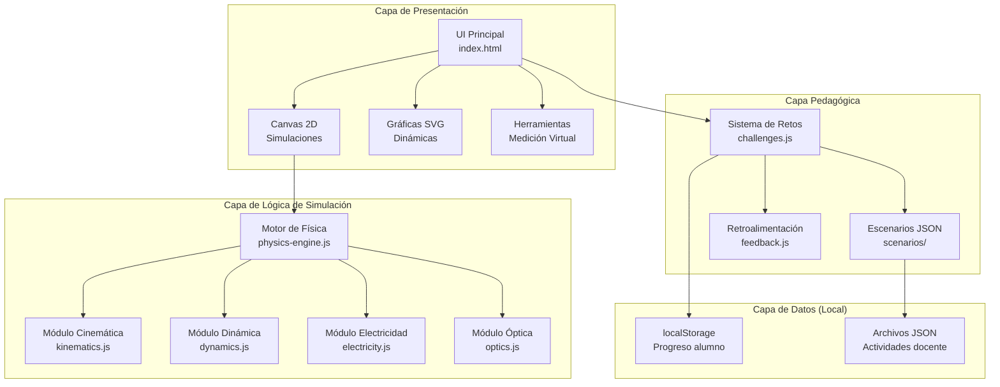

# Simulador de Física Interactivo — SuperPhysics

Simulador web 100% offline para colegios técnicos en Honduras. HTML5 + CSS3 + JavaScript vanilla. Cero dependencias externas. Optimizado para hardware modesto.

---

## User Review Required

> [!IMPORTANT]
> **Decisiones de alcance**: El plan cubre 4 módulos principales con ~15 simulaciones individuales. Confirmar si se desea construir todos en la primera iteración o priorizar un subconjunto (ej. solo Cinemática y Electricidad primero).

> [!IMPORTANT]
> **Idioma de la interfaz**: Toda la UI estará en español. Los comentarios de código estarán en español para facilitar mantenimiento por docentes locales. ¿Es correcto?

> [!WARNING]
> **Distribución**: El simulador se empaquetará como un directorio estático (~2-5 MB) distribuible por USB. No requiere servidor web ni instalación. ¿Se necesita algún instalador adicional o es suficiente abrir `index.html` directamente?

## Open Questions

1. ¿Los estudiantes tienen acceso a navegadores modernos (Chrome/Firefox/Edge recientes) o hay que soportar navegadores antiguos como IE11?
2. ¿Se necesita soporte para tablets/celulares o solo computadoras de escritorio?
3. ¿El docente necesita un panel de administración para ver el progreso de múltiples estudiantes, o cada estación de trabajo es independiente?
4. ¿Hay un currículo específico de la Secretaría de Educación de Honduras (CNB) que deba mapearse a los módulos?

---

> [!NOTE]
> **Filosofía ponytail**: Este proyecto sigue el enfoque ponytail (skills/ponytail/).
> Código minimalista, sin abstracciones prematuras, sin build step, sin frameworks.
> Cada skill en `skills/0X-*.md` contiene la especificación detallada del módulo correspondiente.

---

## 1. Arquitectura General del Sistema



### Estructura de Archivos del Proyecto

```
fisicahn/
├── index.html                    # Punto de entrada principal
├── css/
│   ├── main.css                  # Variables, reset, layout global
│   ├── simulator.css             # Estilos del canvas y controles
│   ├── tools.css                 # Instrumentos de medición
│   └── challenges.css            # Panel de retos/preguntas
├── js/
│   ├── app.js                    # Inicialización y router de módulos
│   ├── physics-engine.js         # Loop de simulación (rAF)
│   ├── renderer.js               # Abstracción de renderizado Canvas 2D
│   ├── ui-controls.js            # Sliders, inputs, drag-and-drop
│   ├── charts.js                 # Gráficas SVG dinámicas
│   ├── tools.js                  # Cronómetro, regla, multímetro
│   ├── challenges.js             # Motor de retos pedagógicos
│   ├── scenarios.js              # Cargador de escenarios JSON
│   ├── modules/
│   │   ├── kinematics/
│   │   │   ├── mru.js            # Movimiento Rectilíneo Uniforme
│   │   │   ├── mruv.js           # MRU Variado (acelerado)
│   │   │   ├── free-fall.js      # Caída libre
│   │   │   └── projectile.js     # Tiro parabólico
│   │   ├── dynamics/
│   │   │   ├── newton-laws.js    # Leyes de Newton con fricción
│   │   │   └── work-energy.js    # Trabajo, energía, potencia
│   │   ├── electricity/
│   │   │   ├── ohm-law.js        # Ley de Ohm simple
│   │   │   ├── kirchhoff.js      # Leyes de Kirchhoff
│   │   │   └── circuit-builder.js # Constructor de circuitos D&D
│   │   └── optics/
│   │       ├── reflection.js     # Reflexión (espejos)
│   │       ├── refraction.js     # Refracción (Snell)
│   │       └── lenses.js         # Lentes convergentes/divergentes
│   └── utils/
│       ├── math-helpers.js       # Funciones matemáticas comunes
│       ├── vector2d.js           # Clase Vector 2D
│       └── unit-converter.js     # Conversión de unidades
├── data/
│   ├── scenarios/                # Escenarios preconfigurados
│   │   ├── cinematica-basica.json
│   │   ├── circuito-serie.json
│   │   └── lente-convergente.json
│   └── challenges/               # Bancos de preguntas
│       ├── cinematica-retos.json
│       ├── dinamica-retos.json
│       ├── electricidad-retos.json
│       └── optica-retos.json
├── assets/
│   ├── icons/                    # Iconos SVG inline
│   └── sounds/                   # Efectos de sonido opcionales
└── README.md                     # Guía de uso para docentes
```

---

## 2. Módulos de Aprendizaje (Skills Técnicas) — Especificación de Física

---

### 2.1 CINEMÁTICA (ver SKILL 01 — skills/01-cinematica.md)

#### 2.1.1 Movimiento Rectilíneo Uniforme (MRU)

| **Variables de Entrada** | **Variables de Salida** | 
|---|---|
| `v₀` — Velocidad (m/s), slider [0, 50] | `x(t)` — Posición en tiempo t |
| `x₀` — Posición inicial (m), slider [-100, 100] | Gráfica x vs t (línea recta) |
| `t` — Tiempo de simulación (s) | Gráfica v vs t (línea horizontal) |

**Ecuaciones base:**

```javascript
// MRU — Velocidad constante, aceleración = 0
function mru(x0, v0, t) {
    return {
        position: x0 + v0 * t,          // x(t) = x₀ + v₀·t
        velocity: v0,                     // v(t) = v₀ = constante
        acceleration: 0                   // a = 0
    };
}
```

**Lógica del Canvas:** Un objeto (bloque/auto) se desplaza horizontalmente. Una línea punteada marca la trayectoria. Regla pixel-métrica visible abajo.

---

#### 2.1.2 Movimiento Rectilíneo Uniformemente Variado (MRUV)

| **Variables de Entrada** | **Variables de Salida** |
|---|---|
| `v₀` — Velocidad inicial (m/s), slider [-30, 30] | `x(t)` — Posición |
| `a` — Aceleración (m/s²), slider [-10, 10] | `v(t)` — Velocidad instantánea |
| `x₀` — Posición inicial (m) | `d` — Distancia recorrida |
| `t` — Tiempo | Gráficas x-t (parábola), v-t (recta), a-t (constante) |

**Ecuaciones base:**

```javascript
// MRUV — Aceleración constante
function mruv(x0, v0, a, t) {
    const position = x0 + v0 * t + 0.5 * a * t * t;    // x = x₀ + v₀t + ½at²
    const velocity = v0 + a * t;                          // v = v₀ + at
    const vSquared = v0 * v0 + 2 * a * (position - x0);  // v² = v₀² + 2a(x - x₀)

    return {
        position,
        velocity,
        velocitySquared: vSquared,
        acceleration: a,
        displacement: position - x0
    };
}
```

---

#### 2.1.3 Caída Libre

| **Variables de Entrada** | **Variables de Salida** |
|---|---|
| `h₀` — Altura inicial (m), slider [1, 100] | `y(t)` — Altura en tiempo t |
| `v₀` — Velocidad inicial vertical (m/s), slider [-20, 20] | `v(t)` — Velocidad vertical |
| `g` — Gravedad (m/s²), default 9.81, slider [1, 25] | `t_impacto` — Tiempo de impacto |
|  | `v_impacto` — Velocidad al impactar |

**Ecuaciones base:**

```javascript
// Caída libre — MRUV vertical con a = -g
const G_DEFAULT = 9.81; // m/s² (Honduras, nivel del mar)

function caidaLibre(h0, v0, g, t) {
    const y = h0 + v0 * t - 0.5 * g * t * t;     // y = h₀ + v₀t - ½gt²
    const vy = v0 - g * t;                          // v = v₀ - gt
    
    // Tiempo de impacto (y = 0): 0 = h₀ + v₀t - ½gt²
    // Fórmula cuadrática: t = (v₀ + √(v₀² + 2gh₀)) / g
    const discriminant = v0 * v0 + 2 * g * h0;
    const tImpacto = (v0 + Math.sqrt(Math.max(0, discriminant))) / g;
    const vImpacto = v0 - g * tImpacto;             // Velocidad en el suelo

    return {
        height: Math.max(0, y),
        velocity: vy,
        impactTime: tImpacto,
        impactVelocity: Math.abs(vImpacto),
        hasLanded: t >= tImpacto
    };
}
```

**Lógica visual:** Objeto cae verticalmente con estela de posiciones. Regla vertical al lado. Al tocar el piso: efecto visual de "rebote" o "splash".

---

#### 2.1.4 Tiro Parabólico (Movimiento de Proyectiles)

| **Variables de Entrada** | **Variables de Salida** |
|---|---|
| `v₀` — Velocidad inicial (m/s), slider [5, 100] | `x(t)`, `y(t)` — Posición 2D |
| `θ` — Ángulo de lanzamiento (°), slider [0, 90] | `vₓ(t)`, `vᵧ(t)` — Componentes velocidad |
| `h₀` — Altura de lanzamiento (m), slider [0, 50] | `R` — Alcance horizontal |
| `g` — Gravedad (m/s²), default 9.81 | `H_max` — Altura máxima |
|  | `t_vuelo` — Tiempo total de vuelo |
|  | Trayectoria parabólica dibujada |

**Ecuaciones base:**

```javascript
// Tiro parabólico — Composición MRU (x) + MRUV (y)
function tiroParabolico(v0, angleDeg, h0, g, t) {
    const angleRad = angleDeg * Math.PI / 180;
    const v0x = v0 * Math.cos(angleRad);          // Componente horizontal
    const v0y = v0 * Math.sin(angleRad);           // Componente vertical

    // Posición
    const x = v0x * t;                              // x(t) = v₀ₓ · t
    const y = h0 + v0y * t - 0.5 * g * t * t;      // y(t) = h₀ + v₀ᵧt - ½gt²

    // Velocidad
    const vx = v0x;                                  // vₓ = constante
    const vy = v0y - g * t;                          // vᵧ = v₀ᵧ - gt
    const vMag = Math.sqrt(vx * vx + vy * vy);      // |v| = √(vₓ² + vᵧ²)

    // Altura máxima: cuando vᵧ = 0 → t_max = v₀ᵧ/g
    const tMax = v0y / g;
    const hMax = h0 + (v0y * v0y) / (2 * g);        // H = h₀ + v₀ᵧ²/(2g)

    // Tiempo de vuelo: y = 0 → cuadrática
    // -½gt² + v₀ᵧt + h₀ = 0
    const disc = v0y * v0y + 2 * g * h0;
    const tVuelo = (v0y + Math.sqrt(Math.max(0, disc))) / g;

    // Alcance horizontal
    const alcance = v0x * tVuelo;                    // R = v₀ₓ · t_vuelo

    return {
        x, y: Math.max(0, y), vx, vy, speed: vMag,
        maxHeight: hMax, timeOfMaxHeight: tMax,
        range: alcance, flightTime: tVuelo,
        hasLanded: t >= tVuelo
    };
}
```

**Lógica visual:** Cañón/lanzador con ángulo ajustable (arrastrar para rotar). Trayectoria parabólica se dibuja como trail de puntos. Vector velocidad descompuesto visible (flechas roja=vₓ, azul=vᵧ). Grid de fondo para medir.

---

### 2.2 DINÁMICA Y ENERGÍA (ver SKILL 02 — skills/02-dinamica.md)

#### 2.2.1 Leyes de Newton con Fricción

| **Variables de Entrada** | **Variables de Salida** |
|---|---|
| `m` — Masa del objeto (kg), slider [0.1, 100] | `a` — Aceleración resultante |
| `F_aplicada` — Fuerza aplicada (N), slider [0, 500] | `F_neta` — Fuerza neta |
| `θ_F` — Ángulo de la fuerza (°), slider [0, 90] | `F_fricción` — Fuerza de fricción |
| `μₛ` — Coef. fricción estática, slider [0, 1] | `F_normal` — Fuerza normal |
| `μₖ` — Coef. fricción cinética, slider [0, 1] | `v(t)` — Velocidad resultante |
| `θ_inclinación` — Ángulo plano inclinado (°), slider [0, 60] | Diagrama de cuerpo libre (DCL) |
| `g` — Gravedad (m/s²) | animación del movimiento |

**Ecuaciones base:**

```javascript
// Segunda Ley de Newton con fricción en plano inclinado
function newtonFriccion(m, Faplicada, angFuerza, us, uk, angPlano, g) {
    const angFRad = angFuerza * Math.PI / 180;
    const angPRad = angPlano * Math.PI / 180;

    // Peso y componentes en plano inclinado
    const W = m * g;                                          // W = mg
    const Wx = W * Math.sin(angPRad);                         // Componente paralela al plano
    const Wy = W * Math.cos(angPRad);                         // Componente perpendicular

    // Fuerza aplicada descompuesta
    const Fax = Faplicada * Math.cos(angFRad);                // Componente paralela
    const Fay = Faplicada * Math.sin(angFRad);                // Componente perpendicular

    // Fuerza Normal: N = Wy - Fay (si Fay empuja hacia el plano)
    const N = Math.max(0, Wy - Fay);                          // N ≥ 0

    // Fricción estática máxima
    const fsMax = us * N;                                      // fs_max = μs · N

    // Fuerza neta SIN fricción (para determinar si se mueve)
    const fNetaSinFriccion = Fax - Wx;

    // ¿Se mueve el objeto?
    let friccion, aceleracion, estado;
    if (Math.abs(fNetaSinFriccion) <= fsMax) {
        // ESTÁTICO: la fricción estática equilibra exactamente la fuerza neta
        friccion = -fNetaSinFriccion;                          // fs = -F_neta (opuesta)
        aceleracion = 0;
        estado = 'estático';
    } else {
        // CINÉTICO: el objeto se mueve
        const direccion = Math.sign(fNetaSinFriccion);
        friccion = -direccion * uk * N;                        // fk = μk · N (opuesta al mov.)
        const fNeta = fNetaSinFriccion + friccion;
        aceleracion = fNeta / m;                               // a = F_neta / m (2da ley)
        estado = 'en movimiento';
    }

    return {
        weight: W,
        weightX: Wx, weightY: Wy,
        normal: N,
        forceAppliedX: Fax, forceAppliedY: Fay,
        frictionForce: friccion,
        maxStaticFriction: fsMax,
        netForce: fNetaSinFriccion + friccion,
        acceleration: aceleracion,
        state: estado,
        // Vectores para DCL (Diagrama de Cuerpo Libre)
        freeBodyDiagram: {
            weight: { x: 0, y: -W },
            normal: { x: -Math.sin(angPRad) * N, y: Math.cos(angPRad) * N },
            applied: { x: Fax, y: Fay },
            friction: { x: friccion, y: 0 }
        }
    };
}
```

**Lógica visual:** Bloque en plano inclinado con ángulo ajustable (drag). Flechas del DCL se dibujan en tiempo real sobre el objeto. Color de flechas: Rojo=Peso, Verde=Normal, Azul=Aplicada, Naranja=Fricción. El bloque se mueve o no según el cálculo.

---

#### 2.2.2 Trabajo, Energía y Potencia

| **Variables de Entrada** | **Variables de Salida** |
|---|---|
| `m` — Masa (kg) | `Ec` — Energía cinética (J) |
| `v` — Velocidad (m/s) | `Ep` — Energía potencial (J) |
| `h` — Altura (m) | `Em` — Energía mecánica total (J) |
| `F` — Fuerza aplicada (N) | `W` — Trabajo realizado (J) |
| `d` — Distancia recorrida (m) | `P` — Potencia (W) |
| `θ` — Ángulo fuerza-desplazamiento (°) | Gráfica de barras de energía |
| `μₖ` — Coef. fricción cinética | `W_fricción` — Trabajo por fricción |

**Ecuaciones base:**

```javascript
// Trabajo, Energía y Potencia
function energiaCalculations(m, v, h, F, d, angleDeg, uk, g) {
    const angleRad = angleDeg * Math.PI / 180;

    // Energía cinética
    const Ec = 0.5 * m * v * v;                    // Ec = ½mv²

    // Energía potencial gravitatoria
    const Ep = m * g * h;                            // Ep = mgh

    // Energía mecánica total
    const Em = Ec + Ep;                              // Em = Ec + Ep

    // Trabajo de la fuerza aplicada
    const W = F * d * Math.cos(angleRad);            // W = F·d·cos(θ)

    // Trabajo de fricción
    const N = m * g;                                  // Normal (plano horizontal)
    const fk = uk * N;                                // Fuerza de fricción cinética
    const Wfriccion = -fk * d;                        // W_fr = -fk·d (siempre negativo)

    // Trabajo neto = ΔEc (teorema trabajo-energía)
    const Wneto = W + Wfriccion;                     // W_neto = W_app + W_fr

    // Potencia (asumiendo tiempo de 1s para demo, se actualiza con dt real)
    // P = W/t  o  P = F·v·cos(θ)
    const P = F * v * Math.cos(angleRad);             // P = F·v·cos(θ)

    return {
        kineticEnergy: Ec,
        potentialEnergy: Ep,
        mechanicalEnergy: Em,
        workApplied: W,
        workFriction: Wfriccion,
        netWork: Wneto,
        power: P,
        // Para gráfica de barras de energía
        energyBars: [
            { label: 'Ec', value: Ec, color: '#e74c3c' },
            { label: 'Ep', value: Ep, color: '#3498db' },
            { label: 'Em', value: Em, color: '#2ecc71' }
        ]
    };
}
```

**Lógica visual:** Objeto que se puede arrastrar en una montaña rusa o rampa. Barras de energía (Ec, Ep, Em) se actualizan en tiempo real al costado. La barra de Em permanece constante (si no hay fricción). Con fricción, Em decrece y aparece barra de "Energía disipada".

---

### 2.3 ELECTRICIDAD BÁSICA (DC) (ver SKILL 03 — skills/03-electricidad-dc.md)

#### 2.3.1 Ley de Ohm y Circuito Simple

| **Variables de Entrada** | **Variables de Salida** |
|---|---|
| `V` — Voltaje de fuente (V), slider [0, 24] | `I` — Corriente total (A) |
| `R₁, R₂, R₃` — Resistencias (Ω), sliders [1, 1000] | `P_total` — Potencia total (W) |
| `tipo` — Serie / Paralelo / Mixto | `V_Rn` — Caída de voltaje en cada R |
| | `I_Rn` — Corriente por cada R |
| | Visualización del flujo de electrones |

**Ecuaciones base:**

```javascript
// ===== LEY DE OHM Y CIRCUITOS =====

// Ley de Ohm básica
function leyOhm(V, R) {
    if (R === 0) return { I: Infinity, P: Infinity }; // cortocircuito
    const I = V / R;               // I = V/R
    const P = V * I;               // P = V·I = V²/R = I²·R
    return { I, P };
}

// Resistencia equivalente en SERIE
function resistenciaSerie(resistencias) {
    // Req = R1 + R2 + R3 + ...
    const Req = resistencias.reduce((sum, r) => sum + r, 0);
    return Req;
}

// Resistencia equivalente en PARALELO
function resistenciaParalelo(resistencias) {
    // 1/Req = 1/R1 + 1/R2 + 1/R3 + ...
    const invReq = resistencias.reduce((sum, r) => sum + 1 / r, 0);
    return 1 / invReq;
}

// Análisis completo de circuito serie
function circuitoSerie(V, resistencias) {
    const Req = resistenciaSerie(resistencias);
    const I = V / Req;                           // Corriente igual en todo el circuito

    const analisis = resistencias.map((R, i) => ({
        id: `R${i + 1}`,
        resistance: R,
        voltage: I * R,                           // V_Rn = I · Rn (divisor de voltaje)
        current: I,                                // Misma corriente en serie
        power: I * I * R                           // P = I²R
    }));

    return {
        Req, totalCurrent: I, totalPower: V * I,
        components: analisis,
        // Verificación Kirchhoff: ΣV = V_fuente
        kirchhoffCheck: analisis.reduce((s, c) => s + c.voltage, 0)
    };
}

// Análisis completo de circuito paralelo
function circuitoParalelo(V, resistencias) {
    const Req = resistenciaParalelo(resistencias);
    const Itotal = V / Req;

    const analisis = resistencias.map((R, i) => ({
        id: `R${i + 1}`,
        resistance: R,
        voltage: V,                                // Mismo voltaje en paralelo
        current: V / R,                            // I_Rn = V / Rn
        power: V * V / R                           // P = V²/R
    }));

    return {
        Req, totalCurrent: Itotal, totalPower: V * Itotal,
        components: analisis,
        // Verificación Kirchhoff: ΣI_ramas = I_total
        kirchhoffCheck: analisis.reduce((s, c) => s + c.current, 0)
    };
}
```

---

#### 2.3.2 Leyes de Kirchhoff — Malla Simple

**Ecuaciones para malla con 2 fuentes y 3 resistencias:**

```javascript
// Kirchhoff — Resolución de malla simple (2 lazos)
// Lazo 1: V1 - I1·R1 - (I1-I2)·R2 = 0
// Lazo 2: -V2 - I2·R3 - (I2-I1)·R2 = 0

function kirchhoffMalla(V1, V2, R1, R2, R3) {
    // Sistema de ecuaciones lineales 2×2:
    // (R1 + R2)·I1 - R2·I2 = V1
    // -R2·I1 + (R2 + R3)·I2 = -V2

    const a11 = R1 + R2;
    const a12 = -R2;
    const a21 = -R2;
    const a22 = R2 + R3;
    const b1 = V1;
    const b2 = -V2;

    // Resolver por Cramer
    const det = a11 * a22 - a12 * a21;
    if (Math.abs(det) < 1e-10) return null; // sistema singular

    const I1 = (b1 * a22 - b2 * a12) / det;
    const I2 = (a11 * b2 - a21 * b1) / det;

    // Corriente por R2 (rama compartida)
    const IR2 = I1 - I2;

    return {
        I1, I2, IR2,
        voltages: {
            VR1: I1 * R1,
            VR2: IR2 * R2,
            VR3: I2 * R3
        },
        powers: {
            PR1: I1 * I1 * R1,
            PR2: IR2 * IR2 * R2,
            PR3: I2 * I2 * R3
        },
        // Verificación: suma de voltajes en cada lazo = 0
        loopCheck1: V1 - I1 * R1 - IR2 * R2,
        loopCheck2: -V2 - I2 * R3 + IR2 * R2
    };
}
```

**Lógica visual:** Diagrama de circuito interactivo. Los electrones "fluyen" como partículas animadas a velocidad proporcional a la corriente. Las resistencias brillan con intensidad proporcional a la potencia disipada. Multímetro virtual se "conecta" haciendo clic en nodos.

---

#### 2.3.3 Constructor de Circuitos (Drag & Drop)

```javascript
// Modelo de datos para el constructor de circuitos
const CircuitComponent = {
    BATTERY: 'battery',
    RESISTOR: 'resistor',
    WIRE: 'wire',
    SWITCH: 'switch',
    LED: 'led',
    AMMETER: 'ammeter',
    VOLTMETER: 'voltmeter'
};

class CircuitNode {
    constructor(id, x, y) {
        this.id = id;
        this.x = x;        // posición en grid
        this.y = y;
        this.connections = []; // IDs de componentes conectados
        this.voltage = 0;      // potencial en el nodo
    }
}

class CircuitComponentInstance {
    constructor(type, value, nodeA, nodeB) {
        this.type = type;
        this.value = value;    // Ohmios, Voltios, etc.
        this.nodeA = nodeA;    // Nodo de entrada
        this.nodeB = nodeB;    // Nodo de salida
        this.current = 0;      // Calculado por solver
        this.voltageDrop = 0;  // Calculado por solver
    }
}

// Grid de colocación: El canvas se divide en celdas de 40×40 px
// Los componentes se "snappean" al grid al soltarlos
const GRID_SIZE = 40;

function snapToGrid(x, y) {
    return {
        x: Math.round(x / GRID_SIZE) * GRID_SIZE,
        y: Math.round(y / GRID_SIZE) * GRID_SIZE
    };
}
```

---

### 2.4 ÓPTICA GEOMÉTRICA (ver SKILL 04 — skills/04-optica-geometrica.md)

#### 2.4.1 Reflexión (Espejos)

| **Variables de Entrada** | **Variables de Salida** |
|---|---|
| `tipo_espejo` — Plano / Cóncavo / Convexo | Posición de la imagen (`dᵢ`) |
| `d₀` — Distancia objeto al espejo (cm), slider [5, 200] | Tamaño de la imagen (`hᵢ`) |
| `h₀` — Tamaño del objeto (cm) | Aumento (`M`) |
| `f` — Distancia focal (cm), slider [5, 100] | Tipo: Real/Virtual, Derecha/Invertida |
| `R` — Radio de curvatura (R = 2f) | Diagrama de rayos |

**Ecuaciones base:**

```javascript
// Reflexión en espejos esféricos
function espejo(tipoEspejo, d0, h0, f) {
    // Convención de signos:
    // Espejo cóncavo: f > 0, espejo convexo: f < 0
    if (tipoEspejo === 'convexo') f = -Math.abs(f);
    if (tipoEspejo === 'concavo') f = Math.abs(f);

    // Ecuación del espejo: 1/f = 1/d₀ + 1/dᵢ
    // dᵢ = (d₀ · f) / (d₀ - f)
    const di = (d0 * f) / (d0 - f);

    // Aumento lateral: M = -dᵢ/d₀ = hᵢ/h₀
    const M = -di / d0;
    const hi = M * h0;

    // Clasificar la imagen
    const esReal = di > 0;                        // Imagen real si dᵢ > 0
    const esDerecha = M > 0;                      // Derecha si M > 0
    const esAmplificada = Math.abs(M) > 1;        // Amplificada si |M| > 1

    return {
        imageDistance: di,
        imageHeight: hi,
        magnification: M,
        isReal: esReal,
        isUpright: esDerecha,
        isMagnified: esAmplificada,
        description: `Imagen ${esReal ? 'real' : 'virtual'}, ` +
                     `${esDerecha ? 'derecha' : 'invertida'}, ` +
                     `${esAmplificada ? 'amplificada' : 'reducida'}`,
        // Rayos principales para diagrama
        rays: calcularRayosEspejo(d0, h0, f, di, hi)
    };
}

function calcularRayosEspejo(d0, h0, f, di, hi) {
    // Tres rayos principales:
    return [
        { // Rayo 1: Paralelo al eje → pasa por el foco
            name: 'Paralelo',
            color: '#e74c3c',
            start: { x: -d0, y: h0 },
            mirror: { x: 0, y: h0 },
            end: { x: -di, y: -hi }  // negativo porque reflejado
        },
        { // Rayo 2: Pasa por el foco → sale paralelo
            name: 'Focal',
            color: '#3498db',
            start: { x: -d0, y: h0 },
            mirror: { x: 0, y: 0 },    // pasa por centro
            end: { x: -di, y: -hi }
        },
        { // Rayo 3: Pasa por el centro de curvatura → se refleja sobre sí mismo
            name: 'Centro',
            color: '#2ecc71',
            start: { x: -d0, y: h0 },
            mirror: { x: 0, y: h0 * f / (d0 - f) },
            end: { x: -di, y: -hi }
        }
    ];
}
```

---

#### 2.4.2 Refracción (Ley de Snell)

| **Variables de Entrada** | **Variables de Salida** |
|---|---|
| `n₁` — Índice refracción medio 1, slider [1.0, 2.5] | `θ₂` — Ángulo de refracción |
| `n₂` — Índice refracción medio 2, slider [1.0, 2.5] | `θ_c` — Ángulo crítico |
| `θ₁` — Ángulo de incidencia (°), slider [0, 90] | Reflexión total interna (sí/no) |
| Presets: Aire(1.0), Agua(1.33), Vidrio(1.5), Diamante(2.42) | Diagrama de rayos incidente/refractado |

**Ecuaciones base:**

```javascript
// Ley de Snell: n₁·sin(θ₁) = n₂·sin(θ₂)
function snell(n1, n2, theta1Deg) {
    const theta1Rad = theta1Deg * Math.PI / 180;

    // Verificar reflexión total interna
    const sinTheta2 = (n1 / n2) * Math.sin(theta1Rad);

    // Ángulo crítico (solo existe si n1 > n2)
    let angleCritico = null;
    if (n1 > n2) {
        angleCritico = Math.asin(n2 / n1) * 180 / Math.PI;  // θc = arcsin(n₂/n₁)
    }

    if (Math.abs(sinTheta2) > 1) {
        // REFLEXIÓN TOTAL INTERNA
        return {
            refractedAngle: null,
            totalInternalReflection: true,
            criticalAngle: angleCritico,
            reflectedAngle: theta1Deg,    // θᵢ = θᵣ
            description: '¡Reflexión total interna!'
        };
    }

    const theta2Rad = Math.asin(sinTheta2);
    const theta2Deg = theta2Rad * 180 / Math.PI;

    return {
        refractedAngle: theta2Deg,
        totalInternalReflection: false,
        criticalAngle: angleCritico,
        reflectedAngle: theta1Deg,
        // Para dibujar el rayo
        deviationAngle: Math.abs(theta1Deg - theta2Deg),
        description: `Ángulo de refracción: ${theta2Deg.toFixed(1)}°`
    };
}
```

---

#### 2.4.3 Lentes Convergentes y Divergentes

| **Variables de Entrada** | **Variables de Salida** |
|---|---|
| `tipo_lente` — Convergente / Divergente | `dᵢ` — Distancia imagen |
| `d₀` — Distancia objeto (cm) | `hᵢ` — Altura imagen |
| `h₀` — Tamaño objeto (cm) | `M` — Aumento |
| `f` — Distancia focal (cm) | Real/Virtual, Derecha/Invertida |
| | Diagrama de 3 rayos principales |

**Ecuaciones base:**

```javascript
// Ecuación de lentes delgadas: 1/f = 1/d₀ + 1/dᵢ
// (Misma forma que espejos, distinta convención de signos)
function lente(tipoLente, d0, h0, f) {
    // Convergente: f > 0, Divergente: f < 0
    if (tipoLente === 'divergente') f = -Math.abs(f);
    if (tipoLente === 'convergente') f = Math.abs(f);

    // dᵢ = (d₀ · f) / (d₀ - f)
    const di = (d0 * f) / (d0 - f);

    // Aumento: M = -dᵢ/d₀
    const M = -di / d0;
    const hi = M * h0;

    const esReal = di > 0;
    const esDerecha = M > 0;

    return {
        imageDistance: di,
        imageHeight: hi,
        magnification: M,
        isReal: esReal,
        isUpright: esDerecha,
        isMagnified: Math.abs(M) > 1,
        rays: calcularRayosLente(d0, h0, f, di, hi)
    };
}

function calcularRayosLente(d0, h0, f, di, hi) {
    return [
        { // Rayo paralelo al eje → pasa por foco imagen
            name: 'Paralelo → Foco',
            color: '#e74c3c',
            segments: [
                { from: { x: -d0, y: h0 }, to: { x: 0, y: h0 } },
                { from: { x: 0, y: h0 }, to: { x: di, y: -hi } }
            ]
        },
        { // Rayo por el centro óptico → no se desvía
            name: 'Centro',
            color: '#2ecc71',
            segments: [
                { from: { x: -d0, y: h0 }, to: { x: di, y: -hi } }
            ]
        },
        { // Rayo hacia foco objeto → sale paralelo
            name: 'Foco → Paralelo',
            color: '#3498db',
            segments: [
                { from: { x: -d0, y: h0 }, to: { x: 0, y: h0 * f / (d0 - f) } },
                { from: { x: 0, y: h0 * f / (d0 - f) }, to: { x: di, y: -hi } }
            ]
        }
    ];
}
```

---

## 3. Diseño UI/UX de la Página Web

Este proyecto integra 3 skills de diseño complementarios para definir la experiencia visual y de interacción de la página web del simulador.

### 3.1 Orientación con layers-skills

El framework `layers-skills` (skills/layers-skills/) estructura el diseño en capas. Para el simulador se priorizan:

| Capa | Aplicación al simulador |
|------|------------------------|
| **Conceptual Model** | Objetos del mundo: escenario (canvas 2D), partículas/cuerpos, paneles de control (sliders numéricos), gráficas dinámicas (SVG), panel de retos, herramientas de medición virtual |
| **Interaction Flow** | 1. Seleccionar módulo en sidebar → 2. Ajustar variables con sliders → 3. Ver animación en canvas → 4. Ver gráficas actualizarse → 5. Opcional: usar herramientas o resolver retos |
| **Navigation Architecture** | Sidebar vertical izquierda (módulos) → Canvas central (simulación) → Panel de control debajo del canvas → Gráficas a la derecha o abajo → Herramientas como overlay/popup |
| **Surface** | Superficie limpia tipo laboratorio, dark mode por defecto, controles visibles sin saturar |

Ver: skills/layers-skills/ — comandos `/layers-orient`, `/layers-surface`.

### 3.2 Estética con taste-skill

El skill `taste-skill` (skills/taste-skill/) define la calidad visual premium. Configuración de los 3 diales para el simulador:

| Dial | Valor | Razón |
|------|-------|-------|
| DESIGN_VARIANCE | 3/10 | Herramienta educativa, no landing page. Consistencia sobre variedad. |
| MOTION_INTENSITY | 2/10 | Movimiento mínimo para no distraer del contenido educativo. |
| VISUAL_DENSITY | 4/10 | Densidad media: paneles de control con espaciado cómodo. |

Reglas taste-skill aplicadas:
- **Anti-slop**: Sin templates genéricos SaaS, sin em-dash, sin lenguaje marketinero.
- **Minimalista**: Sub-skill `minimalista-skill` para UI tipo laboratorio científico.
- **Motion**: Transiciones con spring physics CSS (`cubic-bezier(0.34, 1.56, 0.64, 1)`) solo para cambios de panel y aparición de tooltips. Sin animaciones decorativas.
- **Tipografía**: `system-ui` para UI general, `monospace` para lecturas numéricas y displays de instrumentos.

Ver: skills/taste-skill/ — comandos `/taste-skill`, `/minimalista`.

### 3.3 Sistema de diseño con ui-ux-pro-max-skill

El skill `ui-ux-pro-max-skill` (skills/ui-ux-pro-max-skill/) genera tokens y sistema de diseño completo.

- **Paleta**: Extraer de `products.csv` categoría `education/science`. Tonos azul-púrpura oscuros para fondo, ámbar/verde para acentos (datos, mediciones).
- **Tipografía**: Pairing `system-ui` + `monospace` (ver `typography.csv`).
- **Reglas**: Priorizar normas de accesibilidad (contraste WCAG AA), layout responsive, animaciones mínimas.
- **Validación**: Aplicar pre-delivery checklist del skill antes de release.

Ver: skills/ui-ux-pro-max-skill/ — comandos `/pre-delivery`, `/ui-screenshots`.

### Nota

Las secciones 4-7 implementan técnicamente lo definido aquí. Este diseño no modifica los archivos fuente; es la guía conceptual que informa las decisiones de implementación en las secciones siguientes.

---

## 4. Sistema de Interactividad y UI/UX

### 4.1 Sistema Drag & Drop para Armar Experimentos (ver SKILL 05 — skills/05-interactividad-uiux.md)

```javascript
// ===== SISTEMA DRAG & DROP LIVIANO =====
// Sin librerías. Eventos nativos: pointerdown, pointermove, pointerup
// Usa Pointer Events (no Mouse Events) para soporte táctil nativo

class DragDropManager {
    constructor(canvas) {
        this.canvas = canvas;
        this.ctx = canvas.getContext('2d');
        this.draggables = [];      // Objetos arrastrables
        this.dropZones = [];       // Zonas de destino
        this.activeDrag = null;    // Objeto siendo arrastrado
        this.offsetX = 0;
        this.offsetY = 0;

        // Pointer Events (touch + mouse unificados)
        canvas.addEventListener('pointerdown', (e) => this.onPointerDown(e));
        canvas.addEventListener('pointermove', (e) => this.onPointerMove(e));
        canvas.addEventListener('pointerup', (e) => this.onPointerUp(e));
        canvas.style.touchAction = 'none'; // Prevenir scroll en touch
    }

    addDraggable(obj) {
        // obj = { id, x, y, width, height, type, data, render(ctx) }
        this.draggables.push(obj);
    }

    addDropZone(zone) {
        // zone = { id, x, y, width, height, accepts: [tipos], onDrop(obj) }
        this.dropZones.push(zone);
    }

    onPointerDown(e) {
        const rect = this.canvas.getBoundingClientRect();
        const mx = e.clientX - rect.left;
        const my = e.clientY - rect.top;

        // Buscar en orden inverso (último dibujado = encima)
        for (let i = this.draggables.length - 1; i >= 0; i--) {
            const obj = this.draggables[i];
            if (this.hitTest(mx, my, obj)) {
                this.activeDrag = obj;
                this.offsetX = mx - obj.x;
                this.offsetY = my - obj.y;
                this.canvas.setPointerCapture(e.pointerId);
                break;
            }
        }
    }

    onPointerMove(e) {
        if (!this.activeDrag) return;
        const rect = this.canvas.getBoundingClientRect();
        this.activeDrag.x = e.clientX - rect.left - this.offsetX;
        this.activeDrag.y = e.clientY - rect.top - this.offsetY;

        // Highlight de la zona de destino más cercana
        this.highlightedZone = this.findDropZone(this.activeDrag);
    }

    onPointerUp(e) {
        if (!this.activeDrag) return;

        const zone = this.findDropZone(this.activeDrag);
        if (zone && zone.accepts.includes(this.activeDrag.type)) {
            // Snap al centro de la zona
            this.activeDrag.x = zone.x + (zone.width - this.activeDrag.width) / 2;
            this.activeDrag.y = zone.y + (zone.height - this.activeDrag.height) / 2;
            zone.onDrop(this.activeDrag);
        }

        this.activeDrag = null;
        this.highlightedZone = null;
    }

    hitTest(mx, my, obj) {
        return mx >= obj.x && mx <= obj.x + obj.width &&
               my >= obj.y && my <= obj.y + obj.height;
    }

    findDropZone(obj) {
        const cx = obj.x + obj.width / 2;
        const cy = obj.y + obj.height / 2;
        return this.dropZones.find(z =>
            cx >= z.x && cx <= z.x + z.width &&
            cy >= z.y && cy <= z.y + z.height
        );
    }
}
```

**Contextos de uso:**
- **Circuitos:** Arrastrar baterías, resistencias, cables desde una "paleta" hacia el canvas del circuito.
- **Óptica:** Arrastrar lentes, espejos, fuentes de luz a un banco óptico virtual.
- **Dinámica:** Arrastrar pesas sobre un bloque para cambiar masa; arrastrar el vector fuerza para cambiar dirección/magnitud.

---

### 4.2 Herramientas de Medición Virtual

```javascript
// ===== HERRAMIENTAS DE MEDICIÓN =====

// CRONÓMETRO virtual
class Cronometro {
    constructor() {
        this.startTime = 0;
        this.elapsed = 0;
        this.running = false;
        this.laps = [];
    }

    start()   { this.startTime = performance.now() - this.elapsed; this.running = true; }
    stop()    { this.elapsed = performance.now() - this.startTime; this.running = false; }
    reset()   { this.elapsed = 0; this.running = false; this.laps = []; }
    lap()     { if (this.running) this.laps.push(this.getTime()); }

    getTime() {
        if (this.running) this.elapsed = performance.now() - this.startTime;
        return this.elapsed / 1000; // Retorna en segundos
    }

    render(ctx, x, y) {
        const t = this.getTime();
        const min = Math.floor(t / 60);
        const sec = Math.floor(t % 60);
        const ms = Math.floor((t % 1) * 100);
        ctx.font = 'bold 24px "Courier New", monospace';
        ctx.fillStyle = '#00ff88';
        ctx.fillText(`${String(min).padStart(2,'0')}:${String(sec).padStart(2,'0')}.${String(ms).padStart(2,'0')}`, x, y);
    }
}

// REGLA PIXEL-MÉTRICA
class ReglaMetrica {
    constructor(pixelsPerMeter = 100) {
        this.ppm = pixelsPerMeter;  // Escala: 100 px = 1 metro
        this.visible = true;
    }

    setScale(pixelsPerMeter) { this.ppm = pixelsPerMeter; }

    pixelToMeters(px)  { return px / this.ppm; }
    metersToPixel(m)   { return m * this.ppm; }

    render(ctx, x, y, lengthPx, orientation = 'horizontal') {
        const totalMeters = this.pixelToMeters(lengthPx);
        const step = this.calculateStep(totalMeters); // paso adaptativo

        ctx.strokeStyle = '#ffffff';
        ctx.fillStyle = '#cccccc';
        ctx.lineWidth = 1;
        ctx.font = '10px sans-serif';

        if (orientation === 'horizontal') {
            ctx.beginPath();
            ctx.moveTo(x, y);
            ctx.lineTo(x + lengthPx, y);
            ctx.stroke();

            for (let m = 0; m <= totalMeters; m += step) {
                const px = x + this.metersToPixel(m);
                const isMajor = Math.abs(m % (step * 5)) < 0.001;
                ctx.beginPath();
                ctx.moveTo(px, y);
                ctx.lineTo(px, y - (isMajor ? 12 : 6));
                ctx.stroke();
                if (isMajor) ctx.fillText(`${m.toFixed(1)}m`, px - 10, y - 14);
            }
        }
        // Similar para 'vertical'
    }

    calculateStep(totalMeters) {
        if (totalMeters <= 1) return 0.1;
        if (totalMeters <= 10) return 0.5;
        if (totalMeters <= 50) return 2;
        return 5;
    }
}

// MULTÍMETRO VIRTUAL (para circuitos)
class MultimetroVirtual {
    constructor() {
        this.mode = 'voltmeter';   // 'voltmeter' | 'ammeter' | 'ohmmeter'
        this.reading = 0;
        this.unit = 'V';
        this.connectedNodes = [];
    }

    setMode(mode) {
        this.mode = mode;
        this.unit = { voltmeter: 'V', ammeter: 'A', ohmmeter: 'Ω' }[mode];
    }

    measure(nodeA, nodeB, circuit) {
        switch (this.mode) {
            case 'voltmeter':
                this.reading = Math.abs(nodeA.voltage - nodeB.voltage);
                break;
            case 'ammeter':
                // Medir corriente en la rama entre los nodos
                this.reading = circuit.getCurrentBetween(nodeA, nodeB);
                break;
            case 'ohmmeter':
                this.reading = circuit.getResistanceBetween(nodeA, nodeB);
                break;
        }
    }

    render(ctx, x, y) {
        // Pantalla tipo LCD
        ctx.fillStyle = '#1a1a2e';
        ctx.fillRect(x, y, 140, 70);
        ctx.strokeStyle = '#00ff88';
        ctx.strokeRect(x, y, 140, 70);

        ctx.font = 'bold 28px "Courier New"';
        ctx.fillStyle = '#00ff88';
        ctx.fillText(`${this.reading.toFixed(3)}`, x + 10, y + 38);

        ctx.font = '16px sans-serif';
        ctx.fillText(this.unit, x + 110, y + 38);

        ctx.font = '10px sans-serif';
        ctx.fillStyle = '#888';
        ctx.fillText(this.mode.toUpperCase(), x + 10, y + 60);
    }
}
```

---

### 4.3 Gráficas Dinámicas (SVG Ligero)

```javascript
// ===== GRÁFICAS DINÁMICAS EN SVG EMBEBIDO =====
// SVG es más ligero que Canvas para gráficas estáticas/semi-estáticas
// Se actualiza solo cuando los datos cambian (no cada frame)

class GraficaDinamica {
    constructor(containerId, config) {
        this.container = document.getElementById(containerId);
        this.width = config.width || 400;
        this.height = config.height || 250;
        this.padding = { top: 20, right: 20, bottom: 40, left: 50 };
        this.plotW = this.width - this.padding.left - this.padding.right;
        this.plotH = this.height - this.padding.top - this.padding.bottom;
        this.datasets = [];          // Múltiples líneas
        this.maxPoints = 500;        // Limitar puntos para rendimiento
        this.xlabel = config.xlabel || 't (s)';
        this.ylabel = config.ylabel || 'x (m)';
        this.title = config.title || '';

        this.createSVG();
    }

    createSVG() {
        const ns = 'http://www.w3.org/2000/svg';
        this.svg = document.createElementNS(ns, 'svg');
        this.svg.setAttribute('viewBox', `0 0 ${this.width} ${this.height}`);
        this.svg.setAttribute('width', '100%');
        this.svg.style.maxWidth = this.width + 'px';
        this.container.appendChild(this.svg);
        // Los ejes y líneas se dibujan con métodos SVG
    }

    addDataset(id, label, color) {
        this.datasets.push({ id, label, color, points: [] });
    }

    addPoint(datasetId, x, y) {
        const ds = this.datasets.find(d => d.id === datasetId);
        if (!ds) return;
        ds.points.push({ x, y });
        if (ds.points.length > this.maxPoints) ds.points.shift(); // Ring buffer
    }

    clear(datasetId) {
        const ds = this.datasets.find(d => d.id === datasetId);
        if (ds) ds.points = [];
    }

    render() {
        // Calcular rangos automáticos
        let xMin = Infinity, xMax = -Infinity, yMin = Infinity, yMax = -Infinity;
        for (const ds of this.datasets) {
            for (const p of ds.points) {
                xMin = Math.min(xMin, p.x); xMax = Math.max(xMax, p.x);
                yMin = Math.min(yMin, p.y); yMax = Math.max(yMax, p.y);
            }
        }
        if (xMin === xMax) xMax = xMin + 1;
        if (yMin === yMax) yMax = yMin + 1;

        // Redibujar SVG completo (muy rápido para ~500 puntos)
        this.svg.innerHTML = this.buildSVGContent(xMin, xMax, yMin, yMax);
    }

    buildSVGContent(xMin, xMax, yMin, yMax) {
        const scaleX = (v) => this.padding.left + ((v - xMin) / (xMax - xMin)) * this.plotW;
        const scaleY = (v) => this.padding.top + this.plotH - ((v - yMin) / (yMax - yMin)) * this.plotH;

        let svg = '';
        // Fondo
        svg += `<rect width="${this.width}" height="${this.height}" fill="#0a0a1a" rx="8"/>`;
        // Ejes
        svg += `<line x1="${this.padding.left}" y1="${this.padding.top + this.plotH}"
                 x2="${this.padding.left + this.plotW}" y2="${this.padding.top + this.plotH}"
                 stroke="#444" stroke-width="1"/>`;
        svg += `<line x1="${this.padding.left}" y1="${this.padding.top}"
                 x2="${this.padding.left}" y2="${this.padding.top + this.plotH}"
                 stroke="#444" stroke-width="1"/>`;
        // Etiquetas
        svg += `<text x="${this.width/2}" y="${this.height - 5}" fill="#888"
                 font-size="12" text-anchor="middle">${this.xlabel}</text>`;
        svg += `<text x="15" y="${this.height/2}" fill="#888" font-size="12"
                 text-anchor="middle" transform="rotate(-90, 15, ${this.height/2})">${this.ylabel}</text>`;

        // Líneas de datos
        for (const ds of this.datasets) {
            if (ds.points.length < 2) continue;
            const pathD = ds.points.map((p, i) =>
                `${i === 0 ? 'M' : 'L'} ${scaleX(p.x).toFixed(1)} ${scaleY(p.y).toFixed(1)}`
            ).join(' ');
            svg += `<path d="${pathD}" fill="none" stroke="${ds.color}" stroke-width="2"/>`;
        }

        return svg;
    }
}
```

---

### 4.4 Diseño Visual — Sistema de Diseño CSS

```css
/* ===== SISTEMA DE DISEÑO — FísicaHN ===== */
/* Dark theme para reducir fatiga visual y consumo en LCDs */

:root {
    /* Paleta oscura con acentos neón (inspirada en instrumentos de laboratorio) */
    --bg-primary:    #0a0a1a;
    --bg-secondary:  #12122a;
    --bg-panel:      #1a1a3e;
    --bg-card:       #222250;

    --text-primary:  #e8e8f0;
    --text-secondary:#8888aa;
    --text-muted:    #555577;

    --accent-cyan:   #00e5ff;
    --accent-green:  #00ff88;
    --accent-orange: #ff8c00;
    --accent-red:    #ff4444;
    --accent-purple: #aa66ff;

    /* Tipografía del sistema (sin cargar fuentes externas = offline) */
    --font-ui:       system-ui, -apple-system, 'Segoe UI', sans-serif;
    --font-mono:     'Courier New', Consolas, monospace;
    --font-display:  var(--font-ui);

    /* Espaciado */
    --space-xs: 4px;
    --space-sm: 8px;
    --space-md: 16px;
    --space-lg: 24px;
    --space-xl: 32px;

    /* Bordes y sombras sutiles */
    --border-radius: 8px;
    --border-color:  rgba(255,255,255,0.06);
    --glow-cyan:     0 0 12px rgba(0,229,255,0.3);
    --glow-green:    0 0 12px rgba(0,255,136,0.3);
}

/* Reset mínimo */
*, *::before, *::after { box-sizing: border-box; margin: 0; padding: 0; }
body {
    font-family: var(--font-ui);
    background: var(--bg-primary);
    color: var(--text-primary);
    overflow: hidden;       /* Prevenir scroll accidental */
    height: 100vh;
}
```

---

## 5. Capa Pedagógica y Modo Aula

### 5.1 Sistema de Retos con Retroalimentación Inmediata (ver SKILL 06 — skills/06-capa-pedagogica.md)

El sistema de retos funciona como un overlay no-intrusivo que aparece como un panel lateral colapsable. **No interrumpe la simulación**.

```javascript
// ===== MOTOR DE RETOS PEDAGÓGICOS =====
class ChallengeEngine {
    constructor() {
        this.challenges = [];
        this.currentIndex = 0;
        this.score = 0;
        this.totalAttempts = 0;
    }

    loadChallenges(jsonArray) {
        this.challenges = jsonArray;
        this.currentIndex = 0;
        this.score = 0;
    }

    getCurrentChallenge() {
        return this.challenges[this.currentIndex] || null;
    }

    submitAnswer(userAnswer) {
        const challenge = this.getCurrentChallenge();
        if (!challenge) return null;

        this.totalAttempts++;
        let correct = false;

        switch (challenge.type) {
            case 'multiple_choice':
                correct = userAnswer === challenge.correctAnswer;
                break;
            case 'numeric':
                // Tolerancia del 5% para respuestas numéricas
                const tolerance = challenge.tolerance || 0.05;
                const expected = challenge.correctAnswer;
                correct = Math.abs(userAnswer - expected) <= Math.abs(expected * tolerance);
                break;
            case 'experiment':
                // El alumno debe configurar la simulación para lograr un resultado
                correct = challenge.validator(userAnswer);
                break;
        }

        if (correct) this.score++;

        const feedback = {
            correct,
            message: correct ? challenge.feedbackCorrect : challenge.feedbackIncorrect,
            hint: correct ? null : challenge.hint,
            explanation: challenge.explanation,
            nextAvailable: this.currentIndex < this.challenges.length - 1
        };

        if (correct) this.currentIndex++;
        return feedback;
    }

    getProgress() {
        return {
            completed: this.currentIndex,
            total: this.challenges.length,
            score: this.score,
            attempts: this.totalAttempts,
            percentage: Math.round((this.currentIndex / this.challenges.length) * 100)
        };
    }
}
```

**Formato JSON de los retos:**

```json
{
  "module": "cinematica",
  "topic": "mruv",
  "challenges": [
    {
      "id": "mruv-01",
      "type": "numeric",
      "difficulty": 1,
      "question": "Un auto parte del reposo y acelera a 3 m/s². ¿Qué distancia recorre en 4 segundos?",
      "correctAnswer": 24,
      "tolerance": 0.05,
      "unit": "m",
      "hint": "Usa la fórmula x = x₀ + v₀t + ½at². Si parte del reposo, v₀ = 0.",
      "feedbackCorrect": "¡Correcto! x = 0 + 0 + ½(3)(4²) = 24 m",
      "feedbackIncorrect": "Revisa: x = ½ × a × t². Sustituye a=3 y t=4.",
      "explanation": "Cuando un objeto parte del reposo (v₀=0), la distancia solo depende de la aceleración y el tiempo al cuadrado.",
      "simulationPreset": {
        "module": "mruv",
        "params": { "x0": 0, "v0": 0, "a": 3 }
      }
    },
    {
      "id": "mruv-02",
      "type": "experiment",
      "difficulty": 2,
      "question": "Configura la simulación para que un objeto recorra exactamente 50 metros en 5 segundos, partiendo del reposo. ¿Qué aceleración necesitas?",
      "correctAnswer": 4,
      "tolerance": 0.1,
      "unit": "m/s²",
      "hint": "Despeja 'a' de x = ½at²: a = 2x/t²",
      "feedbackCorrect": "¡Excelente! a = 2(50)/(5²) = 4 m/s²",
      "feedbackIncorrect": "Necesitas despejar 'a'. Si x = ½at², entonces a = 2x/t².",
      "explanation": "Despejar variables es una habilidad clave. Practica reorganizando las ecuaciones."
    },
    {
      "id": "mruv-03",
      "type": "multiple_choice",
      "difficulty": 1,
      "question": "En un gráfico v vs t de un MRUV, ¿qué forma tiene la curva?",
      "options": [
        "Una línea recta",
        "Una parábola",
        "Una hipérbola",
        "Un punto"
      ],
      "correctAnswer": 0,
      "hint": "v = v₀ + at es una ecuación lineal en t.",
      "feedbackCorrect": "¡Sí! Como v = v₀ + at es lineal, la gráfica es una recta con pendiente = a.",
      "feedbackIncorrect": "Recuerda: v = v₀ + at tiene la forma y = mx + b, que es una línea recta.",
      "explanation": "La pendiente de la recta v-t te da la aceleración. Si la recta es horizontal, a=0 (MRU)."
    }
  ]
}
```

---

### 5.2 Estructura de Escenarios Precargados para Docentes

```json
{
  "scenarioId": "lab-caida-libre-01",
  "title": "Laboratorio: Caída Libre desde diferentes alturas",
  "author": "Prof. Martínez",
  "subject": "Física I",
  "grade": "11vo",
  "duration": "45 min",
  "description": "Los alumnos dejan caer objetos desde 5, 10 y 20 metros y comparan tiempos de caída.",
  "module": "kinematics/free-fall",
  "objectives": [
    "Comprobar que el tiempo de caída no depende de la masa",
    "Calcular g a partir de mediciones",
    "Graficar h vs t²"
  ],
  "initialState": {
    "h0": 10,
    "v0": 0,
    "g": 9.81,
    "showTrail": true,
    "showGraph": true,
    "toolsVisible": ["cronometro", "regla"]
  },
  "steps": [
    {
      "instruction": "Configura la altura a 5 metros. Deja caer el objeto y anota el tiempo.",
      "expectedParams": { "h0": 5 }
    },
    {
      "instruction": "Repite con 10 metros. ¿Fue el doble de tiempo?",
      "expectedParams": { "h0": 10 }
    },
    {
      "instruction": "Ahora con 20 metros. Observa la gráfica h vs t.",
      "expectedParams": { "h0": 20 }
    }
  ],
  "challengeSet": "cinematica-retos.json",
  "challengeRange": [0, 3]
}
```

**Sistema de guardado/carga:**

```javascript
// ===== GESTOR DE ESCENARIOS =====
class ScenarioManager {
    constructor() {
        this.STORAGE_KEY = 'fisicahn_scenarios';
    }

    // Guardar escenario (localStorage para offline)
    save(scenario) {
        const scenarios = this.getAll();
        scenario.savedAt = new Date().toISOString();
        scenarios[scenario.scenarioId] = scenario;
        localStorage.setItem(this.STORAGE_KEY, JSON.stringify(scenarios));
    }

    // Cargar todos
    getAll() {
        const raw = localStorage.getItem(this.STORAGE_KEY);
        return raw ? JSON.parse(raw) : {};
    }

    // Cargar uno
    load(scenarioId) {
        return this.getAll()[scenarioId] || null;
    }

    // Exportar como archivo JSON descargable (para compartir por USB)
    export(scenarioId) {
        const scenario = this.load(scenarioId);
        if (!scenario) return;
        const blob = new Blob([JSON.stringify(scenario, null, 2)], { type: 'application/json' });
        const url = URL.createObjectURL(blob);
        const a = document.createElement('a');
        a.href = url;
        a.download = `${scenarioId}.json`;
        a.click();
        URL.revokeObjectURL(url);
    }

    // Importar desde archivo JSON
    importFromFile(file) {
        return new Promise((resolve, reject) => {
            const reader = new FileReader();
            reader.onload = (e) => {
                try {
                    const scenario = JSON.parse(e.target.result);
                    this.save(scenario);
                    resolve(scenario);
                } catch (err) {
                    reject(new Error('Archivo JSON inválido'));
                }
            };
            reader.readAsText(file);
        });
    }

    // Eliminar
    delete(scenarioId) {
        const scenarios = this.getAll();
        delete scenarios[scenarioId];
        localStorage.setItem(this.STORAGE_KEY, JSON.stringify(scenarios));
    }
}
```

---

## 6. Arquitectura Tecnológica — Motor de Simulación

### 6.1 Stack Tecnológico

| Capa | Tecnología | Justificación |
|---|---|---|
| **Estructura** | HTML5 semántico | Nativo, sin transpilación |
| **Estilos** | CSS3 vanilla + Custom Properties | Zero dependencies, dark theme eficiente |
| **Lógica** | JavaScript vanilla (ES2020) | Sin framework, sin build step, carga directa |
| **Renderizado 2D** | Canvas API | GPU-acelerado, ideal para animaciones físicas |
| **Gráficas** | SVG inline generado por JS | Ligero, escalable, no requiere librería |
| **Almacenamiento** | localStorage + FileReader API | 100% offline, sin servidor |
| **Distribución** | Carpeta estática (~2-5 MB por USB) | `file://` protocol funciona directo |

> [!TIP]
> **Sin build step**: Ni npm, ni webpack, ni Vite. Los archivos `.js` se cargan con `<script type="module">`. Los navegadores modernos (Chrome 80+, Firefox 78+, Edge 80+) soportan módulos ES nativamente.

---

### 6.2 Game Loop — Ciclo de Renderizado Optimizado (ver SKILL 07 — skills/07-arquitectura-motor.md)

```javascript
// ===== MOTOR DE FÍSICA — GAME LOOP OPTIMIZADO =====
class PhysicsEngine {
    constructor(canvas) {
        this.canvas = canvas;
        this.ctx = canvas.getContext('2d');
        this.running = false;
        this.paused = false;
        this.timeScale = 1.0;       // Velocidad de simulación (0.1x a 5x)
        this.simTime = 0;            // Tiempo de simulación acumulado (s)
        this.lastTimestamp = 0;
        this.fixedDT = 1 / 60;      // Paso fijo de 16.67ms
        this.accumulator = 0;
        this.activeModule = null;

        // Resolución adaptativa al dispositivo
        this.setupCanvas();
    }

    setupCanvas() {
        // Ajustar al DPR para pantallas HiDPI, pero limitar a 2x para gama baja
        const dpr = Math.min(window.devicePixelRatio || 1, 2);
        const rect = this.canvas.getBoundingClientRect();
        this.canvas.width = rect.width * dpr;
        this.canvas.height = rect.height * dpr;
        this.ctx.scale(dpr, dpr);
        // CSS mantiene el tamaño visual
        this.canvas.style.width = rect.width + 'px';
        this.canvas.style.height = rect.height + 'px';
    }

    setModule(module) {
        this.activeModule = module;
        this.simTime = 0;
        this.accumulator = 0;
    }

    start() {
        this.running = true;
        this.lastTimestamp = performance.now();
        requestAnimationFrame((ts) => this.loop(ts));
    }

    stop() {
        this.running = false;
    }

    loop(timestamp) {
        if (!this.running) return;

        // Delta time en segundos, con cap para evitar espirales de muerte
        let dt = Math.min((timestamp - this.lastTimestamp) / 1000, 0.1);
        this.lastTimestamp = timestamp;

        if (!this.paused) {
            dt *= this.timeScale;
            this.accumulator += dt;

            // FIXED TIMESTEP: física determinística a 60 Hz
            while (this.accumulator >= this.fixedDT) {
                if (this.activeModule) {
                    this.activeModule.update(this.fixedDT, this.simTime);
                }
                this.simTime += this.fixedDT;
                this.accumulator -= this.fixedDT;
            }
        }

        // RENDER: una vez por frame visual
        this.ctx.clearRect(0, 0, this.canvas.width, this.canvas.height);
        if (this.activeModule) {
            // Interpolación para render suave entre pasos de física
            const alpha = this.accumulator / this.fixedDT;
            this.activeModule.render(this.ctx, alpha);
        }

        requestAnimationFrame((ts) => this.loop(ts));
    }
}
```

### 6.3 Optimizaciones para Hardware Modesto

```javascript
// ===== ESTRATEGIAS DE OPTIMIZACIÓN =====

// 1. Object pool para partículas (evita garbage collection)
class ParticlePool {
    constructor(size) {
        this.pool = Array.from({ length: size }, () => ({
            active: false, x: 0, y: 0, vx: 0, vy: 0, life: 0
        }));
        this.activeCount = 0;
    }

    acquire() {
        for (const p of this.pool) {
            if (!p.active) {
                p.active = true;
                this.activeCount++;
                return p;
            }
        }
        return null; // Pool agotado (no crear más)
    }

    release(p) {
        p.active = false;
        this.activeCount--;
    }
}

// 2. Dirty flag: solo redibujar cuando algo cambia
class DirtyRenderer {
    constructor() {
        this.dirty = true;
    }
    markDirty() { this.dirty = true; }
    render(ctx, drawFn) {
        if (!this.dirty) return;
        drawFn(ctx);
        this.dirty = false;
    }
}

// 3. Canvas layers: separar fondo estático de objetos animados
// Usar 2 canvas superpuestos:
//   - backgroundCanvas: grid, ejes, etiquetas (se dibuja UNA vez)
//   - foregroundCanvas: objetos en movimiento (se dibuja cada frame)

// 4. Throttle de gráficas SVG: actualizar máximo 10 veces/segundo
function throttle(fn, delay) {
    let last = 0;
    return function(...args) {
        const now = performance.now();
        if (now - last >= delay) {
            last = now;
            fn.apply(this, args);
        }
    };
}

// 5. Detección de capacidad del dispositivo
function detectPerformanceTier() {
    const canvas = document.createElement('canvas');
    const gl = canvas.getContext('webgl');
    const renderer = gl ? gl.getParameter(gl.RENDERER) : 'unknown';

    // Heurística simple basada en cores y memoria
    const cores = navigator.hardwareConcurrency || 2;
    const memory = navigator.deviceMemory || 2; // GB (Chrome only)

    if (cores >= 4 && memory >= 4) return 'high';
    if (cores >= 2 && memory >= 2) return 'medium';
    return 'low';
}

// Ajustar calidad según tier
function applyPerformanceSettings(tier) {
    const settings = {
        high:   { particleCount: 200, trailLength: 100, antialiasing: true },
        medium: { particleCount: 80,  trailLength: 40,  antialiasing: true },
        low:    { particleCount: 30,  trailLength: 15,  antialiasing: false }
    };
    return settings[tier] || settings.medium;
}
```

---

## 7. Verification Plan

### Automated Tests

```bash
# Tests unitarios con la API nativa de Node.js (sin frameworks)
node --test js/tests/kinematics.test.js
node --test js/tests/dynamics.test.js
node --test js/tests/electricity.test.js
node --test js/tests/optics.test.js
```

Cada test verifica que las funciones de física retornen valores correctos con tolerancia de ±0.01% frente a valores calculados a mano.

### Manual Verification

- Abrir `index.html` directamente desde el explorador de archivos (`file://` protocol)
- Verificar que carga sin internet
- Probar cada módulo de simulación ajustando sliders
- Verificar gráficas se actualizan en tiempo real
- Probar drag & drop en el constructor de circuitos
- Probar import/export de escenarios JSON
- Medir FPS con Chrome DevTools en hardware modesto (simulando CPU 4× slowdown)
- Verificar accesibilidad básica con teclado

---

## Proposed Changes

### Componente: Core Engine

#### [NEW] [index.html](file:///home/escoto/Documentos/simulador%20fisica/skills/fisicahn/index.html)
Punto de entrada HTML5. Carga módulos ES como `<script type="module">`. Layout principal con sidebar de módulos, canvas central, panel de herramientas y panel de retos colapsable.

#### [NEW] [css/main.css](file:///home/escoto/Documentos/simulador%20fisica/skills/fisicahn/css/main.css)
Sistema de diseño completo con variables CSS, dark theme, grid layout responsive.

#### [NEW] [js/app.js](file:///home/escoto/Documentos/simulador%20fisica/skills/fisicahn/js/app.js)
Inicialización de la app, router de módulos, event listeners globales.

#### [NEW] [js/physics-engine.js](file:///home/escoto/Documentos/simulador%20fisica/skills/fisicahn/js/physics-engine.js)
Game loop con fixed timestep, interpolación de render, control de velocidad.

#### [NEW] [js/renderer.js](file:///home/escoto/Documentos/simulador%20fisica/skills/fisicahn/js/renderer.js)
Abstracción Canvas 2D: draw helpers, grids, vectores, partículas.

---

### Componente: Módulos de Física

#### [NEW] [js/modules/kinematics/mru.js](file:///home/escoto/Documentos/simulador%20fisica/skills/fisicahn/js/modules/kinematics/mru.js)
Simulación MRU con ecuaciones, render de objeto y gráficas x-t, v-t.

#### [NEW] [js/modules/kinematics/mruv.js](file:///home/escoto/Documentos/simulador%20fisica/skills/fisicahn/js/modules/kinematics/mruv.js)
Simulación MRUV con 3 gráficas dinámicas simultáneas.

#### [NEW] [js/modules/kinematics/free-fall.js](file:///home/escoto/Documentos/simulador%20fisica/skills/fisicahn/js/modules/kinematics/free-fall.js)
Caída libre con trail vertical, cronómetro y cálculo de impacto.

#### [NEW] [js/modules/kinematics/projectile.js](file:///home/escoto/Documentos/simulador%20fisica/skills/fisicahn/js/modules/kinematics/projectile.js)
Tiro parabólico con cañón rotable, vectores de velocidad descompuestos y trayectoria.

#### [NEW] [js/modules/dynamics/newton-laws.js](file:///home/escoto/Documentos/simulador%20fisica/skills/fisicahn/js/modules/dynamics/newton-laws.js)
Leyes de Newton en plano inclinado con DCL interactivo y fricción estática/cinética.

#### [NEW] [js/modules/dynamics/work-energy.js](file:///home/escoto/Documentos/simulador%20fisica/skills/fisicahn/js/modules/dynamics/work-energy.js)
Barras de energía en tiempo real, rampa interactiva, conservación de energía.

#### [NEW] [js/modules/electricity/ohm-law.js](file:///home/escoto/Documentos/simulador%20fisica/skills/fisicahn/js/modules/electricity/ohm-law.js)
Ley de Ohm con circuitos serie/paralelo y animación de electrones.

#### [NEW] [js/modules/electricity/kirchhoff.js](file:///home/escoto/Documentos/simulador%20fisica/skills/fisicahn/js/modules/electricity/kirchhoff.js)
Análisis de malla con resolución por Cramer y verificación de leyes.

#### [NEW] [js/modules/electricity/circuit-builder.js](file:///home/escoto/Documentos/simulador%20fisica/skills/fisicahn/js/modules/electricity/circuit-builder.js)
Constructor de circuitos drag & drop con grid de snapping y solver.

#### [NEW] [js/modules/optics/reflection.js](file:///home/escoto/Documentos/simulador%20fisica/skills/fisicahn/js/modules/optics/reflection.js)
Espejos planos, cóncavos y convexos con diagramas de rayos interactivos.

#### [NEW] [js/modules/optics/refraction.js](file:///home/escoto/Documentos/simulador%20fisica/skills/fisicahn/js/modules/optics/refraction.js)
Ley de Snell con medios preconfigurados y reflexión total interna.

#### [NEW] [js/modules/optics/lenses.js](file:///home/escoto/Documentos/simulador%20fisica/skills/fisicahn/js/modules/optics/lenses.js)
Lentes convergentes/divergentes con 3 rayos principales y clasificación de imagen.

---

### Componente: UI/Herramientas

#### [NEW] [js/ui-controls.js](file:///home/escoto/Documentos/simulador%20fisica/skills/fisicahn/js/ui-controls.js)
Sliders con labels en tiempo real, botones play/pause/reset, control de velocidad.

#### [NEW] [js/charts.js](file:///home/escoto/Documentos/simulador%20fisica/skills/fisicahn/js/charts.js)
Gráficas SVG dinámicas con auto-scaling y múltiples datasets.

#### [NEW] [js/tools.js](file:///home/escoto/Documentos/simulador%20fisica/skills/fisicahn/js/tools.js)
Cronómetro, regla pixel-métrica, multímetro virtual.

---

### Componente: Capa Pedagógica

#### [NEW] [js/challenges.js](file:///home/escoto/Documentos/simulador%20fisica/skills/fisicahn/js/challenges.js)
Motor de retos con retroalimentación, progreso y panel lateral no-intrusivo.

#### [NEW] [js/scenarios.js](file:///home/escoto/Documentos/simulador%20fisica/skills/fisicahn/js/scenarios.js)
Cargador/guardador de escenarios con import/export JSON.

#### [NEW] [data/challenges/](file:///home/escoto/Documentos/simulador%20fisica/skills/fisicahn/data/challenges/)
Bancos de preguntas JSON para los 4 módulos (~20 preguntas por módulo).

#### [NEW] [data/scenarios/](file:///home/escoto/Documentos/simulador%20fisica/skills/fisicahn/data/scenarios/)
Escenarios preconfigurados de ejemplo para docentes.
