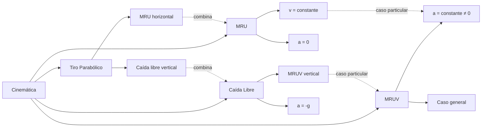
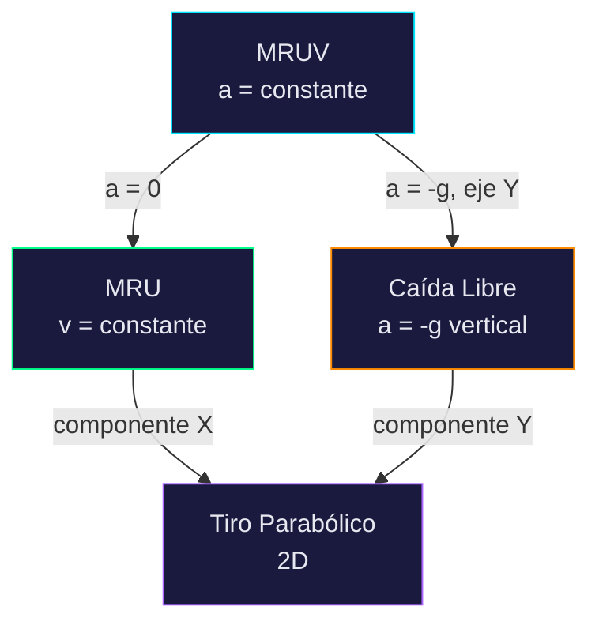

# SKILL 01 — CINEMÁTICA

## Información General

| Campo | Valor |
|-------|-------|
| **Módulo** | Cinemática |
| **Código** | `KIN` |
| **Prerrequisitos del alumno** | Álgebra básica, trigonometría (sin, cos, tan), concepto de función, gráficas en el plano cartesiano |
| **Tiempo estimado** | 4-6 sesiones de 45 minutos |
| **Archivos de implementación** | `js/modules/kinematics/mru.js`, `mruv.js`, `free-fall.js`, `projectile.js` |

## Objetivos de Aprendizaje

Al finalizar este módulo, el alumno será capaz de:

1. Distinguir entre posición, desplazamiento y distancia recorrida.
2. Diferenciar MRU de MRUV a partir del comportamiento de la aceleración.
3. Predecir la posición y velocidad de un objeto en movimiento rectilíneo dado un conjunto de condiciones iniciales.
4. Analizar gráficas x-t, v-t y a-t y extraer información física de ellas (pendientes, áreas).
5. Descomponer el tiro parabólico en sus componentes horizontal (MRU) y vertical (caída libre).
6. Calcular alcance, altura máxima y tiempo de vuelo de un proyectil.
7. Aplicar las ecuaciones cinemáticas para resolver problemas de ingeniería cotidianos.

## Mapa Conceptual



---

## SUB-MÓDULO KIN-01: Movimiento Rectilíneo Uniforme (MRU)

### Descripción

El MRU describe un objeto que se mueve en línea recta con velocidad constante. Es el caso más simple de movimiento y la base para entender todo lo demás. La aceleración es cero en todo momento.

### Variables de Entrada

| Variable | Símbolo | Unidad SI | Rango Slider | Default | Step | Descripción |
|----------|---------|-----------|-------------|---------|------|-------------|
| Posición inicial | `x₀` | m | [-100, 100] | 0 | 0.5 | Punto de partida del objeto |
| Velocidad | `v₀` | m/s | [-50, 50] | 5 | 0.5 | Velocidad constante (negativa = izquierda) |
| Tiempo de simulación | `t_max` | s | [1, 60] | 10 | 1 | Duración máxima de la simulación |

### Variables de Salida

| Variable | Símbolo | Unidad | Fórmula | Dónde se muestra |
|----------|---------|--------|---------|------------------|
| Posición instantánea | `x(t)` | m | x₀ + v₀·t | Sobre el objeto + panel lateral |
| Velocidad instantánea | `v(t)` | m/s | v₀ (constante) | Panel lateral |
| Aceleración | `a` | m/s² | 0 | Panel lateral |
| Distancia recorrida | `d` | m | \|v₀\|·t | Panel lateral |
| Desplazamiento | `Δx` | m | x(t) - x₀ | Panel lateral |
| Tiempo transcurrido | `t` | s | (simulación) | Cronómetro en pantalla |

### Ecuaciones Físicas — Derivación Completa

#### ¿Qué es el MRU?

Un movimiento es rectilíneo uniforme cuando:
- La **trayectoria** es una línea recta.
- La **velocidad** es constante en magnitud y dirección.
- La **aceleración** es cero.

#### Definición de velocidad constante

La velocidad es la razón de cambio de la posición respecto al tiempo:

```
v = Δx / Δt = (x - x₀) / (t - t₀)
```

Si tomamos `t₀ = 0`:

```
v = (x - x₀) / t
```

Despejando la posición:

```
x(t) = x₀ + v·t          ... (Ecuación 1 — MRU)
```

> **Interpretación geométrica**: La gráfica x vs t es una **línea recta** con pendiente = v y ordenada al origen = x₀. La gráfica v vs t es una **línea horizontal** a la altura v.

#### Relación entre gráficas

| Gráfica | Forma | Pendiente | Área bajo la curva |
|---------|-------|-----------|-------------------|
| x vs t | Línea recta | v (velocidad) | — |
| v vs t | Línea horizontal | 0 (aceleración) | Desplazamiento Δx |
| a vs t | Línea en cero | — | Cambio de velocidad Δv = 0 |

> **Dato clave para el alumno**: El área bajo la curva v-t entre t₁ y t₂ es el desplazamiento en ese intervalo. Para MRU: Área = v·Δt = Δx.

### Implementación JavaScript

```javascript
// ============================================
// MRU — Movimiento Rectilíneo Uniforme
// Archivo: js/modules/kinematics/mru.js
// ============================================

/**
 * Calcula el estado completo del sistema MRU en un instante t.
 * 
 * @param {number} x0 - Posición inicial (m)
 * @param {number} v0 - Velocidad constante (m/s)
 * @param {number} t  - Tiempo transcurrido (s)
 * @returns {Object} Estado del sistema
 */
export function mruState(x0, v0, t) {
    const position = x0 + v0 * t;              // x(t) = x₀ + v₀·t
    const velocity = v0;                        // v(t) = v₀ = constante
    const acceleration = 0;                     // a = 0
    const displacement = position - x0;         // Δx = x(t) - x₀
    const distance = Math.abs(v0) * t;          // d = |v₀|·t (siempre positiva)

    return {
        position,        // m
        velocity,        // m/s
        acceleration,    // m/s²
        displacement,    // m  (puede ser negativo)
        distance         // m  (siempre ≥ 0)
    };
}

/**
 * Módulo MRU completo para el simulador.
 * Implementa la interfaz { init(), update(dt, simTime), render(ctx, alpha) }
 */
export class MRUModule {
    constructor() {
        // Parámetros ajustables por el usuario
        this.x0 = 0;           // posición inicial (m)
        this.v0 = 5;           // velocidad (m/s)

        // Estado interno
        this.t = 0;            // tiempo de simulación (s)
        this.currentState = null;
        this.prevState = null;

        // Datos para gráficas
        this.graphData = {
            xt: [],    // puntos { x: t, y: posición }
            vt: []     // puntos { x: t, y: velocidad }
        };

        // Trail visual (posiciones anteriores para estela)
        this.trail = [];
        this.maxTrailPoints = 60;

        // Escala de la simulación
        this.scale = {
            pixelsPerMeter: 20,    // 20 px = 1 metro
            originX: 100,          // origen del eje X en canvas (px)
            originY: 300           // línea del suelo en canvas (px)
        };
    }

    /**
     * Reinicia la simulación al estado inicial.
     */
    init() {
        this.t = 0;
        this.currentState = mruState(this.x0, this.v0, 0);
        this.prevState = { ...this.currentState };
        this.graphData.xt = [];
        this.graphData.vt = [];
        this.trail = [];
    }

    /**
     * Actualiza un paso de física (llamado por el motor con dt fijo = 1/60).
     * @param {number} dt - Paso de tiempo fijo (s)
     * @param {number} simTime - Tiempo acumulado de simulación (s)
     */
    update(dt, simTime) {
        this.t = simTime;
        this.prevState = { ...this.currentState };
        this.currentState = mruState(this.x0, this.v0, this.t);

        // Agregar punto a las gráficas (cada 3 frames para ahorrar memoria)
        if (Math.round(simTime * 60) % 3 === 0) {
            this.graphData.xt.push({ x: this.t, y: this.currentState.position });
            this.graphData.vt.push({ x: this.t, y: this.currentState.velocity });
        }

        // Agregar posición al trail
        this.trail.push(this.currentState.position);
        if (this.trail.length > this.maxTrailPoints) {
            this.trail.shift();
        }
    }

    /**
     * Renderiza el frame visual.
     * @param {CanvasRenderingContext2D} ctx - Contexto del canvas
     * @param {number} alpha - Factor de interpolación [0, 1] entre prevState y currentState
     */
    render(ctx, alpha) {
        // Interpolación para suavidad visual
        const interpX = this.prevState.position + 
                        (this.currentState.position - this.prevState.position) * alpha;
        
        const canvasW = ctx.canvas.width;
        const canvasH = ctx.canvas.height;
        const { pixelsPerMeter, originX, originY } = this.scale;

        // --- 1. Dibujar fondo y grid ---
        this.drawGrid(ctx, canvasW, canvasH);

        // --- 2. Dibujar trail (estela de posiciones anteriores) ---
        this.drawTrail(ctx);

        // --- 3. Dibujar objeto principal ---
        const objScreenX = originX + interpX * pixelsPerMeter;
        const objScreenY = originY;
        this.drawObject(ctx, objScreenX, objScreenY);

        // --- 4. Dibujar vector velocidad ---
        if (Math.abs(this.v0) > 0.01) {
            this.drawVelocityVector(ctx, objScreenX, objScreenY);
        }

        // --- 5. Dibujar valores numéricos junto al objeto ---
        this.drawLabels(ctx, objScreenX, objScreenY);

        // --- 6. Dibujar regla métrica ---
        this.drawRuler(ctx, canvasW);
    }

    // --- MÉTODOS DE RENDERIZADO INDIVIDUALES ---

    drawGrid(ctx, w, h) {
        const { pixelsPerMeter, originX, originY } = this.scale;
        ctx.strokeStyle = 'rgba(255, 255, 255, 0.05)';
        ctx.lineWidth = 1;

        // Líneas verticales cada metro
        const startM = Math.floor(-originX / pixelsPerMeter);
        const endM = Math.ceil((w - originX) / pixelsPerMeter);
        for (let m = startM; m <= endM; m++) {
            const px = originX + m * pixelsPerMeter;
            ctx.beginPath();
            ctx.moveTo(px, 0);
            ctx.lineTo(px, h);
            ctx.stroke();
        }

        // Eje horizontal (suelo)
        ctx.strokeStyle = 'rgba(255, 255, 255, 0.3)';
        ctx.lineWidth = 2;
        ctx.beginPath();
        ctx.moveTo(0, originY);
        ctx.lineTo(w, originY);
        ctx.stroke();

        // Marca del origen
        ctx.fillStyle = '#00e5ff';
        ctx.font = '12px system-ui';
        ctx.fillText('0', originX - 3, originY + 16);
    }

    drawTrail(ctx) {
        const { pixelsPerMeter, originX, originY } = this.scale;
        for (let i = 0; i < this.trail.length; i++) {
            const opacity = (i / this.trail.length) * 0.5;
            const screenX = originX + this.trail[i] * pixelsPerMeter;
            ctx.beginPath();
            ctx.arc(screenX, originY - 15, 3, 0, Math.PI * 2);
            ctx.fillStyle = `rgba(0, 229, 255, ${opacity})`;
            ctx.fill();
        }
    }

    drawObject(ctx, x, y) {
        // Bloque de 30x20 px
        const w = 30, h = 20;
        ctx.fillStyle = '#00e5ff';
        ctx.fillRect(x - w / 2, y - h - 5, w, h);
        ctx.strokeStyle = '#00b8d4';
        ctx.lineWidth = 2;
        ctx.strokeRect(x - w / 2, y - h - 5, w, h);
    }

    drawVelocityVector(ctx, x, y) {
        const { pixelsPerMeter } = this.scale;
        const arrowLen = this.v0 * pixelsPerMeter * 0.3; // escala visual
        const arrowY = y - 15; // centro del objeto
        
        ctx.strokeStyle = '#ff8c00';
        ctx.lineWidth = 2;
        ctx.beginPath();
        ctx.moveTo(x, arrowY);
        ctx.lineTo(x + arrowLen, arrowY);
        ctx.stroke();

        // Punta de flecha
        const dir = Math.sign(arrowLen);
        ctx.fillStyle = '#ff8c00';
        ctx.beginPath();
        ctx.moveTo(x + arrowLen, arrowY);
        ctx.lineTo(x + arrowLen - dir * 8, arrowY - 4);
        ctx.lineTo(x + arrowLen - dir * 8, arrowY + 4);
        ctx.closePath();
        ctx.fill();

        // Etiqueta "v"
        ctx.fillStyle = '#ff8c00';
        ctx.font = 'bold 12px system-ui';
        ctx.fillText(`v = ${this.v0.toFixed(1)} m/s`, x + arrowLen / 2 - 20, arrowY - 8);
    }

    drawLabels(ctx, x, y) {
        ctx.fillStyle = '#e8e8f0';
        ctx.font = '13px system-ui';
        ctx.fillText(`x = ${this.currentState.position.toFixed(2)} m`, x + 20, y - 30);
        ctx.fillText(`t = ${this.t.toFixed(2)} s`, x + 20, y - 14);
    }

    drawRuler(ctx, canvasW) {
        const { pixelsPerMeter, originX, originY } = this.scale;
        const rulerY = originY + 30;
        
        ctx.strokeStyle = '#666';
        ctx.lineWidth = 1;
        ctx.fillStyle = '#888';
        ctx.font = '10px monospace';

        // Línea base de la regla
        ctx.beginPath();
        ctx.moveTo(0, rulerY);
        ctx.lineTo(canvasW, rulerY);
        ctx.stroke();

        // Marcas cada metro
        const startM = Math.floor(-originX / pixelsPerMeter);
        const endM = Math.ceil((canvasW - originX) / pixelsPerMeter);
        for (let m = startM; m <= endM; m++) {
            const px = originX + m * pixelsPerMeter;
            const isMajor = m % 5 === 0;
            ctx.beginPath();
            ctx.moveTo(px, rulerY);
            ctx.lineTo(px, rulerY + (isMajor ? 10 : 5));
            ctx.stroke();
            if (isMajor) {
                ctx.fillText(`${m}m`, px - 8, rulerY + 22);
            }
        }
    }
}
```

### Gráficas Requeridas

| Gráfica | Eje X | Eje Y | Forma esperada | Color línea | Datos |
|---------|-------|-------|----------------|-------------|-------|
| Posición vs Tiempo | t (s) | x (m) | Línea recta con pendiente v₀ | `#00e5ff` (cyan) | `graphData.xt` |
| Velocidad vs Tiempo | t (s) | v (m/s) | Línea horizontal a v₀ | `#ff8c00` (naranja) | `graphData.vt` |

Las gráficas se alimentan con puntos cada 3 frames (~20 Hz) mediante push a los arreglos `graphData.xt` y `graphData.vt`.

### Interacciones del Usuario

| Control | Tipo | Comportamiento |
|---------|------|---------------|
| Slider `x₀` | `<input type="range">` | Cambia posición inicial. **Reinicia** la simulación al cambiar. |
| Slider `v₀` | `<input type="range">` | Cambia velocidad. Aplica **en vivo** (sin reiniciar). |
| Botón Play ▶ | click | Inicia/reanuda la simulación |
| Botón Pausa ⏸ | click | Congela el tiempo, el objeto se detiene |
| Botón Reiniciar ⏹ | click | t=0, objeto vuelve a x₀, gráficas se limpian |
| Botón Step ⏭ | click | Avanza exactamente 1 frame (dt = 1/60 s) |
| Arrastrar objeto | Pointer Events | Cambia x₀ visualmente. Solo funciona en pausa. |

### Casos Especiales y Validaciones

| Caso | Qué sucede | Acción del simulador |
|------|-----------|---------------------|
| `v₀ = 0` | Objeto inmóvil | Se queda en x₀. Gráfica x-t horizontal. Gráfica v-t en cero. Válido. |
| `v₀ < 0` | Se mueve a la izquierda | Flecha de velocidad apunta a la izquierda. Posición decrece. |
| Objeto sale del canvas por la derecha | Posición > vista | Auto-scroll: el "viewport" sigue al objeto. O: el objeto reaparece marcando la posición numérica. |
| Objeto sale del canvas por la izquierda | Posición < vista | Igual: auto-follow o marca numérica. |
| `t` muy grande | Valores extremos | Limitar la simulación a t_max. Mostrar "Simulación finalizada". |

### Retos Pedagógicos — MRU

```json
[
  {
    "id": "mru-01",
    "type": "multiple_choice",
    "difficulty": 1,
    "question": "Un auto viaja a velocidad constante de 20 m/s. ¿Qué tipo de movimiento realiza?",
    "options": [
      "Movimiento Rectilíneo Uniforme (MRU)",
      "Movimiento Rectilíneo Uniformemente Variado (MRUV)",
      "Caída libre",
      "Movimiento circular"
    ],
    "correctAnswer": 0,
    "hint": "Si la velocidad es constante, la aceleración es cero.",
    "feedbackCorrect": "¡Correcto! Velocidad constante = MRU. La aceleración es cero.",
    "feedbackIncorrect": "Si la velocidad no cambia, no hay aceleración. Ese es el MRU.",
    "explanation": "El MRU se define como movimiento con velocidad constante (a=0). Si la velocidad cambiara, sería MRUV."
  },
  {
    "id": "mru-02",
    "type": "numeric",
    "difficulty": 1,
    "question": "Un ciclista viaja a 8 m/s partiendo del punto x₀ = 10 m. ¿Cuál es su posición a los 5 segundos?",
    "correctAnswer": 50,
    "tolerance": 0.02,
    "unit": "m",
    "hint": "Usa x = x₀ + v·t. Sustituye x₀=10, v=8, t=5.",
    "feedbackCorrect": "¡Correcto! x = 10 + 8×5 = 10 + 40 = 50 m",
    "feedbackIncorrect": "Revisa: x = x₀ + v·t = 10 + (8)(5) = 50 m",
    "explanation": "La ecuación x = x₀ + v·t nos da la posición en cualquier instante. Es una suma: posición inicial + lo que avanzó."
  },
  {
    "id": "mru-03",
    "type": "multiple_choice",
    "difficulty": 2,
    "question": "En una gráfica v vs t de un MRU, ¿qué representa el ÁREA bajo la curva entre t₁ y t₂?",
    "options": [
      "El desplazamiento del objeto en ese intervalo",
      "La aceleración del objeto",
      "La velocidad promedio",
      "La energía cinética"
    ],
    "correctAnswer": 0,
    "hint": "El área bajo v-t tiene unidades de (m/s)×(s) = m. ¿Qué magnitud se mide en metros?",
    "feedbackCorrect": "¡Correcto! Área bajo v-t = base × altura = Δt × v = desplazamiento.",
    "feedbackIncorrect": "Piensa en las unidades: (m/s) × (s) = metros = desplazamiento.",
    "explanation": "Esta relación es fundamental: el área bajo la curva v-t siempre da el desplazamiento, en cualquier tipo de movimiento."
  },
  {
    "id": "mru-04",
    "type": "numeric",
    "difficulty": 2,
    "question": "Un tren viaja a 30 m/s. ¿Cuánto tiempo tarda en recorrer 1.5 km?",
    "correctAnswer": 50,
    "tolerance": 0.02,
    "unit": "s",
    "hint": "Convierte 1.5 km a metros (1500 m). Luego despeja t de x = v·t → t = x/v.",
    "feedbackCorrect": "¡Correcto! t = 1500/30 = 50 s",
    "feedbackIncorrect": "1.5 km = 1500 m. Entonces t = d/v = 1500/30 = 50 s.",
    "explanation": "Siempre convierte a unidades SI antes de calcular. 1 km = 1000 m."
  },
  {
    "id": "mru-05",
    "type": "experiment",
    "difficulty": 3,
    "question": "Configura la simulación para que el objeto llegue a la posición x = 100 m en exactamente 10 segundos, partiendo del origen (x₀ = 0). ¿Qué velocidad necesitas?",
    "correctAnswer": 10,
    "tolerance": 0.05,
    "unit": "m/s",
    "hint": "Despeja v de la ecuación x = x₀ + v·t con x₀=0, x=100, t=10.",
    "feedbackCorrect": "¡Excelente! v = (x - x₀)/t = (100 - 0)/10 = 10 m/s. Configuraste correctamente.",
    "feedbackIncorrect": "Necesitas v = Δx/t = 100/10 = 10 m/s. Ajusta el slider de velocidad a 10.",
    "explanation": "Despejar variables es esencial. De x = v·t sacamos v = x/t.",
    "simulationPreset": { "x0": 0 }
  }
]
```

---

## SUB-MÓDULO KIN-02: Movimiento Rectilíneo Uniformemente Variado (MRUV)

### Descripción

El MRUV describe un objeto que se mueve en línea recta con aceleración constante. La velocidad cambia de manera uniforme (la misma cantidad cada segundo). Es la generalización del MRU: cuando a = 0, el MRUV se reduce a MRU.

### Variables de Entrada

| Variable | Símbolo | Unidad SI | Rango Slider | Default | Step | Descripción |
|----------|---------|-----------|-------------|---------|------|-------------|
| Posición inicial | `x₀` | m | [-100, 100] | 0 | 0.5 | Punto de partida |
| Velocidad inicial | `v₀` | m/s | [-30, 30] | 0 | 0.5 | Velocidad al momento t=0 |
| Aceleración | `a` | m/s² | [-10, 10] | 2 | 0.1 | Aceleración constante |
| Tiempo máx. | `t_max` | s | [1, 30] | 10 | 1 | Duración de la simulación |

### Variables de Salida

| Variable | Símbolo | Unidad | Fórmula | Muestra en |
|----------|---------|--------|---------|------------|
| Posición | `x(t)` | m | x₀ + v₀t + ½at² | Sobre el objeto + panel |
| Velocidad | `v(t)` | m/s | v₀ + at | Panel + vector flecha |
| Aceleración | `a` | m/s² | constante | Panel |
| Desplazamiento | `Δx` | m | x(t) - x₀ | Panel |
| Distancia recorrida | `d` | m | (ver algoritmo) | Panel |
| Velocidad² | `v²` | m²/s² | v₀² + 2a(x-x₀) | Panel (informativo) |
| Tiempo de parada | `t_stop` | s | -v₀/a (si a frena) | Evento visual |

### Ecuaciones Físicas — Derivación Completa

#### Punto de partida: aceleración constante

La aceleración es la razón de cambio de la velocidad:

```
a = dv/dt = constante
```

#### Ecuación 1: Velocidad en función del tiempo

Integrando la aceleración respecto al tiempo:

```
∫dv = ∫a·dt
v - v₀ = a·t

v(t) = v₀ + a·t                    ... (Ec. 1 — MRUV)
```

> Interpretación: La gráfica v-t es una **línea recta** con pendiente `a` y ordenada al origen `v₀`.

#### Ecuación 2: Posición en función del tiempo

La velocidad es la razón de cambio de la posición:

```
v = dx/dt = v₀ + a·t
```

Integrando:

```
∫dx = ∫(v₀ + a·t)·dt
x - x₀ = v₀·t + ½·a·t²

x(t) = x₀ + v₀·t + ½·a·t²         ... (Ec. 2 — MRUV)
```

> Interpretación: La gráfica x-t es una **parábola**. Si a > 0, abre hacia arriba. Si a < 0, abre hacia abajo.

#### Ecuación 3: Velocidad en función de la posición (sin tiempo)

Eliminando `t` entre las ecuaciones 1 y 2. De la Ec. 1: `t = (v - v₀)/a`. Sustituyendo en la Ec. 2:

```
x - x₀ = v₀·((v-v₀)/a) + ½·a·((v-v₀)/a)²
x - x₀ = (v·v₀ - v₀²)/a + (v² - 2v·v₀ + v₀²)/(2a)
2a(x - x₀) = 2v·v₀ - 2v₀² + v² - 2v·v₀ + v₀²
2a(x - x₀) = v² - v₀²

v² = v₀² + 2·a·(x - x₀)            ... (Ec. 3 — MRUV)
```

> Útil cuando el tiempo no es dato ni incógnita.

#### Ecuación 4: Velocidad media

```
v̄ = (v₀ + v) / 2                    ... (Ec. 4 — solo para a = cte.)
```

Y entonces: `Δx = v̄ · t = ((v₀ + v)/2) · t`

#### Detección de cambio de dirección

Si v₀ y a tienen signos opuestos, el objeto frena y luego regresa. El instante de parada:

```
v(t_stop) = 0  →  t_stop = -v₀ / a
```

La **distancia total recorrida** (no desplazamiento) requiere calcular por tramos:
- Tramo 1: de t=0 a t=t_stop (ida)
- Tramo 2: de t=t_stop a t=t_final (vuelta)
- Distancia total = |Δx₁| + |Δx₂|

### Implementación JavaScript

```javascript
// ============================================
// MRUV — Movimiento Rectilíneo Uniformemente Variado
// Archivo: js/modules/kinematics/mruv.js
// ============================================

/**
 * Calcula el estado completo del sistema MRUV en un instante t.
 */
export function mruvState(x0, v0, a, t) {
    const position     = x0 + v0 * t + 0.5 * a * t * t;   // x = x₀ + v₀t + ½at²
    const velocity     = v0 + a * t;                         // v = v₀ + at
    const displacement = position - x0;                      // Δx = x(t) - x₀
    const vSquared     = v0 * v0 + 2 * a * displacement;    // v² = v₀² + 2aΔx

    // Tiempo de parada (si existe)
    let tStop = null;
    if (a !== 0 && Math.sign(v0) !== Math.sign(a)) {
        tStop = -v0 / a;    // instante donde v = 0
        if (tStop < 0) tStop = null;   // ya pasó, no relevante
    }

    // Distancia total recorrida (no desplazamiento)
    let distance;
    if (tStop !== null && t > tStop) {
        // El objeto cambió de dirección: sumar ambos tramos
        const x_at_stop = x0 + v0 * tStop + 0.5 * a * tStop * tStop;
        const tramo1 = Math.abs(x_at_stop - x0);
        const tramo2 = Math.abs(position - x_at_stop);
        distance = tramo1 + tramo2;
    } else {
        distance = Math.abs(displacement);
    }

    return {
        position,          // m
        velocity,          // m/s
        acceleration: a,   // m/s²
        displacement,      // m (con signo)
        distance,          // m (siempre positiva)
        vSquared,          // m²/s² (informativo)
        stopTime: tStop,   // s o null
        changedDirection: tStop !== null && t > tStop
    };
}

/**
 * Módulo MRUV completo para el simulador.
 */
export class MRUVModule {
    constructor() {
        this.x0 = 0;
        this.v0 = 0;
        this.a = 2;

        this.t = 0;
        this.currentState = null;
        this.prevState = null;

        this.graphData = {
            xt: [],     // posición vs tiempo
            vt: [],     // velocidad vs tiempo
            at: []      // aceleración vs tiempo
        };

        this.trail = [];
        this.maxTrailPoints = 80;
        this.directionChanged = false;

        this.scale = {
            pixelsPerMeter: 15,
            originX: 100,
            originY: 300
        };
    }

    init() {
        this.t = 0;
        this.currentState = mruvState(this.x0, this.v0, this.a, 0);
        this.prevState = { ...this.currentState };
        this.graphData = { xt: [], vt: [], at: [] };
        this.trail = [];
        this.directionChanged = false;
    }

    update(dt, simTime) {
        this.t = simTime;
        this.prevState = { ...this.currentState };
        this.currentState = mruvState(this.x0, this.v0, this.a, this.t);

        // Detectar cambio de dirección para efecto visual
        if (this.currentState.changedDirection && !this.directionChanged) {
            this.directionChanged = true;
            // Emitir evento visual: flash en el punto de retorno
        }

        // Datos de gráficas (cada 3 frames)
        if (Math.round(simTime * 60) % 3 === 0) {
            this.graphData.xt.push({ x: this.t, y: this.currentState.position });
            this.graphData.vt.push({ x: this.t, y: this.currentState.velocity });
            this.graphData.at.push({ x: this.t, y: this.currentState.acceleration });
        }

        // Trail con información de dirección
        this.trail.push({
            pos: this.currentState.position,
            vel: this.currentState.velocity  // para cambiar color del trail
        });
        if (this.trail.length > this.maxTrailPoints) {
            this.trail.shift();
        }
    }

    render(ctx, alpha) {
        const interpX = this.prevState.position +
                        (this.currentState.position - this.prevState.position) * alpha;
        const interpV = this.prevState.velocity +
                        (this.currentState.velocity - this.prevState.velocity) * alpha;

        const { pixelsPerMeter, originX, originY } = this.scale;
        const canvasW = ctx.canvas.width;
        const canvasH = ctx.canvas.height;

        // 1. Grid y eje
        this.drawGrid(ctx, canvasW, canvasH);

        // 2. Trail con gradiente de color
        //    Azul si v > 0 (avanza), Rojo si v < 0 (retrocede)
        for (let i = 0; i < this.trail.length; i++) {
            const pt = this.trail[i];
            const opacity = (i / this.trail.length) * 0.6;
            const screenX = originX + pt.pos * pixelsPerMeter;
            const color = pt.vel >= 0 ? `rgba(0,229,255,${opacity})` : `rgba(255,68,68,${opacity})`;
            ctx.beginPath();
            ctx.arc(screenX, originY - 15, 3, 0, Math.PI * 2);
            ctx.fillStyle = color;
            ctx.fill();
        }

        // 3. Objeto
        const objX = originX + interpX * pixelsPerMeter;
        ctx.fillStyle = interpV >= 0 ? '#00e5ff' : '#ff4444';
        ctx.fillRect(objX - 15, originY - 25, 30, 20);
        ctx.strokeStyle = '#fff';
        ctx.lineWidth = 1;
        ctx.strokeRect(objX - 15, originY - 25, 30, 20);

        // 4. Vector velocidad (naranja)
        if (Math.abs(interpV) > 0.1) {
            const vArrow = interpV * pixelsPerMeter * 0.2;
            ctx.strokeStyle = '#ff8c00';
            ctx.lineWidth = 2;
            ctx.beginPath();
            ctx.moveTo(objX, originY - 15);
            ctx.lineTo(objX + vArrow, originY - 15);
            ctx.stroke();
            // Punta
            const dir = Math.sign(vArrow);
            ctx.fillStyle = '#ff8c00';
            ctx.beginPath();
            ctx.moveTo(objX + vArrow, originY - 15);
            ctx.lineTo(objX + vArrow - dir * 7, originY - 19);
            ctx.lineTo(objX + vArrow - dir * 7, originY - 11);
            ctx.closePath();
            ctx.fill();
        }

        // 5. Vector aceleración (verde, debajo del objeto)
        if (Math.abs(this.a) > 0.01) {
            const aArrow = this.a * pixelsPerMeter * 0.5;
            ctx.strokeStyle = '#00ff88';
            ctx.lineWidth = 2;
            ctx.beginPath();
            ctx.moveTo(objX, originY + 5);
            ctx.lineTo(objX + aArrow, originY + 5);
            ctx.stroke();
            const dir = Math.sign(aArrow);
            ctx.fillStyle = '#00ff88';
            ctx.beginPath();
            ctx.moveTo(objX + aArrow, originY + 5);
            ctx.lineTo(objX + aArrow - dir * 7, originY + 1);
            ctx.lineTo(objX + aArrow - dir * 7, originY + 9);
            ctx.closePath();
            ctx.fill();
            ctx.font = '11px system-ui';
            ctx.fillText(`a = ${this.a.toFixed(1)} m/s²`, objX + aArrow / 2 - 25, originY + 20);
        }

        // 6. Etiquetas
        ctx.fillStyle = '#e8e8f0';
        ctx.font = '13px system-ui';
        ctx.fillText(`x = ${this.currentState.position.toFixed(2)} m`, objX + 22, originY - 30);
        ctx.fillText(`v = ${this.currentState.velocity.toFixed(2)} m/s`, objX + 22, originY - 14);
        ctx.fillText(`t = ${this.t.toFixed(2)} s`, objX + 22, originY + 2);
    }

    drawGrid(ctx, w, h) {
        // Idéntico al MRU (reusar método o helper)
        const { pixelsPerMeter, originX, originY } = this.scale;
        ctx.strokeStyle = 'rgba(255,255,255,0.05)';
        ctx.lineWidth = 1;
        const startM = Math.floor(-originX / pixelsPerMeter);
        const endM = Math.ceil((w - originX) / pixelsPerMeter);
        for (let m = startM; m <= endM; m++) {
            const px = originX + m * pixelsPerMeter;
            ctx.beginPath();
            ctx.moveTo(px, 0);
            ctx.lineTo(px, h);
            ctx.stroke();
        }
        ctx.strokeStyle = 'rgba(255,255,255,0.3)';
        ctx.lineWidth = 2;
        ctx.beginPath();
        ctx.moveTo(0, originY);
        ctx.lineTo(w, originY);
        ctx.stroke();
    }
}
```

### Gráficas Requeridas (3 simultáneas)

| Gráfica | Eje X | Eje Y | Forma | Color | Significado de la pendiente |
|---------|-------|-------|-------|-------|---------------------------|
| x vs t | t (s) | x (m) | Parábola | `#00e5ff` | Pendiente = v(t) instantánea |
| v vs t | t (s) | v (m/s) | Línea recta | `#ff8c00` | Pendiente = a (aceleración) |
| a vs t | t (s) | a (m/s²) | Línea horizontal | `#00ff88` | Pendiente = 0 |

> **Relación entre gráficas**: La pendiente de x-t en cada punto da el valor de v en ese instante. La pendiente de v-t da la aceleración. El área bajo v-t da el desplazamiento. El área bajo a-t da el cambio de velocidad.

### Retos Pedagógicos — MRUV

```json
[
  {
    "id": "mruv-01",
    "type": "numeric",
    "difficulty": 1,
    "question": "Un auto parte del reposo y acelera a 3 m/s². ¿Qué distancia recorre en 4 segundos?",
    "correctAnswer": 24,
    "tolerance": 0.02,
    "unit": "m",
    "hint": "Si parte del reposo, v₀ = 0. Usa x = ½·a·t².",
    "feedbackCorrect": "¡Correcto! x = ½(3)(4²) = ½(3)(16) = 24 m",
    "feedbackIncorrect": "Con v₀ = 0: x = ½·a·t² = ½(3)(16) = 24 m",
    "explanation": "Cuando v₀ = 0, la ecuación se simplifica a x = ½at². La distancia crece con el cuadrado del tiempo."
  },
  {
    "id": "mruv-02",
    "type": "numeric",
    "difficulty": 2,
    "question": "Un auto viaja a 20 m/s y frena con aceleración de -4 m/s². ¿En cuántos segundos se detiene?",
    "correctAnswer": 5,
    "tolerance": 0.02,
    "unit": "s",
    "hint": "Se detiene cuando v = 0. Usa v = v₀ + at y despeja t.",
    "feedbackCorrect": "¡Correcto! 0 = 20 + (-4)t → t = 20/4 = 5 s",
    "feedbackIncorrect": "v = v₀ + at → 0 = 20 - 4t → t = 5 s",
    "explanation": "El signo negativo de a indica frenado. El auto pierde 4 m/s cada segundo."
  },
  {
    "id": "mruv-03",
    "type": "multiple_choice",
    "difficulty": 1,
    "question": "¿Qué forma tiene la gráfica x vs t de un MRUV?",
    "options": ["Una parábola", "Una línea recta", "Una hipérbola", "Un círculo"],
    "correctAnswer": 0,
    "hint": "x = x₀ + v₀t + ½at² es una función cuadrática de t.",
    "feedbackCorrect": "¡Correcto! x depende de t² → parábola.",
    "feedbackIncorrect": "x = x₀ + v₀t + ½at² tiene t² → es cuadrática → parábola.",
    "explanation": "Toda función de la forma y = At² + Bt + C es una parábola. En el MRUV, A = ½a, B = v₀, C = x₀."
  },
  {
    "id": "mruv-04",
    "type": "numeric",
    "difficulty": 2,
    "question": "Un motociclista acelera de 5 m/s a 25 m/s en una distancia de 150 m. ¿Cuál es su aceleración?",
    "correctAnswer": 2,
    "tolerance": 0.05,
    "unit": "m/s²",
    "hint": "Usa v² = v₀² + 2a·Δx y despeja a.",
    "feedbackCorrect": "¡Correcto! a = (v² - v₀²)/(2Δx) = (625 - 25)/300 = 2 m/s²",
    "feedbackIncorrect": "a = (v² - v₀²)/(2Δx) = (25² - 5²)/(2×150) = 600/300 = 2 m/s²",
    "explanation": "La ecuación v² = v₀² + 2aΔx es útil cuando no conocemos el tiempo."
  },
  {
    "id": "mruv-05",
    "type": "experiment",
    "difficulty": 3,
    "question": "Configura la simulación para que un objeto parta del reposo, acelere y alcance una velocidad de 12 m/s en exactamente 6 segundos. ¿Qué aceleración necesitas?",
    "correctAnswer": 2,
    "tolerance": 0.05,
    "unit": "m/s²",
    "hint": "v = v₀ + at → 12 = 0 + a(6) → a = 12/6",
    "feedbackCorrect": "¡Excelente! a = v/t = 12/6 = 2 m/s²",
    "feedbackIncorrect": "a = (v - v₀)/t = (12 - 0)/6 = 2 m/s²",
    "explanation": "Despejar a de v = at cuando v₀ = 0 da simplemente a = v/t.",
    "simulationPreset": { "x0": 0, "v0": 0 }
  }
]
```

---

## SUB-MÓDULO KIN-03: Caída Libre

### Descripción

La caída libre es un caso particular de MRUV donde el movimiento es vertical y la aceleración es la gravedad terrestre (g ≈ 9.81 m/s²) apuntando hacia abajo. Se desprecian la resistencia del aire y toda otra fuerza que no sea la gravedad.

### Variables de Entrada

| Variable | Símbolo | Unidad SI | Rango Slider | Default | Step | Descripción |
|----------|---------|-----------|-------------|---------|------|-------------|
| Altura inicial | `h₀` | m | [0, 200] | 20 | 1 | Punto de lanzamiento vertical |
| Velocidad inicial | `v₀` | m/s | [-30, 30] | 0 | 0.5 | Positiva=hacia arriba, Negativa=hacia abajo |
| Gravedad | `g` | m/s² | [1, 25] | 9.81 | 0.01 | Ajustable para simular otros planetas |

### Presets de Gravedad

| Cuerpo celeste | g (m/s²) | Icono sugerido |
|----------------|----------|----------------|
| Tierra | 9.81 | 🌍 |
| Luna | 1.62 | 🌙 |
| Marte | 3.72 | 🔴 |
| Júpiter | 24.79 | 🟤 |
| Venus | 8.87 | 🟡 |
| Mercurio | 3.70 | ⚫ |

### Variables de Salida

| Variable | Símbolo | Unidad | Fórmula | Muestra en |
|----------|---------|--------|---------|------------|
| Altura instantánea | `y(t)` | m | h₀ + v₀t - ½gt² | Sobre el objeto + panel |
| Velocidad vertical | `vy(t)` | m/s | v₀ - gt | Panel + vector |
| Tiempo de impacto | `t_imp` | s | Raíz positiva de cuadrática | Panel (se calcula al inicio) |
| Velocidad de impacto | `v_imp` | m/s | √(v₀² + 2g·h₀) | Panel |
| Altura máxima | `h_max` | m | h₀ + v₀²/(2g) (si v₀>0) | Marca visual en canvas |
| Energía cinética al impacto | `Ec_imp` | J | ½m·v_imp² (m=1 kg ref) | Panel |
| Estado | — | — | "subiendo" / "bajando" / "impactó" | Indicador visual |

### Ecuaciones Físicas — Derivación Completa

La caída libre es MRUV vertical con a = -g (negativo porque apunta hacia abajo y tomamos "arriba" como positivo).

#### Posición (altura) en función del tiempo

```
y(t) = h₀ + v₀·t - ½·g·t²          ... (Ec. 1 — Caída libre)
```

Se obtiene de x = x₀ + v₀t + ½at² sustituyendo a = -g.

#### Velocidad en función del tiempo

```
vy(t) = v₀ - g·t                      ... (Ec. 2)
```

Negativa cuando el objeto baja.

#### Tiempo de impacto (cuando y = 0)

```
0 = h₀ + v₀·t - ½·g·t²
½g·t² - v₀·t - h₀ = 0
```

Fórmula cuadrática: a=½g, b=-v₀, c=-h₀

```
t = (v₀ ± √(v₀² + 2g·h₀)) / g
```

Tomamos la raíz **positiva**:

```
t_imp = (v₀ + √(v₀² + 2g·h₀)) / g    ... (Ec. 3)
```

#### Velocidad de impacto

De v² = v₀² + 2a·Δy con Δy = -h₀ (baja h₀ metros) y a = -g:

```
v_imp² = v₀² + 2g·h₀
v_imp = √(v₀² + 2g·h₀)               ... (Ec. 4)
```

#### Altura máxima (solo si v₀ > 0, lanzamiento hacia arriba)

El objeto llega a su punto más alto cuando vy = 0:

```
0 = v₀ - g·t_max
t_max = v₀ / g

h_max = h₀ + v₀·(v₀/g) - ½g·(v₀/g)²
h_max = h₀ + v₀²/(2g)                 ... (Ec. 5)
```

### Implementación JavaScript

```javascript
// ============================================
// CAÍDA LIBRE
// Archivo: js/modules/kinematics/free-fall.js
// ============================================

const G_PRESETS = {
    tierra:   { g: 9.81,  label: 'Tierra 🌍' },
    luna:     { g: 1.62,  label: 'Luna 🌙' },
    marte:    { g: 3.72,  label: 'Marte 🔴' },
    jupiter:  { g: 24.79, label: 'Júpiter 🟤' },
    venus:    { g: 8.87,  label: 'Venus 🟡' },
    mercurio: { g: 3.70,  label: 'Mercurio ⚫' }
};

/**
 * Calcula el estado completo de caída libre en un instante t.
 */
export function caidaLibreState(h0, v0, g, t) {
    // Posición (altura)
    const y = h0 + v0 * t - 0.5 * g * t * t;

    // Velocidad vertical
    const vy = v0 - g * t;

    // Tiempo de impacto (y = 0)
    const discriminant = v0 * v0 + 2 * g * h0;
    const tImpacto = discriminant >= 0
        ? (v0 + Math.sqrt(discriminant)) / g
        : Infinity; // No impacta (caso teórico)

    // Velocidad de impacto
    const vImpacto = Math.sqrt(Math.max(0, v0 * v0 + 2 * g * h0));

    // Altura máxima (solo si v₀ > 0)
    let hMax = h0;
    let tMax = 0;
    if (v0 > 0) {
        tMax = v0 / g;
        hMax = h0 + (v0 * v0) / (2 * g);
    }

    // Estado actual
    const hasLanded = y <= 0 && t > 0;
    let phase;
    if (hasLanded) {
        phase = 'impactó';
    } else if (v0 > 0 && t < tMax) {
        phase = 'subiendo';
    } else {
        phase = 'bajando';
    }

    return {
        height: Math.max(0, y),
        velocity: hasLanded ? 0 : vy,
        impactTime: tImpacto,
        impactVelocity: vImpacto,
        maxHeight: hMax,
        timeOfMaxHeight: tMax,
        hasLanded,
        phase,
        kineticEnergyAtImpact: 0.5 * 1 * vImpacto * vImpacto  // masa = 1 kg referencia
    };
}

/**
 * Módulo Caída Libre completo.
 */
export class FreeFallModule {
    constructor() {
        this.h0 = 20;
        this.v0 = 0;
        this.g = 9.81;
        this.t = 0;
        this.currentState = null;
        this.prevState = null;
        this.graphData = { yt: [], vt: [] };
        this.afterimages = [];      // "fantasmas" de posiciones anteriores
        this.maxAfterimages = 15;
        this.impactEffect = null;   // para animación de impacto

        this.scale = {
            pixelsPerMeter: 8,   // vertical
            groundY: 450,        // línea del suelo en canvas (px)
            objectX: 300         // posición X fija (movimiento solo vertical)
        };
    }

    init() {
        this.t = 0;
        this.currentState = caidaLibreState(this.h0, this.v0, this.g, 0);
        this.prevState = { ...this.currentState };
        this.graphData = { yt: [], vt: [] };
        this.afterimages = [];
        this.impactEffect = null;
    }

    update(dt, simTime) {
        if (this.currentState && this.currentState.hasLanded) return; // Ya impactó

        this.t = simTime;
        this.prevState = { ...this.currentState };
        this.currentState = caidaLibreState(this.h0, this.v0, this.g, this.t);

        // Afterimages cada 5 frames
        if (Math.round(simTime * 60) % 5 === 0) {
            this.afterimages.push(this.currentState.height);
            if (this.afterimages.length > this.maxAfterimages) this.afterimages.shift();
        }

        // Gráficas (cada 3 frames)
        if (Math.round(simTime * 60) % 3 === 0) {
            this.graphData.yt.push({ x: this.t, y: this.currentState.height });
            this.graphData.vt.push({ x: this.t, y: this.currentState.velocity });
        }

        // Efecto de impacto
        if (this.currentState.hasLanded && !this.impactEffect) {
            this.impactEffect = {
                startTime: simTime,
                intensity: Math.min(1, this.currentState.impactVelocity / 30)
            };
        }
    }

    render(ctx, alpha) {
        const { pixelsPerMeter, groundY, objectX } = this.scale;
        const canvasW = ctx.canvas.width;

        // Interpolación vertical
        const interpH = this.prevState.height +
                        (this.currentState.height - this.prevState.height) * alpha;
        const objY = groundY - interpH * pixelsPerMeter;

        // 1. Fondo con regla vertical
        this.drawBackground(ctx, canvasW, groundY);

        // 2. Marca de altura máxima (si v₀ > 0)
        if (this.v0 > 0) {
            const hmaxY = groundY - this.currentState.maxHeight * pixelsPerMeter;
            ctx.setLineDash([4, 4]);
            ctx.strokeStyle = '#aa66ff';
            ctx.beginPath();
            ctx.moveTo(objectX - 40, hmaxY);
            ctx.lineTo(objectX + 40, hmaxY);
            ctx.stroke();
            ctx.setLineDash([]);
            ctx.fillStyle = '#aa66ff';
            ctx.font = '11px system-ui';
            ctx.fillText(`h_max = ${this.currentState.maxHeight.toFixed(1)} m`, objectX + 45, hmaxY + 4);
        }

        // 3. Afterimages (fantasmas)
        for (let i = 0; i < this.afterimages.length; i++) {
            const opacity = (i / this.afterimages.length) * 0.3;
            const ghostY = groundY - this.afterimages[i] * pixelsPerMeter;
            ctx.beginPath();
            ctx.arc(objectX, ghostY, 10, 0, Math.PI * 2);
            ctx.fillStyle = `rgba(0, 229, 255, ${opacity})`;
            ctx.fill();
        }

        // 4. Objeto principal (esfera)
        ctx.beginPath();
        ctx.arc(objectX, objY, 12, 0, Math.PI * 2);
        ctx.fillStyle = this.currentState.hasLanded ? '#ff4444' : '#00e5ff';
        ctx.fill();
        ctx.strokeStyle = '#fff';
        ctx.lineWidth = 2;
        ctx.stroke();

        // 5. Vector velocidad (flecha vertical)
        if (!this.currentState.hasLanded && Math.abs(this.currentState.velocity) > 0.1) {
            const vArrow = -this.currentState.velocity * pixelsPerMeter * 0.15;
            ctx.strokeStyle = '#ff8c00';
            ctx.lineWidth = 2;
            ctx.beginPath();
            ctx.moveTo(objectX + 20, objY);
            ctx.lineTo(objectX + 20, objY + vArrow);
            ctx.stroke();
            // Punta
            const dir = Math.sign(vArrow);
            ctx.fillStyle = '#ff8c00';
            ctx.beginPath();
            ctx.moveTo(objectX + 20, objY + vArrow);
            ctx.lineTo(objectX + 16, objY + vArrow - dir * 7);
            ctx.lineTo(objectX + 24, objY + vArrow - dir * 7);
            ctx.closePath();
            ctx.fill();
        }

        // 6. Efecto de impacto
        if (this.impactEffect) {
            const elapsed = this.t - this.impactEffect.startTime;
            if (elapsed < 0.5) {
                const radius = elapsed * 100 * this.impactEffect.intensity;
                const opacity = (1 - elapsed / 0.5) * 0.6;
                ctx.beginPath();
                ctx.arc(objectX, groundY, radius, 0, Math.PI * 2);
                ctx.fillStyle = `rgba(255, 140, 0, ${opacity})`;
                ctx.fill();
            }
        }

        // 7. Etiquetas
        ctx.fillStyle = '#e8e8f0';
        ctx.font = '13px system-ui';
        ctx.fillText(`h = ${this.currentState.height.toFixed(2)} m`, objectX - 100, objY);
        ctx.fillText(`v = ${Math.abs(this.currentState.velocity).toFixed(2)} m/s`, objectX - 100, objY + 16);
        ctx.fillText(`t = ${this.t.toFixed(2)} s`, objectX - 100, objY + 32);

        // 8. Info de impacto (si ya impactó)
        if (this.currentState.hasLanded) {
            ctx.fillStyle = '#ff8c00';
            ctx.font = 'bold 14px system-ui';
            ctx.fillText(`¡Impacto!`, objectX - 30, groundY - 60);
            ctx.font = '12px system-ui';
            ctx.fillText(`t = ${this.currentState.impactTime.toFixed(2)} s`, objectX - 40, groundY - 44);
            ctx.fillText(`v = ${this.currentState.impactVelocity.toFixed(2)} m/s`, objectX - 40, groundY - 28);
        }
    }

    drawBackground(ctx, w, groundY) {
        const { pixelsPerMeter, objectX } = this.scale;

        // Suelo
        ctx.fillStyle = '#2a2a4a';
        ctx.fillRect(0, groundY, w, 200);
        ctx.strokeStyle = '#555';
        ctx.lineWidth = 2;
        ctx.beginPath();
        ctx.moveTo(0, groundY);
        ctx.lineTo(w, groundY);
        ctx.stroke();

        // Regla vertical
        ctx.strokeStyle = '#444';
        ctx.lineWidth = 1;
        ctx.fillStyle = '#888';
        ctx.font = '10px monospace';
        const maxH = Math.ceil(this.h0 * 1.5);
        for (let m = 0; m <= maxH; m++) {
            const py = groundY - m * pixelsPerMeter;
            const isMajor = m % 5 === 0;
            ctx.beginPath();
            ctx.moveTo(objectX - 50, py);
            ctx.lineTo(objectX - 50 + (isMajor ? 12 : 6), py);
            ctx.stroke();
            if (isMajor) {
                ctx.fillText(`${m} m`, objectX - 85, py + 4);
            }
        }
    }
}
```

### Retos Pedagógicos — Caída Libre

```json
[
  {
    "id": "cl-01",
    "type": "numeric",
    "difficulty": 1,
    "question": "Se deja caer una pelota (v₀=0) desde una altura de 20 metros. ¿Cuánto tarda en llegar al suelo? (g=9.81 m/s²)",
    "correctAnswer": 2.02,
    "tolerance": 0.03,
    "unit": "s",
    "hint": "0 = h₀ - ½gt² → t = √(2h₀/g)",
    "feedbackCorrect": "¡Correcto! t = √(2×20/9.81) = √(4.077) ≈ 2.02 s",
    "feedbackIncorrect": "t = √(2h₀/g) = √(2×20/9.81) = √4.077 ≈ 2.02 s",
    "explanation": "Cuando v₀=0, el tiempo de caída solo depende de h y g. No depende de la masa del objeto."
  },
  {
    "id": "cl-02",
    "type": "numeric",
    "difficulty": 2,
    "question": "Se lanza una pelota hacia arriba con v₀ = 15 m/s desde el suelo. ¿Cuál es la altura máxima que alcanza?",
    "correctAnswer": 11.47,
    "tolerance": 0.03,
    "unit": "m",
    "hint": "h_max = v₀²/(2g). En el punto más alto, la velocidad es cero.",
    "feedbackCorrect": "¡Correcto! h_max = 15²/(2×9.81) = 225/19.62 ≈ 11.47 m",
    "feedbackIncorrect": "h_max = v₀²/(2g) = 225/19.62 ≈ 11.47 m",
    "explanation": "Toda la energía cinética se convierte en energía potencial en el punto más alto."
  },
  {
    "id": "cl-03",
    "type": "multiple_choice",
    "difficulty": 1,
    "question": "Si dejas caer una pluma y una bola de boliche desde la misma altura en el vacío (sin aire), ¿cuál llega primero al suelo?",
    "options": ["Llegan al mismo tiempo", "La bola de boliche", "La pluma", "Depende del tamaño"],
    "correctAnswer": 0,
    "hint": "En caída libre, la aceleración es g para todos los objetos, sin importar su masa.",
    "feedbackCorrect": "¡Correcto! En el vacío, todos los objetos caen con la misma aceleración g.",
    "feedbackIncorrect": "Sin resistencia del aire, la gravedad acelera igual a todos los objetos. ¡Galileo lo demostró hace 400 años!",
    "explanation": "La masa se cancela: F=mg y F=ma → mg=ma → g=a. La aceleración no depende de m."
  },
  {
    "id": "cl-04",
    "type": "experiment",
    "difficulty": 2,
    "question": "Cambia la gravedad al valor de la Luna (1.62 m/s²) y deja caer un objeto desde 20 m. ¿Cuánto tarda? Compara con la Tierra.",
    "correctAnswer": 4.97,
    "tolerance": 0.05,
    "unit": "s",
    "hint": "Usa el selector de planetas para cambiar g. t = √(2h/g_luna).",
    "feedbackCorrect": "¡Correcto! En la Luna: t = √(2×20/1.62) ≈ 4.97 s. ¡2.5 veces más lento que en la Tierra!",
    "feedbackIncorrect": "t = √(2×20/1.62) = √(24.69) ≈ 4.97 s",
    "explanation": "Con menos gravedad, todo cae más lento. Por eso los astronautas del Apolo parecían flotar en la Luna."
  },
  {
    "id": "cl-05",
    "type": "numeric",
    "difficulty": 2,
    "question": "Se deja caer un objeto desde 45 m. ¿Con qué velocidad impacta el suelo? (g = 9.81 m/s²)",
    "correctAnswer": 29.71,
    "tolerance": 0.03,
    "unit": "m/s",
    "hint": "v_imp = √(2g·h₀)  cuando v₀ = 0.",
    "feedbackCorrect": "¡Correcto! v = √(2×9.81×45) = √(882.9) ≈ 29.71 m/s ≈ 107 km/h",
    "feedbackIncorrect": "v = √(2gh) = √(2×9.81×45) = √882.9 ≈ 29.71 m/s",
    "explanation": "29.7 m/s ≈ 107 km/h. ¡Eso es más rápido que un auto en carretera! Por eso las caídas son peligrosas."
  }
]
```

---

## SUB-MÓDULO KIN-04: Tiro Parabólico (Movimiento de Proyectiles)

### Descripción

El tiro parabólico es la composición de dos movimientos simultáneos e independientes:
- **Horizontal**: MRU (velocidad constante, no hay fuerza horizontal)
- **Vertical**: Caída libre (aceleración = g hacia abajo)

Esta independencia es el principio clave: la gravedad solo afecta la componente vertical.

### Variables de Entrada

| Variable | Símbolo | Unidad SI | Rango Slider | Default | Step | Descripción |
|----------|---------|-----------|-------------|---------|------|-------------|
| Velocidad inicial | `v₀` | m/s | [1, 100] | 30 | 1 | Magnitud del vector velocidad |
| Ángulo de lanzamiento | `θ` | ° | [0, 90] | 45 | 1 | Ángulo respecto a la horizontal |
| Altura de lanzamiento | `h₀` | m | [0, 50] | 0 | 0.5 | Altura del punto de lanzamiento |
| Gravedad | `g` | m/s² | [1, 25] | 9.81 | 0.01 | Gravedad |

### Variables de Salida

| Variable | Símbolo | Unidad | Fórmula |
|----------|---------|--------|---------|
| Posición horizontal | `x(t)` | m | v₀·cos(θ)·t |
| Posición vertical | `y(t)` | m | h₀ + v₀·sin(θ)·t - ½gt² |
| Velocidad horizontal | `vx(t)` | m/s | v₀·cos(θ) (constante) |
| Velocidad vertical | `vy(t)` | m/s | v₀·sin(θ) - g·t |
| Rapidez instantánea | `\|v(t)\|` | m/s | √(vx² + vy²) |
| Ángulo de velocidad | `α(t)` | ° | atan2(vy, vx) |
| Alcance horizontal | `R` | m | ver ecuación |
| Altura máxima | `H` | m | h₀ + v₀²sin²(θ)/(2g) |
| Tiempo de vuelo | `T` | s | raíz de cuadrática |
| Ángulo óptimo | `θ_opt` | ° | 45° (si h₀ = 0) |

### Ecuaciones Físicas — Derivación Completa

#### Descomposición del vector velocidad inicial

```
v₀x = v₀ · cos(θ)     (componente horizontal)
v₀y = v₀ · sin(θ)     (componente vertical)
```

> Esto viene de la trigonometría básica del triángulo rectángulo formado por v₀, v₀x y v₀y.

#### Ecuaciones de posición (componentes independientes)

**Horizontal (MRU, no hay fuerza horizontal):**
```
x(t) = v₀x · t = v₀ · cos(θ) · t         ... (Ec. 1)
```

**Vertical (caída libre, a = -g):**
```
y(t) = h₀ + v₀y · t - ½g·t²
y(t) = h₀ + v₀·sin(θ)·t - ½g·t²          ... (Ec. 2)
```

#### Ecuaciones de velocidad

```
vx(t) = v₀·cos(θ)                          ... (Ec. 3, constante)
vy(t) = v₀·sin(θ) - g·t                    ... (Ec. 4)
```

Rapidez (magnitud de v):
```
|v(t)| = √(vx² + vy²)                      ... (Ec. 5)
```

#### Ecuación de la trayectoria (eliminando t)

De Ec. 1: `t = x / (v₀·cos(θ))`

Sustituyendo en Ec. 2:
```
y = h₀ + x·tan(θ) - g·x² / (2·v₀²·cos²(θ))   ... (Ec. 6 — ecuación de trayectoria)
```

> Es una **parábola** en el plano x-y (no confundir con la gráfica x-t del MRUV).

#### Altura máxima

Cuando vy = 0: `t_H = v₀·sin(θ)/g`

```
H = h₀ + v₀²·sin²(θ) / (2g)               ... (Ec. 7)
```

#### Tiempo de vuelo (y = 0)

```
0 = h₀ + v₀·sin(θ)·T - ½g·T²
```

Cuadrática en T: `½g·T² - v₀·sin(θ)·T - h₀ = 0`

```
T = (v₀·sin(θ) + √(v₀²·sin²(θ) + 2g·h₀)) / g   ... (Ec. 8)
```

Para h₀ = 0 se simplifica a:
```
T = 2·v₀·sin(θ) / g
```

#### Alcance horizontal

```
R = v₀·cos(θ) · T                           ... (Ec. 9)
```

Para h₀ = 0:
```
R = v₀²·sin(2θ) / g                        ... (Ec. 10)
```

> **Resultado clave**: R es máximo cuando sin(2θ) = 1, es decir, **θ = 45°**. Además, ángulos complementarios (ej. 30° y 60°) dan el **mismo alcance**.

### Implementación JavaScript

```javascript
// ============================================
// TIRO PARABÓLICO
// Archivo: js/modules/kinematics/projectile.js
// ============================================

/**
 * Calcula el estado completo del tiro parabólico en un instante t.
 */
export function projectileState(v0, angleDeg, h0, g, t) {
    const rad = angleDeg * Math.PI / 180;
    const v0x = v0 * Math.cos(rad);
    const v0y = v0 * Math.sin(rad);

    // Posición
    const x = v0x * t;
    const y = h0 + v0y * t - 0.5 * g * t * t;

    // Velocidad
    const vx = v0x;
    const vy = v0y - g * t;
    const speed = Math.sqrt(vx * vx + vy * vy);
    const velocityAngle = Math.atan2(vy, vx) * 180 / Math.PI;

    // Altura máxima
    const tMaxH = v0y / g;
    const maxHeight = h0 + (v0y * v0y) / (2 * g);

    // Tiempo de vuelo
    const disc = v0y * v0y + 2 * g * h0;
    const flightTime = disc >= 0 ? (v0y + Math.sqrt(disc)) / g : 0;

    // Alcance
    const range = v0x * flightTime;

    // Estado
    const hasLanded = y <= 0 && t > 0;

    return {
        x,
        y: Math.max(0, y),
        vx, vy, speed, velocityAngle,
        maxHeight, timeOfMaxHeight: tMaxH,
        range, flightTime,
        hasLanded,
        // Componentes para vectores visuales
        vectors: {
            v0x, v0y,                     // componentes iniciales
            currentVx: vx,               // componentes actuales
            currentVy: hasLanded ? 0 : vy
        }
    };
}

/**
 * Módulo Tiro Parabólico completo.
 */
export class ProjectileModule {
    constructor() {
        this.v0 = 30;
        this.angle = 45;
        this.h0 = 0;
        this.g = 9.81;

        this.t = 0;
        this.currentState = null;
        this.prevState = null;

        // Trayectoria (todos los puntos para dibujar la parábola)
        this.trajectoryPoints = [];

        // Modo comparación: segundo lanzamiento opcional
        this.comparison = null; // { angle, trajectory, state }

        this.graphData = { xt: [], yt: [], vxt: [], vyt: [] };

        this.scale = {
            pixelsPerMeter: 5,
            originX: 80,
            originY: 500    // suelo
        };
    }

    init() {
        this.t = 0;
        this.currentState = projectileState(this.v0, this.angle, this.h0, this.g, 0);
        this.prevState = { ...this.currentState };
        this.trajectoryPoints = [{ x: 0, y: this.h0 }];
        this.graphData = { xt: [], yt: [], vxt: [], vyt: [] };
    }

    update(dt, simTime) {
        if (this.currentState && this.currentState.hasLanded) return;

        this.t = simTime;
        this.prevState = { ...this.currentState };
        this.currentState = projectileState(this.v0, this.angle, this.h0, this.g, this.t);

        // Guardar punto de trayectoria
        if (!this.currentState.hasLanded) {
            this.trajectoryPoints.push({ x: this.currentState.x, y: this.currentState.y });
        }

        // Gráficas
        if (Math.round(simTime * 60) % 3 === 0) {
            this.graphData.xt.push({ x: this.t, y: this.currentState.x });
            this.graphData.yt.push({ x: this.t, y: this.currentState.y });
        }
    }

    /**
     * Activa el modo comparación con un segundo ángulo.
     */
    addComparison(angle2) {
        this.comparison = { angle: angle2, trajectory: [], state: null };
        // Pre-calcular toda la trayectoria
        const dt = 1 / 60;
        let t = 0;
        while (t < 100) {
            const state = projectileState(this.v0, angle2, this.h0, this.g, t);
            this.comparison.trajectory.push({ x: state.x, y: state.y });
            if (state.hasLanded) {
                this.comparison.state = state;
                break;
            }
            t += dt;
        }
    }

    render(ctx, alpha) {
        const { pixelsPerMeter, originX, originY } = this.scale;

        // Interpolación
        const interpX = this.prevState.x + (this.currentState.x - this.prevState.x) * alpha;
        const interpY = this.prevState.y + (this.currentState.y - this.prevState.y) * alpha;

        const toScreenX = (xm) => originX + xm * pixelsPerMeter;
        const toScreenY = (ym) => originY - ym * pixelsPerMeter;

        // 1. Grid y suelo
        this.drawGrid(ctx, toScreenX, toScreenY);

        // 2. Trayectoria de comparación (si existe, en color tenue)
        if (this.comparison) {
            ctx.strokeStyle = 'rgba(170, 102, 255, 0.5)';
            ctx.lineWidth = 2;
            ctx.setLineDash([4, 4]);
            ctx.beginPath();
            for (let i = 0; i < this.comparison.trajectory.length; i++) {
                const pt = this.comparison.trajectory[i];
                const sx = toScreenX(pt.x);
                const sy = toScreenY(pt.y);
                i === 0 ? ctx.moveTo(sx, sy) : ctx.lineTo(sx, sy);
            }
            ctx.stroke();
            ctx.setLineDash([]);
        }

        // 3. Trayectoria principal
        ctx.strokeStyle = '#00e5ff';
        ctx.lineWidth = 2;
        ctx.beginPath();
        for (let i = 0; i < this.trajectoryPoints.length; i++) {
            const pt = this.trajectoryPoints[i];
            const sx = toScreenX(pt.x);
            const sy = toScreenY(pt.y);
            i === 0 ? ctx.moveTo(sx, sy) : ctx.lineTo(sx, sy);
        }
        ctx.stroke();

        // 4. Marca de altura máxima
        const hmX = toScreenX(this.currentState.vectors.v0x * this.currentState.timeOfMaxHeight);
        const hmY = toScreenY(this.currentState.maxHeight);
        ctx.setLineDash([3, 3]);
        ctx.strokeStyle = '#aa66ff';
        ctx.beginPath();
        ctx.moveTo(hmX - 15, hmY);
        ctx.lineTo(hmX + 15, hmY);
        ctx.stroke();
        ctx.setLineDash([]);
        ctx.fillStyle = '#aa66ff';
        ctx.font = '10px system-ui';
        ctx.fillText(`H=${this.currentState.maxHeight.toFixed(1)}m`, hmX + 18, hmY + 3);

        // 5. Marca de alcance en el suelo
        const rangeX = toScreenX(this.currentState.range);
        ctx.fillStyle = '#00ff88';
        ctx.font = '11px system-ui';
        ctx.fillText(`R=${this.currentState.range.toFixed(1)}m`, rangeX - 20, originY + 16);
        ctx.beginPath();
        ctx.arc(rangeX, originY, 4, 0, Math.PI * 2);
        ctx.fill();

        // 6. Cañón / lanzador (en el origen)
        this.drawLauncher(ctx, toScreenX(0), toScreenY(this.h0));

        // 7. Proyectil
        const projSX = toScreenX(interpX);
        const projSY = toScreenY(interpY);
        if (!this.currentState.hasLanded) {
            ctx.beginPath();
            ctx.arc(projSX, projSY, 8, 0, Math.PI * 2);
            ctx.fillStyle = '#ff8c00';
            ctx.fill();
            ctx.strokeStyle = '#fff';
            ctx.lineWidth = 2;
            ctx.stroke();

            // 8. Vectores de velocidad descompuestos
            const vxArrow = this.currentState.vx * pixelsPerMeter * 0.15;
            const vyArrow = -this.currentState.vy * pixelsPerMeter * 0.15;
            
            // vx (rojo, horizontal)
            ctx.strokeStyle = '#e74c3c';
            ctx.lineWidth = 2;
            ctx.beginPath();
            ctx.moveTo(projSX, projSY);
            ctx.lineTo(projSX + vxArrow, projSY);
            ctx.stroke();

            // vy (azul, vertical)
            ctx.strokeStyle = '#3498db';
            ctx.beginPath();
            ctx.moveTo(projSX, projSY);
            ctx.lineTo(projSX, projSY + vyArrow);
            ctx.stroke();

            // v resultante (blanco)
            ctx.strokeStyle = '#ffffff';
            ctx.beginPath();
            ctx.moveTo(projSX, projSY);
            ctx.lineTo(projSX + vxArrow, projSY + vyArrow);
            ctx.stroke();
        }

        // 9. Panel de datos
        ctx.fillStyle = 'rgba(10, 10, 26, 0.85)';
        ctx.fillRect(10, 10, 220, 150);
        ctx.strokeStyle = 'rgba(255,255,255,0.1)';
        ctx.strokeRect(10, 10, 220, 150);
        ctx.fillStyle = '#e8e8f0';
        ctx.font = '12px system-ui';
        const s = this.currentState;
        const lines = [
            `θ = ${this.angle}°  |  v₀ = ${this.v0} m/s`,
            `x = ${s.x.toFixed(2)} m`,
            `y = ${s.y.toFixed(2)} m`,
            `vx = ${s.vx.toFixed(2)} m/s`,
            `vy = ${s.vy.toFixed(2)} m/s`,
            `|v| = ${s.speed.toFixed(2)} m/s`,
            `H_max = ${s.maxHeight.toFixed(2)} m`,
            `R = ${s.range.toFixed(2)} m`,
            `T = ${s.flightTime.toFixed(2)} s`
        ];
        lines.forEach((l, i) => ctx.fillText(l, 20, 30 + i * 15));
    }

    drawLauncher(ctx, sx, sy) {
        const rad = this.angle * Math.PI / 180;
        const len = 40; // largo del cañón en pixels
        const endX = sx + len * Math.cos(rad);
        const endY = sy - len * Math.sin(rad);

        // Cañón
        ctx.strokeStyle = '#888';
        ctx.lineWidth = 6;
        ctx.lineCap = 'round';
        ctx.beginPath();
        ctx.moveTo(sx, sy);
        ctx.lineTo(endX, endY);
        ctx.stroke();

        // Base
        ctx.fillStyle = '#666';
        ctx.fillRect(sx - 10, sy, 20, 10);

        // Indicador de ángulo
        ctx.strokeStyle = 'rgba(255,255,255,0.3)';
        ctx.lineWidth = 1;
        ctx.beginPath();
        ctx.arc(sx, sy, 25, -rad, 0);
        ctx.stroke();
        ctx.fillStyle = '#888';
        ctx.font = '11px system-ui';
        ctx.fillText(`${this.angle}°`, sx + 28, sy - 5);
    }

    drawGrid(ctx, toScreenX, toScreenY) {
        const canvasW = ctx.canvas.width;
        const { originY, pixelsPerMeter } = this.scale;
        
        // Suelo
        ctx.fillStyle = '#1a1a3e';
        ctx.fillRect(0, originY, canvasW, 100);
        ctx.strokeStyle = '#555';
        ctx.lineWidth = 2;
        ctx.beginPath();
        ctx.moveTo(0, originY);
        ctx.lineTo(canvasW, originY);
        ctx.stroke();

        // Grid sutil
        ctx.strokeStyle = 'rgba(255,255,255,0.03)';
        ctx.lineWidth = 1;
        const step = 10; // cada 10 metros
        for (let m = 0; m < 300; m += step) {
            const px = toScreenX(m);
            if (px > canvasW) break;
            ctx.beginPath();
            ctx.moveTo(px, 0);
            ctx.lineTo(px, originY);
            ctx.stroke();
        }
        for (let m = 0; m < 200; m += step) {
            const py = toScreenY(m);
            if (py < 0) break;
            ctx.beginPath();
            ctx.moveTo(0, py);
            ctx.lineTo(canvasW, py);
            ctx.stroke();
        }
    }
}
```

### Feature Especial: Comparación de Ángulos Complementarios

```javascript
// Demostrar que 30° y 60° tienen el mismo alcance (h₀ = 0)
// Se activa con un botón "Comparar ángulos complementarios"
function setupComparison(module) {
    const complementary = 90 - module.angle;
    if (complementary !== module.angle && complementary > 0) {
        module.addComparison(complementary);
        // La trayectoria de comparación se dibuja en púrpura punteado
    }
}
```

### Retos Pedagógicos — Tiro Parabólico

```json
[
  {
    "id": "tp-01",
    "type": "multiple_choice",
    "difficulty": 1,
    "question": "En un tiro parabólico sin resistencia del aire, ¿qué componente de la velocidad permanece constante?",
    "options": ["La horizontal (vx)", "La vertical (vy)", "Ambas", "Ninguna"],
    "correctAnswer": 0,
    "hint": "No hay fuerza horizontal, así que no hay aceleración horizontal.",
    "feedbackCorrect": "¡Correcto! vx = v₀·cos(θ) = constante. Solo vy cambia por la gravedad.",
    "feedbackIncorrect": "La gravedad actúa verticalmente. No afecta la velocidad horizontal.",
    "explanation": "Este es el principio de independencia de movimientos: horizontal (MRU) y vertical (caída libre) son independientes."
  },
  {
    "id": "tp-02",
    "type": "numeric",
    "difficulty": 2,
    "question": "Un proyectil se lanza a 40 m/s con un ángulo de 30°. ¿Cuál es su alcance horizontal? (h₀=0, g=9.81 m/s²)",
    "correctAnswer": 141.2,
    "tolerance": 0.03,
    "unit": "m",
    "hint": "R = v₀²·sin(2θ)/g. Nota: sin(60°) = √3/2 ≈ 0.866.",
    "feedbackCorrect": "¡Correcto! R = 40²·sin(60°)/9.81 = 1600×0.866/9.81 ≈ 141.2 m",
    "feedbackIncorrect": "R = v₀²·sin(2θ)/g = 1600·sin(60°)/9.81 = 1600×0.866/9.81 ≈ 141.2 m",
    "explanation": "La fórmula R = v₀²sin(2θ)/g solo funciona cuando h₀ = 0 (lanzamiento y caída al mismo nivel)."
  },
  {
    "id": "tp-03",
    "type": "experiment",
    "difficulty": 2,
    "question": "¿A qué ángulo debes lanzar para obtener el MÁXIMO alcance? (Configura h₀ = 0 y prueba varios ángulos)",
    "correctAnswer": 45,
    "tolerance": 0.05,
    "unit": "°",
    "hint": "El alcance es R = v₀²sin(2θ)/g. ¿Para qué θ es sin(2θ) máximo?",
    "feedbackCorrect": "¡Correcto! θ = 45° da el máximo alcance porque sin(90°) = 1, el valor máximo de seno.",
    "feedbackIncorrect": "sin(2θ) es máximo cuando 2θ = 90°, es decir, θ = 45°.",
    "explanation": "A 45° se logra el mejor equilibrio entre componente horizontal (que da alcance) y vertical (que da tiempo de vuelo)."
  },
  {
    "id": "tp-04",
    "type": "experiment",
    "difficulty": 3,
    "question": "Compara lanzamientos de 30° y 60° con la misma velocidad. ¿Qué observas sobre el alcance?",
    "correctAnswer": "igual",
    "tolerance": 0,
    "hint": "Usa el botón de 'Comparar ángulos complementarios'.",
    "feedbackCorrect": "¡Correcto! 30° y 60° dan el MISMO alcance. Son ángulos complementarios.",
    "feedbackIncorrect": "Observa: sin(2×30°) = sin(60°) y sin(2×60°) = sin(120°) = sin(60°). ¡Son iguales!",
    "explanation": "Ángulos complementarios (que suman 90°) siempre dan el mismo alcance. 30°/60°, 20°/70°, 15°/75°, etc."
  },
  {
    "id": "tp-05",
    "type": "numeric",
    "difficulty": 3,
    "question": "Un proyectil se lanza desde una torre de 25 m de alto a 20 m/s con θ=45°. ¿Cuál es la altura máxima sobre el suelo?",
    "correctAnswer": 35.19,
    "tolerance": 0.03,
    "unit": "m",
    "hint": "H = h₀ + v₀²sin²(θ)/(2g). Con θ=45°, sin²(45°) = 0.5.",
    "feedbackCorrect": "¡Correcto! H = 25 + 20²×0.5/(2×9.81) = 25 + 200/19.62 = 25 + 10.19 = 35.19 m",
    "feedbackIncorrect": "H = h₀ + v₀²sin²(θ)/(2g) = 25 + 400×0.5/19.62 = 25 + 10.19 = 35.19 m",
    "explanation": "La altura máxima se mide desde el suelo, así que h₀ se suma al cálculo."
  }
]
```

---

## Tabla Resumen de Ecuaciones de Cinemática

| # | Ecuación | Módulo | Cuándo usar |
|---|----------|--------|-------------|
| 1 | x = x₀ + v·t | MRU | Velocidad constante, a = 0 |
| 2 | v = v₀ + at | MRUV | Aceleración constante |
| 3 | x = x₀ + v₀t + ½at² | MRUV | Posición con a constante |
| 4 | v² = v₀² + 2a(x-x₀) | MRUV | Sin tiempo como dato |
| 5 | Δx = ((v₀+v)/2)·t | MRUV | Velocidad media |
| 6 | y = h₀ + v₀t - ½gt² | Caída libre | Posición vertical |
| 7 | t_imp = (v₀+√(v₀²+2gh₀))/g | Caída libre | Tiempo de impacto |
| 8 | v_imp = √(v₀²+2gh₀) | Caída libre | Velocidad de impacto |
| 9 | x = v₀cosθ · t | Tiro parab. | Posición horizontal |
| 10 | y = h₀ + v₀sinθ·t - ½gt² | Tiro parab. | Posición vertical |
| 11 | R = v₀²sin(2θ)/g | Tiro parab. | Alcance (h₀=0) |
| 12 | H = h₀ + v₀²sin²θ/(2g) | Tiro parab. | Altura máxima |

## Relaciones entre Sub-Módulos



- **MRU** es un caso particular de MRUV donde a = 0.
- **Caída libre** es MRUV aplicado al eje vertical con a = -g.
- **Tiro parabólico** combina MRU (horizontal) + Caída libre (vertical).
- Si el alumno entiende MRUV, ya tiene la base de los otros tres.
