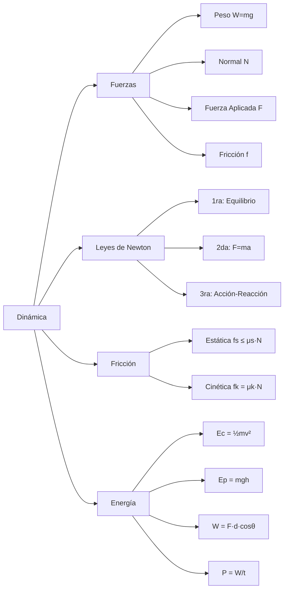

# SKILL 02 — DINÁMICA Y ENERGÍA

## Información General

| Campo | Valor |
|-------|-------|
| **Módulo** | Dinámica y Energía |
| **Código** | `DYN` |
| **Prerrequisitos** | Cinemática (MRU, MRUV), trigonometría, vectores básicos |
| **Tiempo estimado** | 4-6 sesiones de 45 minutos |
| **Archivos** | `js/modules/dynamics/newton-laws.js`, `work-energy.js` |

## Objetivos de Aprendizaje

1. Identificar y dibujar todas las fuerzas que actúan sobre un objeto (Diagrama de Cuerpo Libre).
2. Aplicar la Primera Ley de Newton para predecir si un objeto se mueve o no.
3. Calcular la aceleración de un sistema usando la Segunda Ley de Newton con fricción.
4. Distinguir entre fricción estática y cinética y predecir su efecto sobre el movimiento.
5. Calcular trabajo, energía cinética, potencial y potencia en situaciones mecánicas.
6. Verificar el principio de conservación de energía mecánica con y sin fricción.

## Mapa Conceptual



---

## SUB-MÓDULO DYN-01: Leyes de Newton con Fricción

### Descripción del Escenario

Un bloque de masa `m` sobre una superficie que puede estar horizontal o inclinada. Se le aplica una fuerza `F` en un ángulo dado. Existe fricción entre el bloque y la superficie. El alumno manipula los parámetros y observa:
1. El **Diagrama de Cuerpo Libre** (DCL) actualizado en tiempo real.
2. Si el objeto se mueve o permanece estático.
3. La aceleración y velocidad resultantes.

### Variables de Entrada

| Variable | Símbolo | Unidad | Rango | Default | Step | Descripción |
|----------|---------|--------|-------|---------|------|-------------|
| Masa | `m` | kg | [0.1, 100] | 5 | 0.1 | Masa del bloque |
| Fuerza aplicada | `F` | N | [0, 500] | 10 | 1 | Magnitud de la fuerza |
| Ángulo de la fuerza | `θ_F` | ° | [-30, 90] | 0 | 1 | Respecto a la superficie (0°=paralelo, positivo=hacia arriba) |
| Coef. fricción estática | `μs` | — | [0, 1.5] | 0.4 | 0.01 | Máximo antes de deslizar |
| Coef. fricción cinética | `μk` | — | [0, 1.5] | 0.3 | 0.01 | Mientras desliza (μk ≤ μs) |
| Ángulo plano inclinado | `θ_p` | ° | [0, 60] | 0 | 1 | 0° = horizontal |
| Gravedad | `g` | m/s² | [1, 25] | 9.81 | 0.01 | |

**Validación**: Si el usuario configura μk > μs, el sistema debe corregir automáticamente μk = μs y mostrar un aviso: "El coeficiente cinético no puede ser mayor que el estático."

### Presets de Materiales

| Superficie | μs | μk | 
|------------|-----|-----|
| Madera sobre madera | 0.50 | 0.30 |
| Acero sobre acero | 0.60 | 0.40 |
| Caucho sobre asfalto | 0.80 | 0.70 |
| Hielo sobre hielo | 0.10 | 0.03 |
| Teflón sobre teflón | 0.04 | 0.04 |
| Caucho sobre concreto mojado | 0.30 | 0.25 |

### Variables de Salida

| Variable | Símbolo | Unidad | Muestra en |
|----------|---------|--------|------------|
| Peso | `W = mg` | N | DCL + panel |
| Componente peso paralela al plano | `Wx = mg·sin(θp)` | N | DCL (descomposición) |
| Componente peso perpendicular | `Wy = mg·cos(θp)` | N | DCL (descomposición) |
| Fuerza aplicada paralela | `Fax = F·cos(θF)` | N | DCL |
| Fuerza aplicada perpendicular | `Fay = F·sin(θF)` | N | DCL |
| Fuerza normal | `N` | N | DCL + panel |
| Fricción estática máxima | `fs_max = μs·N` | N | Panel |
| Fuerza de fricción actual | `f` | N | DCL + panel |
| Fuerza neta | `F_neta` | N | Panel |
| Aceleración | `a` | m/s² | Panel + animación |
| Velocidad | `v(t)` | m/s | Panel + animación |
| Estado | — | — | Indicador: "ESTÁTICO" / "EN MOVIMIENTO" |

### Ecuaciones Físicas — Derivación Completa

#### PRIMERA LEY DE NEWTON (Ley de Inercia)

> "Todo cuerpo permanece en su estado de reposo o de movimiento rectilíneo uniforme a menos que una fuerza neta actúe sobre él."

```
Si ΣF = 0  →  a = 0  →  reposo o MRU
```

En nuestro simulador: el bloque está en equilibrio si la fuerza de fricción estática logra contrarrestar todas las demás fuerzas paralelas a la superficie.

#### SEGUNDA LEY DE NEWTON

> "La aceleración de un objeto es directamente proporcional a la fuerza neta e inversamente proporcional a su masa."

```
ΣF = m·a  →  a = ΣF/m                      ... (Ley fundamental)
```

#### TERCERA LEY DE NEWTON (Acción y Reacción)

> "Si A ejerce una fuerza sobre B, entonces B ejerce una fuerza igual y opuesta sobre A."

En el simulador: el peso del bloque (la Tierra tira del bloque hacia abajo) tiene su reacción (el bloque tira de la Tierra hacia arriba). La normal del piso empuja al bloque hacia arriba, y el bloque empuja al piso hacia abajo.

#### Análisis completo en PLANO HORIZONTAL (θp = 0°)

**Fuerzas verticales (eje Y, perpendicular a la superficie):**
```
ΣFy = 0 (no hay movimiento vertical)
N + F·sin(θF) - mg = 0
N = mg - F·sin(θF)                          ... (Ec. 1)
```

> Si θF > 0, la fuerza tiene componente hacia arriba, reduciendo la normal.
> Si N ≤ 0, el objeto se despega del suelo (caso especial).

**Fuerzas horizontales (eje X, paralelo a la superficie):**
```
F_motor = F·cos(θF)                          ... fuerza que intenta mover
```

**Decisión estático vs cinético:**
```
Si |F_motor| ≤ μs·N  →  ESTÁTICO
    f = -F_motor  (la fricción iguala la fuerza, no hay movimiento)
    a = 0

Si |F_motor| > μs·N  →  CINÉTICO
    f = μk·N  (en dirección opuesta al movimiento)
    F_neta = F·cos(θF) - μk·N
    a = F_neta / m                           ... (Ec. 2)
```

#### Análisis completo en PLANO INCLINADO (θp > 0°)

El sistema de coordenadas se rota: X paralelo al plano (positivo cuesta arriba), Y perpendicular al plano.

**Descomposición del peso:**
```
Wx = mg·sin(θp)     (componente paralela, cuesta abajo)
Wy = mg·cos(θp)     (componente perpendicular, hacia la superficie)
```

> **Derivación geométrica**: Si el plano forma ángulo θp con la horizontal, el peso (vertical) forma el mismo ángulo θp con la perpendicular al plano. Entonces:
> - La componente a lo largo del plano = mg·sin(θp)
> - La componente perpendicular = mg·cos(θp)

**Fuerza normal:**
```
N = Wy - F·sin(θF) = mg·cos(θp) - F·sin(θF)    ... (Ec. 3)
```

**Fuerza neta sin fricción (para determinar tendencia de movimiento):**
```
F_tendencia = F·cos(θF) - mg·sin(θp)        ... (Ec. 4)
```

Si F_tendencia > 0: el bloque tiende a subir.
Si F_tendencia < 0: el bloque tiende a bajar (la gravedad gana).
Si F_tendencia = 0: equilibrio perfecto.

**Algoritmo de fricción:**
```
1. Calcular |F_tendencia|
2. Calcular fs_max = μs · N

3. Si |F_tendencia| ≤ fs_max:
     ESTÁTICO. f = -F_tendencia. a = 0.
   
4. Si |F_tendencia| > fs_max:
     CINÉTICO. El objeto se mueve en la dirección de F_tendencia.
     f = μk · N (en dirección opuesta al movimiento)
     F_neta = F_tendencia - signo(F_tendencia) · μk · N
     a = F_neta / m
```

#### Caso especial: objeto deslizando sin fuerza aplicada

Si F = 0 y θp > 0:
```
F_tendencia = -mg·sin(θp)    (cuesta abajo)
fs_max = μs · mg·cos(θp)

Si mg·sin(θp) > μs·mg·cos(θp):
   tan(θp) > μs  →  ¡EL BLOQUE DESLIZA!
   a = g·(sin(θp) - μk·cos(θp))
```

> **Ángulo crítico**: El ángulo mínimo para que el bloque deslice es θ_critico = arctan(μs).

### Implementación JavaScript

```javascript
// ============================================
// LEYES DE NEWTON CON FRICCIÓN
// Archivo: js/modules/dynamics/newton-laws.js
// ============================================

/**
 * Resultado completo del análisis de fuerzas.
 * @typedef {Object} NewtonResult
 * @property {number} weight - Peso total (N)
 * @property {number} weightX - Componente paralela al plano (N)
 * @property {number} weightY - Componente perpendicular al plano (N)
 * @property {number} appliedX - Componente paralela de F aplicada (N)
 * @property {number} appliedY - Componente perpendicular de F aplicada (N)
 * @property {number} normal - Fuerza normal (N)
 * @property {number} maxStaticFriction - μs·N (N)
 * @property {number} friction - Fuerza de fricción actual (N, con signo)
 * @property {number} netForce - Fuerza neta paralela (N)
 * @property {number} acceleration - Aceleración (m/s²)
 * @property {string} state - 'estático' | 'en movimiento' | 'despegado'
 * @property {Object} fbd - Datos para el Diagrama de Cuerpo Libre
 */

/**
 * Calcula el análisis completo de fuerzas de Newton.
 * 
 * @param {number} m - Masa (kg)
 * @param {number} F - Fuerza aplicada (N)
 * @param {number} thetaF - Ángulo de F respecto a la superficie (°)
 * @param {number} mus - Coeficiente de fricción estática
 * @param {number} muk - Coeficiente de fricción cinética
 * @param {number} thetaP - Ángulo del plano inclinado (°)
 * @param {number} g - Gravedad (m/s²)
 * @returns {NewtonResult}
 */
export function newtonCalculation(m, F, thetaF, mus, muk, thetaP, g) {
    // Validación: μk no puede ser mayor que μs
    muk = Math.min(muk, mus);

    const radF = thetaF * Math.PI / 180;
    const radP = thetaP * Math.PI / 180;

    // === PESO Y SUS COMPONENTES ===
    const W = m * g;                             // W = mg
    const Wx = W * Math.sin(radP);               // Paralela al plano (cuesta abajo)
    const Wy = W * Math.cos(radP);               // Perpendicular al plano

    // === FUERZA APLICADA DESCOMPUESTA ===
    // θF medido desde la superficie del plano
    const Fax = F * Math.cos(radF);              // Paralela al plano (cuesta arriba)
    const Fay = F * Math.sin(radF);              // Perpendicular al plano (hacia afuera)

    // === FUERZA NORMAL ===
    const N = Wy - Fay;                          // N = mg·cosθp - F·sinθF

    // Si N ≤ 0, el objeto se despega de la superficie
    if (N <= 0) {
        return {
            weight: W, weightX: Wx, weightY: Wy,
            appliedX: Fax, appliedY: Fay,
            normal: 0,
            maxStaticFriction: 0,
            friction: 0,
            netForce: Fax - Wx,
            acceleration: (Fax - Wx) / m,
            state: 'despegado',
            criticalAngle: Math.atan(mus) * 180 / Math.PI,
            fbd: buildFBD(W, Wx, Wy, Fax, Fay, 0, 0, thetaP)
        };
    }

    // === FRICCIÓN ESTÁTICA MÁXIMA ===
    const fsMax = mus * N;

    // === TENDENCIA DE MOVIMIENTO ===
    // F_tendencia > 0 → tiende a subir, < 0 → tiende a bajar
    const Ftendencia = Fax - Wx;

    // === DECISIÓN: ¿SE MUEVE O NO? ===
    let friction, acceleration, state, netForce;

    if (Math.abs(Ftendencia) <= fsMax) {
        // ---- ESTÁTICO ----
        // La fricción equilibra exactamente la fuerza neta
        friction = -Ftendencia;       // opuesta a la tendencia
        netForce = 0;
        acceleration = 0;
        state = 'estático';
    } else {
        // ---- CINÉTICO (EN MOVIMIENTO) ----
        const direction = Math.sign(Ftendencia);
        const fk = muk * N;
        friction = -direction * fk;    // opuesta a la dirección de movimiento
        netForce = Ftendencia + friction;
        acceleration = netForce / m;
        state = 'en movimiento';
    }

    const criticalAngle = Math.atan(mus) * 180 / Math.PI;

    return {
        weight: W,
        weightX: Wx,
        weightY: Wy,
        appliedX: Fax,
        appliedY: Fay,
        normal: N,
        maxStaticFriction: fsMax,
        friction,
        netForce,
        acceleration,
        state,
        criticalAngle,
        fbd: buildFBD(W, Wx, Wy, Fax, Fay, N, friction, thetaP)
    };
}

/**
 * Genera los datos vectoriales para el Diagrama de Cuerpo Libre.
 * Cada vector tiene: origen, dirección (dx, dy), magnitud, color, etiqueta.
 * Las coordenadas están en el sistema del plano (no del canvas).
 */
function buildFBD(W, Wx, Wy, Fax, Fay, N, friction, thetaPDeg) {
    const radP = thetaPDeg * Math.PI / 180;
    
    // Escala: 1 N = 1 unidad visual (se escala al dibujar en canvas)
    return {
        // Peso: siempre vertical hacia abajo (en coordenadas globales)
        weight: {
            label: `W = ${W.toFixed(1)} N`,
            magnitude: W,
            color: '#e74c3c',    // rojo
            // En coordenadas del plano rotado:
            dx: -W * Math.sin(radP),   // componente en X del plano
            dy: -W * Math.cos(radP)    // componente en Y del plano
        },
        // Peso descompuesto (líneas punteadas)
        weightX: {
            label: `Wx = ${Wx.toFixed(1)} N`,
            magnitude: Wx,
            color: '#e74c3c',
            dx: -Wx,
            dy: 0,
            dashed: true
        },
        weightY: {
            label: `Wy = ${Wy.toFixed(1)} N`,
            magnitude: Wy,
            color: '#e74c3c',
            dx: 0,
            dy: -Wy,
            dashed: true
        },
        // Normal: perpendicular al plano, hacia afuera
        normal: {
            label: `N = ${N.toFixed(1)} N`,
            magnitude: N,
            color: '#2ecc71',   // verde
            dx: 0,
            dy: N
        },
        // Fuerza aplicada
        applied: {
            label: `F = ${Math.sqrt(Fax*Fax + Fay*Fay).toFixed(1)} N`,
            magnitude: Math.sqrt(Fax * Fax + Fay * Fay),
            color: '#3498db',   // azul
            dx: Fax,
            dy: Fay
        },
        // Fricción: paralela al plano
        friction: {
            label: `f = ${Math.abs(friction).toFixed(1)} N`,
            magnitude: Math.abs(friction),
            color: '#ff8c00',   // naranja
            dx: friction,
            dy: 0
        }
    };
}

/**
 * Estado temporal del bloque (para animación).
 */
export class NewtonModule {
    constructor() {
        // Parámetros del usuario
        this.m = 5;
        this.F = 10;
        this.thetaF = 0;
        this.mus = 0.4;
        this.muk = 0.3;
        this.thetaP = 0;
        this.g = 9.81;

        // Estado dinámico
        this.position = 0;    // posición a lo largo del plano (m)
        this.velocity = 0;    // velocidad a lo largo del plano (m/s)
        this.t = 0;
        this.analysis = null;

        // Escala visual
        this.scale = { pixelsPerMeter: 20 };
    }

    init() {
        this.position = 0;
        this.velocity = 0;
        this.t = 0;
        this.analysis = newtonCalculation(
            this.m, this.F, this.thetaF,
            this.mus, this.muk, this.thetaP, this.g
        );
    }

    update(dt) {
        // Recalcular fuerzas (pueden cambiar en vivo por sliders)
        this.analysis = newtonCalculation(
            this.m, this.F, this.thetaF,
            this.mus, this.muk, this.thetaP, this.g
        );

        // Integrar movimiento
        if (this.analysis.state === 'en movimiento') {
            this.velocity += this.analysis.acceleration * dt;
            this.position += this.velocity * dt;
            
            // Si la velocidad llega a 0 y la aceleración también (o cambia de signo),
            // el objeto se detiene → transición a estático
            if (this.velocity <= 0 && this.analysis.acceleration <= 0 && this.position > 0) {
                // El bloque está frenando y se detiene
                this.velocity = 0;
                // Re-evaluar: sin velocidad, ¿se mantiene estático?
            }
        }

        this.t += dt;
    }

    render(ctx, alpha) {
        const canvasW = ctx.canvas.width;
        const canvasH = ctx.canvas.height;
        const radP = this.thetaP * Math.PI / 180;

        // === 1. DIBUJAR PLANO INCLINADO ===
        this.drawInclinedPlane(ctx, canvasW, canvasH, radP);

        // === 2. DIBUJAR BLOQUE ===
        const blockCenter = this.drawBlock(ctx, canvasW, canvasH, radP);

        // === 3. DIBUJAR DCL (VECTORES DE FUERZA) ===
        if (this.analysis) {
            this.drawFBD(ctx, blockCenter.x, blockCenter.y, radP);
        }

        // === 4. PANEL DE DATOS ===
        this.drawDataPanel(ctx);
    }

    drawInclinedPlane(ctx, w, h, radP) {
        const baseX = 50;
        const baseY = h - 60;
        const planeLength = w - 100;
        const endX = baseX + planeLength;
        const endY = baseY - planeLength * Math.tan(radP);

        // Superficie del plano
        ctx.fillStyle = '#2a2a4a';
        ctx.beginPath();
        ctx.moveTo(baseX, baseY);
        ctx.lineTo(endX, endY);
        ctx.lineTo(endX, baseY);
        ctx.closePath();
        ctx.fill();

        // Línea de la superficie
        ctx.strokeStyle = '#666';
        ctx.lineWidth = 3;
        ctx.beginPath();
        ctx.moveTo(baseX, baseY);
        ctx.lineTo(endX, endY);
        ctx.stroke();

        // Marca del ángulo
        if (this.thetaP > 0) {
            ctx.strokeStyle = 'rgba(255,255,255,0.4)';
            ctx.lineWidth = 1;
            ctx.beginPath();
            ctx.arc(endX, baseY, 40, Math.PI, Math.PI + radP, true);
            ctx.stroke();
            ctx.fillStyle = '#aaa';
            ctx.font = '12px system-ui';
            ctx.fillText(`${this.thetaP}°`, endX - 55, baseY - 8);
        }
    }

    drawBlock(ctx, w, h, radP) {
        const baseY = h - 60;
        const planeLength = w - 100;
        // Posición del bloque a lo largo del plano
        const distAlongPlane = 150 + this.position * this.scale.pixelsPerMeter;
        const bx = 50 + distAlongPlane * Math.cos(radP);
        const by = baseY - distAlongPlane * Math.sin(radP);

        const blockW = 50;
        const blockH = 35;

        ctx.save();
        ctx.translate(bx, by);
        ctx.rotate(-radP);

        // Sombra del bloque
        ctx.fillStyle = 'rgba(0,0,0,0.3)';
        ctx.fillRect(-blockW/2 + 3, -blockH + 3, blockW, blockH);

        // Bloque
        const isMoving = this.analysis && this.analysis.state === 'en movimiento';
        ctx.fillStyle = isMoving ? '#3498db' : '#2c3e50';
        ctx.fillRect(-blockW/2, -blockH, blockW, blockH);
        ctx.strokeStyle = isMoving ? '#5dade2' : '#555';
        ctx.lineWidth = 2;
        ctx.strokeRect(-blockW/2, -blockH, blockW, blockH);

        // Etiqueta de masa
        ctx.fillStyle = '#fff';
        ctx.font = 'bold 12px system-ui';
        ctx.textAlign = 'center';
        ctx.fillText(`${this.m} kg`, 0, -blockH/2 + 5);
        ctx.textAlign = 'start';

        ctx.restore();

        return { x: bx, y: by }; // Centro para dibujar DCL
    }

    drawFBD(ctx, cx, cy, radP) {
        const fbd = this.analysis.fbd;
        const SCALE = 0.5; // px por Newton

        // Dibujar cada vector del DCL
        const vectors = [
            fbd.weight,   // Peso (siempre vertical hacia abajo)
            fbd.normal,   // Normal (perpendicular al plano)
            fbd.applied,  // Fuerza aplicada
            fbd.friction   // Fricción
        ];

        for (const vec of vectors) {
            if (vec.magnitude < 0.01) continue; // No dibujar vectores nulos

            ctx.save();
            ctx.translate(cx, cy);
            ctx.rotate(-radP); // Rotar al sistema del plano

            const endX = vec.dx * SCALE;
            const endY = -vec.dy * SCALE;  // invertir Y (canvas es Y-abajo)

            // Línea del vector
            ctx.strokeStyle = vec.color;
            ctx.lineWidth = 3;
            if (vec.dashed) ctx.setLineDash([5, 5]);
            ctx.beginPath();
            ctx.moveTo(0, 0);
            ctx.lineTo(endX, endY);
            ctx.stroke();
            ctx.setLineDash([]);

            // Punta de flecha
            if (vec.magnitude > 0.5) {
                const angle = Math.atan2(endY, endX);
                const headLen = 10;
                ctx.fillStyle = vec.color;
                ctx.beginPath();
                ctx.moveTo(endX, endY);
                ctx.lineTo(
                    endX - headLen * Math.cos(angle - 0.4),
                    endY - headLen * Math.sin(angle - 0.4)
                );
                ctx.lineTo(
                    endX - headLen * Math.cos(angle + 0.4),
                    endY - headLen * Math.sin(angle + 0.4)
                );
                ctx.closePath();
                ctx.fill();
            }

            // Etiqueta
            ctx.fillStyle = vec.color;
            ctx.font = '11px system-ui';
            const labelX = endX * 0.5 + Math.sign(endX) * 15;
            const labelY = endY * 0.5 + Math.sign(endY) * 15;
            ctx.fillText(vec.label, labelX, labelY);

            ctx.restore();
        }
    }

    drawDataPanel(ctx) {
        if (!this.analysis) return;
        const a = this.analysis;

        ctx.fillStyle = 'rgba(10, 10, 26, 0.9)';
        ctx.fillRect(10, 10, 260, 200);
        ctx.strokeStyle = a.state === 'en movimiento' ? '#3498db' : '#555';
        ctx.lineWidth = 1;
        ctx.strokeRect(10, 10, 260, 200);

        ctx.font = '12px system-ui';
        ctx.fillStyle = '#e8e8f0';

        const lines = [
            `Estado: ${a.state.toUpperCase()}`,
            `W = ${a.weight.toFixed(1)} N`,
            `N = ${a.normal.toFixed(1)} N`,
            `Wx = ${a.weightX.toFixed(1)} N | Wy = ${a.weightY.toFixed(1)} N`,
            `Fax = ${a.appliedX.toFixed(1)} N | Fay = ${a.appliedY.toFixed(1)} N`,
            `fs_max = ${a.maxStaticFriction.toFixed(1)} N`,
            `f = ${Math.abs(a.friction).toFixed(1)} N`,
            `F_neta = ${a.netForce.toFixed(2)} N`,
            `a = ${a.acceleration.toFixed(3)} m/s²`,
            `v = ${this.velocity.toFixed(2)} m/s`,
            `x = ${this.position.toFixed(2)} m`,
            `θ_crítico = ${a.criticalAngle.toFixed(1)}°`
        ];

        // Estado con color
        ctx.fillStyle = a.state === 'en movimiento' ? '#3498db' : '#2ecc71';
        ctx.font = 'bold 13px system-ui';
        ctx.fillText(lines[0], 20, 30);

        ctx.fillStyle = '#e8e8f0';
        ctx.font = '12px system-ui';
        for (let i = 1; i < lines.length; i++) {
            ctx.fillText(lines[i], 20, 30 + i * 15);
        }
    }
}
```

### Retos Pedagógicos — Newton

```json
[
  {
    "id": "new-01",
    "type": "numeric",
    "difficulty": 1,
    "question": "Un bloque de 10 kg está sobre una mesa horizontal. El coeficiente de fricción estática es μs = 0.4. ¿Cuál es la fuerza mínima horizontal para que empiece a moverse?",
    "correctAnswer": 39.24,
    "tolerance": 0.03,
    "unit": "N",
    "hint": "F_min = μs·N = μs·mg (en plano horizontal, N = mg).",
    "feedbackCorrect": "¡Correcto! F = μs·mg = 0.4 × 10 × 9.81 = 39.24 N",
    "feedbackIncorrect": "F = μs·N = μs·mg = 0.4 × 10 × 9.81 = 39.24 N",
    "explanation": "La fuerza debe superar la fricción estática máxima. Una vez en movimiento, la fricción baja a μk·N."
  },
  {
    "id": "new-02",
    "type": "multiple_choice",
    "difficulty": 1,
    "question": "Un bloque está en reposo sobre un plano inclinado. ¿Qué fuerza impide que deslice?",
    "options": ["La fricción estática", "La fuerza normal", "El peso", "La fuerza aplicada"],
    "correctAnswer": 0,
    "hint": "La componente del peso paralela al plano intenta deslizar el bloque. ¿Qué se opone?",
    "feedbackCorrect": "¡Correcto! La fricción estática se opone al deslizamiento.",
    "feedbackIncorrect": "La normal es perpendicular a la superficie. La fricción estática actúa paralela, oponiéndose al deslizamiento.",
    "explanation": "La normal sostiene al bloque contra la superficie pero no evita el deslizamiento. Eso lo hace la fricción."
  },
  {
    "id": "new-03",
    "type": "experiment",
    "difficulty": 2,
    "question": "Coloca un bloque de 5 kg en un plano inclinado con μs = 0.5. Aumenta el ángulo gradualmente. ¿A qué ángulo empieza a deslizar? (sin fuerza aplicada)",
    "correctAnswer": 26.57,
    "tolerance": 0.05,
    "unit": "°",
    "hint": "El bloque desliza cuando tan(θ) > μs, o sea θ > arctan(μs).",
    "feedbackCorrect": "¡Correcto! θ_crítico = arctan(0.5) ≈ 26.57°. ¡Una forma experimental de medir μs!",
    "feedbackIncorrect": "θ_crítico = arctan(μs) = arctan(0.5) ≈ 26.57°",
    "explanation": "Este es un método real de laboratorio para medir μs: se inclina la superficie hasta que el objeto empieza a deslizar."
  },
  {
    "id": "new-04",
    "type": "numeric",
    "difficulty": 2,
    "question": "Un bloque de 8 kg está en un plano inclinado de 30° con μk = 0.2. ¿Cuál es su aceleración al deslizar? (sin fuerza aplicada)",
    "correctAnswer": 3.21,
    "tolerance": 0.03,
    "unit": "m/s²",
    "hint": "a = g·(sin(θ) - μk·cos(θ))",
    "feedbackCorrect": "¡Correcto! a = 9.81(sin30° - 0.2·cos30°) = 9.81(0.5 - 0.173) = 9.81 × 0.327 = 3.21 m/s²",
    "feedbackIncorrect": "a = g(sinθ - μk·cosθ) = 9.81(0.5 - 0.2×0.866) = 9.81 × 0.327 = 3.21 m/s²",
    "explanation": "La aceleración no depende de la masa (se cancela). Depende solo del ángulo y la fricción."
  },
  {
    "id": "new-05",
    "type": "multiple_choice",
    "difficulty": 2,
    "question": "Si aplicas una fuerza hacia arriba (θF = 30°) sobre un bloque en piso horizontal, ¿qué le pasa a la fuerza normal?",
    "options": ["Disminuye", "Aumenta", "No cambia", "Se hace cero"],
    "correctAnswer": 0,
    "hint": "N = mg - F·sin(θF). Si F·sin(θF) > 0...",
    "feedbackCorrect": "¡Correcto! La componente vertical de F 'alivia' parte del peso, reduciendo N.",
    "feedbackIncorrect": "N = mg - F·sinθ. Como F·sinθ > 0, N < mg. La normal disminuye.",
    "explanation": "Esto también reduce la fricción (f = μ·N), haciendo más fácil mover el bloque. ¡Truco de ingeniero!"
  },
  {
    "id": "new-06",
    "type": "experiment",
    "difficulty": 3,
    "question": "Configura: m=10 kg, plano a 0°, μk=0.3. ¿Qué fuerza horizontal necesitas para que el bloque se mueva a exactamente 2 m/s²?",
    "correctAnswer": 49.43,
    "tolerance": 0.03,
    "unit": "N",
    "hint": "F = m·a + μk·mg (la fuerza debe vencer la fricción Y producir aceleración).",
    "feedbackCorrect": "¡Correcto! F = m·a + μk·mg = 10(2) + 0.3(10)(9.81) = 20 + 29.43 = 49.43 N",
    "feedbackIncorrect": "F = ma + fk = 10(2) + 0.3(10)(9.81) = 20 + 29.43 = 49.43 N",
    "explanation": "La fuerza total debe cubrir dos cosas: (1) vencer la fricción μk·mg y (2) producir la aceleración m·a."
  }
]
```

---

## SUB-MÓDULO DYN-02: Trabajo, Energía y Potencia

### Descripción

Este sub-módulo visualiza las transformaciones de energía en un sistema mecánico. El alumno ve cómo la energía cinética (Ec), potencial (Ep) y mecánica total (Em) cambian mientras un objeto se mueve, y cómo la fricción disipa energía.

### Variables de Entrada

| Variable | Símbolo | Unidad | Rango | Default | Step |
|----------|---------|--------|-------|---------|------|
| Masa | `m` | kg | [0.1, 50] | 2 | 0.1 |
| Velocidad | `v` | m/s | [0, 30] | 0 | 0.5 |
| Altura | `h` | m | [0, 50] | 10 | 0.5 |
| Fuerza aplicada | `F` | N | [0, 200] | 0 | 1 |
| Distancia | `d` | m | [0, 100] | 0 | 0.5 |
| Ángulo F-desplazamiento | `θ` | ° | [0, 180] | 0 | 1 |
| Coef. fricción cinética | `μk` | — | [0, 1] | 0 | 0.01 |
| Gravedad | `g` | m/s² | — | 9.81 | — |

### Variables de Salida

| Variable | Símbolo | Unidad | Fórmula | Color barra |
|----------|---------|--------|---------|-------------|
| Energía cinética | `Ec` | J | ½mv² | `#e74c3c` (rojo) |
| Energía potencial | `Ep` | J | mgh | `#3498db` (azul) |
| Energía mecánica | `Em` | J | Ec + Ep | `#2ecc71` (verde) |
| Trabajo fuerza aplicada | `W` | J | F·d·cos(θ) | — |
| Trabajo fricción | `Wfr` | J | -μk·mg·d | `#f39c12` (amarillo) |
| Trabajo neto | `Wneto` | J | W + Wfr | — |
| Potencia instantánea | `P` | W | F·v·cos(θ) | — |
| Energía disipada | `Edis` | J | \|Wfr\| acumulado | `#f39c12` (amarillo) |

### Ecuaciones Físicas — Derivación Completa

#### TRABAJO (W)

**Definición**: El trabajo es la transferencia de energía que ocurre cuando una fuerza desplaza un objeto.

```
W = F · d · cos(θ)                           ... (Ec. 1)
```

Donde θ es el ángulo entre la fuerza y el desplazamiento.

**Derivación desde producto punto**:
```
W = F⃗ · d⃗ = |F| · |d| · cos(θ)
```

**Casos especiales del ángulo:**
| θ | cos(θ) | Tipo de trabajo | Significado |
|---|--------|----------------|-------------|
| 0° | 1 | Positivo (máximo) | F en la misma dirección que d |
| 90° | 0 | Cero | F perpendicular a d (ej. Normal) |
| 180° | -1 | Negativo (máximo) | F opuesta a d (ej. Fricción) |

**Trabajo de cada fuerza:**
```
W_fuerza_aplicada = F · d · cos(θ)           (puede ser + o -)
W_fricción = -μk · N · d                      (siempre negativo)
W_peso = -m · g · Δh                          (negativo al subir, positivo al bajar)
W_normal = 0                                   (siempre perpendicular al movimiento)
```

#### ENERGÍA CINÉTICA (Ec)

**Definición**: Energía que posee un objeto debido a su movimiento.

```
Ec = ½ · m · v²                               ... (Ec. 2)
```

**Derivación desde el trabajo**: Si una fuerza neta F acelera un objeto de v₀ a v:
```
W_neto = ∫F·dx = ∫(m·a)·dx = m·∫(dv/dt)·(dx) = m·∫v·dv
W_neto = ½mv² - ½mv₀²
W_neto = ΔEc                                  ... (Teorema Trabajo-Energía)
```

> **Teorema trabajo-energía**: El trabajo neto sobre un objeto es igual al cambio en su energía cinética.

#### ENERGÍA POTENCIAL GRAVITATORIA (Ep)

**Definición**: Energía almacenada por la posición de un objeto en un campo gravitatorio.

```
Ep = m · g · h                                ... (Ec. 3)
```

**Derivación**: El trabajo de la gravedad al bajar una altura h es:
```
W_gravedad = mgh
```
Definimos Ep tal que W_gravedad = -ΔEp, entonces Ep = mgh.

> **Nota importante**: h se mide desde un **nivel de referencia** elegido arbitrariamente (generalmente el suelo). Lo que importa es el *cambio* de Ep, no su valor absoluto.

#### CONSERVACIÓN DE ENERGÍA MECÁNICA

**Sin fricción (sistema conservativo):**
```
Em = Ec + Ep = constante

½mv₁² + mgh₁ = ½mv₂² + mgh₂                ... (Ec. 4)
```

**Con fricción (sistema no conservativo):**
```
Ec₁ + Ep₁ = Ec₂ + Ep₂ + |W_fricción|

½mv₁² + mgh₁ = ½mv₂² + mgh₂ + μk·N·d      ... (Ec. 5)
```

La energía mecánica **decrece** por la fricción. La diferencia se convierte en calor.

#### POTENCIA (P)

**Potencia media:**
```
P = W / t                                     ... (Ec. 6)
```

**Potencia instantánea:**
```
P = dW/dt = F · v · cos(θ)                    ... (Ec. 7)
```

**Derivación**: P = dW/dt = F·(dx/dt)·cos(θ) = F·v·cos(θ)

**Unidades:**
- 1 Watt = 1 J/s
- 1 HP (caballo de fuerza) = 746 W
- 1 kW = 1000 W

### Implementación JavaScript

```javascript
// ============================================
// TRABAJO, ENERGÍA Y POTENCIA
// Archivo: js/modules/dynamics/work-energy.js
// ============================================

/**
 * Calcula todas las magnitudes de energía para un estado dado.
 */
export function energyCalculation(m, v, h, F, d, thetaDeg, muk, g) {
    const rad = thetaDeg * Math.PI / 180;

    // Energía cinética
    const Ec = 0.5 * m * v * v;                     // ½mv²

    // Energía potencial gravitatoria
    const Ep = m * g * h;                             // mgh

    // Energía mecánica total
    const Em = Ec + Ep;                               // Ec + Ep

    // Trabajo de la fuerza aplicada
    const Wapplied = F * d * Math.cos(rad);           // F·d·cos(θ)

    // Trabajo de la fricción
    const N = m * g;   // Normal en plano horizontal
    const fk = muk * N;
    const Wfriction = -fk * d;                        // Siempre negativo

    // Trabajo neto
    const Wnet = Wapplied + Wfriction;

    // Potencia instantánea
    const Pinstant = F * v * Math.cos(rad);           // F·v·cos(θ)

    return {
        kineticEnergy: Ec,
        potentialEnergy: Ep,
        mechanicalEnergy: Em,
        workApplied: Wapplied,
        workFriction: Wfriction,
        workNet: Wnet,
        power: Pinstant,
        powerHP: Pinstant / 746,   // En HP
        // Para gráfica de barras
        bars: [
            { label: 'Ec', value: Ec, color: '#e74c3c' },
            { label: 'Ep', value: Ep, color: '#3498db' },
            { label: 'Em', value: Em, color: '#2ecc71' }
        ]
    };
}

/**
 * Módulo interactivo de Energía: objeto en rampa.
 * El alumno arrastra un objeto a una altura, lo suelta,
 * y observa cómo Ec y Ep se intercambian.
 */
export class WorkEnergyModule {
    constructor() {
        this.m = 2;      // kg
        this.muk = 0;    // Sin fricción por defecto
        this.g = 9.81;

        // La rampa es un perfil de alturas
        this.rampProfile = null;   // Array de {x, y} que define la forma
        this.rampLength = 600;     // px

        // Estado del objeto
        this.pos = 0;         // Posición a lo largo de la rampa (0 = izq, 1 = der)
        this.velocity = 0;    // Velocidad (m/s)
        this.height = 10;     // Altura actual (m)

        // Tracking de energía disipada
        this.dissipatedEnergy = 0;

        // Datos para gráficas
        this.energyHistory = [];  // [{t, Ec, Ep, Em, Edis}]

        this.scale = { pixelsPerMeter: 8 };
    }

    /**
     * Genera un perfil de rampa (montaña rusa simplificada).
     * Forma de "U" o forma sinusoidal configurable.
     */
    generateRamp(type) {
        const n = 200; // puntos del perfil
        this.rampProfile = [];

        for (let i = 0; i <= n; i++) {
            const t = i / n; // 0 a 1
            let h;
            switch (type) {
                case 'valley':
                    // Forma de valle: alto → bajo → alto
                    h = 20 * (1 - Math.sin(t * Math.PI)) * 0.5 + 1;
                    break;
                case 'hill':
                    // Forma de colina: bajo → alto → bajo
                    h = 15 * Math.sin(t * Math.PI) + 1;
                    break;
                case 'slide':
                    // Rampa descendente
                    h = 20 * (1 - t) + 1;
                    break;
                case 'rollercoaster':
                    // Montaña rusa: 2 picos
                    h = 12 * Math.sin(t * Math.PI * 2) + 14;
                    if (h < 1) h = 1;
                    break;
                default:
                    h = 20 * (1 - t) + 1;
            }
            this.rampProfile.push({ t, h });
        }
    }

    init() {
        this.pos = 0;
        this.velocity = 0;
        this.dissipatedEnergy = 0;
        this.energyHistory = [];
        if (!this.rampProfile) this.generateRamp('slide');
        this.height = this.getHeightAt(this.pos);
    }

    getHeightAt(t) {
        // Interpolar el perfil de la rampa
        const idx = t * (this.rampProfile.length - 1);
        const i0 = Math.floor(idx);
        const i1 = Math.min(i0 + 1, this.rampProfile.length - 1);
        const frac = idx - i0;
        return this.rampProfile[i0].h * (1 - frac) + this.rampProfile[i1].h * frac;
    }

    getSlopeAt(t) {
        const dt = 0.001;
        const h1 = this.getHeightAt(Math.max(0, t - dt));
        const h2 = this.getHeightAt(Math.min(1, t + dt));
        return (h2 - h1) / (2 * dt * this.rampLength / this.scale.pixelsPerMeter);
    }

    update(dt) {
        if (this.pos >= 1 || this.pos <= 0) return; // Llegó al borde

        const h = this.getHeightAt(this.pos);
        const slope = this.getSlopeAt(this.pos);
        const angle = Math.atan(slope);

        // Aceleración por gravedad a lo largo de la rampa
        const aGrav = -this.g * Math.sin(angle);

        // Fricción
        const N = this.m * this.g * Math.cos(angle);
        const aFric = this.velocity !== 0
            ? -Math.sign(this.velocity) * this.muk * N / this.m
            : 0;

        // Aceleración total
        const a = aGrav + aFric;

        // Integración (Euler semi-implícito)
        this.velocity += a * dt;

        // Energía disipada este frame
        this.dissipatedEnergy += Math.abs(this.muk * N * Math.abs(this.velocity) * dt);

        // Actualizar posición normalizada
        const dx = this.velocity * dt / (this.rampLength / this.scale.pixelsPerMeter);
        this.pos += dx;
        this.pos = Math.max(0, Math.min(1, this.pos));
        this.height = this.getHeightAt(this.pos);

        // Registrar para gráfica
        const Ec = 0.5 * this.m * this.velocity * this.velocity;
        const Ep = this.m * this.g * this.height;
        this.energyHistory.push({
            Ec, Ep, Em: Ec + Ep, Edis: this.dissipatedEnergy
        });
        if (this.energyHistory.length > 500) this.energyHistory.shift();
    }

    render(ctx) {
        const w = ctx.canvas.width;
        const h = ctx.canvas.height;

        // 1. Dibujar rampa
        this.drawRamp(ctx, w, h);

        // 2. Dibujar objeto sobre la rampa
        this.drawObjectOnRamp(ctx, w, h);

        // 3. Barras de energía (panel lateral)
        this.drawEnergyBars(ctx, w, h);
    }

    drawRamp(ctx, w, h) {
        if (!this.rampProfile) return;
        const baseY = h - 50;
        const startX = 80;
        const ppm = this.scale.pixelsPerMeter;

        ctx.beginPath();
        ctx.moveTo(startX, baseY);
        for (const pt of this.rampProfile) {
            const px = startX + pt.t * this.rampLength;
            const py = baseY - pt.h * ppm;
            ctx.lineTo(px, py);
        }
        ctx.lineTo(startX + this.rampLength, baseY);
        ctx.closePath();
        ctx.fillStyle = '#1a1a3e';
        ctx.fill();
        ctx.strokeStyle = '#00e5ff';
        ctx.lineWidth = 2;
        ctx.stroke();
    }

    drawObjectOnRamp(ctx, w, h) {
        const baseY = h - 50;
        const startX = 80;
        const ppm = this.scale.pixelsPerMeter;

        const px = startX + this.pos * this.rampLength;
        const py = baseY - this.height * ppm;

        // Esfera
        ctx.beginPath();
        ctx.arc(px, py - 8, 10, 0, Math.PI * 2);
        ctx.fillStyle = '#ff8c00';
        ctx.fill();
        ctx.strokeStyle = '#fff';
        ctx.lineWidth = 2;
        ctx.stroke();

        // Etiqueta de altura y velocidad
        ctx.fillStyle = '#e8e8f0';
        ctx.font = '11px system-ui';
        ctx.fillText(`h=${this.height.toFixed(1)}m`, px + 15, py - 15);
        ctx.fillText(`v=${Math.abs(this.velocity).toFixed(1)}m/s`, px + 15, py);
    }

    drawEnergyBars(ctx, w, h) {
        const barX = w - 160;
        const barW = 35;
        const maxBarH = 200;
        const baseY = h - 80;

        const Ec = 0.5 * this.m * this.velocity * this.velocity;
        const Ep = this.m * this.g * this.height;
        const Em = Ec + Ep;
        const EmInitial = this.m * this.g * (this.rampProfile ? this.rampProfile[0].h : 20);
        const scale = maxBarH / Math.max(EmInitial, 1);

        const bars = [
            { label: 'Ec', value: Ec, color: '#e74c3c', x: barX },
            { label: 'Ep', value: Ep, color: '#3498db', x: barX + 45 },
            { label: 'Em', value: Em, color: '#2ecc71', x: barX + 90 }
        ];

        // Fondo del panel
        ctx.fillStyle = 'rgba(10, 10, 26, 0.85)';
        ctx.fillRect(barX - 15, baseY - maxBarH - 40, 155, maxBarH + 60);

        ctx.font = 'bold 12px system-ui';
        ctx.fillStyle = '#e8e8f0';
        ctx.fillText('Energía (J)', barX, baseY - maxBarH - 25);

        for (const bar of bars) {
            const barH = bar.value * scale;

            // Barra
            ctx.fillStyle = bar.color;
            ctx.fillRect(bar.x, baseY - barH, barW, barH);

            // Borde
            ctx.strokeStyle = 'rgba(255,255,255,0.2)';
            ctx.strokeRect(bar.x, baseY - maxBarH, barW, maxBarH);

            // Etiqueta
            ctx.fillStyle = bar.color;
            ctx.font = '10px system-ui';
            ctx.textAlign = 'center';
            ctx.fillText(bar.label, bar.x + barW / 2, baseY + 14);
            ctx.fillText(bar.value.toFixed(1), bar.x + barW / 2, baseY - barH - 5);
            ctx.textAlign = 'start';
        }

        // Barra de energía disipada (si hay fricción)
        if (this.dissipatedEnergy > 0.1) {
            const disH = this.dissipatedEnergy * scale;
            ctx.fillStyle = '#f39c12';
            ctx.globalAlpha = 0.6;
            ctx.fillRect(barX + 90, baseY - (Em * scale) - disH, barW, disH);
            ctx.globalAlpha = 1;
            ctx.fillStyle = '#f39c12';
            ctx.font = '9px system-ui';
            ctx.textAlign = 'center';
            ctx.fillText(`Disipada`, barX + 90 + barW / 2, baseY - (Em * scale) - disH - 5);
            ctx.fillText(`${this.dissipatedEnergy.toFixed(1)}J`, barX + 90 + barW / 2, baseY - (Em * scale) - disH - 16);
            ctx.textAlign = 'start';
        }
    }
}
```

### Retos Pedagógicos — Trabajo y Energía

```json
[
  {
    "id": "we-01",
    "type": "numeric",
    "difficulty": 1,
    "question": "¿Cuál es la energía cinética de un auto de 1000 kg que viaja a 20 m/s?",
    "correctAnswer": 200000,
    "tolerance": 0.02,
    "unit": "J",
    "hint": "Ec = ½mv² = ½(1000)(20²).",
    "feedbackCorrect": "¡Correcto! Ec = ½(1000)(400) = 200,000 J = 200 kJ",
    "feedbackIncorrect": "Ec = ½mv² = ½ × 1000 × 400 = 200,000 J",
    "explanation": "200 kJ es mucha energía. Por eso los accidentes a alta velocidad son devastadores: Ec crece con v²."
  },
  {
    "id": "we-02",
    "type": "numeric",
    "difficulty": 1,
    "question": "Una caja de 5 kg está a 8 metros de altura. ¿Cuál es su energía potencial gravitatoria? (g=9.81)",
    "correctAnswer": 392.4,
    "tolerance": 0.02,
    "unit": "J",
    "hint": "Ep = mgh = 5 × 9.81 × 8",
    "feedbackCorrect": "¡Correcto! Ep = 5 × 9.81 × 8 = 392.4 J",
    "feedbackIncorrect": "Ep = mgh = 5 × 9.81 × 8 = 392.4 J",
    "explanation": "Esta energía se puede convertir en energía cinética si el objeto cae."
  },
  {
    "id": "we-03",
    "type": "multiple_choice",
    "difficulty": 2,
    "question": "Un objeto baja por una rampa SIN fricción. ¿Qué le sucede a la energía mecánica total?",
    "options": ["Se mantiene constante", "Aumenta", "Disminuye", "Depende de la forma de la rampa"],
    "correctAnswer": 0,
    "hint": "Sin fricción = sistema conservativo.",
    "feedbackCorrect": "¡Correcto! Sin fricción, Em = Ec + Ep = constante. Lo que pierde en Ep lo gana en Ec.",
    "feedbackIncorrect": "Sin fricción, no se disipa energía. Toda la Ep se convierte en Ec.",
    "explanation": "Observa la barra verde (Em) en la simulación: sin fricción, permanece constante."
  },
  {
    "id": "we-04",
    "type": "experiment",
    "difficulty": 2,
    "question": "Activa la fricción (μk = 0.2) y suelta el objeto desde 15 m. ¿Cuánta energía se disipa al llegar al suelo? Compara Em al inicio vs al final.",
    "correctAnswer": null,
    "tolerance": 0.1,
    "hint": "Observa la barra amarilla de 'energía disipada'. Em_final < Em_inicial.",
    "feedbackCorrect": "¡Muy bien! La energía disipada es la diferencia Em_inicial - Em_final. Se convirtió en calor.",
    "feedbackIncorrect": "Fíjate en cómo la barra verde (Em) decrece. La diferencia es la energía que se fue en calor.",
    "explanation": "En el mundo real siempre hay fricción. La energía mecánica siempre se pierde un poco, convirtiéndose en calor."
  },
  {
    "id": "we-05",
    "type": "numeric",
    "difficulty": 2,
    "question": "Una grúa levanta una caja de 200 kg a 12 metros de altura en 30 segundos. ¿Cuál es la potencia de la grúa? (g=9.81)",
    "correctAnswer": 785,
    "tolerance": 0.03,
    "unit": "W",
    "hint": "W = mgh (trabajo contra la gravedad). P = W/t.",
    "feedbackCorrect": "¡Correcto! W = 200×9.81×12 = 23,544 J. P = 23,544/30 = 784.8 W ≈ 785 W ≈ 1.05 HP",
    "feedbackIncorrect": "P = W/t = mgh/t = (200 × 9.81 × 12) / 30 ≈ 785 W",
    "explanation": "785 W ≈ 1.05 HP. Un caballo de fuerza (HP) es la potencia que un caballo puede mantener de forma sostenida."
  },
  {
    "id": "we-06",
    "type": "multiple_choice",
    "difficulty": 1,
    "question": "Un maletero empuja una caja con fuerza perpendicular a la dirección de movimiento (θ=90°). ¿Cuánto trabajo realiza?",
    "options": ["Cero (W = 0)", "Positivo", "Negativo", "Depende de la fuerza"],
    "correctAnswer": 0,
    "hint": "W = F·d·cos(90°). ¿Cuánto vale cos(90°)?",
    "feedbackCorrect": "¡Correcto! cos(90°) = 0, por lo tanto W = 0. Una fuerza perpendicular no hace trabajo.",
    "feedbackIncorrect": "W = F·d·cos(90°) = F·d·0 = 0. La fuerza normal del piso tampoco hace trabajo, por la misma razón.",
    "explanation": "La fuerza normal nunca hace trabajo porque es perpendicular al movimiento. Solo las fuerzas con componente paralela al desplazamiento hacen trabajo."
  }
]
```

---

## Tabla Resumen de Ecuaciones de Dinámica y Energía

| # | Ecuación | Nombre | Cuándo usar |
|---|----------|--------|-------------|
| 1 | ΣF = ma | Segunda Ley de Newton | Siempre para encontrar aceleración |
| 2 | fs ≤ μs·N | Fricción estática | Determinar si se mueve o no |
| 3 | fk = μk·N | Fricción cinética | Objeto ya en movimiento |
| 4 | N = mg·cosθ - F·sinθF | Normal en plano inclinado | Con fuerza aplicada en ángulo |
| 5 | Ec = ½mv² | Energía cinética | Energía del movimiento |
| 6 | Ep = mgh | Energía potencial | Energía de la posición |
| 7 | W = F·d·cos(θ) | Trabajo | Transferencia de energía |
| 8 | Wneto = ΔEc | Teorema trabajo-energía | Relacionar fuerza con velocidad |
| 9 | Ec₁+Ep₁ = Ec₂+Ep₂ | Conservación energía | Sin fricción |
| 10 | Ec₁+Ep₁ = Ec₂+Ep₂+\|Wfr\| | Conservación con fricción | Con fricción |
| 11 | P = W/t = F·v·cos(θ) | Potencia | Rapidez de transferencia de energía |

## Presets de Escenarios para Docentes

```json
[
  {
    "scenarioId": "dyn-plano-horizontal",
    "title": "Laboratorio: Fuerza y Aceleración en Plano Horizontal",
    "module": "dynamics/newton-laws",
    "duration": "45 min",
    "objectives": ["Verificar que F = ma", "Medir el efecto de la fricción"],
    "initialState": { "m": 5, "F": 0, "thetaF": 0, "mus": 0.4, "muk": 0.3, "thetaP": 0 },
    "steps": [
      {"instruction": "Sin fricción (μs=0, μk=0): aplica F=10N y mide a. Luego F=20N. ¿La aceleración se duplicó?"},
      {"instruction": "Activa fricción (μs=0.4, μk=0.3). ¿Ahora se mueve con F=10N? ¿Cuál es la fuerza mínima?"},
      {"instruction": "Con F=50N, mide la aceleración. Calcula Fneta y verifica que a = Fneta/m."}
    ]
  },
  {
    "scenarioId": "dyn-plano-inclinado",
    "title": "Laboratorio: Plano Inclinado y Ángulo Crítico",
    "module": "dynamics/newton-laws",
    "duration": "45 min",
    "objectives": ["Encontrar el ángulo crítico experimentalmente", "Verificar θc = arctan(μs)"],
    "initialState": { "m": 5, "F": 0, "thetaF": 0, "mus": 0.5, "muk": 0.3, "thetaP": 0 },
    "steps": [
      {"instruction": "Sin fuerza aplicada, aumenta el ángulo gradualmente. Anota cuándo empieza a deslizar."},
      {"instruction": "Calcula arctan(0.5) = 26.57°. ¿Coincide con tu observación?"},
      {"instruction": "Cambia μs a 0.3. ¿A qué ángulo desliza ahora? Verifica con arctan(0.3)."}
    ]
  },
  {
    "scenarioId": "energy-conservation",
    "title": "Laboratorio: Conservación de Energía Mecánica",
    "module": "dynamics/work-energy",
    "duration": "45 min",
    "objectives": ["Verificar Em constante sin fricción", "Medir energía disipada con fricción"],
    "initialState": { "m": 2, "muk": 0, "rampType": "slide" },
    "steps": [
      {"instruction": "Sin fricción: suelta el objeto desde arriba. Observa las barras de Ec y Ep. ¿Em cambia?"},
      {"instruction": "Activa fricción μk=0.2. Repite. ¿Cuánta energía se disipó?"},
      {"instruction": "Cambia a la montaña rusa. ¿El objeto llega a la misma altura en el segundo pico?"}
    ]
  }
]
```
