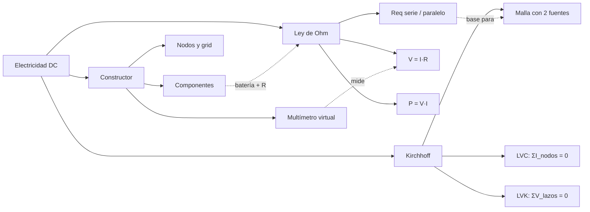

# SKILL 03 — ELECTRICIDAD DC

## Información General

| Campo | Valor |
|-------|-------|
| **Módulo** | Electricidad Básica (Corriente Continua) |
| **Código** | `ELE` |
| **Prerrequisitos del alumno** | Álgebra básica, concepto de carga y corriente, diferencia de potencial, resistividad, Ley de Ohm intuitiva |
| **Tiempo estimado** | 5-7 sesiones de 45 minutos |
| **Archivos de implementación** | `js/modules/electricity/ohm.js`, `kirchhoff.js`, `circuit-builder.js` |

## Objetivos de Aprendizaje

Al finalizar este módulo, el alumno será capaz de:

1. Aplicar la Ley de Ohm (V = I·R) para calcular cualquiera de las tres variables dadas las otras dos.
2. Distinguir entre una asociación de resistencias en serie y en paralelo, y calcular la resistencia equivalente en cada caso.
3. Predecir la caída de voltaje en cada resistencia de un circuito serie (divisor de voltaje).
4. Predecir la corriente por cada rama de un circuito paralelo (divisor de corriente).
5. Aplicar las Leyes de Kirchhoff (corrientes y voltajes) para resolver mallas con dos fuentes.
6. Calcular la potencia disipada por una resistencia y verificar la conservación de energía (ΣP_fuente = ΣP_resistencias).
7. Construir circuitos sencillos arrastrando componentes (batería, resistencia, LED, multímetro) sobre un canvas con grid.

## Mapa Conceptual



---

## SUB-MÓDULO ELE-01: Ley de Ohm y Circuito Simple

### Descripción del Escenario

Se presenta una fuente de voltaje conectada a una combinación de tres resistencias. El alumno elige si están en serie, paralelo o mixto y observa en tiempo real:

1. La corriente total que entrega la fuente.
2. La caída de voltaje en cada resistencia (resaltada con brillo proporcional).
3. La potencia disipada por cada resistencia (calor simulado).
4. Un panel con la verificación de Kirchhoff (ΣV = V_fuente en serie; ΣI_ramas = I_total en paralelo).

### Variables de Entrada

| Variable | Símbolo | Unidad SI | Rango Slider | Default | Step | Descripción |
|----------|---------|-----------|---------------|---------|------|-------------|
| Voltaje de la fuente | `V` | V | [0, 24] | 12 | 0.5 | Fem de la batería |
| Resistencia 1 | `R₁` | Ω | [1, 1000] | 100 | 1 | Primera resistencia |
| Resistencia 2 | `R₂` | Ω | [1, 1000] | 220 | 1 | Segunda resistencia |
| Resistencia 3 | `R₃` | Ω | [1, 1000] | 470 | 1 | Tercera resistencia |
| Tipo de asociación | `tipo` | — | serie / paralelo / mixto | serie | — | Topología del circuito |

**Validación**: en modo mixto se exige R₂ como resistencia "puente" entre R₁ y R₃; si alguna resistencia es 0 se considera cortocircuito (corriente → ∞ y se muestra aviso).

### Variables de Salida

| Variable | Símbolo | Unidad | Fórmula | Muestra en |
|----------|---------|--------|---------|------------|
| Corriente total | `I` | A | V / Req | Panel + amperímetro |
| Resistencia equivalente | `Req` | Ω | ΣRₙ o 1/Σ(1/Rₙ) | Panel lateral |
| Potencia total | `P_total` | W | V · I | Panel lateral |
| Caída por resistencia | `V_Rn` | V | I·Rₙ (serie) o V (paralelo) | Sobre cada R + multímetro |
| Corriente por resistencia | `I_Rn` | A | I (serie) o V/Rₙ (paralelo) | Panel lateral |
| Verificación Kirchhoff | `ΣV` / `ΣI` | V / A | ΣV_Rn ≈ V ; ΣI_Rn ≈ I_total | Indicador ✓ / ✗ |

### Ecuaciones Físicas — Derivación Completa

#### LEY DE OHM

La diferencia de potencial (voltaje) necesaria para mantener una corriente `I` a través de una resistencia `R` es proporcional a ambas:

```
V = I · R          ... (Ecuación 1 — Ley de Ohm)
```

Despejando cualquier variable:

```
I = V / R      R = V / I
```

> **Interpretación**: a mayor voltaje, mayor corriente. A mayor resistencia, menor corriente. La resistencia es la "oposición" al flujo de electrones.

#### POTENCIA ELÉCTRICA

La energía por unidad de tiempo disipada en una resistencia:

```
P = V · I          ... (Ecuación 2)
```

Sustituyendo V = I·R o I = V/R se obtienen tres formas equivalentes:

```
P = V·I = I²·R = V²/R
```

> **Dato clave para el alumno**: en una resistencia, la energía eléctrica se transforma en calor (efecto Joule). Por eso I²·R es la forma más usada para calcular potencia disipada en cada resistencia individual.

#### RESISTENCIA EQUIVALENTE EN SERIE

En serie las resistencias se recorren una tras otra; la misma corriente pasa por todas:

```
Req = R₁ + R₂ + R₃ + ...        ... (Ecuación 3)
```

#### RESISTENCIA EQUIVALENTE EN PARALELO

En paralelo las resistencias comparten los mismos terminales; el voltaje es el mismo en todas y la corriente se reparte:

```
1 / Req = 1/R₁ + 1/R₂ + 1/R₃ + ...        ... (Ecuación 4)
```

> **Nota**: para dos resistencias en paralelo existe un atajo: `Req = (R₁·R₂) / (R₁ + R₂)`. Nunca es mayor que la menor de las dos.

#### DIVISOR DE VOLTAJE (serie)

En un circuito serie, el voltaje de la fuente se reparte proporcionalmente a cada resistencia:

```
V_Rn = I · Rn       donde I = V / Req
```

> **Verificación (Kirchhoff de voltajes)**: Σ V_Rn = V_fuente.

#### DIVISOR DE CORRIENTE (paralelo)

En un circuito paralelo, la corriente total se reparte inversamente proporcional a cada resistencia:

```
I_Rn = V / Rn       donde V es el mismo en todas las ramas
```

> **Verificación (Kirchhoff de corrientes)**: Σ I_Rn = I_total.

### Implementación JavaScript

```javascript
// ============================================
// LEY DE OHM Y CIRCUITOS SIMPLES
// Archivo: js/modules/electricity/ohm.js
// ============================================

/**
 * Ley de Ohm básica.
 * @param {number} V - Voltaje (V)
 * @param {number} R - Resistencia (Ω)
 * @returns {{I: number, P: number}} Corriente (A) y Potencia (W)
 */
export function leyOhm(V, R) {
    if (R === 0) return { I: Infinity, P: Infinity }; // cortocircuito
    const I = V / R;               // I = V/R
    const P = V * I;               // P = V·I = V²/R = I²·R
    return { I, P };
}

/**
 * Resistencia equivalente en SERIE.
 * Req = R1 + R2 + R3 + ...
 * @param {number[]} resistencias
 * @returns {number}
 */
export function resistenciaSerie(resistencias) {
    return resistencias.reduce((sum, r) => sum + r, 0);
}

/**
 * Resistencia equivalente en PARALELO.
 * 1/Req = 1/R1 + 1/R2 + 1/R3 + ...
 * @param {number[]} resistencias
 * @returns {number}
 */
export function resistenciaParalelo(resistencias) {
    const invReq = resistencias.reduce((sum, r) => sum + 1 / r, 0);
    return 1 / invReq;
}

/**
 * Análisis completo de un circuito SERIE.
 * La misma corriente pasa por todas las resistencias.
 *
 * @param {number} V - Voltaje de la fuente (V)
 * @param {number[]} resistencias - Resistencias en serie (Ω)
 * @returns {Object} Estado completo del circuito
 */
export function circuitoSerie(V, resistencias) {
    const Req = resistenciaSerie(resistencias);
    const I = Req === 0 ? Infinity : V / Req;

    const componentes = resistencias.map((R, i) => ({
        id: `R${i + 1}`,
        resistance: R,
        voltage: I * R,                // V_Rn = I · Rn  (divisor de voltaje)
        current: I,                    // misma corriente en serie
        power: I * I * R               // P = I²·R
    }));

    return {
        Req,
        totalCurrent: I,
        totalPower: V * I,
        components: componentes,
        // Verificación Kirchhoff: ΣV_Rn = V_fuente
        kirchhoffCheck: componentes.reduce((s, c) => s + c.voltage, 0)
    };
}

/**
 * Análisis completo de un circuito PARALELO.
 * El voltaje es el mismo en todas las ramas.
 *
 * @param {number} V - Voltaje de la fuente (V)
 * @param {number[]} resistencias - Resistencias en paralelo (Ω)
 * @returns {Object} Estado completo del circuito
 */
export function circuitoParalelo(V, resistencias) {
    const Req = resistenciaParalelo(resistencias);
    const Itotal = Req === 0 ? Infinity : V / Req;

    const componentes = resistencias.map((R, i) => ({
        id: `R${i + 1}`,
        resistance: R,
        voltage: V,                    // mismo voltaje en paralelo
        current: V / R,                // I_Rn = V / Rn
        power: V * V / R               // P = V²/R
    }));

    return {
        Req,
        totalCurrent: Itotal,
        totalPower: V * Itotal,
        components: componentes,
        // Verificación Kirchhoff: ΣI_ramas = I_total
        kirchhoffCheck: componentes.reduce((s, c) => s + c.current, 0)
    };
}

/**
 * Módulo Ley de Ohm para el motor de simulación.
 * Implementa { init(), update(dt, simTime), render(ctx, alpha) }.
 */
export class OhmModule {
    constructor() {
        this.V = 12;
        this.R = [100, 220, 470];
        this.tipo = 'serie';

        this.t = 0;
        this.currentState = null;
        this.prevState = null;

        this.electronParticles = [];   // partículas visuales del flujo
        this.maxParticles = 80;
    }

    init() {
        this.t = 0;
        this.recalc();
        this.prevState = { ...this.currentState };
        this.electronParticles = [];
        for (let i = 0; i < this.maxParticles; i++) {
            this.electronParticles.push({
                progress: i / this.maxParticles, // posición 0..1 sobre el lazo
                speed: 0
            });
        }
    }

    recalc() {
        if (this.tipo === 'serie') {
            this.currentState = circuitoSerie(this.V, this.R);
        } else if (this.tipo === 'paralelo') {
            this.currentState = circuitoParalelo(this.V, this.R);
        } else {
            // mixto: R1 en serie con (R2 || R3)
            const reqPar = resistenciaParalelo([this.R[1], this.R[2]]);
            this.currentState = circuitoSerie(this.V, [this.R[0], reqPar]);
        }
    }

    update(dt, simTime) {
        this.t = simTime;
        this.prevState = { ...this.currentState };
        this.recalc();

        // Velocidad de los electrones proporcional a la corriente
        const I = Math.min(this.currentState.totalCurrent, 5); // tope visual
        const flow = 0.05 + I * 0.05;
        for (const p of this.electronParticles) {
            p.progress = (p.progress + flow * dt) % 1;
        }
    }

    render(ctx, alpha) {
        const W = ctx.canvas.width;
        const H = ctx.canvas.height;
        ctx.clearRect(0, 0, W, H);

        this.drawCircuit(ctx, W, H);
        this.drawElectrons(ctx, W, H);
        this.drawLabels(ctx, W, H);
    }

    drawCircuit(ctx, W, H) {
        const margin = 80;
        ctx.strokeStyle = '#8888aa';
        ctx.lineWidth = 3;
        ctx.strokeRect(margin, margin, W - 2 * margin, H - 2 * margin);

        // Símbolo de batería (lado izquierdo)
        ctx.strokeStyle = '#ff8c00';
        ctx.lineWidth = 4;
        ctx.beginPath();
        ctx.moveTo(margin - 15, H / 2 - 20);
        ctx.lineTo(margin + 15, H / 2 - 20);
        ctx.moveTo(margin - 10, H / 2 + 20);
        ctx.lineTo(margin + 10, H / 2 + 20);
        ctx.stroke();
        ctx.fillStyle = '#ff8c00';
        ctx.font = '14px system-ui';
        ctx.fillText(`${this.V.toFixed(1)} V`, margin - 40, H / 2 + 50);
    }

    drawElectrons(ctx, W, H) {
        const margin = 80;
        const perimetro = 2 * (W - 2 * margin) + 2 * (H - 2 * margin);
        for (const p of this.electronParticles) {
            const d = p.progress * perimetro;
            const pos = perimToXY(d, margin, W - margin, H - margin);
            ctx.beginPath();
            ctx.arc(pos.x, pos.y, 2.5, 0, Math.PI * 2);
            ctx.fillStyle = '#00e5ff';
            ctx.fill();
        }
    }

    drawLabels(ctx, W, H) {
        const st = this.currentState;
        ctx.fillStyle = '#e8e8f0';
        ctx.font = '14px system-ui';
        ctx.fillText(`Req = ${st.Req.toFixed(1)} Ω`, 20, 24);
        ctx.fillText(`I  = ${st.totalCurrent.toFixed(3)} A`, 20, 44);
        ctx.fillText(`P  = ${st.totalPower.toFixed(2)} W`, 20, 64);
    }
}

function perimToXY(d, x0, x1, y0, y1) {
    const w = x1 - x0, h = y1 - y0;
    const p = 2 * (w + h);
    d = ((d % p) + p) % p;
    if (d < w) return { x: x0 + d, y: y0 };
    d -= w;
    if (d < h) return { x: x1, y: y0 + d };
    d -= h;
    if (d < w) return { x: x1 - d, y: y1 };
    d -= w;
    return { x: x0, y: y1 - d };
}
```

### Retos Pedagógicos — Ley de Ohm

```json
[
  {
    "id": "ohm-01",
    "type": "numeric",
    "difficulty": 1,
    "question": "Una pila de 9 V se conecta a una resistencia de 3 Ω. ¿Qué corriente circula?",
    "correctAnswer": 3,
    "tolerance": 0.05,
    "unit": "A",
    "hint": "I = V / R.",
    "feedbackCorrect": "¡Correcto! I = 9 / 3 = 3 A.",
    "feedbackIncorrect": "Recuerda I = V / R. Sustituye V=9 y R=3.",
    "explanation": "La Ley de Ohm relaciona linealmente voltaje y corriente cuando R es constante."
  },
  {
    "id": "ohm-02",
    "type": "numeric",
    "difficulty": 2,
    "question": "Si por una resistencia de 100 Ω pasa una corriente de 0.2 A, ¿qué voltaje hay entre sus terminales?",
    "correctAnswer": 20,
    "tolerance": 0.05,
    "unit": "V",
    "hint": "Despeja V = I·R.",
    "feedbackCorrect": "¡Excelente! V = 0.2 × 100 = 20 V.",
    "feedbackIncorrect": "Despeja V de la Ley de Ohm: V = I·R.",
    "explanation": "La misma ecuación V=IR sirve para calcular V si se conocen I y R."
  },
  {
    "id": "ohm-03",
    "type": "multiple_choice",
    "difficulty": 1,
    "question": "Al conectar dos resistencias en SERIE, la resistencia equivalente es...",
    "options": [
      "La suma de ambas",
      "El producto sobre la suma",
      "Siempre menor que la menor",
      "Cero"
    ],
    "correctAnswer": 0,
    "hint": "En serie las resistencias se suman.",
    "feedbackCorrect": "¡Sí! En serie Req = R₁ + R₂.",
    "feedbackIncorrect": "Piensa en serie como 'una detrás de otra'.",
    "explanation": "En serie el electrón debe atravesar cada resistencia secuencialmente: se suman."
  },
  {
    "id": "ohm-04",
    "type": "multiple_choice",
    "difficulty": 2,
    "question": "En un circuito PARALELO con dos resistencias distintas, ¿dónde circula mayor corriente?",
    "options": [
      "Por la resistencia mayor",
      "Por la resistencia menor",
      "Igual en ambas",
      "No hay corriente"
    ],
    "correctAnswer": 1,
    "hint": "I = V/R: a menor R, mayor I.",
    "feedbackCorrect": "¡Correcto! La corriente prefiere el camino de menor resistencia.",
    "feedbackIncorrect": "En paralelo el voltaje es el mismo; usa I = V/R.",
    "explanation": "El divisor de corriente reparte más electrones por la rama de menor resistencia."
  },
  {
    "id": "ohm-05",
    "type": "experiment",
    "difficulty": 2,
    "question": "Configura la simulación en modo SERIE con V=12 V y logra que la corriente total sea exactamente 0.05 A eligiendo las resistencias adecuadas. ¿Qué valor de Req necesitas?",
    "correctAnswer": 240,
    "tolerance": 0.05,
    "unit": "Ω",
    "hint": "Despeja Req = V / I.",
    "feedbackCorrect": "¡Perfecto! Req = 12 / 0.05 = 240 Ω.",
    "feedbackIncorrect": "Despeja Req de I = V / Req.",
    "explanation": "Esto muestra cómo una sola resistencia equivalente modela todo el circuito."
  },
  {
    "id": "ohm-06",
    "type": "experiment",
    "difficulty": 3,
    "question": "Con V=10 V, coloca R₁ y R₂ en PARALELO de modo que la potencia total disipada sea 5 W. ¿Qué valor debe tener cada resistencia si son iguales?",
    "correctAnswer": 40,
    "tolerance": 0.1,
    "unit": "Ω",
    "hint": "P = V²/Req; con dos R iguales en paralelo, Req = R/2.",
    "feedbackCorrect": "¡Excelente! Req = 20 Ω → cada R = 40 Ω.",
    "feedbackIncorrect": "Recuerda que dos R iguales en paralelo dan Req = R/2.",
    "explanation": "Combinando divisor de corriente y potencia se modelan circuitos reales."
  }
]
```

---

## SUB-MÓDULO ELE-02: Leyes de Kirchhoff — Malla Simple

### Descripción del Escenario

Se presenta un circuito con dos lazos: cada uno contiene una fuente de voltaje y una resistencia, y comparten una resistencia central `R₂`. El alumno observa:

1. Las corrientes `I₁` (lazo izquierdo) e `I₂` (lazo derecho), con sentido indicado por flechas.
2. La corriente real por la resistencia compartida `R₂`, que es `IR₂ = I₁ − I₂`.
3. Un panel de verificación que muestra que ΣV en cada lazo = 0.
4. La potencia total entregada por las fuentes frente a la disipada en las resistencias.

### Variables de Entrada

| Variable | Símbolo | Unidad SI | Rango Slider | Default | Step | Descripción |
|----------|---------|-----------|---------------|---------|------|-------------|
| Fuente 1 | `V₁` | V | [0, 24] | 12 | 0.5 | Fem del lazo izquierdo |
| Fuente 2 | `V₂` | V | [0, 24] | 6 | 0.5 | Fem del lazo derecho |
| Resistencia 1 | `R₁` | Ω | [1, 1000] | 100 | 1 | Resistencia del lazo 1 |
| Resistencia 2 | `R₂` | Ω | [1, 1000] | 50 | 1 | Resistencia compartida |
| Resistencia 3 | `R₃` | Ω | [1, 1000] | 200 | 1 | Resistencia del lazo 2 |

**Validación**: si `det = 0` (sistema singular) se muestra "Configuración degenerada" y se bloquea la simulación.

### Variables de Salida

| Variable | Símbolo | Unidad | Fórmula | Muestra en |
|----------|---------|--------|---------|------------|
| Corriente lazo 1 | `I₁` | A | Cramer | Flecha + amperímetro lazo 1 |
| Corriente lazo 2 | `I₂` | A | Cramer | Flecha + amperímetro lazo 2 |
| Corriente compartida | `IR₂` | A | I₁ − I₂ | Flecha central |
| Caídas de tensión | `VR₁,VR₂,VR₃` | V | I·R | Sobre cada R + multímetro |
| Potencias disipadas | `PR₁,PR₂,PR₃` | W | I²·R | Panel |
| Verificación lazos | `loopCheck1/2` | V | ΣV_lazo ≈ 0 | Indicador ✓ / ✗ |

### Ecuaciones Físicas — Derivación Completa

#### PRIMERA LEY DE KIRCHHOFF (LVC — Corrientes)

> "La suma de corrientes que entran a un nodo es igual a la suma de corrientes que salen."

```
Σ I_entrantes = Σ I_salientes     ⇔     Σ I_nodo = 0
```

#### SEGUNDA LEY DE KIRCHHOFF (LVK — Voltajes)

> "La suma algebraica de las diferencias de potencial a lo largo de cualquier lazo cerrado es cero."

```
Σ V_lazo = 0
```

#### PLANTEO DE LA MALLA CON DOS LAZOS

Para el lazo 1 (fuente V₁, R₁, R₂ compartida):

```
V₁ − I₁·R₁ − (I₁ − I₂)·R₂ = 0
```

Para el lazo 2 (fuente V₂, R₃, R₂ compartida):

```
−V₂ − I₂·R₃ − (I₂ − I₁)·R₂ = 0
```

Reordenando como sistema lineal 2×2:

```
(R₁ + R₂)·I₁  −  R₂·I₂ = V₁
   −R₂·I₁   + (R₂ + R₃)·I₂ = −V₂
```

#### RESOLUCIÓN POR REGLA DE CRAMER

Sea la matriz de coeficientes:

```
| a11  a12 |     | (R₁+R₂)    −R₂   |
| a21  a22 |  =  |   −R₂    (R₂+R₃) |
```

Determinante:

```
det = a11·a22 − a12·a21
```

Soluciones:

```
I₁ = (b1·a22 − b2·a12) / det
I₂ = (a11·b2 − a21·b1) / det
```

> **Nota**: si `det = 0` el sistema es singular (no tiene solución única). En la práctica indica componentes puramente reactivos o redundancia topológica.

#### CORRIENTE Y POTENCIA EN LA RAMA COMPARTIDA

```
IR₂ = I₁ − I₂
PR₂ = IR₂² · R₂
```

> **Verificación de energía**: `V₁·I₁ + V₂·I₂ ≈ PR₁ + PR₂ + PR₃`. La potencia entregada por las fuentes siempre debe igualar la potencia disipada por las resistencias.

### Implementación JavaScript

```javascript
// ============================================
// KIRCHHOFF — MALLA SIMPLE DE 2 LAZOS
// Archivo: js/modules/electricity/kirchhoff.js
// ============================================

/**
 * Resuelve una malla con 2 fuentes y 3 resistencias usando
 * la Ley de Voltajes de Kirchhoff y la regla de Cramer.
 *
 *  Lazo 1: V1 - I1·R1 - (I1-I2)·R2 = 0
 *  Lazo 2: -V2 - I2·R3 - (I2-I1)·R2 = 0
 *
 * @param {number} V1 - Fem lazo 1 (V)
 * @param {number} V2 - Fem lazo 2 (V)
 * @param {number} R1 - Resistencia lazo 1 (Ω)
 * @param {number} R2 - Resistencia compartida (Ω)
 * @param {number} R3 - Resistencia lazo 2 (Ω)
 * @returns {Object|null} Solución o null si sistema singular
 */
export function kirchhoffMalla(V1, V2, R1, R2, R3) {
    // Matriz de coeficientes del sistema 2x2
    const a11 = R1 + R2;
    const a12 = -R2;
    const a21 = -R2;
    const a22 = R2 + R3;
    const b1 = V1;
    const b2 = -V2;

    // Resolver por Cramer
    const det = a11 * a22 - a12 * a21;
    if (Math.abs(det) < 1e-10) return null; // sistema singular

    const I1 = (b1 * a22 - b2 * a12) / det;
    const I2 = (a11 * b2 - a21 * b1) / det;

    // Corriente por R2 (rama compartida)
    const IR2 = I1 - I2;

    return {
        I1, I2, IR2,
        voltages: {
            VR1: I1 * R1,
            VR2: IR2 * R2,
            VR3: I2 * R3
        },
        powers: {
            PR1: I1 * I1 * R1,
            PR2: IR2 * IR2 * R2,
            PR3: I2 * I2 * R3
        },
        // Verificación: suma de voltajes en cada lazo = 0
        loopCheck1: V1 - I1 * R1 - IR2 * R2,
        loopCheck2: -V2 - I2 * R3 + IR2 * R2
    };
}

/**
 * Módulo Kirchhoff para el motor de simulación.
 */
export class KirchhoffModule {
    constructor() {
        this.V1 = 12; this.V2 = 6;
        this.R1 = 100; this.R2 = 50; this.R3 = 200;

        this.t = 0;
        this.currentState = null;
        this.prevState = null;
    }

    init() {
        this.t = 0;
        this.recalc();
        this.prevState = { ...this.currentState };
    }

    recalc() {
        this.currentState = kirchhoffMalla(this.V1, this.V2, this.R1, this.R2, this.R3);
    }

    update(dt, simTime) {
        this.t = simTime;
        this.prevState = { ...this.currentState };
        this.recalc();
    }

    render(ctx, alpha) {
        const W = ctx.canvas.width, H = ctx.canvas.height;
        ctx.clearRect(0, 0, W, H);
        this.drawMesh(ctx, W, H);
        this.drawArrows(ctx, W, H);
        this.drawLabels(ctx, W, H);
    }

    drawMesh(ctx, W, H) {
        if (!this.currentState) {
            ctx.fillStyle = '#ff4444';
            ctx.font = '16px system-ui';
            ctx.fillText('Configuración degenerada (det = 0)', 40, 40);
            return;
        }
        const margin = 80;
        ctx.strokeStyle = '#8888aa';
        ctx.lineWidth = 3;
        // Lazo izquierdo
        ctx.strokeRect(margin, margin, (W - 3 * margin) / 2, H - 2 * margin);
        // Lazo derecho
        ctx.strokeRect(margin + (W - 3 * margin) / 2, margin,
                       (W - 3 * margin) / 2, H - 2 * margin);
    }

    drawArrows(ctx, W, H) {
        const st = this.currentState;
        if (!st) return;
        // Flechas proporcionales a I1 e I2
        const mag1 = Math.min(Math.abs(st.I1), 0.5) * 40;
        const mag2 = Math.min(Math.abs(st.I2), 0.5) * 40;
        ctx.strokeStyle = '#00e5ff';
        ctx.lineWidth = 2;
        ctx.beginPath();
        ctx.moveTo(80, H / 2);
        ctx.lineTo(80 + mag1, H / 2);
        ctx.stroke();
        ctx.beginPath();
        ctx.moveTo(W - 80, H / 2);
        ctx.lineTo(W - 80 - mag2, H / 2);
        ctx.stroke();
    }

    drawLabels(ctx, W, H) {
        const st = this.currentState;
        if (!st) return;
        ctx.fillStyle = '#e8e8f0';
        ctx.font = '14px system-ui';
        ctx.fillText(`I₁ = ${st.I1.toFixed(3)} A`, 20, 24);
        ctx.fillText(`I₂ = ${st.I2.toFixed(3)} A`, 20, 44);
        ctx.fillText(`IR₂ = ${st.IR2.toFixed(3)} A`, 20, 64);
        ctx.fillText(`ΣV lazo1 = ${st.loopCheck1.toExponential(2)} V`, W - 260, 24);
        ctx.fillText(`ΣV lazo2 = ${st.loopCheck2.toExponential(2)} V`, W - 260, 44);
    }
}
```

### Retos Pedagógicos — Kirchhoff

```json
[
  {
    "id": "kir-01",
    "type": "numeric",
    "difficulty": 1,
    "question": "En un nodo entran 3 A y 2 A. Sale una única corriente. ¿Cuánto vale?",
    "correctAnswer": 5,
    "tolerance": 0.05,
    "unit": "A",
    "hint": "ΣI_entrantes = ΣI_salientes.",
    "feedbackCorrect": "¡Correcto! 3 + 2 = 5 A.",
    "feedbackIncorrect": "Aplica la LVC: lo que entra debe salir.",
    "explanation": "La Primera Ley de Kirchhoff es consecuencia de la conservación de la carga."
  },
  {
    "id": "kir-02",
    "type": "numeric",
    "difficulty": 2,
    "question": "En un lazo cerrado simple hay una pila de 12 V y una sola resistencia con caída de 12 V. ¿Cuál es la suma de voltajes del lazo?",
    "correctAnswer": 0,
    "tolerance": 0.05,
    "unit": "V",
    "hint": "La LVK dice ΣV = 0 en un lazo.",
    "feedbackCorrect": "¡Perfecto! +12 (pila) − 12 (R) = 0.",
    "feedbackIncorrect": "La suma algebraica siempre da cero en un lazo cerrado.",
    "explanation": "La Segunda Ley de Kirchhoff expresa la conservación de la energía."
  },
  {
    "id": "kir-03",
    "type": "multiple_choice",
    "difficulty": 1,
    "question": "Si en una malla el determinante del sistema lineal da cero, significa que...",
    "options": [
      "El circuito no tiene solución única",
      "La corriente es infinita",
      "Hay un cortocircuito",
      "No hay baterías"
    ],
    "correctAnswer": 0,
    "hint": "det = 0 implica sistema singular.",
    "feedbackCorrect": "¡Sí! Un sistema singular no tiene solución única.",
    "feedbackIncorrect": "Piensa en álgebra lineal: det=0 ⇒ sin solución única.",
    "explanation": "En circuitos reales esto indica redundancia o un componente ideal."
  },
  {
    "id": "kir-04",
    "type": "multiple_choice",
    "difficulty": 2,
    "question": "En una malla de 2 lazos, ¿por qué resistencia pasa la corriente I₁ − I₂?",
    "options": [
      "Por la resistencia compartida entre ambos lazos",
      "Por la resistencia del lazo 1",
      "Por la resistencia del lazo 2",
      "Por la batería"
    ],
    "correctAnswer": 0,
    "hint": "Es la rama que pertenece a ambos lazos a la vez.",
    "feedbackCorrect": "¡Exacto! La rama compartida ve la diferencia de corrientes.",
    "feedbackIncorrect": "Busca el componente que está en ambos lazos.",
    "explanation": "La rama compartida es clave: su corriente neta es la diferencia de las dos corrientes de lazo."
  },
  {
    "id": "kir-05",
    "type": "experiment",
    "difficulty": 3,
    "question": "Configura la malla con V₁=10 V, V₂=10 V, R₁=R₂=R₃=100 Ω. ¿Qué corriente circula por R₂?",
    "correctAnswer": 0,
    "tolerance": 0.05,
    "unit": "A",
    "hint": "Si V₁=V₂ y todas las R son iguales, el circuito es simétrico.",
    "feedbackCorrect": "¡Perfecto! Por simetría I₁=I₂, por lo que IR₂=0.",
    "feedbackIncorrect": "Considera la simetría del circuito cuando V₁=V₂ y R₁=R₃.",
    "explanation": "La simetría puede anular la corriente en la rama compartida: principio del puente de Wheatstone equilibrado."
  },
  {
    "id": "kir-06",
    "type": "experiment",
    "difficulty": 3,
    "question": "Con V₁=12 V, V₂=0 V (quita la segunda fuente), R₁=100 Ω, R₂=50 Ω, R₃=200 Ω. ¿Cuál es la corriente que entrega la fuente V₁?",
    "correctAnswer": 0.1,
    "tolerance": 0.05,
    "unit": "A",
    "hint": "Sin V₂, el lazo 2 actúa como una rama en paralelo a través de R₂ y R₃.",
    "feedbackCorrect": "¡Excelente! La corriente total ≈ 0.1 A.",
    "feedbackIncorrect": "Modela el circuito como V₁ alimentando Req = R₁ + (R₂ || R₃).",
    "explanation": "Caso particular útil: cuando una fuente es cero, la malla se reduce a un circuito serie-paralelo clásico."
  }
]
```

---

## SUB-MÓDULO ELE-03: Constructor de Circuitos (Drag & Drop)

### Descripción del Escenario

El alumno dispone de una **paleta de componentes** a la izquierda (batería, resistencia, cable, switch, LED, amperímetro, voltímetro) y un **canvas con grid** a la derecha. Arrastra los componentes al canvas, donde "snappean" a la cuadrícula, y los conecta dibujando cables entre nodos.

1. La paleta ofrece cada componente con un icono y valor por defecto.
2. Al soltar un componente sobre el grid, se ajusta a la celda más cercana (40×40 px).
3. El alumno conecta componentes haciendo clic en dos nodos: aparece un cable.
4. Un botón "Analizar" ejecuta el solver ( Kirchhoff generalizado) y muestra corrientes/voltajes en cada componente y sobre los instrumentos virtuales.

### Variables de Entrada

| Variable | Símbolo | Unidad SI | Rango Slider | Default | Step | Descripción |
|----------|---------|-----------|---------------|---------|------|-------------|
| Tamaño de grid | `GRID_SIZE` | px | [20, 80] | 40 | 5 | Resolución del canvas de construcción |
| Componentes | `tipo` | — | battery/resistor/wire/switch/LED/ammeter/voltmeter | resistor | — | Tipo arrastrado desde la paleta |
| Valor de componente | `value` | V/Ω/— | [1, 1000] | 100 | 1 | Fem (battery), resistencia, etc. |

**Validación**: un circuito válido requiere al menos 1 battery y un lazo cerrado; si no, el solver reporta "Circuito abierto" sin calcular corrientes.

### Variables de Salida

| Variable | Símbolo | Unidad | Fórmula | Muestra en |
|----------|---------|--------|---------|------------|
| Potencial por nodo | `V_nodo` | V | Solver nodal | Etiqueta sobre cada nodo |
| Corriente por componente | `I_comp` | A | Solver | Flecha + amperímetro |
| Caída por componente | `V_comp` | V | I·R | Voltímetro virtual |
| Estado de elementos | `LED on/off`, `switch open/closed` | — | Según I y V | Cambio visual del componente |

### Ecuaciones Físicas — Derivación Completa

#### MODELO DE DATOS DEL CIRCUITO

Un circuito se modela como un **grafo dirigido**:

- **Nodos**: puntos de conexión donde pueden unirse varios componentes. Tienen un potencial `V_nodo` (referido a un nodo tierra = 0).
- **Componentes**: aristas entre dos nodos. Tienen un tipo, un valor y un sentido de corriente positiva.

#### ANÁLISIS NODAL (forma general de Kirchhoff)

Para cada nodo distinto del de referencia, se aplica LVC:

```
Σ I_salen = 0   ⇒   Σ (V_nodo − V_vecino) / R = Σ I_fuentes
```

Esto da un sistema lineal `G · V = I`, donde:

- `G` es la matriz de conductancias (simétrica, definida positiva si hay resistencia a tierra).
- `V` es el vector de potenciales desconocidos.
- `I` contiene las fuentes de corriente equivalentes.

> **Nota**: para fuentes de voltaje ideales se usa el método de modificación de nodos (MNA), agregando la corriente por la fuente como variable desconocida.

#### CORRIENTE Y POTENCIA POR COMPONENTE

Una vez resueltos los potenciales:

```
I_comp = (V_nodoA − V_nodoB) / R
P_comp = I_comp² · R
```

#### GRID Y SNAP

El canvas se divide en celdas cuadradas de `GRID_SIZE` píxeles. Al soltar un componente, se redondea su posición al centro de la celda más cercana:

```
x_grid = round(x / GRID_SIZE) · GRID_SIZE
y_grid = round(y / GRID_SIZE) · GRID_SIZE
```

> **Dato clave**: el grid no es solo estético: garantiza que los nodos coincidan exactamente para permitir conexiones limpias y simplifica el hit-testing del Drag & Drop.

### Implementación JavaScript

```javascript
// ============================================
// CONSTRUCTOR DE CIRCUITOS — DRAG & DROP
// Archivo: js/modules/electricity/circuit-builder.js
// ============================================

export const CircuitComponent = {
    BATTERY:   'battery',
    RESISTOR:  'resistor',
    WIRE:      'wire',
    SWITCH:    'switch',
    LED:       'led',
    AMMETER:   'ammeter',
    VOLTMETER: 'voltmeter'
};

/**
 * Nodo del circuito. Vive en una intersección del grid.
 */
export class CircuitNode {
    constructor(id, x, y) {
        this.id = id;
        this.x = x;           // posición en px (ya snappeada)
        this.y = y;
        this.connections = []; // IDs de componentes conectados
        this.voltage = 0;      // potencial calculado por el solver (V)
    }
}

/**
 * Instancia de un componente colocado en el canvas.
 */
export class CircuitComponentInstance {
    constructor(type, value, nodeA, nodeB) {
        this.type = type;
        this.value = value;   // Ω, V, etc.
        this.nodeA = nodeA;   // Nodo de entrada
        this.nodeB = nodeB;   // Nodo de salida
        this.current = 0;     // calculado por el solver (A)
        this.voltageDrop = 0; // calculado por el solver (V)
    }
}

/**
 * Tamaño de celda del grid.
 */
export const GRID_SIZE = 40;

/**
 * Ajusta una coordenada al centro de la celda más cercana.
 * @param {number} x - coordenada en px
 * @param {number} y - coordenada en px
 * @returns {{x: number, y: number}}
 */
export function snapToGrid(x, y) {
    return {
        x: Math.round(x / GRID_SIZE) * GRID_SIZE,
        y: Math.round(y / GRID_SIZE) * GRID_SIZE
    };
}

/**
 * Constructor de circuitos completo.
 * Depende del DragDropManager (ver skill 05-interactividad-uiux).
 */
export class CircuitBuilderModule {
    constructor(canvas) {
        this.canvas = canvas;
        this.ctx = canvas.getContext('2d');
        this.nodes = new Map();          // id -> CircuitNode
        this.components = [];            // CircuitComponentInstance[]
        this.nextNodeId = 1;
        this.nextCompId = 1;
        this.selectedNode = null;         // Para conectar cable a cable
        this.solved = false;
    }

    /**
     * Añade un nodo en la posición indicada (snapeada al grid).
     */
    addNode(x, y) {
        const snapped = snapToGrid(x, y);
        const id = `n${this.nextNodeId++}`;
        const node = new CircuitNode(id, snapped.x, snapped.y);
        this.nodes.set(id, node);
        return node;
    }

    /**
     * Añade un componente entre dos nodos.
     */
    addComponent(type, value, nodeA, nodeB) {
        const comp = new CircuitComponentInstance(type, value, nodeA, nodeB);
        comp.id = `c${this.nextCompId++}`;
        this.components.push(comp);
        nodeA.connections.push(comp.id);
        nodeB.connections.push(comp.id);
        this.solved = false;
        return comp;
    }

    /**
     * Validación: ¿hay al menos una batería y un lazo cerrado?
     */
    isValid() {
        const hasBattery = this.components.some(c => c.type === CircuitComponent.BATTERY);
        if (!hasBattery) return false;
        // Lazo cerrado: existe un ciclo en el grafo
        return this.hasClosedLoop();
    }

    hasClosedLoop() {
        // BFS/DFS buscando un ciclo
        const visited = new Set();
        const stack = [this.nodes.values().next().value];
        while (stack.length) {
            const n = stack.pop();
            if (!n || visited.has(n.id)) continue;
            visited.add(n.id);
            for (const cid of n.connections) {
                const comp = this.components.find(c => c.id === cid);
                if (!comp) continue;
                const other = comp.nodeA === n ? comp.nodeB : comp.nodeA;
                if (other && !visited.has(other.id)) stack.push(other);
            }
        }
        // Si visitamos más de 1 nodo y hay algún cable cerrando, hay lazo
        return visited.size > 1;
    }

    /**
     * Ejecuta el solver nodal simplificado.
     * Versión pedagógica: asume una sola batería y componentes lineales.
     */
    analyze() {
        if (!this.isValid()) {
            return { ok: false, message: 'Circuito abierto o sin batería' };
        }
        // Para simplicidad pedagógica: aplicar Ley de Ohm al primer lazo encontrado
        // (Una implementación completa usaría MNA; ver skill 07-arquitectura-motor.)
        const battery = this.components.find(c => c.type === CircuitComponent.BATTERY);
        const resistors = this.components.filter(c => c.type === CircuitComponent.RESISTOR);
        const Req = resistors.reduce((s, r) => s + r.value, 0);
        const I = Req > 0 ? battery.value / Req : Infinity;
        for (const r of resistors) {
            r.current = I;
            r.voltageDrop = I * r.value;
        }
        battery.current = I;
        this.solved = true;
        return { ok: true, totalCurrent: I };
    }

    render(ctx, alpha) {
        const W = this.canvas.width, H = this.canvas.height;
        ctx.clearRect(0, 0, W, H);
        this.drawGrid(ctx, W, H);
        this.drawComponents(ctx);
        this.drawNodes(ctx);
    }

    drawGrid(ctx, W, H) {
        ctx.strokeStyle = 'rgba(255,255,255,0.05)';
        ctx.lineWidth = 1;
        for (let x = 0; x <= W; x += GRID_SIZE) {
            ctx.beginPath();
            ctx.moveTo(x, 0); ctx.lineTo(x, H); ctx.stroke();
        }
        for (let y = 0; y <= H; y += GRID_SIZE) {
            ctx.beginPath();
            ctx.moveTo(0, y); ctx.lineTo(W, y); ctx.stroke();
        }
    }

    drawComponents(ctx) {
        for (const c of this.components) {
            const a = c.nodeA, b = c.nodeB;
            ctx.strokeStyle = '#8888aa';
            ctx.lineWidth = 2;
            ctx.beginPath();
            ctx.moveTo(a.x, a.y); ctx.lineTo(b.x, b.y); ctx.stroke();

            ctx.fillStyle = '#00e5ff';
            ctx.font = '11px system-ui';
            const mx = (a.x + b.x) / 2, my = (a.y + b.y) / 2;
            const label = this.labelFor(c);
            ctx.fillText(label, mx + 6, my - 4);
        }
    }

    labelFor(c) {
        if (c.type === CircuitComponent.BATTERY) return `${c.value}V`;
        if (c.type === CircuitComponent.RESISTOR) return `${c.value}Ω`;
        return c.type;
    }

    drawNodes(ctx) {
        for (const n of this.nodes.values()) {
            ctx.beginPath();
            ctx.arc(n.x, n.y, 4, 0, Math.PI * 2);
            ctx.fillStyle = '#ff8c00';
            ctx.fill();
        }
    }
}
```

### Retos Pedagógicos — Constructor

```json
[
  {
    "id": "cir-01",
    "type": "experiment",
    "difficulty": 1,
    "question": "Construye un circuito cerrado simple con 1 batería de 9 V y 1 resistencia de 100 Ω. ¿Qué corriente muestra el amperímetro?",
    "correctAnswer": 0.09,
    "tolerance": 0.05,
    "unit": "A",
    "hint": "I = V / R.",
    "feedbackCorrect": "¡Correcto! 9 / 100 = 0.09 A.",
    "feedbackIncorrect": "Aplica la Ley de Ohm al circuito.",
    "explanation": "El constructor permite verificar experimentalmente la Ley de Ohm."
  },
  {
    "id": "cir-02",
    "type": "experiment",
    "difficulty": 2,
    "question": "Construye un divisor de voltaje: batería 12 V con dos resistencias iguales de 200 Ω en serie. ¿Qué voltaje lee el voltímetro sobre una sola resistencia?",
    "correctAnswer": 6,
    "tolerance": 0.05,
    "unit": "V",
    "hint": "En serie con R iguales, el voltaje se reparte a la mitad.",
    "feedbackCorrect": "¡Perfecto! Cada resistencia recibe 6 V.",
    "feedbackIncorrect": "El divisor reparte V proporcional a cada R.",
    "explanation": "Divisor de voltaje: V_Rn = V · (Rn / Req)."
  },
  {
    "id": "cir-03",
    "type": "multiple_choice",
    "difficulty": 1,
    "question": "¿Para qué sirve el 'snap al grid' al arrastrar componentes?",
    "options": [
      "Alinear los nodos para permitir conexiones limpias",
      "Hacer el circuito más bonito",
      "Reducir el consumo de batería",
      "Aumentar la corriente"
    ],
    "correctAnswer": 0,
    "hint": "El grid garantiza que dos componentes se conecten exactamente.",
    "feedbackCorrect": "¡Sí! El snap facilita hit-testing y conexiones correctas.",
    "feedbackIncorrect": "Piensa en la usabilidad: los nodos deben coincidir.",
    "explanation": "El snap es una decisión UX con impacto directo en el modelo de datos."
  },
  {
    "id": "cir-04",
    "type": "multiple_choice",
    "difficulty": 2,
    "question": "Al pulsar 'Analizar', el constructor muestra 'Circuito abierto'. ¿Qué falta?",
    "options": [
      "Un lazo cerrado por el que pueda circular la corriente",
      "Más resistencias",
      "Un voltímetro",
      "Un switch abierto"
    ],
    "correctAnswer": 0,
    "hint": "La corriente necesita un camino cerrado de vuelta a la batería.",
    "feedbackCorrect": "¡Exacto! Sin lazo cerrado no hay corriente continua.",
    "feedbackIncorrect": "La corriente no circula si el camino está interrumpido.",
    "explanation": "Un circuito abierto equivale a resistencia infinita: I = 0."
  },
  {
    "id": "cir-05",
    "type": "experiment",
    "difficulty": 3,
    "question": "Construye un circuito con 1 batería de 10 V y 3 resistencias de 100 Ω en paralelo. ¿Qué corriente total entrega la batería?",
    "correctAnswer": 0.3,
    "tolerance": 0.05,
    "unit": "A",
    "hint": "Req = R/3 = 33.3 Ω; I = V / Req.",
    "feedbackCorrect": "¡Excelente! Req ≈ 33.3 Ω → I = 0.3 A.",
    "feedbackIncorrect": "Calcula Req para tres R iguales en paralelo.",
    "explanation": "N resistencias iguales R en paralelo → Req = R / N."
  },
  {
    "id": "cir-06",
    "type": "experiment",
    "difficulty": 3,
    "question": "Coloca un LED en serie con una resistencia de 330 Ω y una batería de 5 V (modelo el LED como R=50 Ω). ¿Qué corriente circula? ¿Se enciende el LED?",
    "correctAnswer": 0.013,
    "tolerance": 0.1,
    "unit": "A",
    "hint": "Req = 330 + 50 = 380 Ω; I = 5 / 380.",
    "feedbackCorrect": "¡Perfecto! I ≈ 13 mA, el LED se enciende débilmente.",
    "feedbackIncorrect": "Suma ambas resistencias antes de aplicar Ley de Ohm.",
    "explanation": "En la práctica siempre se pone una resistencia en serie con un LED para limitar la corriente y evitar quemarlo."
  }
]
```

---

## Tabla Resumen de Ecuaciones de Electricidad DC

| # | Ecuación | Nombre | Cuándo usar |
|---|----------|--------|-------------|
| 1 | `V = I · R` | Ley de Ohm | Calcular V, I o R cuando dos son conocidas |
| 2 | `P = V·I = I²·R = V²/R` | Potencia eléctrica | Potencia disipada o entregada |
| 3 | `Req_serie = R₁ + R₂ + … + Rₙ` | Resistencia equivalente en serie | Resistencias una detrás de otra |
| 4 | `1/Req = 1/R₁ + 1/R₂ + …` | Resistencia equivalente en paralelo | Resistencias en ramas paralelas |
| 5 | `V_Rn = I · Rn` | Divisor de voltaje | Caída en cada R de un circuito serie |
| 6 | `I_Rn = V / Rn` | Divisor de corriente | Corriente por cada rama en paralelo |
| 7 | `Σ I_nodo = 0` | 1ª Ley de Kirchhoff (LVC) | Análisis nodal |
| 8 | `Σ V_lazo = 0` | 2ª Ley de Kirchhoff (LVK) | Análisis de mallas |
| 9 | `I₁ − I₂ = IR₂` | Corriente en rama compartida | Malla con 2 lazos |
| 10 | `Σ P_fuentes = Σ P_resistencias` | Balance de potencia | Verificación de energía |

---

## Presets de Escenarios para Docentes

```json
[
  {
    "scenarioId": "lab-divisor-voltaje-01",
    "title": "Laboratorio: Divisor de voltaje con dos resistencias",
    "author": "Prof. Martínez",
    "subject": "Física III",
    "grade": "11vo",
    "duration": "30 min",
    "description": "Los alumnos arman un divisor de voltaje y verifican que cada resistencia recibe la mitad de V.",
    "module": "electricity/ohm",
    "objectives": [
      "Comprobar el divisor de voltaje en serie",
      "Verificar ΣV_Rn = V_fuente",
      "Medir con voltímetro virtual"
    ],
    "initialState": {
      "V": 12, "R": [200, 200, 200], "tipo": "serie",
      "toolsVisible": ["voltimetro", "amperimetro"]
    },
    "steps": [
      { "instruction": "Configura dos resistencias de 200 Ω en serie con V=12 V.", "expectedParams": { "V": 12, "R": [200, 200] } },
      { "instruction": "Mide el voltaje en una sola resistencia. ¿Es la mitad?", "expectedParams": {} },
      { "instruction": "Cambia una resistencia a 400 Ω. ¿Cómo se reparte ahora el voltaje?", "expectedParams": { "R": [200, 400] } }
    ],
    "challengeSet": "electricidad-retos.json",
    "challengeRange": [0, 3]
  },
  {
    "scenarioId": "lab-paralelo-corriente-02",
    "title": "Laboratorio: Divisor de corriente en paralelo",
    "author": "Prof. Martínez",
    "subject": "Física III",
    "grade": "11vo",
    "duration": "30 min",
    "description": "Los alumnos verifican que la corriente se reparte inversamente a R y que ΣI_ramas = I_total.",
    "module": "electricity/ohm",
    "objectives": [
      "Comprobar el divisor de corriente",
      "Verificar LVC en un nodo",
      "Observar que el voltaje es igual en todas las ramas"
    ],
    "initialState": {
      "V": 10, "R": [100, 200, 400], "tipo": "paralelo",
      "toolsVisible": ["amperimetro"]
    },
    "steps": [
      { "instruction": "Coloca tres resistencias distintas en paralelo con V=10 V.", "expectedParams": { "V": 10, "tipo": "paralelo" } },
      { "instruction": "Mide la corriente por cada rama con el amperímetro.", "expectedParams": {} },
      { "instruction": "Verifica que la suma de corrientes iguale la corriente total.", "expectedParams": {} }
    ],
    "challengeSet": "electricidad-retos.json",
    "challengeRange": [3, 6]
  },
  {
    "scenarioId": "lab-malla-dos-fuentes-03",
    "title": "Laboratorio: Malla con 2 fuentes y resistencia compartida",
    "author": "Prof. Martínez",
    "subject": "Física III",
    "grade": "11vo",
    "duration": "45 min",
    "description": "Se analiza una malla con dos lazos. Los alumnos predicen el sentido de IR₂ antes de simular.",
    "module": "electricity/kirchhoff",
    "objectives": [
      "Aplicar LVK a cada lazo",
      "Predecir la corriente en la rama compartida",
      "Verificar el balance de potencia"
    ],
    "initialState": {
      "V1": 12, "V2": 6, "R1": 100, "R2": 50, "R3": 200,
      "toolsVisible": ["voltimetro", "amperimetro"]
    },
    "steps": [
      { "instruction": "Predice sobre papel la corriente IR₂ antes de simular.", "expectedParams": {} },
      { "instruction": "Ejecuta la simulación y compara con tu predicción.", "expectedParams": {} },
      { "instruction": "Invierte V₂ (pon valor negativo). ¿Qué ocurre con IR₂?", "expectedParams": { "V2": -6 } }
    ],
    "challengeSet": "electricidad-retos.json",
    "challengeRange": [6, 12]
  }
]
```
```
