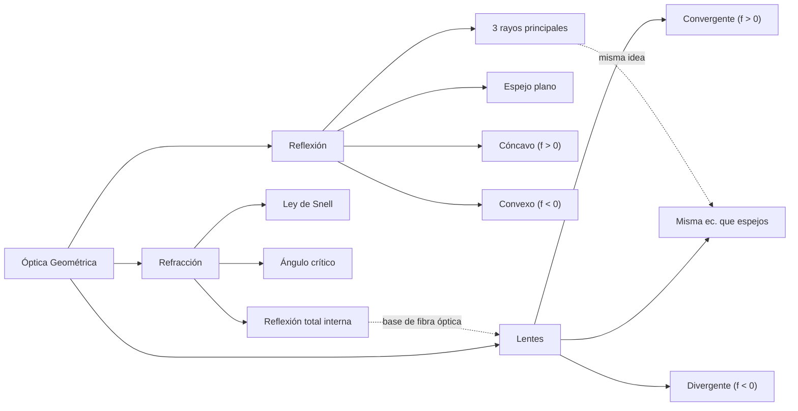

# SKILL 04 — ÓPTICA GEOMÉTRICA

## Información General

| Campo | Valor |
|-------|-------|
| **Módulo** | Óptica Geométrica |
| **Código** | `OPT` |
| **Prerrequisitos del alumno** | Geometría elemental, trigonometría (sin, cos, tan), concepto de ángulo, rectas y segmentos |
| **Tiempo estimado** | 4-6 sesiones de 45 minutos |
| **Archivos de implementación** | `js/modules/optics/mirrors.js`, `refraction.js`, `lenses.js` |

## Objetivos de Aprendizaje

Al finalizar este módulo, el alumno será capaz de:

1. Distinguir entre un espejo plano, cóncavo y convexo, e identificar su distancia focal y centro de curvatura.
2. Aplicar la ecuación del espejo `1/f = 1/d₀ + 1/dᵢ` para calcular la posición de la imagen.
3. Calcular el aumento lateral `M = −dᵢ/d₀` y clasificar la imagen (real/virtual, derecha/invertida, amplificada/reducida).
4. Aplicar la Ley de Snell `n₁·sinθ₁ = n₂·sinθ₂` para predecir el ángulo de refracción.
5. Identificar el ángulo crítico y la reflexión total interna cuando `n₁ > n₂`.
6. Aplicar la ecuación de lentes delgadas y trazar los tres rayos principales.
7. Diferenciar la convención de signos entre espejos y lentes (f positivo/negativo según convergencia).

## Mapa Conceptual



---

## SUB-MÓDULO OPT-01: Reflexión en Espejos Esféricos

### Descripción del Escenario

Se presenta un banco óptico con un objeto (flecha vertical) frente a un espejo. El alumno elige el tipo de espejo (plano, cóncavo, convexo), la distancia del objeto `d₀`, su altura `h₀` y la distancia focal `f`. La simulación muestra:

1. El espejo y su eje óptico con foco `F` y centro de curvatura `C = 2f`.
2. El objeto como una flecha vertical azul.
3. Los tres rayos principales (Paralelo, Focal, Centro) dibujados con colores distintos.
4. La imagen resultante (flecha vertical naranja) con su clasificación automática: real/virtual, derecha/invertida, amplificada/reducida.

### Variables de Entrada

| Variable | Símbolo | Unidad SI | Rango Slider | Default | Step | Descripción |
|----------|---------|-----------|---------------|---------|------|-------------|
| Tipo de espejo | `tipo_espejo` | — | plano / cóncavo / convexo | cóncavo | — | Geometría del espejo |
| Distancia del objeto | `d₀` | cm | [5, 200] | 30 | 1 | Distancia objeto-espejo |
| Altura del objeto | `h₀` | cm | [1, 50] | 10 | 0.5 | Tamaño del objeto |
| Distancia focal | `f` | cm | [5, 100] | 15 | 1 | Distancia foco-espejo |
| Radio de curvatura | `R` | cm | [10, 200] | 30 | 1 | `R = 2f` (derivado) |

**Validación**: para espejo plano se ignora `f` (se considera `f = ∞`); para cóncavo se fuerza `f > 0`; para convexo se fuerza `f < 0`.

### Variables de Salida

| Variable | Símbolo | Unidad | Fórmula | Muestra en |
|----------|---------|--------|---------|------------|
| Distancia imagen | `dᵢ` | cm | `(d₀·f)/(d₀−f)` | Sobre el eje óptico + panel |
| Altura imagen | `hᵢ` | cm | `M·h₀` | Flecha de imagen |
| Aumento lateral | `M` | — | `−dᵢ/d₀` | Panel lateral |
| Tipo de imagen | `real/virtual` | — | `dᵢ > 0` ⇔ real | Etiqueta textual |
| Orientación | `derecha/invertida` | — | `M > 0` ⇔ derecha | Etiqueta textual |
| Tamaño relativo | `amplificada/reducida` | — | `\|M\| > 1` ⇔ amplificada | Etiqueta textual |
| Rayos principales | `rays` | — | 3 segmentos | Diagrama de rayos |

### Ecuaciones Físicas — Derivación Completa

#### LEYES DE LA REFLEXIÓN

> "El ángulo de incidencia iguala al ángulo de reflexión, ambos medidos respecto a la normal."

```
θᵢ = θᵣ          ... (Ecuación 1)
```

En un espejo plano esto produce una imagen virtual del mismo tamaño, simétrica respecto al plano.

#### ESPEJOS ESFÉRICOS — DEFINICIONES

- **Centro de curvatura (C)**: centro de la esfera de la que el espejo es una tapa.
- **Radio de curvatura (R)**: distancia del espejo a C.
- **Distancia focal (f)**: distancia del espejo al foco F (donde convergen rayos paralelos al eje).

```
R = 2·f          ... (Ecuación 2)
```

#### CONVENCIÓN DE SIGNOS PARA ESPEJOS

| Espejo | Distancia focal `f` | Radio `R` |
|--------|---------------------|------------|
| Cóncavo (convergente) | `f > 0` | `R > 0` |
| Convexo (divergente) | `f < 0` | `R < 0` |
| Plano | `f = ∞` | `R = ∞` |

#### ECUACIÓN DEL ESPEJO

> "La inversa de la distancia focal iguala la suma de las inversas de las distancias al objeto y a la imagen."

```
1 / f = 1 / d₀ + 1 / dᵢ          ... (Ecuación 3)
```

Despejando `dᵢ`:

```
dᵢ = (d₀ · f) / (d₀ − f)
```

> **Interpretación geométrica**: cuando `d₀ > f`, la imagen es real (se forma del mismo lado que el objeto). Cuando `d₀ < f`, la imagen es virtual (detrás del espejo).

#### AUMENTO LATERAL

```
M = −dᵢ / d₀ = hᵢ / h₀          ... (Ecuación 4)
```

- `M > 0` → imagen derecha (virtual en espejos).
- `M < 0` → imagen invertida (real en espejos).
- `|M| > 1` → imagen amplificada.
- `|M| < 1` → imagen reducida.

> **Dato clave para el alumno**: el signo negativo en `M = −dᵢ/d₀` aparece porque en la convención de signos, una imagen real (dᵢ > 0) está invertida (hᵢ < 0). El signo codifica la orientación.

#### LOS TRES RAYOS PRINCIPALES

1. **Rayo paralelo** (rojo `#e74c3c`): sale del objeto paralelo al eje y se refleja pasando por el foco F.
2. **Rayo focal** (azul `#3498db`): sale del objeto pasando por F y se refleja paralelo al eje.
3. **Rayo al centro** (verde `#2ecc71`): sale del objeto pasando por C y se refleja sobre sí mismo.

> **Nota**: los tres rayos se intersectan en un mismo punto: la punta de la imagen. Esta intersección es la base geométrica de la ecuación del espejo.

#### CASOS PARTICULARES

| Posición del objeto | Tipo de imagen | Orientación | Tamaño |
|----------------------|----------------|-------------|--------|
| `d₀ > 2f` | Real | Invertida | Reducida |
| `d₀ = 2f` | Real | Invertida | Igual tamaño |
| `f < d₀ < 2f` | Real | Invertida | Amplificada |
| `d₀ = f` | Imagen en el infinito | — | — |
| `d₀ < f` (cóncavo) | Virtual | Derecha | Amplificada |
| Cualquier `d₀` (convexo) | Virtual | Derecha | Reducida |

### Implementación JavaScript

```javascript
// ============================================
// REFLEXIÓN EN ESPEJOS ESFÉRICOS
// Archivo: js/modules/optics/mirrors.js
// ============================================

/**
 * Calcula la imagen formada por un espejo esférico.
 *
 * Convención de signos:
 *   - Espejo cóncavo: f > 0
 *   - Espejo convexo: f < 0
 *   - Espejo plano: f = Infinity (se maneja aparte)
 *
 * @param {string} tipoEspejo - 'plano' | 'concavo' | 'convexo'
 * @param {number} d0 - Distancia objeto (cm)
 * @param {number} h0 - Altura objeto (cm)
 * @param {number} f  - Distancia focal (cm), valor absoluto
 * @returns {Object} Resultado con imagen, aumento y rayos
 */
export function espejo(tipoEspejo, d0, h0, f) {
    // Caso especial: espejo plano
    if (tipoEspejo === 'plano') {
        const di = -d0;            // imagen virtual simétrica
        const M = 1;
        const hi = h0;
        return {
            imageDistance: di, imageHeight: hi, magnification: M,
            isReal: false, isUpright: true, isMagnified: false,
            description: 'Imagen virtual, derecha, mismo tamaño',
            rays: calcularRayosEspejoPlano(d0, h0)
        };
    }

    // Aplicar convención de signos
    if (tipoEspejo === 'convexo') f = -Math.abs(f);
    if (tipoEspejo === 'concavo') f = Math.abs(f);

    // Ecuación del espejo: 1/f = 1/d₀ + 1/dᵢ  ⇒  dᵢ = d₀·f / (d₀ − f)
    const di = (d0 * f) / (d0 - f);

    // Aumento lateral: M = −dᵢ/d₀ = hᵢ/h₀
    const M = -di / d0;
    const hi = M * h0;

    // Clasificar la imagen
    const esReal = di > 0;                       // Real si dᵢ > 0
    const esDerecha = M > 0;                     // Derecha si M > 0
    const esAmplificada = Math.abs(M) > 1;       // Amplificada si |M| > 1

    return {
        imageDistance: di,
        imageHeight: hi,
        magnification: M,
        isReal: esReal,
        isUpright: esDerecha,
        isMagnified: esAmplificada,
        description:
            `Imagen ${esReal ? 'real' : 'virtual'}, ` +
            `${esDerecha ? 'derecha' : 'invertida'}, ` +
            `${esAmplificada ? 'amplificada' : 'reducida'}`,
        rays: calcularRayosEspejo(d0, h0, f, di, hi)
    };
}

/**
 * Calcula los tres rayos principales para el diagrama.
 */
function calcularRayosEspejo(d0, h0, f, di, hi) {
    return [
        { // Rayo 1: Paralelo al eje → se refleja pasando por el foco
            name: 'Paralelo',
            color: '#e74c3c',
            start:  { x: -d0, y: h0 },
            mirror: { x: 0,   y: h0 },
            end:    { x: -di, y: -hi }
        },
        { // Rayo 2: Pasa por el foco → se refleja paralelo al eje
            name: 'Focal',
            color: '#3498db',
            start:  { x: -d0, y: h0 },
            mirror: { x: 0,   y: 0 },
            end:    { x: -di, y: -hi }
        },
        { // Rayo 3: Pasa por el centro de curvatura → se refleja sobre sí mismo
            name: 'Centro',
            color: '#2ecc71',
            start:  { x: -d0, y: h0 },
            mirror: { x: 0,   y: h0 * f / (d0 - f) },
            end:    { x: -di, y: -hi }
        }
    ];
}

function calcularRayosEspejoPlano(d0, h0) {
    return [
        {
            name: 'Reflejo',
            color: '#e74c3c',
            start:  { x: -d0, y: h0 },
            mirror: { x: 0,   y: h0 },
            end:    { x: d0,  y: h0 }
        }
    ];
}

/**
 * Módulo de espejos para el motor de simulación.
 */
export class MirrorModule {
    constructor() {
        this.tipoEspejo = 'concavo';
        this.d0 = 30; this.h0 = 10; this.f = 15;
        this.t = 0;
        this.currentState = null;
        this.prevState = null;
    }

    init() {
        this.t = 0;
        this.recalc();
        this.prevState = { ...this.currentState };
    }

    recalc() {
        this.currentState = espejo(this.tipoEspejo, this.d0, this.h0, this.f);
    }

    update(dt, simTime) {
        this.t = simTime;
        this.prevState = { ...this.currentState };
        this.recalc();
    }

    render(ctx, alpha) {
        const W = ctx.canvas.width, H = ctx.canvas.height;
        ctx.clearRect(0, 0, W, H);
        this.drawAxis(ctx, W, H);
        this.drawMirror(ctx, W, H);
        this.drawObject(ctx, W, H);
        this.drawImage(ctx, W, H);
        this.drawRays(ctx, W, H);
        this.drawLabels(ctx, W, H);
    }

    // Conversión cm → px
    toPx(x_cm) { return 4 * x_cm; }   // 4 px por cm

    drawAxis(ctx, W, H) {
        ctx.strokeStyle = 'rgba(255,255,255,0.3)';
        ctx.lineWidth = 1;
        ctx.beginPath();
        ctx.moveTo(0, H / 2); ctx.lineTo(W, H / 2); ctx.stroke();
    }

    drawMirror(ctx, W, H) {
        // El espejo se dibuja en x = W/2
        const cx = W / 2;
        const r = 80; // radio visual
        ctx.strokeStyle = '#aa66ff';
        ctx.lineWidth = 3;
        ctx.beginPath();
        if (this.tipoEspejo === 'convexo') {
            ctx.arc(cx + r, H / 2, r, Math.PI * 2 / 3, Math.PI * 4 / 3);
        } else if (this.tipoEspejo === 'concavo') {
            ctx.arc(cx - r, H / 2, r, -Math.PI * 1 / 3, Math.PI * 1 / 3);
        } else {
            ctx.moveTo(cx, H / 2 - 100);
            ctx.lineTo(cx, H / 2 + 100);
        }
        ctx.stroke();
    }

    drawObject(ctx, W, H) {
        const cx = W / 2, cy = H / 2;
        const objX = cx - this.toPx(this.d0);
        ctx.strokeStyle = '#00e5ff';
        ctx.lineWidth = 2;
        ctx.beginPath();
        ctx.moveTo(objX, cy);
        ctx.lineTo(objX, cy - this.toPx(this.h0));
        ctx.stroke();
        // Punta de flecha
        ctx.beginPath();
        ctx.moveTo(objX, cy - this.toPx(this.h0));
        ctx.lineTo(objX - 5, cy - this.toPx(this.h0) + 10);
        ctx.lineTo(objX + 5, cy - this.toPx(this.h0) + 10);
        ctx.closePath();
        ctx.fillStyle = '#00e5ff';
        ctx.fill();
    }

    drawImage(ctx, W, H) {
        const st = this.currentState;
        if (!st) return;
        const cx = W / 2, cy = H / 2;
        const imgX = cx - this.toPx(st.imageDistance);
        ctx.strokeStyle = st.isReal ? '#ff8c00' : '#8888aa';
        ctx.lineWidth = 2;
        ctx.setLineDash(st.isReal ? [] : [5, 5]);
        ctx.beginPath();
        ctx.moveTo(imgX, cy);
        ctx.lineTo(imgX, cy - this.toPx(st.imageHeight));
        ctx.stroke();
        ctx.setLineDash([]);
    }

    drawRays(ctx, W, H) {
        const st = this.currentState;
        if (!st) return;
        const cx = W / 2, cy = H / 2;
        for (const r of st.rays) {
            ctx.strokeStyle = r.color;
            ctx.lineWidth = 1.5;
            ctx.beginPath();
            ctx.moveTo(cx + this.toPx(r.start.x), cy - this.toPx(r.start.y));
            ctx.lineTo(cx + this.toPx(r.mirror.x), cy - this.toPx(r.mirror.y));
            ctx.lineTo(cx + this.toPx(r.end.x), cy - this.toPx(r.end.y));
            ctx.stroke();
        }
    }

    drawLabels(ctx, W, H) {
        const st = this.currentState;
        if (!st) return;
        ctx.fillStyle = '#e8e8f0';
        ctx.font = '13px system-ui';
        ctx.fillText(`dᵢ = ${st.imageDistance.toFixed(1)} cm`, 20, 24);
        ctx.fillText(`M  = ${st.magnification.toFixed(2)}`, 20, 44);
        ctx.fillText(st.description, 20, 64);
    }
}
```

### Retos Pedagógicos — Espejos

```json
[
  {
    "id": "esp-01",
    "type": "numeric",
    "difficulty": 1,
    "question": "Un espejo cóncavo tiene f = 10 cm y un objeto a d₀ = 30 cm. ¿A qué distancia se forma la imagen?",
    "correctAnswer": 15,
    "tolerance": 0.05,
    "unit": "cm",
    "hint": "dᵢ = d₀·f / (d₀ − f).",
    "feedbackCorrect": "¡Correcto! dᵢ = 30·10/(30−10) = 15 cm.",
    "feedbackIncorrect": "Aplica dᵢ = (d₀·f)/(d₀−f).",
    "explanation": "Como dᵢ > 0, la imagen es real (se forma frente al espejo)."
  },
  {
    "id": "esp-02",
    "type": "numeric",
    "difficulty": 2,
    "question": "En la situación anterior, ¿cuál es el aumento M?",
    "correctAnswer": -0.5,
    "tolerance": 0.05,
    "unit": "",
    "hint": "M = −dᵢ/d₀.",
    "feedbackCorrect": "¡Perfecto! M = −15/30 = −0.5.",
    "feedbackIncorrect": "Recuerda el signo negativo: M = −dᵢ/d₀.",
    "explanation": "M negativo significa imagen invertida. |M|<1 significa reducida."
  },
  {
    "id": "esp-03",
    "type": "multiple_choice",
    "difficulty": 1,
    "question": "Un espejo convexo siempre produce una imagen...",
    "options": [
      "Virtual, derecha y reducida",
      "Real, invertida y amplificada",
      "Real, derecha y reducida",
      "Virtual, invertida y amplificada"
    ],
    "correctAnswer": 0,
    "hint": "Para convexo f < 0 ⇒ dᵢ < 0 (virtual).",
    "feedbackCorrect": "¡Sí! El convexo siempre da imagen virtual, derecha y reducida.",
    "feedbackIncorrect": "Recuerda la convención: convexo f<0.",
    "explanation": "Por eso los espejos retrovisores son convexos: amplían el campo de visión."
  },
  {
    "id": "esp-04",
    "type": "multiple_choice",
    "difficulty": 2,
    "question": "Si colocas el objeto EXACTAMENTE en el foco de un espejo cóncavo (d₀ = f), ¿qué pasa?",
    "options": [
      "La imagen se forma en el infinito",
      "La imagen es virtual y amplificada",
      "No se forma imagen alguna",
      "La imagen es real y del mismo tamaño"
    ],
    "correctAnswer": 0,
    "hint": "En la ecuación, d₀ − f = 0.",
    "feedbackCorrect": "¡Correcto! d₀ − f = 0 ⇒ dᵢ → ∞.",
    "feedbackIncorrect": "Sustituye d₀ = f en dᵢ = (d₀·f)/(d₀ − f).",
    "explanation": "Los rayos reflejados salen paralelos entre sí: la imagen está en el infinito. Base de los reflectores de faros."
  },
  {
    "id": "esp-05",
    "type": "experiment",
    "difficulty": 2,
    "question": "Configura un espejo cóncavo con f=20 cm y coloca el objeto a 10 cm del espejo (más cerca que el foco). ¿Qué tipo de imagen obtienes?",
    "correctAnswer": -1,
    "tolerance": 0.1,
    "unit": "cm",
    "hint": "Cuando d₀ < f, la imagen es virtual.",
    "feedbackCorrect": "¡Perfecto! La imagen es virtual, derecha y amplificada (dᵢ = −20 cm).",
    "feedbackIncorrect": "Recuerda: si d₀ < f en cóncavo, la imagen es virtual.",
    "explanation": "Este es el principio del espejo de aumento: maquillaje, dentistas."
  },
  {
    "id": "esp-06",
    "type": "experiment",
    "difficulty": 3,
    "question": "Con un espejo cóncavo de f=15 cm, ¿a qué distancia debes colocar el objeto para obtener una imagen real del DOBLE de tamaño que el original?",
    "correctAnswer": 22.5,
    "tolerance": 0.05,
    "unit": "cm",
    "hint": "M = −2 ⇒ dᵢ = 2·d₀; sustituye en 1/f = 1/d₀ + 1/dᵢ.",
    "feedbackCorrect": "¡Excelente! d₀ = 22.5 cm ⇒ dᵢ = 45 cm ⇒ M = −2.",
    "feedbackIncorrect": "Plantea el sistema: M = −dᵢ/d₀ = −2 y 1/f = 1/d₀ + 1/dᵢ.",
    "explanation": "Para imagen doble y real, el objeto debe estar entre f y 2f (más cerca de 2f)."
  }
]
```

---

## SUB-MÓDULO OPT-02: Refracción — Ley de Snell

### Descripción del Escenario

Se ven dos medios transparentes separados por una interfaz horizontal. Un rayo de luz incide desde el medio superior con un ángulo `θ₁` respecto a la normal. El alumno observa:

1. El rayo incidente (azul).
2. El rayo refractado en el medio inferior (verde) con su ángulo `θ₂`.
3. El rayo reflejado parcialmente de vuelta al medio superior (gris).
4. Un indicador si se alcanza la **reflexión total interna**.
5. El ángulo crítico marcado como referencia cuando `n₁ > n₂`.

### Variables de Entrada

| Variable | Símbolo | Unidad SI | Rango Slider | Default | Step | Descripción |
|----------|---------|-----------|---------------|---------|------|-------------|
| Índice medio 1 | `n₁` | — | [1.0, 2.5] | 1.00 | 0.01 | Medio incidente |
| Índice medio 2 | `n₂` | — | [1.0, 2.5] | 1.50 | 0.01 | Medio refractado |
| Ángulo de incidencia | `θ₁` | ° | [0, 90] | 30 | 1 | Respecto a la normal |

### Presets de Medios

| Medio | Índice n |
|-------|----------|
| Aire | 1.00 |
| Agua | 1.33 |
| Vidrio | 1.50 |
| Diamante | 2.42 |

### Variables de Salida

| Variable | Símbolo | Unidad | Fórmula | Muestra en |
|----------|---------|--------|---------|------------|
| Ángulo refractado | `θ₂` | ° | `arcsin((n₁/n₂)·sinθ₁)` | Sobre el rayo refractado |
| Ángulo crítico | `θ_c` | ° | `arcsin(n₂/n₁)` solo si `n₁ > n₂` | Línea guía punteada |
| Ángulo reflejado | `θ_r` | ° | `θ₁` | Sobre el rayo reflejado |
| Reflexión total interna | RTI | — | `sí` si `\|sinθ₂\| > 1` | Etiqueta roja parpadeante |
| Desviación | `δ` | ° | `\|θ₁ − θ₂\|` | Panel lateral |

### Ecuaciones Físicas — Derivación Completa

#### ÍNDICE DE REFRACCIÓN

El índice de refracción `n` de un medio es la razón entre la velocidad de la luz en el vacío `c` y su velocidad en el medio `v`:

```
n = c / v          ... (Ecuación 1)
```

> **Nota**: como `v < c` siempre, `n ≥ 1`. El vacío tiene `n = 1` por definición.

#### LEY DE SNELL

Cuando la luz pasa de un medio 1 a un medio 2 con distinto `n`, el rayo se desvía. La relación entre los ángulos respecto a la normal es:

```
n₁ · sin(θ₁) = n₂ · sin(θ₂)          ... (Ecuación 2 — Ley de Snell)
```

Despejando el ángulo refractado:

```
sin(θ₂) = (n₁ / n₂) · sin(θ₁)
θ₂ = arcsin((n₁ / n₂) · sin(θ₁))
```

> **Interpretación**:
> - Si `n₂ > n₁` (pasa a medio más denso), el rayo se acerca a la normal: `θ₂ < θ₁`.
> - Si `n₂ < n₁` (pasa a medio menos denso), el rayo se aleja de la normal: `θ₂ > θ₁`.

#### ÁNGULO CRÍTICO Y REFLEXIÓN TOTAL INTERNA

Cuando `n₁ > n₂` (pasa de un medio más denso a uno menos denso), existe un ángulo de incidencia a partir del cual la luz deja de refractarse:

```
θ_c = arcsin(n₂ / n₁)          ... (Ecuación 3)
```

Para `θ₁ ≥ θ_c` no hay rayo refractado: toda la luz se refleja de vuelta al medio 1. Esto se llama **reflexión total interna (RTI)**.

Matemáticamente:

```
RTI ⇔ | sin(θ₂) | > 1 ⇔ (n₁ / n₂) · sin(θ₁) > 1
```

> **Dato clave para el alumno**: la RTI es el principio de la fibra óptica: la luz viaja dentro del núcleo de la fibra porque rebota sin escapar.

#### LEY DE LA REFLEXIÓN (reflejo parcial)

Aunque parte de la luz se refracta, otra parte se refleja siguiendo:

```
θᵣ = θᵢ
```

> **Nota**: la fracción reflejada vs refractada depende de los ángulos y de la polarización (ecuaciones de Fresnel, fuera del alcance de este módulo).

### Implementación JavaScript

```javascript
// ============================================
// REFRACCIÓN — LEY DE SNELL
// Archivo: js/modules/optics/refraction.js
// ============================================

/**
 * Calcula la refracción de un rayo según la Ley de Snell.
 *
 * @param {number} n1 - Índice del medio incidente
 * @param {number} n2 - Índice del medio refractado
 * @param {number} theta1Deg - Ángulo de incidencia en grados (0..90)
 * @returns {Object} Resultado con ángulos, RTI y descripción
 */
export function snell(n1, n2, theta1Deg) {
    const theta1Rad = theta1Deg * Math.PI / 180;

    // Verificar reflexión total interna
    const sinTheta2 = (n1 / n2) * Math.sin(theta1Rad);

    // Ángulo crítico (solo existe si n1 > n2)
    let angleCritico = null;
    if (n1 > n2) {
        angleCritico = Math.asin(n2 / n1) * 180 / Math.PI;  // θc = arcsin(n₂/n₁)
    }

    if (Math.abs(sinTheta2) > 1) {
        // REFLEXIÓN TOTAL INTERNA
        return {
            refractedAngle: null,
            totalInternalReflection: true,
            criticalAngle: angleCritico,
            reflectedAngle: theta1Deg,    // θᵢ = θᵣ
            deviationAngle: 0,
            description: '¡Reflexión total interna! No hay rayo refractado.'
        };
    }

    const theta2Rad = Math.asin(sinTheta2);
    const theta2Deg = theta2Rad * 180 / Math.PI;

    return {
        refractedAngle: theta2Deg,
        totalInternalReflection: false,
        criticalAngle: angleCritico,
        reflectedAngle: theta1Deg,
        deviationAngle: Math.abs(theta1Deg - theta2Deg),
        description: `Ángulo de refracción: ${theta2Deg.toFixed(1)}°`
    };
}

/**
 * Módulo de refracción para el motor de simulación.
 */
export class RefractionModule {
    constructor() {
        this.n1 = 1.00;
        this.n2 = 1.50;
        this.theta1 = 30;
        this.t = 0;
        this.currentState = null;
        this.prevState = null;
    }

    init() {
        this.t = 0;
        this.recalc();
        this.prevState = { ...this.currentState };
    }

    recalc() {
        this.currentState = snell(this.n1, this.n2, this.theta1);
    }

    update(dt, simTime) {
        this.t = simTime;
        this.prevState = { ...this.currentState };
        this.recalc();
    }

    render(ctx, alpha) {
        const W = ctx.canvas.width, H = ctx.canvas.height;
        ctx.clearRect(0, 0, W, H);
        this.drawMedia(ctx, W, H);
        this.drawNormal(ctx, W, H);
        this.drawIncidentRay(ctx, W, H);
        this.drawRefractedRay(ctx, W, H);
        this.drawReflectedRay(ctx, W, H);
        this.drawLabels(ctx, W, H);
    }

    drawMedia(ctx, W, H) {
        // Medio 1 (arriba)
        ctx.fillStyle = 'rgba(0, 229, 255, 0.05)';
        ctx.fillRect(0, 0, W, H / 2);
        // Medio 2 (abajo)
        ctx.fillStyle = 'rgba(170, 102, 255, 0.15)';
        ctx.fillRect(0, H / 2, W, H / 2);
        // Línea de interfaz
        ctx.strokeStyle = '#8888aa';
        ctx.lineWidth = 2;
        ctx.beginPath();
        ctx.moveTo(0, H / 2); ctx.lineTo(W, H / 2); ctx.stroke();
        // Etiquetas
        ctx.fillStyle = '#8888aa';
        ctx.font = '12px system-ui';
        ctx.fillText(`n₁ = ${this.n1.toFixed(2)}`, 12, 20);
        ctx.fillText(`n₂ = ${this.n2.toFixed(2)}`, 12, H / 2 + 20);
    }

    drawNormal(ctx, W, H) {
        const cx = W / 2, cy = H / 2;
        ctx.strokeStyle = 'rgba(255,255,255,0.3)';
        ctx.lineWidth = 1;
        ctx.setLineDash([4, 4]);
        ctx.beginPath();
        ctx.moveTo(cx, 0); ctx.lineTo(cx, H); ctx.stroke();
        ctx.setLineDash([]);
    }

    drawIncidentRay(ctx, W, H) {
        const cx = W / 2, cy = H / 2;
        const len = 200;
        const ang = this.theta1 * Math.PI / 180;
        const x = cx - len * Math.sin(ang);
        const y = cy - len * Math.cos(ang);
        ctx.strokeStyle = '#3498db';
        ctx.lineWidth = 2;
        ctx.beginPath();
        ctx.moveTo(x, y); ctx.lineTo(cx, cy); ctx.stroke();
    }

    drawRefractedRay(ctx, W, H) {
        const st = this.currentState;
        if (!st || st.totalInternalReflection) return;
        const cx = W / 2, cy = H / 2;
        const len = 200;
        const ang = st.refractedAngle * Math.PI / 180;
        const x = cx + len * Math.sin(ang);
        const y = cy + len * Math.cos(ang);
        ctx.strokeStyle = '#2ecc71';
        ctx.lineWidth = 2;
        ctx.beginPath();
        ctx.moveTo(cx, cy); ctx.lineTo(x, y); ctx.stroke();
    }

    drawReflectedRay(ctx, W, H) {
        const cx = W / 2, cy = H / 2;
        const len = 200;
        const ang = this.theta1 * Math.PI / 180;
        const x = cx + len * Math.sin(ang);
        const y = cy - len * Math.cos(ang);
        ctx.strokeStyle = 'rgba(200, 200, 200, 0.5)';
        ctx.lineWidth = 1.5;
        ctx.setLineDash([3, 3]);
        ctx.beginPath();
        ctx.moveTo(cx, cy); ctx.lineTo(x, y); ctx.stroke();
        ctx.setLineDash([]);
    }

    drawLabels(ctx, W, H) {
        const st = this.currentState;
        if (!st) return;
        ctx.fillStyle = '#e8e8f0';
        ctx.font = '13px system-ui';
        ctx.fillText(`θ₁ = ${this.theta1}°`, W - 120, 24);
        if (st.refractedAngle !== null) {
            ctx.fillText(`θ₂ = ${st.refractedAngle.toFixed(1)}°`, W - 120, 44);
        }
        if (st.criticalAngle !== null) {
            ctx.fillStyle = '#ff8c00';
            ctx.fillText(`θ_c = ${st.criticalAngle.toFixed(1)}°`, W - 120, 64);
        }
        if (st.totalInternalReflection) {
            ctx.fillStyle = '#ff4444';
            ctx.font = 'bold 14px system-ui';
            ctx.fillText('REFLEXIÓN TOTAL INTERNA', W / 2 - 100, H / 2 - 10);
        }
    }
}
```

### Retos Pedagógicos — Refracción

```json
[
  {
    "id": "ref-01",
    "type": "numeric",
    "difficulty": 1,
    "question": "Un rayo pasa del aire (n=1) al vidrio (n=1.5) con θ₁=30°. ¿Cuál es el ángulo de refracción?",
    "correctAnswer": 19.47,
    "tolerance": 0.05,
    "unit": "°",
    "hint": "sinθ₂ = (n₁/n₂)·sinθ₁.",
    "feedbackCorrect": "¡Correcto! θ₂ ≈ 19.5°.",
    "feedbackIncorrect": "Aplica sinθ₂ = (1/1.5)·sin(30°) y luego arcsin.",
    "explanation": "Al pasar a un medio más denso, el rayo se acerca a la normal: θ₂ < θ₁."
  },
  {
    "id": "ref-02",
    "type": "numeric",
    "difficulty": 2,
    "question": "¿Cuál es el ángulo crítico para la interfaz vidrio (n=1.5) → aire (n=1)?",
    "correctAnswer": 41.81,
    "tolerance": 0.05,
    "unit": "°",
    "hint": "θ_c = arcsin(n₂/n₁) = arcsin(1/1.5).",
    "feedbackCorrect": "¡Perfecto! θ_c ≈ 41.8°.",
    "feedbackIncorrect": "Aplica θ_c = arcsin(n₂/n₁).",
    "explanation": "Por encima de 41.8°, la luz no escapa del vidrio al aire: fibra óptica."
  },
  {
    "id": "ref-03",
    "type": "multiple_choice",
    "difficulty": 1,
    "question": "Cuando la luz pasa del aire al agua (n_agua=1.33), el rayo...",
    "options": [
      "Se acerca a la normal",
      "Se aleja de la normal",
      "No se desvía",
      "Se refleja totalmente"
    ],
    "correctAnswer": 0,
    "hint": "n_agua > n_aire.",
    "feedbackCorrect": "¡Sí! Pasa a un medio más denso ⇒ se acerca a la normal.",
    "feedbackIncorrect": "Si n₂ > n₁, el rayo se acerca a la normal.",
    "explanation": "Por eso un lápiz en un vaso parece doblado: la luz del medio acuático se refracta al salir al aire."
  },
  {
    "id": "ref-04",
    "type": "multiple_choice",
    "difficulty": 2,
    "question": "¿Para qué combinación de medios EXISTE un ángulo crítico?",
    "options": [
      "Solo cuando n₁ > n₂",
      "Solo cuando n₁ < n₂",
      "Siempre existe",
      "Nunca existe"
    ],
    "correctAnswer": 0,
    "hint": "El ángulo crítico aparece solo cuando se puede pasar de más denso a menos denso.",
    "feedbackCorrect": "¡Exacto! Solo existe cuando n₁ > n₂.",
    "feedbackIncorrect": "Considera: el rayo debe poder intentar escapar a un medio menos denso.",
    "explanation": "Si n₁ < n₂, sinθ₂ nunca llega a 1: no hay RTI posible."
  },
  {
    "id": "ref-05",
    "type": "experiment",
    "difficulty": 2,
    "question": "Configura la interfaz agua (n=1.33) → aire (n=1) y sube θ₁ hasta encontrar el ángulo crítico. ¿Cuál es?",
    "correctAnswer": 48.75,
    "tolerance": 0.1,
    "unit": "°",
    "hint": "θ_c = arcsin(1/1.33).",
    "feedbackCorrect": "¡Perfecto! θ_c ≈ 48.8°.",
    "feedbackIncorrect": "Aplica θ_c = arcsin(n₂/n₁) con n₁=1.33 y n₂=1.",
    "explanation": "Por eso un pez ve el mundo exterior solo a través de un cono de 97° alrededor de la vertical."
  },
  {
    "id": "ref-06",
    "type": "experiment",
    "difficulty": 3,
    "question": "Imita un prisma de diamante (n=2.42) rodeado de aire. ¿A partir de qué ángulo de incidencia ocurre RTI?",
    "correctAnswer": 24.41,
    "tolerance": 0.1,
    "unit": "°",
    "hint": "θ_c = arcsin(1/2.42).",
    "feedbackCorrect": "¡Excelente! θ_c ≈ 24.4°, muy pequeño.",
    "feedbackIncorrect": "El diamante tiene n muy alto, por lo que el ángulo crítico es muy pequeño.",
    "explanation": "El alto índice del diamante provoca RTI con facilidad: por eso brilla tanto."
  }
]
```

---

## SUB-MÓDULO OPT-03: Lentes Convergentes y Divergentes

### Descripción del Escenario

Se presenta un banco óptico con una lente delgada en el centro. El alumno elige el tipo de lente (convergente o divergente), la distancia del objeto `d₀`, la altura `h₀` y la distancia focal `f`. La simulación muestra:

1. La lente representada esquemáticamente (dos flechas curvas) y el eje óptico con focos `F` y `F'`.
2. El objeto como flecha vertical azul.
3. Los tres rayos principales a través de la lente.
4. La imagen resultante con su clasificación automática.

> **Nota importante**: la ecuación de las lentes delgadas tiene la misma forma que la de los espejos (`1/f = 1/d₀ + 1/dᵢ`), pero la **convención de signos** difiere: en lentes, `f > 0` para convergentes y `f < 0` para divergentes (igual que en espejos), pero además `dᵢ > 0` indica imagen real del lado opuesto al objeto.

### Variables de Entrada

| Variable | Símbolo | Unidad SI | Rango Slider | Default | Step | Descripción |
|----------|---------|-----------|---------------|---------|------|-------------|
| Tipo de lente | `tipo_lente` | — | convergente / divergente | convergente | — | Geometría de la lente |
| Distancia del objeto | `d₀` | cm | [5, 200] | 40 | 1 | Distancia objeto-lente |
| Altura del objeto | `h₀` | cm | [1, 50] | 10 | 0.5 | Tamaño del objeto |
| Distancia focal | `f` | cm | [5, 100] | 20 | 1 | Distancia foco-lente |

**Validación**: si `tipo_lente` es divergente, `f` se fuerza negativo internamente.

### Variables de Salida

| Variable | Símbolo | Unidad | Fórmula | Muestra en |
|----------|---------|--------|---------|------------|
| Distancia imagen | `dᵢ` | cm | `(d₀·f)/(d₀−f)` | Sobre el eje + panel |
| Altura imagen | `hᵢ` | cm | `M·h₀` | Flecha imagen |
| Aumento lateral | `M` | — | `−dᵢ/d₀` | Panel lateral |
| Tipo de imagen | `real/virtual` | — | `dᵢ > 0` ⇔ real | Etiqueta textual |
| Orientación | `derecha/invertida` | — | `M > 0` ⇔ derecha | Etiqueta textual |
| Rayos principales | `rays` | — | 3 trayectos (con segments) | Diagrama de rayos |

### Ecuaciones Físicas — Derivación Completa

#### LENTES DELGADAS — DEFINICIONES

Una lente **delgada** es aquella cuyo espesor es despreciable frente a sus distancias focales. Se clasifican en:

- **Convergente** (biconvexa): `f > 0`. Los rayos paralelos convergen en el foco.
- **Divergente** (bicóncava): `f < 0`. Los rayos paralelos divergen como si vinieran del foco.

#### ECUACIÓN DE LAS LENTES DELGADAS

> "La inversa de la distancia focal iguala la suma de las inversas de las distancias al objeto y a la imagen."

```
1 / f = 1 / d₀ + 1 / dᵢ          ... (Ecuación 1)
```

> **Comparación con espejos**: la forma matemática es idéntica a la ecuación del espejo (OPT-01), pero la convención de signos para `dᵢ` difiere: en lentes, `dᵢ > 0` significa imagen **real** del lado opuesto al objeto (luz realmente llega ahí); `dᵢ < 0` significa imagen **virtual** del mismo lado que el objeto.

#### AUMENTO LATERAL

```
M = −dᵢ / d₀ = hᵢ / h₀          ... (Ecuación 2)
```

> **Nota**: el signo sigue el mismo criterio que en espejos: `M > 0` → derecha, `M < 0` → invertida.

#### LOS TRES RAYOS PRINCIPALES EN LENTES

1. **Rayo paralelo** (rojo `#e74c3c`): sale del objeto paralelo al eje y sale de la lente pasando por el foco imagen `F'`.
2. **Rayo al centro óptico** (verde `#2ecc71`): pasa por el centro de la lente sin desviarse.
3. **Rayo hacia el foco objeto** (azul `#3498db`): sale del objeto pasando por `F` y emerge paralelo al eje.

> **Dato clave para el alumno**: a diferencia de los espejos, aquí el rayo por el centro **no se desvía** (la lente es delgada y simétrica cerca del centro).

#### CASOS PARTICULARES — LENTES CONVERGENTES

| Posición del objeto | Tipo de imagen | Orientación | Tamaño |
|----------------------|----------------|-------------|--------|
| `d₀ > 2f` | Real | Invertida | Reducida |
| `d₀ = 2f` | Real | Invertida | Igual tamaño |
| `f < d₀ < 2f` | Real | Invertida | Amplificada |
| `d₀ = f` | Imagen en el infinito | — | — |
| `d₀ < f` | Virtual | Derecha | Amplificada |

#### CASO LENTE DIVERGENTE

> Cualquiera sea `d₀`, una lente divergente siempre forma una imagen **virtual, derecha y reducida**.

### Implementación JavaScript

```javascript
// ============================================
// LENTES DELGADAS — CONVERGENTES Y DIVERGENTES
// Archivo: js/modules/optics/lenses.js
// ============================================

/**
 * Calcula la imagen formada por una lente delgada.
 *
 * Convención de signos:
 *   - Convergente: f > 0
 *   - Divergente: f < 0
 *
 * @param {string} tipoLente - 'convergente' | 'divergente'
 * @param {number} d0 - Distancia objeto (cm)
 * @param {number} h0 - Altura objeto (cm)
 * @param {number} f  - Distancia focal (cm), valor absoluto
 * @returns {Object} Resultado con imagen, aumento y rayos
 */
export function lente(tipoLente, d0, h0, f) {
    // Aplicar convención de signos
    if (tipoLente === 'divergente')  f = -Math.abs(f);
    if (tipoLente === 'convergente') f = Math.abs(f);

    // Ecuación de lentes delgadas: 1/f = 1/d₀ + 1/dᵢ
    //                         ⇒  dᵢ = (d₀·f) / (d₀ − f)
    const di = (d0 * f) / (d0 - f);

    // Aumento: M = −dᵢ/d₀
    const M = -di / d0;
    const hi = M * h0;

    const esReal = di > 0;
    const esDerecha = M > 0;

    return {
        imageDistance: di,
        imageHeight: hi,
        magnification: M,
        isReal: esReal,
        isUpright: esDerecha,
        isMagnified: Math.abs(M) > 1,
        description:
            `Imagen ${esReal ? 'real' : 'virtual'}, ` +
            `${esDerecha ? 'derecha' : 'invertida'}, ` +
            `${Math.abs(M) > 1 ? 'amplificada' : 'reducida'}`,
        rays: calcularRayosLente(d0, h0, f, di, hi)
    };
}

/**
 * Calcula los tres rayos principales para una lente delgada.
 * Cada rayo puede tener múltiples segments (tramo antes y después de la lente).
 */
function calcularRayosLente(d0, h0, f, di, hi) {
    return [
        { // Rayo paralelo al eje → pasa por foco imagen
            name: 'Paralelo → Foco',
            color: '#e74c3c',
            segments: [
                { from: { x: -d0, y: h0 }, to: { x: 0,  y: h0 } },
                { from: { x: 0,   y: h0 }, to: { x: di, y: -hi } }
            ]
        },
        { // Rayo por el centro óptico → no se desvía
            name: 'Centro',
            color: '#2ecc71',
            segments: [
                { from: { x: -d0, y: h0 }, to: { x: di, y: -hi } }
            ]
        },
        { // Rayo hacia foco objeto → sale paralelo
            name: 'Foco → Paralelo',
            color: '#3498db',
            segments: [
                { from: { x: -d0, y: h0 }, to: { x: 0,  y: h0 * f / (d0 - f) } },
                { from: { x: 0,   y: h0 * f / (d0 - f) }, to: { x: di, y: -hi } }
            ]
        }
    ];
}

/**
 * Módulo de lentes para el motor de simulación.
 */
export class LensModule {
    constructor() {
        this.tipoLente = 'convergente';
        this.d0 = 40; this.h0 = 10; this.f = 20;
        this.t = 0;
        this.currentState = null;
        this.prevState = null;
    }

    init() {
        this.t = 0;
        this.recalc();
        this.prevState = { ...this.currentState };
    }

    recalc() {
        this.currentState = lente(this.tipoLente, this.d0, this.h0, this.f);
    }

    update(dt, simTime) {
        this.t = simTime;
        this.prevState = { ...this.currentState };
        this.recalc();
    }

    render(ctx, alpha) {
        const W = ctx.canvas.width, H = ctx.canvas.height;
        ctx.clearRect(0, 0, W, H);
        this.drawAxis(ctx, W, H);
        this.drawLens(ctx, W, H);
        this.drawObject(ctx, W, H);
        this.drawImage(ctx, W, H);
        this.drawRays(ctx, W, H);
        this.drawLabels(ctx, W, H);
    }

    toPx(x_cm) { return 4 * x_cm; }

    drawAxis(ctx, W, H) {
        ctx.strokeStyle = 'rgba(255,255,255,0.3)';
        ctx.lineWidth = 1;
        ctx.beginPath();
        ctx.moveTo(0, H / 2); ctx.lineTo(W, H / 2); ctx.stroke();
        // Marcas de foco
        const cx = W / 2, cy = H / 2;
        const fSign = this.tipoLente === 'divergente' ? -1 : 1;
        ctx.fillStyle = '#ff8c00';
        ctx.font = '12px system-ui';
        ctx.fillText('F', cx + this.toPx(this.f) * fSign - 4, cy + 16);
        ctx.fillText("F'", cx - this.toPx(this.f) * fSign - 4, cy + 16);
    }

    drawLens(ctx, W, H) {
        const cx = W / 2, cy = H / 2;
        ctx.strokeStyle = '#aa66ff';
        ctx.lineWidth = 3;
        // Lente esquemática: dos arcos opuestos
        ctx.beginPath();
        ctx.moveTo(cx, cy - 80);
        ctx.quadraticCurveTo(cx + 10, cy, cx, cy + 80);
        ctx.moveTo(cx, cy - 80);
        ctx.quadraticCurveTo(cx - 10, cy, cx, cy + 80);
        ctx.stroke();
    }

    drawObject(ctx, W, H) {
        const cx = W / 2, cy = H / 2;
        const objX = cx - this.toPx(this.d0);
        ctx.strokeStyle = '#00e5ff';
        ctx.lineWidth = 2;
        ctx.beginPath();
        ctx.moveTo(objX, cy); ctx.lineTo(objX, cy - this.toPx(this.h0));
        ctx.stroke();
        ctx.beginPath();
        ctx.moveTo(objX, cy - this.toPx(this.h0));
        ctx.lineTo(objX - 5, cy - this.toPx(this.h0) + 10);
        ctx.lineTo(objX + 5, cy - this.toPx(this.h0) + 10);
        ctx.closePath();
        ctx.fillStyle = '#00e5ff';
        ctx.fill();
    }

    drawImage(ctx, W, H) {
        const st = this.currentState;
        if (!st) return;
        const cx = W / 2, cy = H / 2;
        const imgX = cx + this.toPx(st.imageDistance);
        ctx.strokeStyle = st.isReal ? '#ff8c00' : '#8888aa';
        ctx.lineWidth = 2;
        ctx.setLineDash(st.isReal ? [] : [5, 5]);
        ctx.beginPath();
        ctx.moveTo(imgX, cy); ctx.lineTo(imgX, cy - this.toPx(st.imageHeight));
        ctx.stroke();
        ctx.setLineDash([]);
    }

    drawRays(ctx, W, H) {
        const st = this.currentState;
        if (!st) return;
        const cx = W / 2, cy = H / 2;
        for (const r of st.rays) {
            ctx.strokeStyle = r.color;
            ctx.lineWidth = 1.5;
            ctx.beginPath();
            for (let i = 0; i < r.segments.length; i++) {
                const s = r.segments[i];
                const fx = cx + this.toPx(s.from.x);
                const fy = cy - this.toPx(s.from.y);
                const tx = cx + this.toPx(s.to.x);
                const ty = cy - this.toPx(s.to.y);
                if (i === 0) ctx.moveTo(fx, fy);
                ctx.lineTo(tx, ty);
            }
            ctx.stroke();
        }
    }

    drawLabels(ctx, W, H) {
        const st = this.currentState;
        if (!st) return;
        ctx.fillStyle = '#e8e8f0';
        ctx.font = '13px system-ui';
        ctx.fillText(`dᵢ = ${st.imageDistance.toFixed(1)} cm`, 20, 24);
        ctx.fillText(`M  = ${st.magnification.toFixed(2)}`, 20, 44);
        ctx.fillText(st.description, 20, 64);
    }
}
```

### Retos Pedagógicos — Lentes

```json
[
  {
    "id": "len-01",
    "type": "numeric",
    "difficulty": 1,
    "question": "Una lente convergente tiene f=10 cm y un objeto a d₀=30 cm. ¿A qué distancia se forma la imagen?",
    "correctAnswer": 15,
    "tolerance": 0.05,
    "unit": "cm",
    "hint": "dᵢ = (d₀·f)/(d₀ − f).",
    "feedbackCorrect": "¡Correcto! dᵢ = 30·10/(30−10) = 15 cm.",
    "feedbackIncorrect": "Aplica la ecuación de la lente delgada.",
    "explanation": "Como dᵢ > 0, la imagen es real (del lado opuesto al objeto)."
  },
  {
    "id": "len-02",
    "type": "numeric",
    "difficulty": 2,
    "question": "Una lente divergente tiene f=−20 cm y un objeto a d₀=30 cm. ¿A qué distancia se forma la imagen?",
    "correctAnswer": -12,
    "tolerance": 0.05,
    "unit": "cm",
    "hint": "dᵢ = (d₀·f)/(d₀ − f) con f=−20.",
    "feedbackCorrect": "¡Perfecto! dᵢ = 30·(−20)/(30−(−20)) = −12 cm.",
    "feedbackIncorrect": "Recuerda el signo negativo de f para divergente.",
    "explanation": "dᵢ < 0 indica imagen virtual: la lente divergente SIEMPRE da imagen virtual."
  },
  {
    "id": "len-03",
    "type": "multiple_choice",
    "difficulty": 1,
    "question": "¿Qué tipo de imagen forma SIEMPRE una lente divergente?",
    "options": [
      "Virtual, derecha y reducida",
      "Real, invertida y amplificada",
      "Real, derecha y reducida",
      "Virtual, invertida y amplificada"
    ],
    "correctAnswer": 0,
    "hint": "Para f<0, dᵢ siempre es negativa.",
    "feedbackCorrect": "¡Sí! La divergente siempre da imagen virtual, derecha y reducida.",
    "feedbackIncorrect": "Recuerda: f<0 ⇒ dᵢ<0 ⇒ virtual y derecha.",
    "explanation": "Por eso los miopes usan lentes divergentes: reducen la imagen para que se forme sobre la retina."
  },
  {
    "id": "len-04",
    "type": "multiple_choice",
    "difficulty": 2,
    "question": "En una lente convergente, ¿cuál de estos rayos NO se desvía al pasar por la lente?",
    "options": [
      "El rayo que pasa por el centro óptico",
      "El rayo paralelo al eje",
      "El rayo que pasa por el foco",
      "Ninguno: todos se desvían"
    ],
    "correctAnswer": 0,
    "hint": "Cerca del centro, las dos caras de la lente son casi paralelas.",
    "feedbackCorrect": "¡Exacto! El rayo al centro no se desvía.",
    "feedbackIncorrect": "Piensa en cuál atraviesa la zona más fina de la lente.",
    "explanation": "Este rayo sirve como referencia geométrica para construir la imagen."
  },
  {
    "id": "len-05",
    "type": "experiment",
    "difficulty": 2,
    "question": "Con una lente convergente de f=15 cm, coloca el objeto a 10 cm (más cerca que f). ¿Qué tipo de imagen obtienes?",
    "correctAnswer": -30,
    "tolerance": 0.05,
    "unit": "cm",
    "hint": "Si d₀ < f en convergente, la imagen es virtual.",
    "feedbackCorrect": "¡Perfecto! Imagen virtual, derecha y amplificada (dᵢ = −30 cm).",
    "feedbackIncorrect": "Cuando d₀ < f, el denominador d₀ − f < 0 ⇒ dᵢ < 0.",
    "explanation": "Este es el principio de la lupa: imagen virtual amplificada."
  },
  {
    "id": "len-06",
    "type": "experiment",
    "difficulty": 3,
    "question": "Con una lente convergente de f=20 cm, ¿a qué distancia debes colocar el objeto para obtener una imagen real del MISMO tamaño pero invertida?",
    "correctAnswer": 40,
    "tolerance": 0.05,
    "unit": "cm",
    "hint": "M = −1 ⇒ dᵢ = d₀; sustituye en 1/f = 2/d₀.",
    "feedbackCorrect": "¡Excelente! d₀ = 2f = 40 cm.",
    "feedbackIncorrect": "Para M = −1, el objeto debe estar en 2f.",
    "explanation": "Este caso se usa en sistemas ópticos simétricos: el copiador óptico de una cámara."
  }
]
```

---

## Tabla Resumen de Ecuaciones de Óptica Geométrica

| # | Ecuación | Nombre | Cuándo usar |
|---|----------|--------|-------------|
| 1 | `θᵢ = θᵣ` | Ley de la reflexión | En espejos y en el reflejo parcial |
| 2 | `R = 2·f` | Relación radio-foco | Espejos esféricos |
| 3 | `1/f = 1/d₀ + 1/dᵢ` | Ecuación del espejo / lente delgada | Calcular dᵢ o d₀ dados los demás |
| 4 | `dᵢ = (d₀·f)/(d₀ − f)` | Distancia imagen despejada | Forma operativa |
| 5 | `M = −dᵢ/d₀ = hᵢ/h₀` | Aumento lateral | Tamaño y orientación de imagen |
| 6 | `n = c / v` | Índice de refracción | Velocidad de la luz en un medio |
| 7 | `n₁·sinθ₁ = n₂·sinθ₂` | Ley de Snell | Refracción entre dos medios |
| 8 | `θ_c = arcsin(n₂/n₁)` | Ángulo crítico | Solo si `n₁ > n₂` |
| 9 | `RTI ⇔ (n₁/n₂)·sinθ₁ > 1` | Reflexión total interna | Fibra óptica, prismas |

---

## Presets de Escenarios para Docentes

```json
[
  {
    "scenarioId": "lab-espejo-concavo-01",
    "title": "Laboratorio: Espejo cóncavo como amplificador",
    "author": "Prof. Martínez",
    "subject": "Física II",
    "grade": "11vo",
    "duration": "30 min",
    "description": "Los alumnos exploran el caso d₀ < f y comprueban que se forma una imagen virtual derecha y amplificada.",
    "module": "optics/mirrors",
    "objectives": [
      "Verificar la ecuación del espejo",
      "Identificar imágenes virtuales",
      "Comprender el principio del espejo de aumento"
    ],
    "initialState": {
      "tipo_espejo": "concavo", "d0": 10, "h0": 5, "f": 15,
      "toolsVisible": ["regla"]
    },
    "steps": [
      { "instruction": "Coloca el objeto a 10 cm de un espejo cóncavo f=15 cm.", "expectedParams": { "d0": 10, "f": 15 } },
      { "instruction": "Observa la imagen: ¿es real o virtual? ¿Derecha o invertida?", "expectedParams": {} },
      { "instruction": "Acerca el objeto al foco. ¿Qué pasa con la imagen?", "expectedParams": { "d0": 15 } }
    ],
    "challengeSet": "optica-retos.json",
    "challengeRange": [0, 3]
  },
  {
    "scenarioId": "lab-refraccion-agua-02",
    "title": "Laboratorio: Refracción agua → aire",
    "author": "Prof. Martínez",
    "subject": "Física II",
    "grade": "11vo",
    "duration": "30 min",
    "description": "Se simula la interfaz agua-aire y se busca experimentalmente el ángulo crítico.",
    "module": "optics/refraction",
    "objectives": [
      "Aplicar la Ley de Snell",
      "Encontrar el ángulo crítico",
      "Comprender la reflexión total interna"
    ],
    "initialState": {
      "n1": 1.33, "n2": 1.00, "theta1": 30,
      "toolsVisible": ["regla"]
    },
    "steps": [
      { "instruction": "Configura n₁=1.33 (agua) y n₂=1.00 (aire).", "expectedParams": { "n1": 1.33, "n2": 1 } },
      { "instruction": "Sube θ₁ hasta encontrar el ángulo crítico. Anótalo.", "expectedParams": {} },
      { "instruction": "Pasa el ángulo crítico. ¿Qué ocurre con el rayo refractado?", "expectedParams": {} }
    ],
    "challengeSet": "optica-retos.json",
    "challengeRange": [3, 6]
  },
  {
    "scenarioId": "lab-lente-convergente-03",
    "title": "Laboratorio: Lente convergente formando imagen real",
    "author": "Prof. Martínez",
    "subject": "Física II",
    "grade": "11vo",
    "duration": "45 min",
    "description": "Los alumnos colocan un objeto más allá de 2f y comprueban que la imagen es real, invertida y reducida.",
    "module": "optics/lenses",
    "objectives": [
      "Verificar la ecuación de lentes delgadas",
      "Clasificar imágenes reales vs virtuales",
      "Trazar los tres rayos principales"
    ],
    "initialState": {
      "tipo_lente": "convergente", "d0": 50, "h0": 10, "f": 20,
      "toolsVisible": ["regla"]
    },
    "steps": [
      { "instruction": "Coloca el objeto a 50 cm de una lente convergente f=20 cm.", "expectedParams": { "d0": 50, "f": 20 } },
      { "instruction": "Observa los tres rayos. ¿Dónde se forma la imagen?", "expectedParams": {} },
      { "instruction": "Acerca el objeto a 2f. ¿Cómo cambia la imagen?", "expectedParams": { "d0": 40 } }
    ],
    "challengeSet": "optica-retos.json",
    "challengeRange": [6, 12]
  }
]
```
