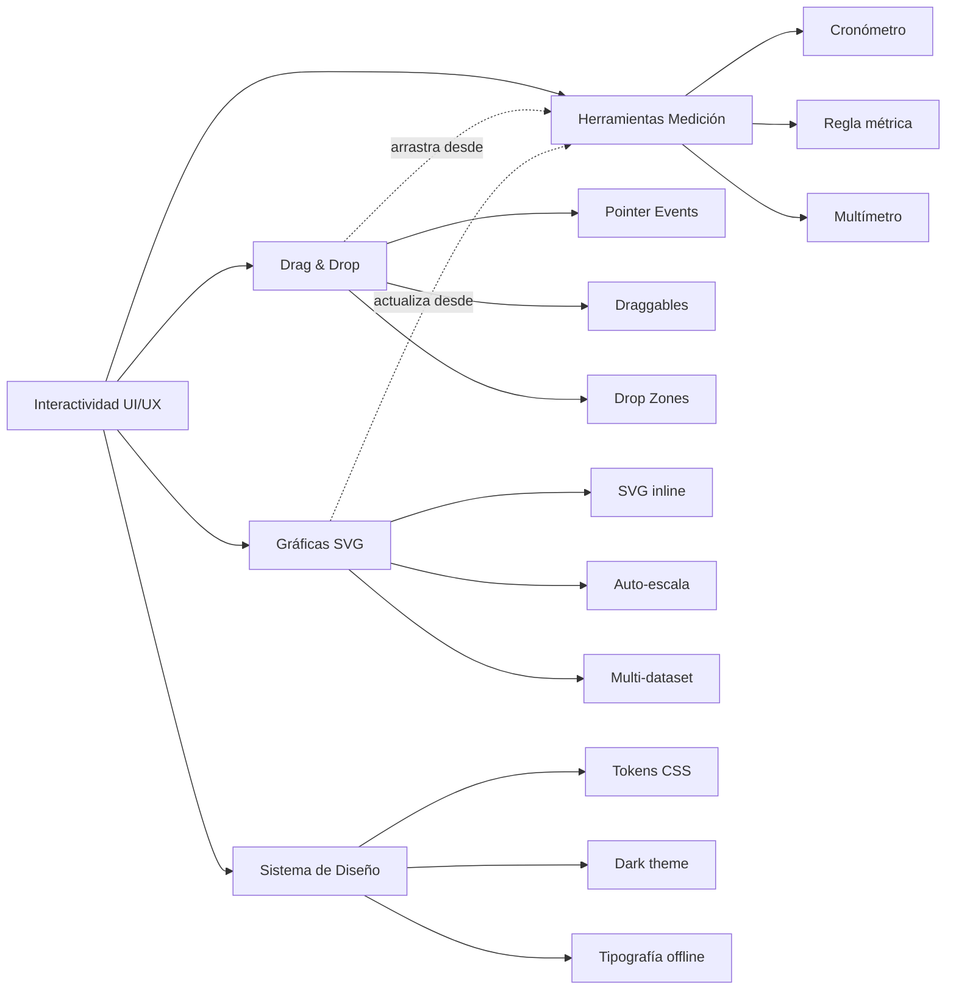

# SKILL 05 — INTERACTIVIDAD UI/UX

## Información General

| Campo | Valor |
|-------|-------|
| **Módulo** | Infraestructura — Sistema de Interactividad y Diseño Visual |
| **Código** | `UIU` |
| **Prerrequisitos del alumno** | DOM y eventos en JavaScript, Canvas API, CSS básico, haber revisado Skills 01-04 (consumidores de esta infraestructura) |
| **Tiempo estimado** | 3-5 sesiones de 45 minutos |
| **Archivos de implementación** | `js/ui/dragdrop.js`, `measurement-tools.js`, `graph.js`, `css/design-system.css` |

## Objetivos de Aprendizaje

Al finalizar este módulo, el alumno será capaz de:

1. Implementar un sistema de Drag & Drop sin librerías usando Pointer Events nativos.
2. Construir herramientas de medición virtual (cronómetro, regla, multímetro) reutilizables en cualquier simulación.
3. Crear gráficas dinámicas eficientes con SVG inline, con auto-escalado y múltiples datasets.
4. Definir un sistema de diseño visual basado en CSS Custom Properties (dark theme con acentos neón).
5. Aplicar el patrón de "objeto arrastrable + zona de destino con tipos aceptados".
6. Justificar las decisiones de diseño (fatiga visual, soporte offline, accesibilidad táctil).

## Mapa Conceptual



---

## COMPONENTE UIU-01: Sistema Drag & Drop

### Descripción

El sistema de Drag & Drop es el núcleo de la interacción del simulador: permite a los alumnos **armar experimentos** arrastrando componentes (baterías, resistencias, lentes, pesas) desde una paleta hacia un canvas de trabajo. Está construido sobre **Pointer Events nativos** (no Mouse Events), por lo que funciona idéntico en mouse, táctil y lápiz digital, sin necesidad de librerías externas.

Contextos de uso típicos:
- **Circuitos (Skill 03):** arrastrar baterías, resistencias y cables desde una paleta hacia el canvas del circuito.
- **Óptica (Skill 04):** arrastrar lentes, espejos y fuentes de luz a un banco óptico virtual.
- **Dinámica (Skill 02):** arrastrar pesas sobre un bloque para cambiar su masa; arrastrar el vector fuerza para cambiar dirección/magnitud.

### API y Configuración

| Variable | Símbolo | Tipo | Default | Descripción |
|----------|---------|------|---------|-------------|
| Canvas | `canvas` | HTMLCanvasElement | — | Canvas receptor del input |
| Objetos arrastrables | `draggables[]` | Array | `[]` | `{ id, x, y, width, height, type, data, render(ctx) }` |
| Zonas de destino | `dropZones[]` | Array | `[]` | `{ id, x, y, width, height, accepts: [tipos], onDrop(obj) }` |
| Arrastre activo | `activeDrag` | Object\|null | `null` | Objeto siendo arrastrado |
| Offset | `offsetX/Y` | number | 0 | Diferencia entre puntero y esquina superior izquierda del objeto |
| Touch action | `touchAction` | CSS | `'none'` | Previene scroll durante arrastre en táctil |

**Validación**: un objeto solo se soltará en una zona si su `type` está en `zone.accepts`; en caso contrario vuelve a su posición original.

### Eventos nativos utilizados

```
canvas.addEventListener('pointerdown', onPointerDown);
canvas.addEventListener('pointermove', onPointerMove);
canvas.addEventListener('pointerup',   onPointerUp);
canvas.style.touchAction = 'none';   // Prevenir scroll en touch
```

> **Nota**: Pointer Events unifican mouse, táctil y lápiz. `setPointerCapture(pointerId)` asegura que el canvas siga recibiendo `pointermove` aunque el dedo salga del área.

### Implementación JavaScript

```javascript
// ============================================
// SISTEMA DRAG & DROP LIVIANO
// Archivo: js/ui/dragdrop.js
// ============================================
//
// Sin librerías. Eventos nativos: pointerdown, pointermove, pointerup.
// Usa Pointer Events (no Mouse Events) para soporte táctil nativo.

export class DragDropManager {
    /**
     * @param {HTMLCanvasElement} canvas
     */
    constructor(canvas) {
        this.canvas = canvas;
        this.ctx = canvas.getContext('2d');
        this.draggables = [];      // Objetos arrastrables
        this.dropZones = [];       // Zonas de destino
        this.activeDrag = null;    // Objeto siendo arrastrado
        this.offsetX = 0;
        this.offsetY = 0;
        this.highlightedZone = null;

        // Pointer Events (touch + mouse unificados)
        canvas.addEventListener('pointerdown', (e) => this.onPointerDown(e));
        canvas.addEventListener('pointermove', (e) => this.onPointerMove(e));
        canvas.addEventListener('pointerup',   (e) => this.onPointerUp(e));
        canvas.style.touchAction = 'none'; // Prevenir scroll en touch
    }

    /**
     * Registra un objeto arrastrable.
     * @param {{id, x, y, width, height, type, data, render(ctx)}} obj
     */
    addDraggable(obj) {
        this.draggables.push(obj);
    }

    /**
     * Registra una zona de destino.
     * @param {{id, x, y, width, height, accepts: string[], onDrop(obj)}} zone
     */
    addDropZone(zone) {
        this.dropZones.push(zone);
    }

    onPointerDown(e) {
        const rect = this.canvas.getBoundingClientRect();
        const mx = e.clientX - rect.left;
        const my = e.clientY - rect.top;

        // Buscar en orden inverso (último dibujado = encima)
        for (let i = this.draggables.length - 1; i >= 0; i--) {
            const obj = this.draggables[i];
            if (this.hitTest(mx, my, obj)) {
                this.activeDrag = obj;
                this.offsetX = mx - obj.x;
                this.offsetY = my - obj.y;
                this.canvas.setPointerCapture(e.pointerId);
                break;
            }
        }
    }

    onPointerMove(e) {
        if (!this.activeDrag) return;
        const rect = this.canvas.getBoundingClientRect();
        this.activeDrag.x = e.clientX - rect.left - this.offsetX;
        this.activeDrag.y = e.clientY - rect.top - this.offsetY;

        // Highlight de la zona de destino más cercana
        this.highlightedZone = this.findDropZone(this.activeDrag);
    }

    onPointerUp(e) {
        if (!this.activeDrag) return;

        const zone = this.findDropZone(this.activeDrag);
        if (zone && zone.accepts.includes(this.activeDrag.type)) {
            // Snap al centro de la zona
            this.activeDrag.x = zone.x + (zone.width - this.activeDrag.width) / 2;
            this.activeDrag.y = zone.y + (zone.height - this.activeDrag.height) / 2;
            zone.onDrop(this.activeDrag);
        }

        this.activeDrag = null;
        this.highlightedZone = null;
    }

    /**
     * Comprueba si el punto (mx, my) está dentro del objeto.
     */
    hitTest(mx, my, obj) {
        return mx >= obj.x && mx <= obj.x + obj.width &&
               my >= obj.y && my <= obj.y + obj.height;
    }

    /**
     * Devuelve la zona cuyo centro contiene el centro del objeto arrastrado.
     */
    findDropZone(obj) {
        const cx = obj.x + obj.width / 2;
        const cy = obj.y + obj.height / 2;
        return this.dropZones.find(z =>
            cx >= z.x && cx <= z.x + z.width &&
            cy >= z.y && cy <= z.y + z.height
        );
    }
}
```

### Retos Pedagógicos — Drag & Drop

```json
[
  {
    "id": "uiu-01-dd",
    "type": "multiple_choice",
    "difficulty": 1,
    "question": "¿Qué familia de eventos nativos se usa en el DragDropManager?",
    "options": [
      "Pointer Events (pointerdown, pointermove, pointerup)",
      "Mouse Events (mousedown, mousemove, mouseup)",
      "Touch Events (touchstart, touchmove, touchend)",
      "Drag Events (dragstart, drag, dragend)"
    ],
    "correctAnswer": 0,
    "hint": "Se eligió una familia que unifica mouse, táctil y lápiz.",
    "feedbackCorrect": "¡Correcto! Pointer Events abstrae los tres tipos de input.",
    "feedbackIncorrect": "Busca la familia que cubre mouse, táctil y lápiz digital a la vez.",
    "explanation": "Mouse Events solo funcionan con ratón; Touch Events solo con dedo. Pointer Events cubre los tres."
  },
  {
    "id": "uiu-02-dd",
    "type": "multiple_choice",
    "difficulty": 1,
    "question": "¿Para qué sirve `canvas.style.touchAction = 'none'`?",
    "options": [
      "Evitar que el navegador haga scroll al arrastrar en táctil",
      "Acelerar el canvas",
      "Cambiar el color del canvas",
      "Bloquear el teclado"
    ],
    "correctAnswer": 0,
    "hint": "En móvil, arrastrar el dedo normalmente desplaza la página.",
    "feedbackCorrect": "¡Sí! Sin esto, el navegador interpretaría el arrastre como scroll.",
    "feedbackIncorrect": "Piensa en qué hace el navegador con un gesto táctil por defecto.",
    "explanation": "touchAction: none desactiva los gestos nativos y deja que JavaScript maneje el evento."
  },
  {
    "id": "uiu-03-dd",
    "type": "multiple_choice",
    "difficulty": 2,
    "question": "Al recorrer los draggables en `onPointerDown`, ¿por qué se itera en orden inverso?",
    "options": [
      "Para que el objeto dibujado encima (último) reciba primero el clic",
      "Para ahorrar memoria",
      "Para evitar conflictos con drop zones",
      "Por exigencia del DOM"
    ],
    "correctAnswer": 0,
    "hint": "El orden de dibujado determina el orden visual.",
    "feedbackCorrect": "¡Exacto! El último dibujado está encima y debe recibir el clic primero.",
    "feedbackIncorrect": "Considera cómo se 'apilan' los objetos dibujados uno tras otro.",
    "explanation": "Recorrer del último al primero replica el orden visual: el de arriba gana."
  },
  {
    "id": "uiu-04-dd",
    "type": "multiple_choice",
    "difficulty": 2,
    "question": "¿Qué propiedad del objeto comprueba `zone.accepts.includes(obj.type)`?",
    "options": [
      "Si la zona admite objetos de ese tipo",
      "Si el objeto está activo",
      "Si el objeto tiene hijos",
      "Si la zona está oculta"
    ],
    "correctAnswer": 0,
    "hint": "Cada zona declara qué tipos de objetos puede recibir.",
    "feedbackCorrect": "¡Sí! Un resistor solo cae en zonas que aceptan 'resistor'.",
    "feedbackIncorrect": "Revisa la definición de dropZone: tiene un array `accepts`.",
    "explanation": "Esto permite restringir semánticamente dónde puede caer cada componente."
  },
  {
    "id": "uiu-05-dd",
    "type": "experiment",
    "difficulty": 3,
    "question": "Implementa una paleta con un componente tipo 'battery' y un canvas receptor. Verifica que al soltar la batería fuera de la zona, vuelve a su posición original. ¿Qué parte del código lo garantiza?",
    "correctAnswer": null,
    "tolerance": 0.1,
    "unit": "",
    "hint": "Revisa `onPointerUp`: si no hay zona válida, no se aplica snap ni onDrop.",
    "feedbackCorrect": "¡Perfecto! Si findDropZone devuelve null o el tipo no coincide, el objeto conserva su x/y anterior.",
    "feedbackIncorrect": "El secreto está en que solo se actualiza x/y si hay zona válida.",
    "explanation": "La regla 'sin snap = sin modificación' es un patrón UX crucial: el usuario siempre percibe el resultado."
  },
  {
    "id": "uiu-06-dd",
    "type": "experiment",
    "difficulty": 3,
    "question": "Agrega un segundo tipo de componente 'led' y una zona que acepte solo 'resistor'. Verifica que soltar un LED en esa zona NO dispare onDrop. ¿Qué ocurrirá?",
    "correctAnswer": null,
    "tolerance": 0.1,
    "unit": "",
    "hint": "El LED no está en zone.accepts.",
    "feedbackCorrect": "¡Excelente! La validación de tipos evita colocar un LED donde no corresponde.",
    "feedbackIncorrect": "Revisa la condición `zone.accepts.includes(this.activeDrag.type)`.",
    "explanation": "Esta validación de tipos es lo que distingue un 'cualquier destino' de un 'destino semánticamente correcto'."
  }
]
```

---

## COMPONENTE UIU-02: Herramientas de Medición Virtual

### Descripción

Tres instrumentos virtuales reutilizables en cualquier simulación: un **cronómetro** digital, una **regla métrica** pixel-métrica adaptable y un **multímetro** para circuitos (voltímetro/amperímetro/ohmímetro). Cada herramienta es una clase independiente con un método `render(ctx, x, y)` que la dibuja donde se indique.

### API y Configuración

| Herramienta | Clase | Modos / Parámetros | Salida visual |
|-------------|-------|---------------------|---------------|
| Cronómetro | `Cronometro` | `start/stop/reset/lap`, formato `MM:SS.cc` | Display `#00ff88` estilo LCD |
| Regla métrica | `ReglaMetrica` | `pixelsPerMeter` (default 100), `pixelToMeters/metersToPixel` | Ticks mayores/menores adaptativos |
| Multímetro | `MultimetroVirtual` | `mode` ∈ {voltimeter, ammeter, ohmmeter} | Pantalla LCD 140×70 con unidad V/A/Ω |

**Validación**: el cronómetro usa `performance.now()` para precisión de milisegundos; la regla calcula su `step` automáticamente según el rango visible.

### Implementación JavaScript

```javascript
// ============================================
// HERRAMIENTAS DE MEDICIÓN VIRTUAL
// Archivo: js/ui/measurement-tools.js
// ============================================

/**
 * CRONÓMETRO virtual.
 * Cuenta tiempo con precisión de centésimas de segundo.
 */
export class Cronometro {
    constructor() {
        this.startTime = 0;
        this.elapsed = 0;
        this.running = false;
        this.laps = [];
    }

    start() { this.startTime = performance.now() - this.elapsed; this.running = true; }
    stop()  { this.elapsed = performance.now() - this.startTime; this.running = false; }
    reset() { this.elapsed = 0; this.running = false; this.laps = []; }
    lap()   { if (this.running) this.laps.push(this.getTime()); }

    getTime() {
        if (this.running) this.elapsed = performance.now() - this.startTime;
        return this.elapsed / 1000; // segundos
    }

    /**
     * Dibuja el cronómetro en el canvas.
     * @param {CanvasRenderingContext2D} ctx
     * @param {number} x - Esquina superior izquierda
     * @param {number} y - Esquina superior izquierda
     */
    render(ctx, x, y) {
        const t = this.getTime();
        const min = Math.floor(t / 60);
        const sec = Math.floor(t % 60);
        const ms = Math.floor((t % 1) * 100);

        ctx.fillStyle = '#1a1a2e';
        ctx.fillRect(x, y, 140, 40);
        ctx.strokeStyle = '#00ff88';
        ctx.lineWidth = 1;
        ctx.strokeRect(x, y, 140, 40);

        ctx.font = 'bold 20px "Courier New", monospace';
        ctx.fillStyle = '#00ff88';
        ctx.fillText(
            `${String(min).padStart(2, '0')}:${String(sec).padStart(2, '0')}.${String(ms).padStart(2, '0')}`,
            x + 10, y + 27
        );
    }
}

/**
 * REGLA PIXEL-MÉTRICA.
 * Convierte entre píxeles y metros con escala configurable.
 */
export class ReglaMetrica {
    constructor(pixelsPerMeter = 100) {
        this.ppm = pixelsPerMeter;  // Escala: 100 px = 1 metro
        this.visible = true;
    }

    setScale(pixelsPerMeter) { this.ppm = pixelsPerMeter; }

    pixelToMeters(px) { return px / this.ppm; }
    metersToPixel(m)  { return m * this.ppm; }

    /**
     * Dibuja la regla sobre el canvas.
     * @param {CanvasRenderingContext2D} ctx
     * @param {number} x - Inicio
     * @param {number} y - Altura de la línea base
     * @param {number} lengthPx - Largo visible en píxeles
     * @param {'horizontal'|'vertical'} orientation
     */
    render(ctx, x, y, lengthPx, orientation = 'horizontal') {
        const totalMeters = this.pixelToMeters(lengthPx);
        const step = this.calculateStep(totalMeters);

        ctx.strokeStyle = '#ffffff';
        ctx.fillStyle = '#cccccc';
        ctx.lineWidth = 1;
        ctx.font = '10px sans-serif';

        if (orientation === 'horizontal') {
            ctx.beginPath();
            ctx.moveTo(x, y);
            ctx.lineTo(x + lengthPx, y);
            ctx.stroke();

            for (let m = 0; m <= totalMeters; m += step) {
                const px = x + this.metersToPixel(m);
                const isMajor = Math.abs(m % (step * 5)) < 0.001;
                ctx.beginPath();
                ctx.moveTo(px, y);
                ctx.lineTo(px, y - (isMajor ? 12 : 6));
                ctx.stroke();
                if (isMajor) ctx.fillText(`${m.toFixed(1)}m`, px - 10, y - 14);
            }
        } else {
            // Similar para orientación vertical
            ctx.beginPath();
            ctx.moveTo(x, y);
            ctx.lineTo(x, y + lengthPx);
            ctx.stroke();

            for (let m = 0; m <= totalMeters; m += step) {
                const px = y + this.metersToPixel(m);
                const isMajor = Math.abs(m % (step * 5)) < 0.001;
                ctx.beginPath();
                ctx.moveTo(x, px);
                ctx.lineTo(x - (isMajor ? 12 : 6), px);
                ctx.stroke();
                if (isMajor) ctx.fillText(`${m.toFixed(1)}m`, x - 40, px + 3);
            }
        }
    }

    /**
     * Calcula el paso entre marcas para que siempre haya
     * un número manejable de ticks visibles.
     */
    calculateStep(totalMeters) {
        if (totalMeters <= 1)  return 0.1;
        if (totalMeters <= 10) return 0.5;
        if (totalMeters <= 50) return 2;
        return 5;
    }
}

/**
 * MULTÍMETRO VIRTUAL (para circuitos).
 * Modos: voltímetro (V), amperímetro (A), óhmetro (Ω).
 */
export class MultimetroVirtual {
    constructor() {
        this.mode = 'voltmeter';   // 'voltmeter' | 'ammeter' | 'ohmmeter'
        this.reading = 0;
        this.unit = 'V';
        this.connectedNodes = [];
    }

    /**
     * Cambia el modo de medición.
     * @param {'voltimeter'|'ammeter'|'ohmmeter'} mode
     */
    setMode(mode) {
        this.mode = mode;
        this.unit = { voltmeter: 'V', ammeter: 'A', ohmmeter: 'Ω' }[mode];
    }

    /**
     * Mide entre dos nodos del circuito.
     * @param {CircuitNode} nodeA
     * @param {CircuitNode} nodeB
     * @param {Object} circuit - Referencia al circuito analizado
     */
    measure(nodeA, nodeB, circuit) {
        switch (this.mode) {
            case 'voltmeter':
                this.reading = Math.abs(nodeA.voltage - nodeB.voltage);
                break;
            case 'ammeter':
                this.reading = circuit.getCurrentBetween(nodeA, nodeB);
                break;
            case 'ohmmeter':
                this.reading = circuit.getResistanceBetween(nodeA, nodeB);
                break;
        }
    }

    /**
     * Dibuja el multímetro en el canvas como una pantalla LCD.
     */
    render(ctx, x, y) {
        ctx.fillStyle = '#1a1a2e';
        ctx.fillRect(x, y, 140, 70);
        ctx.strokeStyle = '#00ff88';
        ctx.lineWidth = 1;
        ctx.strokeRect(x, y, 140, 70);

        ctx.font = 'bold 28px "Courier New"';
        ctx.fillStyle = '#00ff88';
        ctx.fillText(`${this.reading.toFixed(3)}`, x + 10, y + 38);

        ctx.font = '16px sans-serif';
        ctx.fillText(this.unit, x + 110, y + 38);

        ctx.font = '10px sans-serif';
        ctx.fillStyle = '#888';
        ctx.fillText(this.mode.toUpperCase(), x + 10, y + 60);
    }
}
```

### Retos Pedagógicos — Herramientas de Medición

```json
[
  {
    "id": "uiu-01-tm",
    "type": "multiple_choice",
    "difficulty": 1,
    "question": "¿Qué función nativa usa el Cronometro para medir tiempo con precisión?",
    "options": [
      "performance.now()",
      "Date.now()",
      "setTimeout",
      "requestAnimationFrame"
    ],
    "correctAnswer": 0,
    "hint": "Buscamos precisión sub-milisegundo.",
    "feedbackCorrect": "¡Correcto! performance.now() ofrece precisión de microsegundos.",
    "feedbackIncorrect": "Date.now() solo da milisegundos enteros; setTimeout es impreciso.",
    "explanation": "performance.now() es la API estándar para medir tiempo en animaciones."
  },
  {
    "id": "uiu-02-tm",
    "type": "multiple_choice",
    "difficulty": 2,
    "question": "La regla métrica ajusta automáticamente su `step`. Si el rango visible es 25 metros, ¿qué step usa?",
    "options": [
      "2 metros",
      "0.1 metros",
      "0.5 metros",
      "5 metros"
    ],
    "correctAnswer": 0,
    "hint": "Revisa calculateStep: si totalMeters está entre 10 y 50, step = 2.",
    "feedbackCorrect": "¡Exacto! Para 25 m usa step = 2 m, con marcas mayores cada 10 m.",
    "feedbackIncorrect": "Consulta la función calculateStep para el rango 10–50.",
    "explanation": "El paso adaptativo evita tener demasiados (o muy pocos) ticks en pantalla."
  },
  {
    "id": "uiu-03-tm",
    "type": "multiple_choice",
    "difficulty": 1,
    "question": "El multímetro tiene tres modos. ¿Cuál mide RESISTENCIA entre dos nodos?",
    "options": [
      "ohmmeter",
      "voltimeter",
      "ammeter",
      "nanometer"
    ],
    "correctAnswer": 0,
    "hint": "El prefijo 'ohm' se refiere a resistencia.",
    "feedbackCorrect": "¡Sí! El ohmmeter reporta en Ω.",
    "feedbackIncorrect": "Voltímetro mide V, amperímetro mide A; el ohmmetro mide Ω.",
    "explanation": "Los tres modos comparten la misma pantalla LCD pero llaman a métodos distintos del circuito."
  },
  {
    "id": "uiu-04-tm",
    "type": "numeric",
    "difficulty": 2,
    "question": "Si una regla tiene 100 px por metro, ¿cuántos píxeles ocupa una longitud de 2.5 m?",
    "correctAnswer": 250,
    "tolerance": 0.05,
    "unit": "px",
    "hint": "pixelsPerMeter × metros.",
    "feedbackCorrect": "¡Correcto! 100 × 2.5 = 250 px.",
    "feedbackIncorrect": "Multiplica metros por pixelsPerMeter.",
    "explanation": "La escala pixelsPerMeter es lo que permite mezclar unidades físicas y de pantalla."
  },
  {
    "id": "uiu-05-tm",
    "type": "experiment",
    "difficulty": 3,
    "question": "Conecta el multímetro en modo amperímetro entre dos nodos de un circuito con 0.5 A. Verifica la lectura en pantalla. ¿Es coherente?",
    "correctAnswer": 0.5,
    "tolerance": 0.05,
    "unit": "A",
    "hint": "El amperímetro llama a circuit.getCurrentBetween(nodeA, nodeB).",
    "feedbackCorrect": "¡Perfecto! La pantalla LCD muestra 0.500 A.",
    "feedbackIncorrect": "Asegúrate de que el circuito ya fue analizado (corrientes calculadas).",
    "explanation": "El multímetro es una capa visual fina sobre los cálculos del solver (Skill 03)."
  },
  {
    "id": "uiu-06-tm",
    "type": "experiment",
    "difficulty": 3,
    "question": "Usa el cronómetro para medir el tiempo que tarda un objeto en caer 20 m en la simulación de caída libre. Compara con el valor teórico t = √(2h/g). ¿Cuánto debería dar?",
    "correctAnswer": 2.02,
    "tolerance": 0.1,
    "unit": "s",
    "hint": "t = √(2·20/9.81).",
    "feedbackCorrect": "¡Excelente! t ≈ 2.02 s, coincide con la teoría.",
    "feedbackIncorrect": "Calcula t = √(2h/g) con h=20 y g=9.81.",
    "explanation": "El cronómetro permite verificar experimentalmente los modelos físicos (Skill 01)."
  }
]
```

---

## COMPONENTE UIU-03: Gráficas Dinámicas SVG

### Descripción

Las gráficas se construyen con **SVG embebido generado por JavaScript**, en lugar de Canvas. Razón: el SVG es más ligero que el Canvas para gráficas semi-estáticas (que cambian pocos puntos por segundo), es escalable sin perder nitidez y permite interactividad futura (tooltips nativos del DOM).

### API y Configuración

| Variable | Default | Descripción |
|----------|---------|-------------|
| `width × height` | `400 × 250` | Dimensiones del SVG |
| `padding` | `{top:20, right:20, bottom:40, left:50}` | Márgenes internos |
| `maxPoints` | `500` | Máximo de puntos por dataset (ring buffer) |
| `xlabel` | `'t (s)'` | Etiqueta eje X |
| `ylabel` | `'x (m)'` | Etiqueta eje Y |
| `datasets[]` | `[]` | Múltiples series `{id, label, color, points[]}` |

**Validación**: cuando un dataset supera `maxPoints`, se elimina el punto más viejo (patrón ring buffer vía `shift()`).

### Decisiones de diseño

> **Nota**: las gráficas SVG se redibujan **solo cuando cambian los datos**, no cada frame. Para animaciones a 60 FPS se recomienda el throttle descrito en Skill 07 (máximo 10 actualizaciones/segundo).

### Implementación JavaScript

```javascript
// ============================================
// GRÁFICAS DINÁMICAS EN SVG EMBEBIDO
// Archivo: js/ui/graph.js
// ============================================
//
// SVG es más ligero que Canvas para gráficas estáticas/semi-estáticas.
// Se actualiza solo cuando los datos cambian (no cada frame).

const SVG_NS = 'http://www.w3.org/2000/svg';

export class GraficaDinamica {
    /**
     * @param {string} containerId - ID del div contenedor
     * @param {Object} config - { width, height, xlabel, ylabel, title }
     */
    constructor(containerId, config) {
        this.container = document.getElementById(containerId);
        this.width = config.width || 400;
        this.height = config.height || 250;
        this.padding = { top: 20, right: 20, bottom: 40, left: 50 };
        this.plotW = this.width - this.padding.left - this.padding.right;
        this.plotH = this.height - this.padding.top - this.padding.bottom;
        this.datasets = [];          // Múltiples líneas
        this.maxPoints = 500;        // Limitar puntos para rendimiento
        this.xlabel = config.xlabel || 't (s)';
        this.ylabel = config.ylabel || 'x (m)';
        this.title = config.title || '';

        this.createSVG();
    }

    createSVG() {
        this.svg = document.createElementNS(SVG_NS, 'svg');
        this.svg.setAttribute('viewBox', `0 0 ${this.width} ${this.height}`);
        this.svg.setAttribute('width', '100%');
        this.svg.style.maxWidth = this.width + 'px';
        this.container.appendChild(this.svg);
    }

    /**
     * Registra un nuevo dataset (línea).
     * @param {string} id
     * @param {string} label - Etiqueta para leyenda
     * @param {string} color - Color de trazo
     */
    addDataset(id, label, color) {
        this.datasets.push({ id, label, color, points: [] });
    }

    /**
     * Agrega un punto al dataset indicado.
     * Ring buffer: si supera maxPoints, elimina el más viejo.
     */
    addPoint(datasetId, x, y) {
        const ds = this.datasets.find(d => d.id === datasetId);
        if (!ds) return;
        ds.points.push({ x, y });
        if (ds.points.length > this.maxPoints) ds.points.shift();
    }

    clear(datasetId) {
        const ds = this.datasets.find(d => d.id === datasetId);
        if (ds) ds.points = [];
    }

    /**
     * Redibuja el SVG completo con auto-escalado.
     */
    render() {
        let xMin = Infinity, xMax = -Infinity, yMin = Infinity, yMax = -Infinity;
        for (const ds of this.datasets) {
            for (const p of ds.points) {
                xMin = Math.min(xMin, p.x); xMax = Math.max(xMax, p.x);
                yMin = Math.min(yMin, p.y); yMax = Math.max(yMax, p.y);
            }
        }
        if (xMin === xMax) xMax = xMin + 1;
        if (yMin === yMax) yMax = yMin + 1;

        this.svg.innerHTML = this.buildSVGContent(xMin, xMax, yMin, yMax);
    }

    buildSVGContent(xMin, xMax, yMin, yMax) {
        const scaleX = (v) => this.padding.left + ((v - xMin) / (xMax - xMin)) * this.plotW;
        const scaleY = (v) => this.padding.top + this.plotH - ((v - yMin) / (yMax - yMin)) * this.plotH;

        let svg = '';
        svg += `<rect width="${this.width}" height="${this.height}" fill="#0a0a1a" rx="8"/>`;

        // Ejes
        svg += `<line x1="${this.padding.left}" y1="${this.padding.top + this.plotH}"
                 x2="${this.padding.left + this.plotW}" y2="${this.padding.top + this.plotH}"
                 stroke="#444" stroke-width="1"/>`;
        svg += `<line x1="${this.padding.left}" y1="${this.padding.top}"
                 x2="${this.padding.left}" y2="${this.padding.top + this.plotH}"
                 stroke="#444" stroke-width="1"/>`;

        // Etiquetas
        svg += `<text x="${this.width / 2}" y="${this.height - 5}" fill="#888"
                 font-size="12" text-anchor="middle">${this.xlabel}</text>`;
        svg += `<text x="15" y="${this.height / 2}" fill="#888" font-size="12"
                 text-anchor="middle" transform="rotate(-90, 15, ${this.height / 2})">${this.ylabel}</text>`;

        // Título
        if (this.title) {
            svg += `<text x="${this.width / 2}" y="14" fill="#e8e8f0"
                     font-size="13" text-anchor="middle" font-weight="bold">${this.title}</text>`;
        }

        // Líneas de datos
        for (const ds of this.datasets) {
            if (ds.points.length < 2) continue;
            const pathD = ds.points.map((p, i) =>
                `${i === 0 ? 'M' : 'L'} ${scaleX(p.x).toFixed(1)} ${scaleY(p.y).toFixed(1)}`
            ).join(' ');
            svg += `<path d="${pathD}" fill="none" stroke="${ds.color}" stroke-width="2"/>`;
        }

        return svg;
    }
}
```

### Retos Pedagógicos — Gráficas SVG

```json
[
  {
    "id": "uiu-01-gr",
    "type": "multiple_choice",
    "difficulty": 1,
    "question": "¿Por qué se eligió SVG en lugar de Canvas para las gráficas?",
    "options": [
      "SVG es más ligero para gráficas semi-estáticas y es escalable",
      "Canvas no soporta 2D",
      "SVG es más rápido para 60 FPS",
      "Canvas no funciona offline"
    ],
    "correctAnswer": 0,
    "hint": "Las gráficas cambian pocos puntos por segundo.",
    "feedbackCorrect": "¡Correcto! SVG redibuja solo cuando hay cambios nuevos.",
    "feedbackIncorrect": "Canvas es mejor para animación continua; SVG para datos semi-estáticos.",
    "explanation": "El SVG embebido evita redibujar miles de píxeles cada frame cuando no hay cambios."
  },
  {
    "id": "uiu-02-gr",
    "type": "multiple_choice",
    "difficulty": 2,
    "question": "¿Qué patrón se aplica cuando un dataset supera maxPoints?",
    "options": [
      "Ring buffer: se elimina el punto más viejo con shift()",
      "Se duplica el array",
      "Se ignora el nuevo punto",
      "Se divide por dos"
    ],
    "correctAnswer": 0,
    "hint": "Se mantiene el tamaño fijo.",
    "feedbackCorrect": "¡Exacto! El patrón ring buffer mantiene la memoria acotada.",
    "feedbackIncorrect": "Busca una estrategia que mantenga el tamaño fijo.",
    "explanation": "Esto evita que una simulación larga consuma memoria infinita."
  },
  {
    "id": "uiu-03-gr",
    "type": "numeric",
    "difficulty": 1,
    "question": "Con un padding de {left:50, right:20} y ancho 400, ¿cuál es el ancho útil de la gráfica?",
    "correctAnswer": 330,
    "tolerance": 0.05,
    "unit": "px",
    "hint": "plotW = width - left - right.",
    "feedbackCorrect": "¡Correcto! 400 - 50 - 20 = 330 px.",
    "feedbackIncorrect": "Resta los paddings laterales al ancho total.",
    "explanation": "El padding reserva espacio para etiquetas de ejes."
  },
  {
    "id": "uiu-04-gr",
    "type": "multiple_choice",
    "difficulty": 2,
    "question": "¿Cómo se comporta el auto-escalado cuando todos los puntos tienen el mismo valor Y?",
    "options": [
      " Fuerza yMax = yMin + 1 para evitar división por cero",
      "Muestra error",
      "Ignora el dataset",
      "Deja la gráfica en blanco"
    ],
    "correctAnswer": 0,
    "hint": "Piensa en evitar división por cero en scaleY.",
    "feedbackCorrect": "¡Sí! yMax = yMin + 1 evita NaN.",
    "feedbackIncorrect": "El código debe contemplar este caso degenerado.",
    "explanation": "Sin esta protección, la fórmula (v - yMin) / (yMax - yMin) daría NaN."
  },
  {
    "id": "uiu-05-gr",
    "type": "experiment",
    "difficulty": 3,
    "question": "Conecta una gráfica dinámica al módulo MRU (Skill 01) y agrega puntos cada 3 frames. ¿Se ve la línea recta esperada en x vs t?",
    "correctAnswer": null,
    "tolerance": 0.1,
    "unit": "",
    "hint": "x(t) = x₀ + v₀·t es una recta.",
    "feedbackCorrect": "¡Perfecto! La pendiente visual iguala v₀.",
    "feedbackIncorrect": "Asegúrate de llamar a render() tras agregar puntos.",
    "explanation": "Esta es la integración típica entre un módulo físico y la capa visual."
  },
  {
    "id": "uiu-06-gr",
    "type": "experiment",
    "difficulty": 3,
    "question": "Crea una gráfica con dos datasets (posición y velocidad) del MRUV. ¿Las dos líneas tienen la forma esperada?",
    "correctAnswer": null,
    "tolerance": 0.1,
    "unit": "",
    "hint": "Posición → parábola; velocidad → recta con pendiente = a.",
    "feedbackCorrect": "¡Excelente! Visualizar dos variables juntas refuerza la comprensión.",
    "feedbackIncorrect": "Recuerda: el segundo dataset se agrega con addDataset() antes de addPoint().",
    "explanation": "Comparar curvas en un mismo gráfico es una técnica pedagógica clave."
  }
]
```

---

## COMPONENTE UIU-04: Sistema de Diseño Visual CSS

### Descripción

El sistema de diseño define una **paleta oscura con acentos neón**, inspirada en los instrumentos de laboratorio modernos. Se construye enteramente con **CSS Custom Properties** (variables CSS), sin preprocesadores ni librerías externas. La justificación pedagógica: el dark theme reduce la fatiga visual en sesiones largas y consume menos energía en pantallas OLED/LCD de los equipos modestos del entorno escolar.

### Tokens de Diseño

| Categoría | Token | Valor | Uso |
|-----------|-------|-------|-----|
| Fondo primario | `--bg-primary` | `#0a0a1a` | Fondo de la app |
| Fondo secundario | `--bg-secondary` | `#12122a` | Paneles |
| Fondo panel | `--bg-panel` | `#1a1a3e` | Sidebars |
| Fondo tarjeta | `--bg-card` | `#222250` | Tarjetas de contenido |
| Texto primario | `--text-primary` | `#e8e8f0` | Texto principal |
| Texto secundario | `--text-secondary` | `#8888aa` | Etiquetas |
| Texto apagado | `--text-muted` | `#555577` | Placeholders |
| Acento cian | `--accent-cyan` | `#00e5ff` | Acciones principales |
| Acento verde | `--accent-green` | `#00ff88` | Confirmaciones, displays LCD |
| Acento naranja | `--accent-orange` | `#ff8c00` | Advertencias, baterías |
| Acento rojo | `--accent-red` | `#ff4444` | Errores, RTI |
| Acento púrpura | `--accent-purple` | `#aa66ff` | Óptica, lentes |
| Fuente UI | `--font-ui` | `system-ui, -apple-system, 'Segoe UI', sans-serif` | Texto general |
| Fuente mono | `--font-mono` | `'Courier New', Consolas, monospace` | Display numérico |
| Radio | `--border-radius` | `8px` | Esquinas |
| Glow cian | `--glow-cyan` | `0 0 12px rgba(0,229,255,0.3)` | Resaltado activo |
| Glow verde | `--glow-green` | `0 0 12px rgba(0,255,136,0.3)` | Indicadores |

### Implementación CSS

```css
/* ============================================
   SISTEMA DE DISEÑO — FísicaHN
   Archivo: css/design-system.css
   ============================================
   Dark theme para reducir fatiga visual y consumo en LCDs */

:root {
    /* Paleta oscura con acentos neón (inspirada en instrumentos de laboratorio) */
    --bg-primary:    #0a0a1a;
    --bg-secondary:  #12122a;
    --bg-panel:      #1a1a3e;
    --bg-card:       #222250;

    --text-primary:  #e8e8f0;
    --text-secondary:#8888aa;
    --text-muted:    #555577;

    --accent-cyan:   #00e5ff;
    --accent-green:  #00ff88;
    --accent-orange: #ff8c00;
    --accent-red:    #ff4444;
    --accent-purple: #aa66ff;

    /* Tipografía del sistema (sin cargar fuentes externas = offline) */
    --font-ui:       system-ui, -apple-system, 'Segoe UI', sans-serif;
    --font-mono:     'Courier New', Consolas, monospace;
    --font-display:  var(--font-ui);

    /* Espaciado */
    --space-xs: 4px;
    --space-sm: 8px;
    --space-md: 16px;
    --space-lg: 24px;
    --space-xl: 32px;

    /* Bordes y sombras sutiles */
    --border-radius: 8px;
    --border-color:  rgba(255, 255, 255, 0.06);
    --glow-cyan:     0 0 12px rgba(0, 229, 255, 0.3);
    --glow-green:    0 0 12px rgba(0, 255, 136, 0.3);
}

/* Reset mínimo */
*, *::before, *::after { box-sizing: border-box; margin: 0; padding: 0; }
body {
    font-family: var(--font-ui);
    background: var(--bg-primary);
    color: var(--text-primary);
    overflow: hidden;       /* Prevenir scroll accidental */
    height: 100vh;
}

/* Ejemplos de uso */
.button-primary {
    background: var(--accent-cyan);
    color: var(--bg-primary);
    padding: var(--space-sm) var(--space-md);
    border: none;
    border-radius: var(--border-radius);
    cursor: pointer;
}
.button-primary:hover { box-shadow: var(--glow-cyan); }

.panel {
    background: var(--bg-panel);
    border: 1px solid var(--border-color);
    border-radius: var(--border-radius);
    padding: var(--space-md);
}

.value-display {
    font-family: var(--font-mono);
    color: var(--accent-green);
    font-size: 24px;
}
```

### Retos Pedagógicos — Sistema de Diseño

```json
[
  {
    "id": "uiu-01-ds",
    "type": "multiple_choice",
    "difficulty": 1,
    "question": "¿Qué mecanismo CSS se usa para definir los tokens de diseño?",
    "options": [
      "CSS Custom Properties (--variable)",
      "Sass variables",
      "CSS Modules",
      "Atributos data-"
    ],
    "correctAnswer": 0,
    "hint": "Funciona nativamente en todos los navegadores modernos.",
    "feedbackCorrect": "¡Correcto! Custom Properties no requiere build step.",
    "feedbackIncorrect": "Busca la opción 100% nativa de CSS3.",
    "explanation": "Las CSS Custom Properties permiten tematización dinámica sin recompilar."
  },
  {
    "id": "uiu-02-ds",
    "type": "multiple_choice",
    "difficulty": 1,
    "question": "¿Por qué se eligió un dark theme con acentos neón?",
    "options": [
      "Reduce fatiga visual y consumo en LCD/OLED",
      "Es tendencia 2010",
      "Carga más rápido",
      "Es lo único que soporta Canvas"
    ],
    "correctAnswer": 0,
    "hint": "Considera sesiones largas y equipos escolares modestos.",
    "feedbackCorrect": "¡Sí! La justificación es ergonómica y energética.",
    "feedbackIncorrect": "No es estético: hay razones funcionales.",
    "explanation": "El dark theme imita los instrumentos de laboratorio y reduce cansancio visual."
  },
  {
    "id": "uiu-03-ds",
    "type": "multiple_choice",
    "difficulty": 2,
    "question": "¿Por qué se usan `system-ui` y fuentes monoespaciadas del sistema en lugar de cargar fuentes externas?",
    "options": [
      "Para funcionar offline sin cargar archivos adicionales",
      "Porque las fuentes web son ilegales",
      "Porque Canvas no soporta fuentes externas",
      "Para ahorrar memoria de GPU"
    ],
    "correctAnswer": 0,
    "hint": "El simulador debe funcionar vía file:// sin internet.",
    "feedbackCorrect": "¡Exacto! Sin internet, no se pueden descargar fuentes de Google Fonts.",
    "feedbackIncorrect": "Piensa en el caso de uso: distribución por USB sin servidor.",
    "explanation": "Cualquier fuente externa rompería el modo offline 100%."
  },
  {
    "id": "uiu-04-ds",
    "type": "numeric",
    "difficulty": 1,
    "question": "¿Cuál es el valor del radio de borde por defecto (--border-radius)?",
    "correctAnswer": 8,
    "tolerance": 0.05,
    "unit": "px",
    "hint": "Consulta la tabla de tokens.",
    "feedbackCorrect": "¡Correcto! 8 px da esquinas suaves sin exagerar.",
    "feedbackIncorrect": "Revisa la tabla de diseño visual.",
    "explanation": "Un radio pequeño mantiene la estética técnica sin parecer 'juguetón'."
  },
  {
    "id": "uiu-05-ds",
    "type": "experiment",
    "difficulty": 3,
    "question": "Crea un botón con clase 'button-primary' y pásalo por encima con el mouse. ¿Qué efecto visual aparece?",
    "correctAnswer": null,
    "tolerance": 0.1,
    "unit": "",
    "hint": "Revisa el :hover en el CSS.",
    "feedbackCorrect": "¡Perfecto! Aparece un glow cian alrededor del botón.",
    "feedbackIncorrect": "El :hover aplica la sombra --glow-cyan.",
    "explanation": "Los glows sutiles son la firma visual del estilo 'instrumento de laboratorio'."
  },
  {
    "id": "uiu-06-ds",
    "type": "experiment",
    "difficulty": 3,
    "question": "Usa el token --accent-red para resaltar un mensaje de error de circuito abierto. ¿En qué se diferencia visualmente del --accent-cyan?",
    "correctAnswer": null,
    "tolerance": 0.1,
    "unit": "",
    "hint": "Rojo indica error; cian indica acción principal.",
    "feedbackCorrect": "¡Excelente! El rojo capta la atención sobre errores; el cian invita a acción.",
    "feedbackIncorrect": "Cada color tiene un rol semántico asignado.",
    "explanation": "La consistencia semántica de colores acelera la comprensión del usuario."
  }
]
```

---

## Tabla Resumen de Componentes UI/UX

| # | Componente | Archivo | Rol | Consumidores |
|---|------------|---------|-----|--------------|
| 1 | `DragDropManager` | `js/ui/dragdrop.js` | Interacción arrastrar-soltar | Skills 02, 03, 04 |
| 2 | `Cronometro` | `js/ui/measurement-tools.js` | Medir intervalos temporales | Skills 01, 02 |
| 3 | `ReglaMetrica` | `js/ui/measurement-tools.js` | Escala pixel-métrica | Skills 01, 02, 03 |
| 4 | `MultimetroVirtual` | `js/ui/measurement-tools.js` | Medir V/A/Ω en circuitos | Skill 03 |
| 5 | `GraficaDinamica` | `js/ui/graph.js` | Gráficas x-t, v-t, etc. | Skills 01, 02, 03 |
| 6 | Design tokens | `css/design-system.css` | Tematización visual | Todos |

---

## Presets de Escenarios para Docentes

```json
[
  {
    "scenarioId": "lab-drag-circuito-01",
    "title": "Laboratorio: Armar un circuito por drag & drop",
    "author": "Prof. Martínez",
    "subject": "Física III",
    "grade": "11vo",
    "duration": "30 min",
    "description": "Los alumnos usan la paleta de componentes para construir un circuito serie y lo analizan.",
    "module": "electricity/circuit-builder",
    "objectives": [
      "Practicar el arrastre de componentes al grid",
      "Verificar el snap automático",
      "Ejecutar el análisis y leer la corriente"
    ],
    "initialState": {
      "GRID_SIZE": 40,
      "toolsVisible": ["ammeter", "voltmeter"]
    },
    "steps": [
      { "instruction": "Arrastra una batería de 9 V al canvas.", "expectedParams": {} },
      { "instruction": "Añade dos resistencias (100 Ω y 200 Ω) en serie.", "expectedParams": {} },
      { "instruction": "Pulsa 'Analizar' y lee la corriente con el amperímetro.", "expectedParams": {} }
    ],
    "challengeSet": "uiux-retos.json",
    "challengeRange": [0, 3]
  },
  {
    "scenarioId": "lab-medicion-multimetro-02",
    "title": "Laboratorio: Medición con multímetro virtual",
    "author": "Prof. Martínez",
    "subject": "Física III",
    "grade": "11vo",
    "duration": "30 min",
    "description": "Se mide voltaje, corriente y resistencia en distintas configuraciones.",
    "module": "ui/measurement-tools",
    "objectives": [
      "Usar los tres modos del multímetro",
      "Verificar Kirchhoff midiendo caídas de voltaje",
      "Comprender la diferencia entre V, A y Ω"
    ],
    "initialState": {
      "V": 12, "R": [100, 220], "tipo": "serie",
      "toolsVisible": ["voltmeter", "ammeter", "ohmmeter"]
    },
    "steps": [
      { "instruction": "Mide el voltaje total: debe ser ~12 V.", "expectedParams": {} },
      { "instruction": "Mide la corriente: debe ser ~37.5 mA.", "expectedParams": {} },
      { "instruction": "Cambia a óhmetro y mide la resistencia total: ~320 Ω.", "expectedParams": {} }
    ],
    "challengeSet": "uiux-retos.json",
    "challengeRange": [3, 6]
  },
  {
    "scenarioId": "lab-grafica-caida-libre-03",
    "title": "Laboratorio: Graficar la caída libre",
    "author": "Prof. Martínez",
    "subject": "Física I",
    "grade": "10mo",
    "duration": "30 min",
    "description": "Se conecta una gráfica dinámica al módulo de caída libre para visualizar h vs t.",
    "module": "kinematics/free-fall",
    "objectives": [
      "Conectar gráfica SVG con simulación física",
      "Observar la parábola invertida de la altura",
      "Comparar con la gráfica de velocidad"
    ],
    "initialState": {
      "h0": 20, "v0": 0, "g": 9.81,
      "toolsVisible": ["cronometro", "grafica"]
    },
    "steps": [
      { "instruction": "Configura el dataset 'posición' en la gráfica.", "expectedParams": {} },
      { "instruction": "Agrega un segundo dataset 'velocidad'.", "expectedParams": {} },
      { "instruction": "Observa cómo una es parábola y la otra es recta.", "expectedParams": {} }
    ],
    "challengeSet": "uiux-retos.json",
    "challengeRange": [6, 12]
  }
]
```
