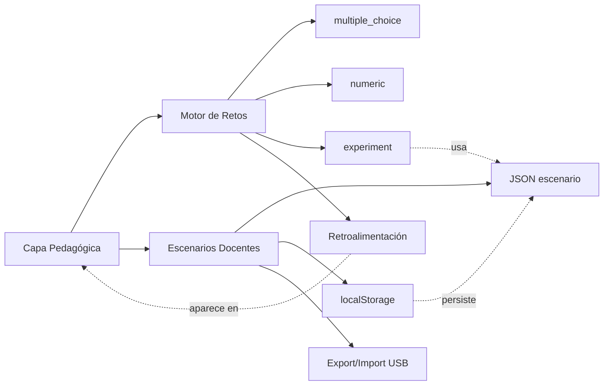

# SKILL 06 — CAPA PEDAGÓGICA Y MODO AULA

## Información General

| Campo | Valor |
|-------|-------|
| **Módulo** | Infraestructura — Capa Pedagógica, Retos y Escenarios para Docentes |
| **Código** | `PED` |
| **Prerrequisitos del alumno** | Conocimiento de JSON, haber revisado Skills 01-05 (módulos físicos y UI) |
| **Tiempo estimado** | 2-3 sesiones de 45 minutos |
| **Archivos de implementación** | `js/pedagogy/challenge-engine.js`, `scenario-manager.js` |

## Objetivos de Aprendizaje

Al finalizar este módulo, el alumno será capaz de:

1. Diseñar retos pedagógicos en formato JSON siguiendo el schema estándar.
2. Clasificar retos en tres tipos: `multiple_choice`, `numeric` y `experiment`.
3. Aplicar tolerancias adecuadas a respuestas numéricas (5% por defecto).
4. Construir escenarios didácticos con `steps[]` y `expectedParams`.
5. Guardar, cargar, exportar e importar escenarios usando `localStorage` y `FileReader`.
6. Integrar el ChallengeEngine con cualquier simulación de las Skills 01-04.
7. Justificar el modelo de retroalimentación inmediata (no intrusiva) frente a alternativas.

## Mapa Conceptual



---

## SISTEMA PED-01: Motor de Retos con Retroalimentación

### Descripción

El sistema de retos funciona como un **overlay no-intrusivo** que aparece como un panel lateral colapsable. **No interrumpe la simulación**: el alumno puede seguir manipulando sliders y observando el efecto mientras responde el reto.

Características clave:

1. Tres tipos de reto: `multiple_choice`, `numeric` y `experiment`.
2. Retroalimentación inmediata con `feedbackCorrect` o `feedbackIncorrect`.
3. Pistas (`hint`) que solo aparecen tras una respuesta incorrecta.
4. Explicación final que refuerza el concepto.
5. Avance automático al siguiente reto tras una respuesta correcta.
6. Tolerancia configurable para respuestas numéricas (por defecto 5%).
7. Los retos `experiment` usan un `validator(userAnswer)` callback: el alumno debe configurar la simulación para lograr un objetivo.

### API y Configuración

| Variable | Tipo | Default | Descripción |
|----------|------|---------|-------------|
| `challenges[]` | Array | `[]` | Lista de retos cargados |
| `currentIndex` | number | 0 | Índice del reto actual |
| `score` | number | 0 | Aciertos totales |
| `totalAttempts` | number | 0 | Intentos totales |
| Tolerancia por defecto | number | 0.05 | 5% para retos `numeric` |

**Validación**: el `currentIndex` solo avanza cuando la respuesta es correcta. Los retos `multiple_choice` comparan `userAnswer` con el índice de `options`; los `numeric` comparan con `tolerance*|expected|`; los `experiment` ejecutan `validator(userAnswer)`.

### Schema JSON de un Reto

```json
{
  "id": "mruv-01",
  "type": "numeric",
  "difficulty": 1,
  "question": "Un auto parte del reposo y acelera a 3 m/s². ¿Qué distancia recorre en 4 segundos?",
  "correctAnswer": 24,
  "tolerance": 0.05,
  "unit": "m",
  "hint": "Usa la fórmula x = x₀ + v₀t + ½at². Si parte del reposo, v₀ = 0.",
  "feedbackCorrect": "¡Correcto! x = 0 + 0 + ½(3)(4²) = 24 m",
  "feedbackIncorrect": "Revisa: x = ½ × a × t². Sustituye a=3 y t=4.",
  "explanation": "Cuando un objeto parte del reposo (v₀=0), la distancia solo depende de la aceleración y el tiempo al cuadrado.",
  "simulationPreset": {
    "module": "mruv",
    "params": { "x0": 0, "v0": 0, "a": 3 }
  }
}
```

> **Nota**: `simulationPreset` es opcional y vincula el reto con un estado inicial de la simulación, permitiendo que el alumno arranque el reto con la simulación ya configurada.

### Tipos de Reto — Tabla Comparativa

| Tipo | Entrada del alumno | Comparación | Cuándo usar |
|------|-------------------|-------------|-------------|
| `multiple_choice` | Índice 0..N del array `options` | Igualdad exacta con `correctAnswer` | Conceptos teóricos, identificación |
| `numeric` | Número | `\|user − expected\| ≤ tolerance·\|expected\|` | Cálculos con resultado cuantitativo |
| `experiment` | Configuración de la simulación | `validator(userAnswer)` devuelve boolean | "Logra que X valga Y" |

### Implementación JavaScript

```javascript
// ============================================
// MOTOR DE RETOS PEDAGÓGICOS
// Archivo: js/pedagogy/challenge-engine.js
// ============================================

export class ChallengeEngine {
    constructor() {
        this.challenges = [];
        this.currentIndex = 0;
        this.score = 0;
        this.totalAttempts = 0;
    }

    /**
     * Carga un array de retos desde JSON.
     * @param {Object[]} jsonArray
     */
    loadChallenges(jsonArray) {
        this.challenges = jsonArray;
        this.currentIndex = 0;
        this.score = 0;
        this.totalAttempts = 0;
    }

    /**
     * Devuelve el reto actual o null si se terminó.
     */
    getCurrentChallenge() {
        return this.challenges[this.currentIndex] || null;
    }

    /**
     * Procesa la respuesta del alumno.
     * @param {number|string|Object} userAnswer
     * @returns {{correct: boolean, message: string, hint: string|null, explanation: string, nextAvailable: boolean}}
     */
    submitAnswer(userAnswer) {
        const challenge = this.getCurrentChallenge();
        if (!challenge) return null;

        this.totalAttempts++;
        let correct = false;

        switch (challenge.type) {
            case 'multiple_choice':
                correct = userAnswer === challenge.correctAnswer;
                break;
            case 'numeric':
                // Tolerancia del 5% para respuestas numéricas
                const tolerance = challenge.tolerance || 0.05;
                const expected = challenge.correctAnswer;
                correct = Math.abs(userAnswer - expected) <= Math.abs(expected * tolerance);
                break;
            case 'experiment':
                // El alumno debe configurar la simulación para lograr un resultado
                correct = challenge.validator(userAnswer);
                break;
        }

        if (correct) this.score++;

        const feedback = {
            correct,
            message: correct ? challenge.feedbackCorrect : challenge.feedbackIncorrect,
            hint: correct ? null : challenge.hint,
            explanation: challenge.explanation,
            nextAvailable: this.currentIndex < this.challenges.length - 1
        };

        if (correct) this.currentIndex++;
        return feedback;
    }

    /**
     * Devuelve el estado de progreso para la barra de avance.
     */
    getProgress() {
        return {
            completed: this.currentIndex,
            total: this.challenges.length,
            score: this.score,
            attempts: this.totalAttempts,
            percentage: Math.round((this.currentIndex / this.challenges.length) * 100)
        };
    }
}
```

### Ejemplo Completo — Set de Retos

```json
{
  "module": "cinematica",
  "topic": "mruv",
  "challenges": [
    {
      "id": "mruv-01",
      "type": "numeric",
      "difficulty": 1,
      "question": "Un auto parte del reposo y acelera a 3 m/s². ¿Qué distancia recorre en 4 segundos?",
      "correctAnswer": 24,
      "tolerance": 0.05,
      "unit": "m",
      "hint": "Usa la fórmula x = x₀ + v₀t + ½at². Si parte del reposo, v₀ = 0.",
      "feedbackCorrect": "¡Correcto! x = 0 + 0 + ½(3)(4²) = 24 m",
      "feedbackIncorrect": "Revisa: x = ½ × a × t². Sustituye a=3 y t=4.",
      "explanation": "Cuando un objeto parte del reposo (v₀=0), la distancia solo depende de la aceleración y el tiempo al cuadrado.",
      "simulationPreset": {
        "module": "mruv",
        "params": { "x0": 0, "v0": 0, "a": 3 }
      }
    },
    {
      "id": "mruv-02",
      "type": "experiment",
      "difficulty": 2,
      "question": "Configura la simulación para que un objeto recorra exactamente 50 metros en 5 segundos, partiendo del reposo. ¿Qué aceleración necesitas?",
      "correctAnswer": 4,
      "tolerance": 0.1,
      "unit": "m/s²",
      "hint": "Despeja 'a' de x = ½at²: a = 2x/t²",
      "feedbackCorrect": "¡Excelente! a = 2(50)/(5²) = 4 m/s²",
      "feedbackIncorrect": "Necesitas despejar 'a'. Si x = ½at², entonces a = 2x/t².",
      "explanation": "Despejar variables es una habilidad clave. Practica reorganizando las ecuaciones."
    },
    {
      "id": "mruv-03",
      "type": "multiple_choice",
      "difficulty": 1,
      "question": "En un gráfico v vs t de un MRUV, ¿qué forma tiene la curva?",
      "options": [
        "Una línea recta",
        "Una parábola",
        "Una hipérbola",
        "Un punto"
      ],
      "correctAnswer": 0,
      "hint": "v = v₀ + at es una ecuación lineal en t.",
      "feedbackCorrect": "¡Sí! Como v = v₀ + at es lineal, la gráfica es una recta con pendiente = a.",
      "feedbackIncorrect": "Recuerda: v = v₀ + at tiene la forma y = mx + b, que es una línea recta.",
      "explanation": "La pendiente de la recta v-t te da la aceleración. Si la recta es horizontal, a=0 (MRU)."
    }
  ]
}
```

### Retos Pedagógicos — Motor de Retos

```json
[
  {
    "id": "ped-01-ce",
    "type": "multiple_choice",
    "difficulty": 1,
    "question": "¿Cuál de estos NO es un tipo de reto soportado por el ChallengeEngine?",
    "options": [
      "essay",
      "numeric",
      "multiple_choice",
      "experiment"
    ],
    "correctAnswer": 0,
    "hint": "El motor soporta tres tipos bien definidos.",
    "feedbackCorrect": "¡Correcto! No hay retos tipo 'essay'.",
    "feedbackIncorrect": "Repasa la documentación: hay exactamente 3 tipos.",
    "explanation": "Los tres tipos cubren la mayoría de casos pedagógicos sin abrir juicio subjetivo."
  },
  {
    "id": "ped-02-ce",
    "type": "multiple_choice",
    "difficulty": 2,
    "question": "En un reto `multiple_choice`, ¿qué representa `correctAnswer`?",
    "options": [
      "El índice (0-based) de la opción correcta en `options`",
      "El texto literal de la opción correcta",
      "El número de intentos permitidos",
      "El ID de la pregunta siguiente"
    ],
    "correctAnswer": 0,
    "hint": "Es un número entero que indexa el array.",
    "feedbackCorrect": "¡Exacto! correctAnswer = 0 significa 'primera opción'.",
    "feedbackIncorrect": "Es un índice, no un texto.",
    "explanation": "Usar índices en lugar de texto facilita internacionalización y comparación."
  },
  {
    "id": "ped-03-ce",
    "type": "numeric",
    "difficulty": 1,
    "question": "Si un reto numeric tiene correctAnswer=100 y tolerance=0.05, ¿qué rango de respuestas se aceptan?",
    "correctAnswer": 95,
    "tolerance": 0.05,
    "unit": "min",
    "hint": "Se acepta ±5% alrededor del valor esperado.",
    "feedbackCorrect": "¡Sí! El rango es [95, 105].",
    "feedbackIncorrect": "Calcula 100 ± 5%.",
    "explanation": "La tolerancia porcentual permite imprecisiones de redondeo del alumno."
  },
  {
    "id": "ped-04-ce",
    "type": "multiple_choice",
    "difficulty": 2,
    "question": "¿Cuándo aparece el `hint` en la retroalimentación?",
    "options": [
      "Solo tras una respuesta incorrecta",
      "Siempre, antes de responder",
      "Solo si el alumno lo pide 3 veces",
      "Solo si la respuesta es correcta"
    ],
    "correctAnswer": 0,
    "hint": "El hint es una ayuda post-error.",
    "feedbackCorrect": "¡Correcto! El hint guía tras fallar, sin regalar la respuesta inicial.",
    "feedbackIncorrect": "El motor devuelve hint=null si la respuesta fue correcta.",
    "explanation": "Mostrar la pista solo tras error preserva el reto inicial."
  },
  {
    "id": "ped-05-ce",
    "type": "experiment",
    "difficulty": 3,
    "question": "Implementa un reto `experiment` para el módulo MRU que pida al alumno lograr una posición final de 50 m con velocidad 5 m/s en 10 s. Define el JSON completo.",
    "correctAnswer": null,
    "tolerance": 0.1,
    "unit": "",
    "hint": "Usa type:'experiment' y validator que compruebe x0=0, v0=5, t_max=10.",
    "feedbackCorrect": "¡Perfecto! El validator es la pieza clave del tipo experiment.",
    "feedbackIncorrect": "Recuerda: el validator recibe userAnswer y debe devolver boolean.",
    "explanation": "El tipo experiment es el más poderoso: evalúa una configuración completa, no solo un número."
  },
  {
    "id": "ped-06-ce",
    "type": "experiment",
    "difficulty": 3,
    "question": "Diseña un set de 3 retos para el módulo de Óptica (Skill 04) que combine los tres tipos (numeric, multiple_choice, experiment). ¿Cuál es la estructura común?",
    "correctAnswer": null,
    "tolerance": 0.1,
    "unit": "",
    "hint": "Cada reto debe tener id, type, question, feedbackCorrect/Incorrect y explanation.",
    "feedbackCorrect": "¡Excelente! La consistencia del schema facilita reutilizar el motor.",
    "feedbackIncorrect": "Recuerda los campos obligatorios del schema.",
    "explanation": "Un schema uniforme permite que un mismo ChallengeEngine atienda cualquier módulo."
  }
]
```

---

## SISTEMA PED-02: Escenarios Precargados para Docentes

### Descripción

Los escenarios son **paquetes didácticos completos** que un docente puede crear, guardar y compartir. Incluyen:

1. Metadatos (autor, materia, grado, duración).
2. Estado inicial de la simulación (`initialState`).
3. Lista de pasos guiados (`steps[]`) con instrucciones para el alumno.
4. Referencia a un set de retos (`challengeSet` + `challengeRange`).

El almacenamiento es 100% offline mediante `localStorage`. Para compartir entre equipos, el docente **exporta** el escenario como archivo JSON descargable (pensado para pasarlo por USB) y otro docente puede **importarlo** con `FileReader`.

### API y Configuración

| Variable | Tipo | Default | Descripción |
|----------|------|---------|-------------|
| `STORAGE_KEY` | string | `'fisicahn_scenarios'` | Clave en localStorage |
| Escenario | Object | — | Schema completo (ver abajo) |

**Validación**: el `scenarioId` es único; al guardar, sobrescribe cualquier escenario con el mismo ID. El campo `savedAt` se estampa automáticamente.

### Schema JSON de un Escenario

```json
{
  "scenarioId": "lab-caida-libre-01",
  "title": "Laboratorio: Caída Libre desde diferentes alturas",
  "author": "Prof. Martínez",
  "subject": "Física I",
  "grade": "11vo",
  "duration": "45 min",
  "description": "Los alumnos dejan caer objetos desde 5, 10 y 20 metros y comparan tiempos de caída.",
  "module": "kinematics/free-fall",
  "objectives": [
    "Comprobar que el tiempo de caída no depende de la masa",
    "Calcular g a partir de mediciones",
    "Graficar h vs t²"
  ],
  "initialState": {
    "h0": 10,
    "v0": 0,
    "g": 9.81,
    "showTrail": true,
    "showGraph": true,
    "toolsVisible": ["cronometro", "regla"]
  },
  "steps": [
    {
      "instruction": "Configura la altura a 5 metros. Deja caer el objeto y anota el tiempo.",
      "expectedParams": { "h0": 5 }
    },
    {
      "instruction": "Repite con 10 metros. ¿Fue el doble de tiempo?",
      "expectedParams": { "h0": 10 }
    },
    {
      "instruction": "Ahora con 20 metros. Observa la gráfica h vs t.",
      "expectedParams": { "h0": 20 }
    }
  ],
  "challengeSet": "cinematica-retos.json",
  "challengeRange": [0, 3]
}
```

> **Nota**: `toolsVisible` referencia instrumentos de la Skill 05 (cronometro, regla, multimetro, grafica). `challengeSet` apunta a un archivo JSON como los de la Skill 03/04; `challengeRange` delimita qué índices del set se usan en este escenario.

### Implementación JavaScript

```javascript
// ============================================
// GESTOR DE ESCENARIOS
// Archivo: js/pedagogy/scenario-manager.js
// ============================================

export class ScenarioManager {
    constructor() {
        this.STORAGE_KEY = 'fisicahn_scenarios';
    }

    /**
     * Guarda un escenario en localStorage.
     * Si ya existe uno con el mismo scenarioId, lo sobrescribe.
     * @param {Object} scenario - Debe tener scenarioId único
     */
    save(scenario) {
        const scenarios = this.getAll();
        scenario.savedAt = new Date().toISOString();
        scenarios[scenario.scenarioId] = scenario;
        localStorage.setItem(this.STORAGE_KEY, JSON.stringify(scenarios));
    }

    /**
     * Devuelve todos los escenarios guardados.
     * @returns {Object} Mapa scenarioId -> escenario
     */
    getAll() {
        const raw = localStorage.getItem(this.STORAGE_KEY);
        return raw ? JSON.parse(raw) : {};
    }

    /**
     * Carga un escenario por ID.
     * @param {string} scenarioId
     * @returns {Object|null}
     */
    load(scenarioId) {
        return this.getAll()[scenarioId] || null;
    }

    /**
     * Exporta un escenario como archivo JSON descargable.
     * Pensado para compartir por USB entre docentes.
     * @param {string} scenarioId
     */
    export(scenarioId) {
        const scenario = this.load(scenarioId);
        if (!scenario) return;
        const blob = new Blob([JSON.stringify(scenario, null, 2)], { type: 'application/json' });
        const url = URL.createObjectURL(blob);
        const a = document.createElement('a');
        a.href = url;
        a.download = `${scenarioId}.json`;
        a.click();
        URL.revokeObjectURL(url);
    }

    /**
     * Importa un escenario desde un archivo JSON elegido por el usuario.
     * @param {File} file - Archivo cargado vía input[type=file]
     * @returns {Promise<Object>} El escenario ya guardado
     */
    importFromFile(file) {
        return new Promise((resolve, reject) => {
            const reader = new FileReader();
            reader.onload = (e) => {
                try {
                    const scenario = JSON.parse(e.target.result);
                    this.save(scenario);
                    resolve(scenario);
                } catch (err) {
                    reject(new Error('Archivo JSON inválido'));
                }
            };
            reader.readAsText(file);
        });
    }

    /**
     * Elimina un escenario por ID.
     */
    delete(scenarioId) {
        const scenarios = this.getAll();
        delete scenarios[scenarioId];
        localStorage.setItem(this.STORAGE_KEY, JSON.stringify(scenarios));
    }
}
```

### Retos Pedagógicos — Escenarios

```json
[
  {
    "id": "ped-01-sm",
    "type": "multiple_choice",
    "difficulty": 1,
    "question": "¿Dónde se guardan los escenarios por defecto?",
    "options": [
      "En localStorage del navegador",
      "En un servidor remoto",
      "En una cookie",
      "En IndexedDB"
    ],
    "correctAnswer": 0,
    "hint": "Es 100% offline.",
    "feedbackCorrect": "¡Correcto! localStorage permite guardar sin servidor.",
    "feedbackIncorrect": "Recuerda: el simulador funciona sin internet.",
    "explanation": "localStorage persiste entre sesiones en el mismo navegador."
  },
  {
    "id": "ped-02-sm",
    "type": "multiple_choice",
    "difficulty": 2,
    "question": "¿Para qué sirve el método `export`?",
    "options": [
      "Descargar el escenario como JSON para compartir por USB",
      "Imprimir en PDF",
      "Enviar por correo",
      "Borrar el escenario"
    ],
    "correctAnswer": 0,
    "hint": "El simulador se distribuye por USB; ¿cómo compartes tu escenario con otro docente?",
    "feedbackCorrect": "¡Exacto! Genera un archivo .json descargable.",
    "feedbackIncorrect": "Piensa en cómo compartir sin internet.",
    "explanation": "El flujo es: export → copiar JSON a USB → el otro docente usa importFromFile."
  },
  {
    "id": "ped-03-sm",
    "type": "multiple_choice",
    "difficulty": 2,
    "question": "¿Qué campo se estampa automáticamente al guardar?",
    "options": [
      "savedAt (fecha ISO)",
      "author",
      "duration",
      "scenarioId"
    ],
    "correctAnswer": 0,
    "hint": "Revisa el método save().",
    "feedbackCorrect": "¡Sí! savedAt permite ordenar por antigüedad.",
    "feedbackIncorrect": "El docente no tiene que escribirlo; lo añade el sistema.",
    "explanation": "La marca temporal permite gestionar versiones y limpiar escenarios viejos."
  },
  {
    "id": "ped-04-sm",
    "type": "numeric",
    "difficulty": 1,
    "question": "Si guardas un escenario con scenarioId 'lab-01' y luego guardas otro con el mismo ID, ¿cuántos escenarios con ese ID quedan?",
    "correctAnswer": 1,
    "tolerance": 0.05,
    "unit": "",
    "hint": "El ID es la clave del mapa.",
    "feedbackCorrect": "¡Correcto! El nuevo sobrescribe al viejo.",
    "feedbackIncorrect": "El scenarioId es clave única.",
    "explanation": "Esto evita duplicados pero exige cuidar los IDs."
  },
  {
    "id": "ped-05-sm",
    "type": "experiment",
    "difficulty": 3,
    "question": "Crea un escenario para el módulo de Óptica (Skill 04) con 2 steps: configurar lente convergente y observar imagen. Verifica su JSON. ¿Está completo?",
    "correctAnswer": null,
    "tolerance": 0.1,
    "unit": "",
    "hint": "Debe tener scenarioId, title, module, initialState, steps.",
    "feedbackCorrect": "¡Perfecto! El schema es válido y portable.",
    "feedbackIncorrect": "Asegúrate de incluir todos los campos obligatorios.",
    "explanation": "Un escenario bien formado se puede importar en cualquier equipo sin pérdida."
  },
  {
    "id": "ped-06-sm",
    "type": "experiment",
    "difficulty": 3,
    "question": "Implementa la importación de un escenario: usa un input type=file, llama a importFromFile y muestra el título cargado. ¿Qué evento dispara la importación?",
    "correctAnswer": null,
    "tolerance": 0.1,
    "unit": "",
    "hint": "El input type=file emite 'change' cuando el usuario elige un archivo.",
    "feedbackCorrect": "¡Excelente! El evento change entrega el File a importFromFile.",
    "feedbackIncorrect": "Recuerda: input type=file no tiene onclick de archivo, sino change.",
    "explanation": "El flujo file→FileReader→JSON.parse→save es estándar para importar JSON."
  }
]
```

---

## Tabla Resumen de Componentes Pedagógicos

| # | Componente | Archivo | Rol | Persistencia |
|---|------------|---------|-----|--------------|
| 1 | `ChallengeEngine` | `js/pedagogy/challenge-engine.js` | Evaluar respuestas y dar feedback | En memoria |
| 2 | Retos JSON | `data/<modulo>-retos.json` | Banco de preguntas | Archivo |
| 3 | `ScenarioManager` | `js/pedagogy/scenario-manager.js` | CRUD de escenarios | localStorage |
| 4 | Escenarios JSON | Export / import | Paquetes didácticos compartibles | Archivo (USB) |

---

## Presets de Escenarios para Docentes

```json
[
  {
    "scenarioId": "lab-caida-libre-01",
    "title": "Laboratorio: Caída Libre desde diferentes alturas",
    "author": "Prof. Martínez",
    "subject": "Física I",
    "grade": "11vo",
    "duration": "45 min",
    "description": "Los alumnos dejan caer objetos desde 5, 10 y 20 metros y comparan tiempos de caída.",
    "module": "kinematics/free-fall",
    "objectives": [
      "Comprobar que el tiempo de caída no depende de la masa",
      "Calcular g a partir de mediciones",
      "Graficar h vs t²"
    ],
    "initialState": {
      "h0": 10, "v0": 0, "g": 9.81,
      "showTrail": true, "showGraph": true,
      "toolsVisible": ["cronometro", "regla"]
    },
    "steps": [
      { "instruction": "Configura la altura a 5 metros. Deja caer el objeto y anota el tiempo.", "expectedParams": { "h0": 5 } },
      { "instruction": "Repite con 10 metros. ¿Fue el doble de tiempo?", "expectedParams": { "h0": 10 } },
      { "instruction": "Ahora con 20 metros. Observa la gráfica h vs t.", "expectedParams": { "h0": 20 } }
    ],
    "challengeSet": "cinematica-retos.json",
    "challengeRange": [0, 3]
  },
  {
    "scenarioId": "lab-optica-lente-02",
    "title": "Laboratorio: Lente convergente y formación de imágenes",
    "author": "Prof. Martínez",
    "subject": "Física II",
    "grade": "11vo",
    "duration": "30 min",
    "description": "Se explora cómo varía la imagen al mover el objeto respecto a la lente.",
    "module": "optics/lenses",
    "objectives": [
      "Identificar imagen real vs virtual",
      "Verificar la ecuación de lentes delgadas",
      "Trazar los tres rayos principales"
    ],
    "initialState": {
      "tipo_lente": "convergente", "d0": 40, "h0": 10, "f": 20,
      "toolsVisible": ["regla"]
    },
    "steps": [
      { "instruction": "Coloca el objeto a 40 cm (más allá de 2f=40). ¿Qué imagen se forma?", "expectedParams": { "d0": 40 } },
      { "instruction": "Acerca el objeto a 30 cm (entre f y 2f). ¿Qué cambia?", "expectedParams": { "d0": 30 } },
      { "instruction": "Coloca el objeto a 10 cm (más cerca que f). ¿Imagen real o virtual?", "expectedParams": { "d0": 10 } }
    ],
    "challengeSet": "optica-retos.json",
    "challengeRange": [6, 12]
  },
  {
    "scenarioId": "lab-electricidad-malla-03",
    "title": "Laboratorio: Malla con 2 fuentes",
    "author": "Prof. Martínez",
    "subject": "Física III",
    "grade": "11vo",
    "duration": "45 min",
    "description": "Análisis de una malla con dos lazos. Los alumnos predicen y verifican la corriente en la rama compartida.",
    "module": "electricity/kirchhoff",
    "objectives": [
      "Aplicar LVK a cada lazo",
      "Predecir el sentido de IR₂",
      "Verificar el balance de potencia"
    ],
    "initialState": {
      "V1": 12, "V2": 6, "R1": 100, "R2": 50, "R3": 200,
      "toolsVisible": ["voltimeter", "ammeter"]
    },
    "steps": [
      { "instruction": "Predice sobre papel la corriente IR₂ antes de simular.", "expectedParams": {} },
      { "instruction": "Ejecuta la simulación y compara con tu predicción.", "expectedParams": {} },
      { "instruction": "Invierte V₂ (valor negativo). ¿Qué pasa con IR₂?", "expectedParams": { "V2": -6 } }
    ],
    "challengeSet": "electricidad-retos.json",
    "challengeRange": [6, 12]
  }
]
```
