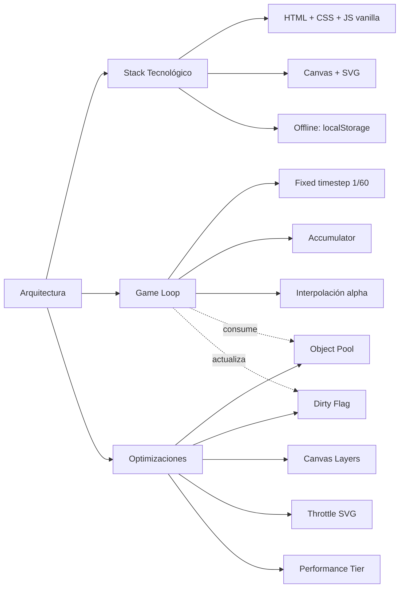

# SKILL 07 — ARQUITECTURA DEL MOTOR DE SIMULACIÓN

## Información General

| Campo | Valor |
|-------|-------|
| **Módulo** | Infraestructura — Arquitectura Tecnológica y Optimización |
| **Código** | `ARC` |
| **Prerrequisitos del alumno** | ES Modules, Canvas API, `requestAnimationFrame`, localStorage; haber revisado Skills 01-06 |
| **Tiempo estimado** | 3-4 sesiones de 45 minutos |
| **Archivos de implementación** | `js/core/physics-engine.js`, `particle-pool.js`, `performance.js` |

## Objetivos de Aprendizaje

Al finalizar este módulo, el alumno será capaz de:

1. Justificar la elección de un stack 100% vanilla (sin build step, sin dependencias) para entornos escolares.
2. Implementar un Game Loop con timestep fijo (1/60 s) y acumulador.
3. Aplicar interpolación visual `alpha` para suavizar el render entre pasos de física.
4. Implementar un Object Pool para evitar garbage collection excesiva.
5. Aplicar el patrón Dirty Flag para evitar redibujados innecesarios.
6. Separar el render en capas (background + foreground) para optimizar.
7. Detectar la capacidad del dispositivo y aplicar ajustes (partículas, antialiasing) por `tier`.

## Mapa Conceptual



---

## SISTEMA ARC-01: Stack Tecnológico

### Descripción

El simulador se construye **100% con tecnologías nativas del navegador**, sin frameworks ni build step. La justificación es el entorno escolar: conexión intermitente, equipos modestos y la necesidad de distribuir por **USB** y abrir con `file://`. Cualquier dependencia externa rompería el modo offline.

### Tabla del Stack

| Capa | Tecnología | Justificación |
|------|------------|----------------|
| **Estructura** | HTML5 semántico | Nativo, sin transpilación |
| **Estilos** | CSS3 vanilla + Custom Properties | Zero dependencies, dark theme eficiente |
| **Lógica** | JavaScript vanilla (ES2020) | Sin framework, sin build step, carga directa |
| **Renderizado 2D** | Canvas API | GPU-acelerado, ideal para animaciones físicas |
| **Gráficas** | SVG inline generado por JS | Ligero, escalable, no requiere librería |
| **Almacenamiento** | localStorage + FileReader API | 100% offline, sin servidor |
| **Distribución** | Carpeta estática (~2-5 MB por USB) | `file://` protocol funciona directo |

### Política de Build Step

> **Sin build step**: Ni npm, ni webpack, ni Vite. Los archivos `.js` se cargan con `<script type="module">`. Los navegadores modernos (Chrome 80+, Firefox 78+, Edge 80+) soportan módulos ES nativamente.

### Navegadores Soportados

| Navegador | Versión mínima | Motivo de la cota |
|-----------|---------------|-------------------|
| Chrome | 80+ | ES Modules estable, Pointer Events |
| Firefox | 78+ | ES Modules, Custom Properties |
| Edge | 80+ | Basado en Chromium |

### Implementación — Estructura de Carga

```html
<!-- index.html — carga directa vía ES Modules, sin bundler -->
<!DOCTYPE html>
<html lang="es">
<head>
    <meta charset="UTF-8">
    <link rel="stylesheet" href="css/design-system.css">
    <title>FísicaHN</title>
</head>
<body>
    <div id="app">
        <canvas id="simCanvas"></canvas>
        <aside id="sidebar"></aside>
    </div>

    <!-- Carga directa del módulo principal -->
    <script type="module" src="js/main.js"></script>
</body>
</html>
```

```javascript
// js/main.js — Punto de entrada con ES Modules nativo
import { PhysicsEngine } from './core/physics-engine.js';
import { FreeFallModule } from './modules/kinematics/free-fall.js';

const canvas = document.getElementById('simCanvas');
const engine = new PhysicsEngine(canvas);
engine.setModule(new FreeFallModule());
engine.start();
```

### Retos Pedagógicos — Stack

```json
[
  {
    "id": "arc-01-st",
    "type": "multiple_choice",
    "difficulty": 1,
    "question": "¿Cuál de estas tecnologías NO forma parte del stack?",
    "options": [
      "Webpack",
      "Canvas API",
      "CSS3 vanilla",
      "localStorage"
    ],
    "correctAnswer": 0,
    "hint": "El stack evita herramientas de build.",
    "feedbackCorrect": "¡Correcto! No hay build step.",
    "feedbackIncorrect": "Busca la opción que pertenece a un bundler.",
    "explanation": "La decisión de omitir npm/webpack es para garantizar portabilidad por USB."
  },
  {
    "id": "arc-02-st",
    "type": "multiple_choice",
    "difficulty": 1,
    "question": "¿Por qué se carga JavaScript con `<script type=\"module\">`?",
    "options": [
      "Para usar ES Modules nativos sin bundler",
      "Para diferir la carga automáticamente",
      "Para comprimir el código",
      "Para evitar el caché"
    ],
    "correctAnswer": 0,
    "hint": "Los navegadores modernos soportan módulos ES sin transpilación.",
    "feedbackCorrect": "¡Exacto! ES Modules nativos permiten import/export sin bundler.",
    "feedbackIncorrect": "No es por rendimiento ni compresión: es por sintaxis nativa.",
    "explanation": "Esto elimina la dependencia de npm/webpack mientras organiza el código en módulos."
  },
  {
    "id": "arc-03-st",
    "type": "multiple_choice",
    "difficulty": 2,
    "question": "¿Por qué se prefiere Canvas para la simulación física y SVG para las gráficas?",
    "options": [
      "Canvas es mejor para animación 60 FPS; SVG es más ligero para gráficas semi-estáticas",
      "Canvas no soporta 2D",
      "SVG es más rápido que Canvas siempre",
      "Ambos son intercambiables"
    ],
    "correctAnswer": 0,
    "hint": "Cada tecnología tiene su punto fuerte.",
    "feedbackCorrect": "¡Sí! Canvas para animar, SVG para actualizar pocos puntos.",
    "feedbackIncorrect": "Piensa en la frecuencia de actualización de cada caso.",
    "explanation": "Canvas redibuja píxel a píxel (rápido para animación); SVG opera con elementos DOM (rápido para cambios puntuales)."
  },
  {
    "id": "arc-04-st",
    "type": "multiple_choice",
    "difficulty": 2,
    "question": "¿Cuál es la versión mínima de Chrome soportada y por qué?",
    "options": [
      "Chrome 80+ — ES Modules estables y Pointer Events",
      "Chrome 60+ — Canvas 2D",
      "Chrome 100+ — rendimiento",
      "Cualquier versión"
    ],
    "correctAnswer": 0,
    "hint": "ES Modules y Pointer Events maduraron en esa versión.",
    "feedbackCorrect": "¡Correcto! Chrome 80+ garantiza las APIs clave.",
    "feedbackIncorrect": "La cota no es por rendimiento, sino por APIs nativas.",
    "explanation": "Esta cota cubre prácticamente todos los equipos escolares actuales."
  },
  {
    "id": "arc-05-st",
    "type": "numeric",
    "difficulty": 1,
    "question": "¿Cuánto pesa aproximadamente la distribución estática completa?",
    "correctAnswer": 2,
    "tolerance": 0.5,
    "unit": "MB",
    "hint": "Está en el rango 2-5 MB.",
    "feedbackCorrect": "¡Sí! 2-5 MB caben en cualquier USB.",
    "feedbackIncorrect": "Consulta la tabla del stack.",
    "explanation": "Sin dependencias pesadas, el tamaño se mantiene mínimo."
  },
  {
    "id": "arc-06-st",
    "type": "experiment",
    "difficulty": 3,
    "question": "Crea la estructura de carpetas mínima (css/, js/core/, js/modules/) y abre index.html con file://. ¿Funciona sin servidor?",
    "correctAnswer": null,
    "tolerance": 0.1,
    "unit": "",
    "hint": "Los ES Modules funcionan con file:// en navegadores modernos.",
    "feedbackCorrect": "¡Perfecto! La app arranca sin servidor ni internet.",
    "feedbackIncorrect": "Verifica que el navegador soporte type=\"module\" con file://.",
    "explanation": "Esta es la prueba de fuego del modo offline 100%."
  }
]
```

---

## SISTEMA ARC-02: Game Loop — Ciclo de Renderizado Optimizado

### Descripción

El Game Loop es el corazón del motor: orquesta la actualización de la física y el render visual. Usa el patrón de **Fixed Timestep con Acumulador**, que separa la cadencia de la física (determinística a 60 Hz) de la cadencia del render (variable según el monitor). Esto garantiza simulaciones reproducibles y visualmente fluidas incluso en hardware modesto.

### API y Configuración

| Variable | Tipo | Default | Descripción |
|----------|------|---------|-------------|
| `running` | boolean | `false` | Loop activo |
| `paused` | boolean | `false` | Pausa sin detener el loop |
| `timeScale` | number | `1.0` | Multiplicador de velocidad (0.1× a 5×) |
| `simTime` | number | `0` | Tiempo acumulado de simulación (s) |
| `fixedDT` | number | `1/60` | Paso fijo de física (16.67 ms) |
| `accumulator` | number | `0` | Tiempo acumulado pendiente de consumir |
| `activeModule` | Object\|null | `null` | Módulo con `update(dt, simTime)` y `render(ctx, alpha)` |

**Contrato del módulo**: cualquier módulo (Skills 01-04) debe implementar `update(fixedDT, simTime)` y `render(ctx, alpha)`, donde `alpha ∈ [0, 1]` es el factor de interpolación entre el estado físico anterior y el actual.

### Decisiones de Diseño

> **Fixed timestep**: la física siempre avanza en pasos de `1/60 s`. Esto hace la simulación **determinística**: dadas las mismas entradas, produce exactamente el mismo resultado.

> **Cap de dt**: `Math.min(dt, 0.1)` evita las "espirales de muerte": si un frame tarda demasiado (por ejemplo al volver de una pestaña inactiva), el acumulador no se dispara.

> **Interpolación alpha**: tras consumir todos los pasos físicos completos, puede sobrar tiempo fraccional en el acumulador. El render usa `alpha = accumulator / fixedDT` para interpolar visualmente entre el estado anterior y el actual, produciendo movimiento suave a cualquier FPS.

### Implementación JavaScript

```javascript
// ============================================
// MOTOR DE FÍSICA — GAME LOOP OPTIMIZADO
// Archivo: js/core/physics-engine.js
// ============================================

export class PhysicsEngine {
    /**
     * @param {HTMLCanvasElement} canvas
     */
    constructor(canvas) {
        this.canvas = canvas;
        this.ctx = canvas.getContext('2d');
        this.running = false;
        this.paused = false;
        this.timeScale = 1.0;       // Velocidad de simulación (0.1x a 5x)
        this.simTime = 0;            // Tiempo de simulación acumulado (s)
        this.lastTimestamp = 0;
        this.fixedDT = 1 / 60;      // Paso fijo de 16.67ms
        this.accumulator = 0;
        this.activeModule = null;

        // Resolución adaptativa al dispositivo
        this.setupCanvas();
    }

    /**
     * Ajusta el canvas al DPR para pantallas HiDPI,
     * pero limita a 2x para gama baja.
     */
    setupCanvas() {
        const dpr = Math.min(window.devicePixelRatio || 1, 2);
        const rect = this.canvas.getBoundingClientRect();
        this.canvas.width = rect.width * dpr;
        this.canvas.height = rect.height * dpr;
        this.ctx.scale(dpr, dpr);
        // CSS mantiene el tamaño visual
        this.canvas.style.width = rect.width + 'px';
        this.canvas.style.height = rect.height + 'px';
    }

    /**
     * Cambia el módulo activo.
     * @param {Object} module - Debe tener update(dt, simTime) y render(ctx, alpha)
     */
    setModule(module) {
        this.activeModule = module;
        this.simTime = 0;
        this.accumulator = 0;
        if (module.init) module.init();
    }

    start() {
        this.running = true;
        this.lastTimestamp = performance.now();
        requestAnimationFrame((ts) => this.loop(ts));
    }

    stop() {
        this.running = false;
    }

    pause()  { this.paused = true; }
    resume()  { this.paused = false; }

    /**
     * Bucle principal. Llamado por requestAnimationFrame.
     * @param {number} timestamp - Tiempo actual (ms) desde performance.now()
     */
    loop(timestamp) {
        if (!this.running) return;

        // Delta time en segundos, con cap para evitar espirales de muerte
        let dt = Math.min((timestamp - this.lastTimestamp) / 1000, 0.1);
        this.lastTimestamp = timestamp;

        if (!this.paused) {
            dt *= this.timeScale;
            this.accumulator += dt;

            // FIXED TIMESTEP: física determinística a 60 Hz
            while (this.accumulator >= this.fixedDT) {
                if (this.activeModule) {
                    this.activeModule.update(this.fixedDT, this.simTime);
                }
                this.simTime += this.fixedDT;
                this.accumulator -= this.fixedDT;
            }
        }

        // RENDER: una vez por frame visual
        this.ctx.clearRect(0, 0, this.canvas.width, this.canvas.height);
        if (this.activeModule) {
            // Interpolación para render suave entre pasos de física
            const alpha = this.accumulator / this.fixedDT;
            this.activeModule.render(this.ctx, alpha);
        }

        requestAnimationFrame((ts) => this.loop(ts));
    }
}
```

### Retos Pedagógicos — Game Loop

```json
[
  {
    "id": "arc-01-gl",
    "type": "multiple_choice",
    "difficulty": 1,
    "question": "¿Cuál es el paso fijo de física por defecto?",
    "options": [
      "1/60 segundos (≈16.67 ms)",
      "1 segundo",
      "1/30 segundos",
      "1/120 segundos"
    ],
    "correctAnswer": 0,
    "hint": "Es el paso estándar de animación a 60 Hz.",
    "feedbackCorrect": "¡Correcto! fixedDT = 1/60.",
    "feedbackIncorrect": "Consulta la propiedad fixedDT del PhysicsEngine.",
    "explanation": "60 Hz es el estándar de la industria para simulación determinística."
  },
  {
    "id": "arc-02-gl",
    "type": "multiple_choice",
    "difficulty": 2,
    "question": "¿Para qué sirve el acumulador (accumulator)?",
    "options": [
      "Acumular el dt restante para ejecutar pasos físicos completos en el siguiente frame",
      "Contar FPS",
      "Acumular energía",
      "Guardar puntuación"
    ],
    "correctAnswer": 0,
    "hint": "Si dt es mayor que fixedDT, se ejecutan varios pasos físicos pequeños.",
    "feedbackCorrect": "¡Exacto! El acumulador fracciona dt en pasos de fixedDT.",
    "feedbackIncorrect": "El acumulador descompone dt variable en pasos fijos.",
    "explanation": "Esto desacopla la cadencia del monitor (variable) de la física (fija)."
  },
  {
    "id": "arc-03-gl",
    "type": "multiple_choice",
    "difficulty": 2,
    "question": "¿Por qué se aplica `Math.min(dt, 0.1)` al delta time?",
    "options": [
      "Para evitar 'espirales de muerte' cuando un frame tarda demasiado",
      "Para ralentizar la simulación",
      "Para ahorrar batería",
      "Para comprimir datos"
    ],
    "correctAnswer": 0,
    "hint": "Si el navegador estuvo inactivo y dt es enorme, el loop podría colapsar.",
    "feedbackCorrect": "¡Sí! Sin el cap, el acumulador se dispararía y haría N pasos enormes.",
    "feedbackIncorrect": "Es una medida de seguridad ante pausas largas.",
    "explanation": "Esto evita que volver de una pestaña inactiva congele la simulación."
  },
  {
    "id": "arc-04-gl",
    "type": "multiple_choice",
    "difficulty": 3,
    "question": "¿Qué representa el factor `alpha` pasado a render?",
    "options": [
      "La fracción de tiempo entre el último y el siguiente paso físico",
      "La transparencia del canvas",
      "La velocidad de render",
      "El número de FPS"
    ],
    "correctAnswer": 0,
    "hint": "alpha = accumulator / fixedDT.",
    "feedbackCorrect": "¡Correcto! alpha ∈ [0,1] interpola entre estados físicos.",
    "feedbackIncorrect": "Es un factor de interpolación visual, no una propiedad del canvas.",
    "explanation": "Sin alpha, el movimiento se vería 'a saltos' a FPS mayores que 60."
  },
  {
    "id": "arc-05-gl",
    "type": "numeric",
    "difficulty": 2,
    "question": "Si timeScale = 2, ¿en cuántos segundos de simulación equivale 1 segundo real?",
    "correctAnswer": 2,
    "tolerance": 0.05,
    "unit": "s",
    "hint": "timeScale multiplica el dt.",
    "feedbackCorrect": "¡Perfecto! La simulación avanza al doble de velocidad.",
    "feedbackIncorrect": "timeScale=2 ⇒ 1 s real = 2 s simulados.",
    "explanation": "timeScale permite ralentizar (0.1×) para análisis o acelerar (5×) para efectos largos."
  },
  {
    "id": "arc-06-gl",
    "type": "experiment",
    "difficulty": 3,
    "question": "Configura el motor en timeScale=2 y observa una caída libre de 20 m. ¿Tarda la mitad de tiempo (real) que a timeScale=1?",
    "correctAnswer": null,
    "tolerance": 0.1,
    "unit": "",
    "hint": "timeScale=2 duplica la velocidad efectiva.",
    "feedbackCorrect": "¡Excelente! El tiempo real se reduce a la mitad.",
    "feedbackIncorrect": "Verifica que estás midiendo tiempo real, no simTime.",
    "explanation": "Esto es útil para ver simulaciones lentas (ej. órbitas planetarias) en tiempo razonable."
  }
]
```

---

## SISTEMA ARC-03: Optimizaciones para Hardware Modesto

### Descripción

El simulador debe correr en equipos escolares de gama baja (tablets baratas, laptops Celeron). Estas cinco estrategias mantienen los 60 FPS incluso con hardware modesto:

1. **Object Pool** para partículas (evita garbage collection).
2. **Dirty Flag renderer** (solo redibuja cuando algo cambia).
3. **Canvas layers** (separar fondo estático de objetos en movimiento).
4. **Throttle de gráficas SVG** (máximo 10 actualizaciones/segundo).
5. **Detección de capacidad del dispositivo** (tiers high/medium/low).

### API y Configuración

| Estrategia | Clase / Función | Propósito |
|------------|----------------|-----------|
| Object Pool | `ParticlePool(size)` | Pre-asignar partículas, reutilizar memoria |
| Dirty Flag | `DirtyRenderer` | Evitar redibujados innecesarios |
| Canvas Layers | 2 canvas superpuestos | Fondo dibujado 1 vez + objetos cada frame |
| Throttle | `throttle(fn, delay)` | Limitar actualizaciones SVG a 10/s |
| Performance Tier | `detectPerformanceTier()` | high/medium/low según cores y memoria |

### Implementación JavaScript

```javascript
// ============================================
// ESTRATEGIAS DE OPTIMIZACIÓN
// Archivo: js/core/performance.js + particle-pool.js
// ============================================

/**
 * 1. Object pool para partículas (evita garbage collection).
 * Las partículas se pre-asignan y se reutilizan,
 * en lugar de crearse y destruirse continuamente.
 */
export class ParticlePool {
    /**
     * @param {number} size - Tamaño fijo del pool
     */
    constructor(size) {
        this.pool = Array.from({ length: size }, () => ({
            active: false, x: 0, y: 0, vx: 0, vy: 0, life: 0
        }));
        this.activeCount = 0;
    }

    /**
     * Adquiere una partícula inactiva del pool.
     * @returns {Object|null} Partícula o null si pool agotado
     */
    acquire() {
        for (const p of this.pool) {
            if (!p.active) {
                p.active = true;
                this.activeCount++;
                return p;
            }
        }
        return null; // Pool agotado (no crear más)
    }

    /**
     * Libera una partícula para reutilización.
     */
    release(p) {
        p.active = false;
        this.activeCount--;
    }
}

/**
 * 2. Dirty flag: solo redibujar cuando algo cambia.
 */
export class DirtyRenderer {
    constructor() {
        this.dirty = true;
    }
    markDirty() { this.dirty = true; }
    /**
     * @param {CanvasRenderingContext2D} ctx
     * @param {(ctx) => void} drawFn
     */
    render(ctx, drawFn) {
        if (!this.dirty) return;
        drawFn(ctx);
        this.dirty = false;
    }
}

/**
 * 3. Canvas layers: separar fondo estático de objetos animados.
 *
 * Se usan 2 canvas superpuestos:
 *   - backgroundCanvas: grid, ejes, etiquetas (se dibuja UNA vez)
 *   - foregroundCanvas: objetos en movimiento (se dibuja cada frame)
 *
 * Esto evita redibujar el fondo estático 60 veces por segundo.
 */

/**
 * 4. Throttle de gráficas SVG: actualizar máximo 10 veces/segundo.
 * @param {Function} fn
 * @param {number} delay - Mínimo ms entre llamadas
 */
export function throttle(fn, delay) {
    let last = 0;
    return function (...args) {
        const now = performance.now();
        if (now - last >= delay) {
            last = now;
            fn.apply(this, args);
        }
    };
}

/**
 * 5. Detección de capacidad del dispositivo.
 * @returns {'high'|'medium'|'low'}
 */
export function detectPerformanceTier() {
    const canvas = document.createElement('canvas');
    const gl = canvas.getContext('webgl');
    const renderer = gl ? gl.getParameter(gl.RENDERER) : 'unknown';

    // Heurística simple basada en cores y memoria
    const cores = navigator.hardwareConcurrency || 2;
    const memory = navigator.deviceMemory || 2; // GB (Chrome only)

    if (cores >= 4 && memory >= 4) return 'high';
    if (cores >= 2 && memory >= 2) return 'medium';
    return 'low';
}

/**
 * Ajustar calidad según tier.
 * @param {'high'|'medium'|'low'} tier
 */
export function applyPerformanceSettings(tier) {
    const settings = {
        high:   { particleCount: 200, trailLength: 100, antialiasing: true },
        medium: { particleCount: 80,  trailLength: 40,  antialiasing: true },
        low:    { particleCount: 30,  trailLength: 15,  antialiasing: false }
    };
    return settings[tier] || settings.medium;
}
```

### Tabla de Settings por Tier

| Tier | particleCount | trailLength | antialiasing | Hardware típico |
|------|---------------|-------------|--------------|------------------|
| `high` | 200 | 100 | ✓ | 4+ cores, 4+ GB RAM |
| `medium` | 80 | 40 | ✓ | 2 cores, 2 GB RAM |
| `low` | 30 | 15 | ✗ | Tablets/Laptops Celeron |

> **Nota**: en tier `low` se desactiva el antialiasing del canvas para priorizar FPS por encima de nitidez visual.

### Retos Pedagógicos — Optimizaciones

```json
[
  {
    "id": "arc-01-op",
    "type": "multiple_choice",
    "difficulty": 1,
    "question": "¿Cuál es el propósito principal de un Object Pool?",
    "options": [
      "Evitar la creación/destrucción continua de objetos (reducir garbage collection)",
      "Acelerar el render",
      "Comprimir texturas",
      "Reducir el tamaño del código"
    ],
    "correctAnswer": 0,
    "hint": "Crear/destruir objetos frecuentemente dispara el GC del navegador.",
    "feedbackCorrect": "¡Correcto! Reutilizar objetos evita pausas por GC.",
    "feedbackIncorrect": "Es una técnica de gestión de memoria, no de render.",
    "explanation": "El Object Pool pre-asigna un set fijo y los reutiliza con acquire/release."
  },
  {
    "id": "arc-02-op",
    "type": "multiple_choice",
    "difficulty": 2,
    "question": "¿Qué hace `DirtyRenderer.render` si `dirty === false`?",
    "options": [
      "No dibuja nada (sale temprano)",
      "Dibuja normalmente",
      "Lanza error",
      "Espera 1 segundo"
    ],
    "correctAnswer": 0,
    "hint": "El patrón Dirty Flag evita trabajo redundante.",
    "feedbackCorrect": "¡Exacto! Si nada cambió, no redibuja.",
    "feedbackIncorrect": "El dirty flag marca si hace falta actualizar.",
    "explanation": "Esto ahorra CPU en paneles laterales y displays que cambian poco."
  },
  {
    "id": "arc-03-op",
    "type": "multiple_choice",
    "difficulty": 2,
    "question": "¿Por qué se usan 2 canvas superpuestos (background + foreground)?",
    "options": [
      "Para dibujar el fondo estático UNA vez y solo animar el frente",
      "Para doble buffer",
      "Para estereoscopia 3D",
      "Por exigencia del navegador"
    ],
    "correctAnswer": 0,
    "hint": "El fondo (grid, ejes) rara vez cambia.",
    "feedbackCorrect": "¡Sí! Redibujar el fondo 60 veces por segundo es desperdicio.",
    "feedbackIncorrect": "Piensa en qué capas cambian y cuáles no.",
    "explanation": "La separación de capas es una optimización clásica en motores 2D."
  },
  {
    "id": "arc-04-op",
    "type": "numeric",
    "difficulty": 1,
    "question": "¿Cada cuántos milisegundos permite actualizar el throttle por defecto para SVG (10 updates/s)?",
    "correctAnswer": 100,
    "tolerance": 0.05,
    "unit": "ms",
    "hint": "1000 ms / 10 actualizaciones = ?",
    "feedbackCorrect": "¡Correcto! Cada 100 ms.",
    "feedbackIncorrect": "1000 ms ÷ 10 = 100 ms.",
    "explanation": "10 actualizaciones por segundo son suficientes para que el ojo perciba movimiento fluido en una gráfica."
  },
  {
    "id": "arc-05-op",
    "type": "experiment",
    "difficulty": 3,
    "question": "Ejecuta detectPerformanceTier() en tu equipo. ¿Qué tier obtienes y qué settings aplica?",
    "correctAnswer": null,
    "tolerance": 0.1,
    "unit": "",
    "hint": "navigator.hardwareConcurrency y navigator.deviceMemory determinan el tier.",
    "feedbackCorrect": "¡Perfecto! Los settings se aplican automáticamente al iniciar el motor.",
    "feedbackIncorrect": "Verifica que el navegador soporte navigator.deviceMemory (Chrome).",
    "explanation": "La detección adaptativa permite que la app funcione bien en cualquier equipo."
  },
  {
    "id": "arc-06-op",
    "type": "experiment",
    "difficulty": 3,
    "question": "Crea un ParticlePool(100), adquiere y libera 1000 partículas en un bucle. ¿Se caen los FPS?",
    "correctAnswer": null,
    "tolerance": 0.1,
    "unit": "",
    "hint": "Con pool no hay garbage collection porque no se crean objetos nuevos.",
    "feedbackCorrect": "¡Excelente! El FPS se mantiene estable gracias a la reutilización.",
    "feedbackIncorrect": "Si los FPS caen, revisa que estés liberando (release) tras usar cada partícula.",
    "explanation": "Esta es la prueba visible del beneficio del Object Pool."
  }
]
```

---

## Tabla Resumen de Decisiones Arquitectónicas

| # | Decisión | Justificación | Impacto |
|---|----------|---------------|---------|
| 1 | Stack 100% vanilla, sin build step | Portabilidad USB + offline | Reduce complejidad de despliegue |
| 2 | ES Modules nativos (`<script type="module">`) | Carga directa sin bundler | Organiza código sin npm |
| 3 | Canvas para física + SVG para gráficas | Mejor herramienta para cada trabajo | Rendimiento balanceado |
| 4 | localStorage + FileReader API | 100% offline | Sin servidor ni dependencias |
| 5 | Fixed timestep 1/60 + acumulador | Física determinística | Simulaciones reproducibles |
| 6 | Cap de dt en 0.1 s | Evitar espirales de muerte | Estabilidad ante pausas |
| 7 | Interpolación alpha | Render suave a cualquier FPS | Calidad visual |
| 8 | Object Pool | Evitar GC | FPS estables con muchas partículas |
| 9 | Dirty Flag | Evitar redibujado redundante | Ahorro de CPU |
| 10 | Canvas layers (bg + fg) | Fondo estático dibujado 1 vez | Menos trabajo por frame |
| 11 | Throttle SVG a 10/s | Gráficas no necesitan 60 FPS | Liberar CPU para física |
| 12 | Performance tier (high/med/low) | Adaptarse al hardware | Funciona en equipos modestos |
| 13 | DPR clamp a 2 | Equilibrio nitidez/rendimiento | Sin sobrecarga en gama baja |

---

## Presets de Escenarios para Docentes

```json
[
  {
    "scenarioId": "lab-arq-loop-01",
    "title": "Laboratorio: Inspeccionar el Game Loop con timeScale",
    "author": "Prof. Martínez",
    "subject": "Programación",
    "grade": "11vo",
    "duration": "30 min",
    "description": "Los alumnos varían timeScale y observan cómo cambia el simTime respecto al tiempo real.",
    "module": "core/physics-engine",
    "objectives": [
      "Comprender el concepto de timestep fijo",
      "Verificar la relación timeScale vs velocidad",
      "Identificar la interpolación alpha"
    ],
    "initialState": {
      "timeScale": 1,
      "toolsVisible": ["cronometro"]
    },
    "steps": [
      { "instruction": "Ejecuta el motor a timeScale=1 durante 10 s reales. Anota simTime.", "expectedParams": { "timeScale": 1 } },
      { "instruction": "Cambia a timeScale=2 y repite. ¿simTime se duplicó?", "expectedParams": { "timeScale": 2 } },
      { "instruction": "Prueba timeScale=0.1. ¿Qué observas en el movimiento?", "expectedParams": { "timeScale": 0.1 } }
    ],
    "challengeSet": "arquitectura-retos.json",
    "challengeRange": [0, 3]
  },
  {
    "scenarioId": "lab-arq-tier-02",
    "title": "Laboratorio: Detección de performance tier",
    "author": "Prof. Martínez",
    "subject": "Programación",
    "grade": "11vo",
    "duration": "30 min",
    "description": "Los alumnos detectan el tier de su equipo y observan cómo cambian los settings.",
    "module": "core/performance",
    "objectives": [
      "Ejecutar detectPerformanceTier()",
      "Aplicar applyPerformanceSettings(tier)",
      "Comparar antialiasing on/off"
    ],
    "initialState": {
      "detectOnStart": true,
      "toolsVisible": []
    },
    "steps": [
      { "instruction": "Abre la consola y ejecuta detectPerformanceTier(). Anota el resultado.", "expectedParams": {} },
      { "instruction": "Aplica applyPerformanceSettings(tier) y observa particleCount.", "expectedParams": {} },
      { "instruction": "Fuerza tier='low' y observa el antialiasing desactivado.", "expectedParams": { "forceTier": "low" } }
    ],
    "challengeSet": "arquitectura-retos.json",
    "challengeRange": [3, 6]
  },
  {
    "scenarioId": "lab-arq-pool-03",
    "title": "Laboratorio: Object Pool vs GC",
    "author": "Prof. Martínez",
    "subject": "Programación",
    "grade": "11vo",
    "duration": "45 min",
    "description": "Se compara el rendimiento de crear/destruir partículas vs reutilizarlas con pool.",
    "module": "core/particle-pool",
    "objectives": [
      "Comprender el costo del garbage collection",
      "Implementar acquire/release correcto",
      "Medir FPS con y sin pool"
    ],
    "initialState": {
      "particleCount": 100,
      "toolsVisible": []
    },
    "steps": [
      { "instruction": "Crea partículas con `new` en cada frame durante 30 s. Observa caídas de FPS.", "expectedParams": {} },
      { "instruction": "Repite usando ParticlePool. ¿El FPS es más estable?", "expectedParams": { "usePool": true } },
      { "instruction": "Verifica que release() se llama tras usar cada partícula.", "expectedParams": {} }
    ],
    "challengeSet": "arquitectura-retos.json",
    "challengeRange": [6, 12]
  }
]
```
